# Chapter 3 - Explore automation

Welcome to Chapter 3 of our tutorial [Getting Started with PlayFab](getting-started-with-playfab.md), the tutorial contains the following chapters: 

[Chapter 1 - Get started with players and tournaments](get-started-with-players-and-tournaments.md)
[Chapter 2 - Set up your game's in-game economy](set-up-your-games-in-game-economy.md)
**Chapter 3 - Explore automation**
[Chapter 4 - Try out content management](try-out-content-management.md)

## Overview

Chapter 3 contains the following steps to help you explore automation:

[Step 1: Create a custom server-hosted CloudScript function](#step-1-write-a-cloud-script-function)
[Step 2: Create a filtered segment of players](#step-2-create-a-filtered-segment-of-players)
[Step 3: Trigger an action when players enter that segment](#step-3-trigger-an-action-when-players-enter-that-segment)
[Step 4: Target a custom store to players in that segment](#step-4-override-a-store)

## Step 1: Write a CloudScript function

CloudScript is custom JavaScript that runs on PlayFab's servers. It's great for securely and consistently setting up players, leveling them up, or making multi-step purchases. When using CloudScript you have secure access to the [Server API](https://api.playfab.com/documentation/Server). This makes it simple to grant items and change statistics without worrying if the client is allowed to do so.

> [!WARNING]
> Take care with the size of your functions. CloudScript isn't designed for generating procedural terrain or mining Bitcoin. Your functions will time out if they take too long (though you can upgrade that on the Settings > Limits tab).

### A bushel on your first day

Let's make it easy to give players 500 gold, two apples, and 10 XP.

1. Go to Automation > CloudScript
2. You can type directly in this window and add functions in any order

   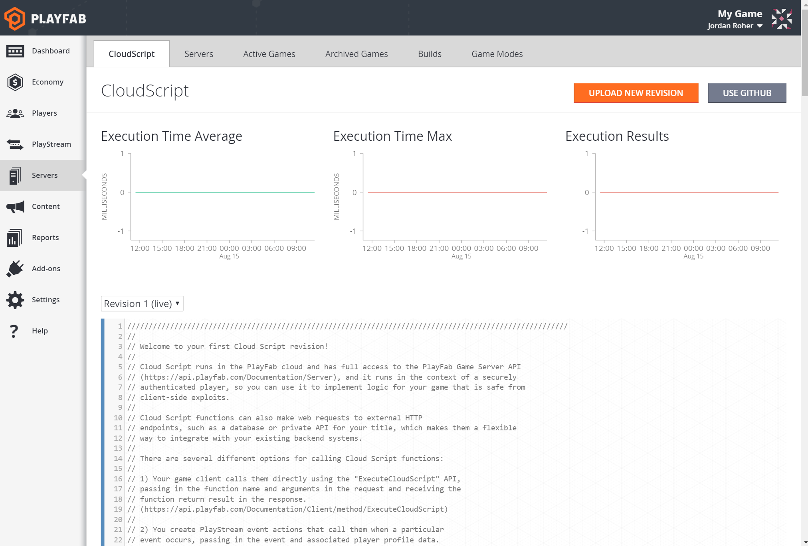  

3. Copy and paste this function at the top of your CloudScript:

```javascript
handlers.bushelOnYourFirstDay = function(args) {
    // The server API can add virtual currency safely
    var addGoldResult = server.AddUserVirtualCurrency({
        PlayFabId: currentPlayerId,
        VirtualCurrency: "GO",
        Amount: 500
    });

    // When the server grants items, there's no cost to the player
    var appleBounty = server.GrantItemsToUser({
        PlayFabId: currentPlayerId,
        CatalogVersion: "main",
        ItemIds: ["apple", "apple"]
    });

    // Like AddUserVirtualCurrency, it's safer to call UpdatePlayerStatistics from Cloud Script
    var updateStatistics = server.UpdatePlayerStatistics({
        PlayFabId: currentPlayerId,
        Statistics: [{
            "StatisticName": "xp",
            "Value": 10
        }]
    });

    log.info("I have 500 gold, two apples and 10 XP!");
}
```

4. Scroll to the top of the page and click Save as revision 2, then confirm in the popup
5. Your revision has been saved, but it's not deployed and live yet
6. Click Deploy revision 2 and confirm in the popup

   > [!NOTE]
   > You can manually call functions in a revision that's not live, but some areas of the Game Manager only look for CloudScript functions in your live revision.

   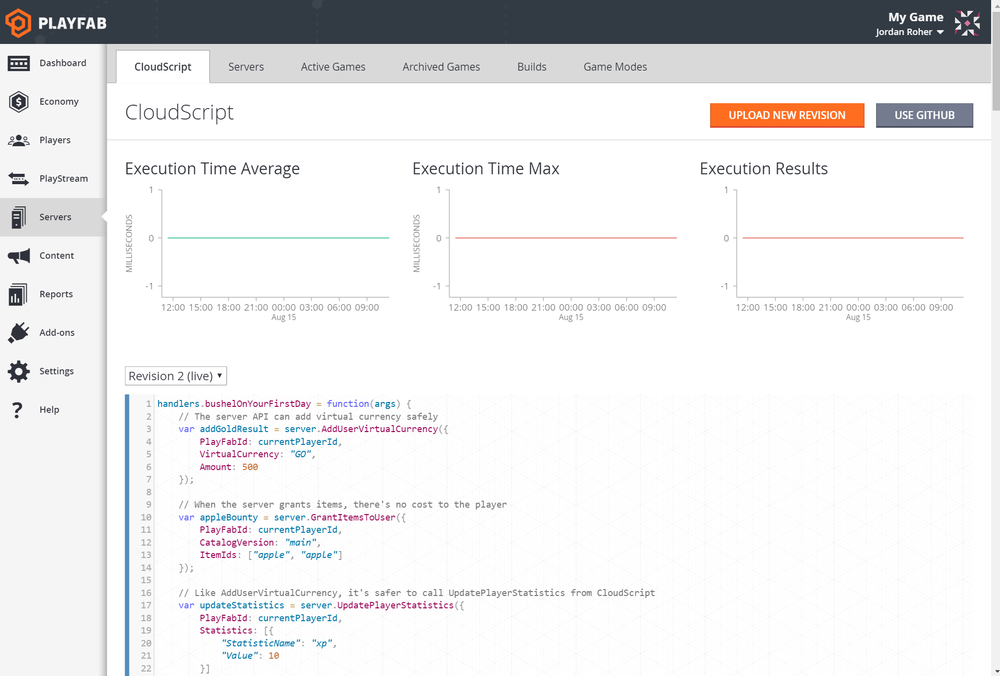  

### Test your CloudScript

Let's make sure this welcome package works.

1. In your game, call [ExecuteCloudScript](xref:titleid.playfabapi.com.client.server-sidecloudscript.executecloudscript)
    - FunctionName: "bushelOnYourFirstDay"
    - GeneratePlayStreamEvent: true

2. The response object shows any log events you recorded and how long the function took to execute

   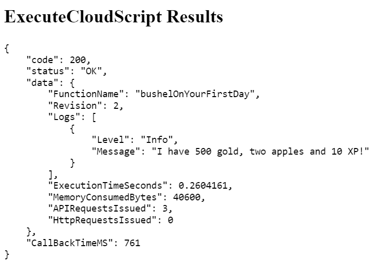  

3. Check the player's Statistics tab to ensure they have 10 XP
4. Check the player's Inventory tab to ensure they have two apples

It's safer to grant items and virtual currency this way if you're worried about players hacking your game and cheating. Once again, you can see the relevant events in the PlayStream Debugger.

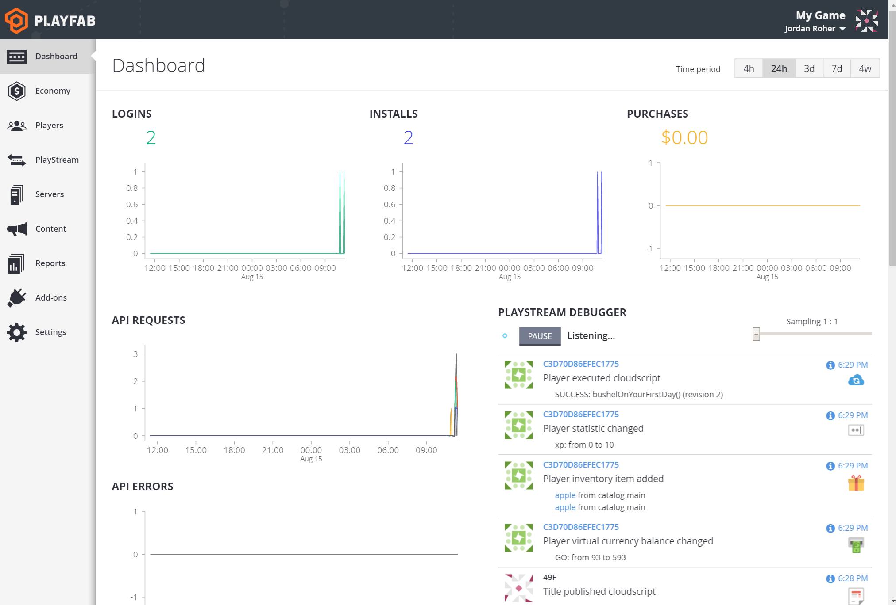  

### Going further

That's a sample of what you can do with CloudScript. You can use it to grant players XP after a match ends, randomize starting statistics, or even run referral codes.

But there's another way to interact with players that runs automatically and doesn't involve writing any code. Your secret weapon is PlayStream, PlayFab's powerful real-time segmentation engine.

## Step 2: Create a filtered segment of players

PlayStream is PlayFab's proprietary real-time engine. It allows you to instantly run actions against players who match criteria you specify.

You could:

- Grant a special welcome package to players who log in before a specific date
- Send a congratulation notification to players who reach the maximum level
- Run an A/B test to see which store prices result in more purchases
- Ban a player who hacked their statistics to an invalid value
- Reward players with a special item if they link their Facebook account
- Give gold to players who come to your game via an advertisement

All of this without writing any game code!

### Filter players

It's possible to use PlayStream almost like game code. Let's reward players who reach 500 - 600 XP with an item and some gold.

1. Go to Players > Segments
2. Click **New segment**
    - Segment name: "Adventurers"
3. Change the filter to "Statistic value xp is greater than or equal to 500"
4. Click **Add filter**
5. Change the new filter to "Statistic value xp is less than or equal to 600"

This defines a range of the "xp" statistic between 500 and 600. Players who earn that much XP are said to be in the segment. If the player earns more XP than 600 XP they leave the segment.

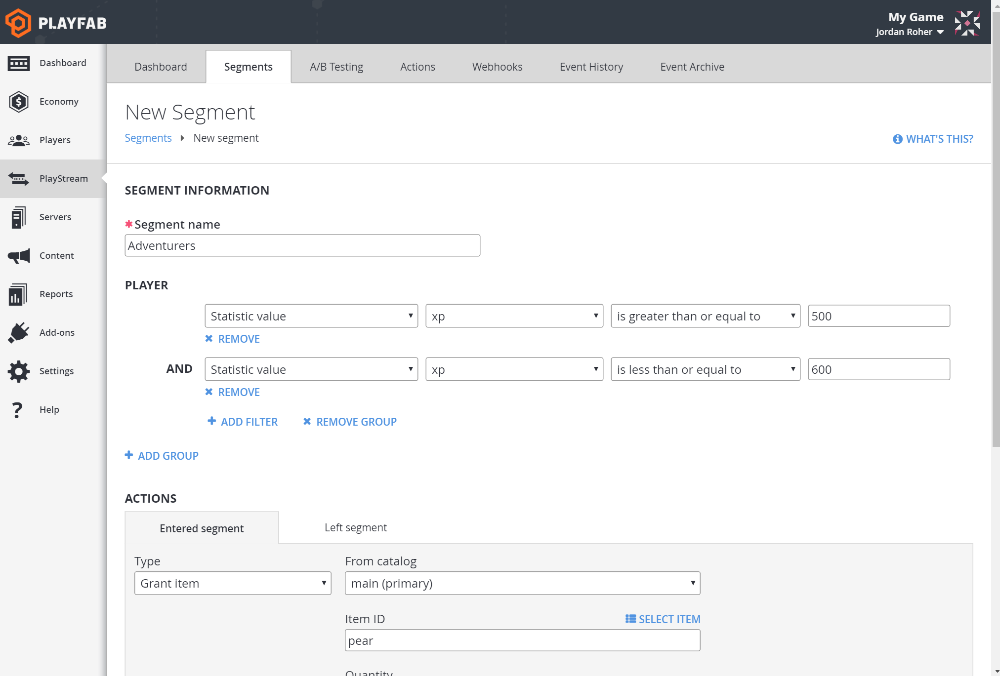  

## Step 3: Trigger an action when players enter that segment

Under "Actions" you'll see two tabs:

- Entered segment (your filters apply to a player)
- Left segment (your filters no longer apply to the player who was in the segment).

To file an action when the player enters this segment:

1. Make sure "Entered segment" is highlighted.
2. Click **Add action** and change the dropdown at the left
    - Type: "Grant item"
3. Click **Select item** and choose a pear

That's one, but you can also give the player virtual currency.

1. Click **Add action** and change the dropdown at the left
    - Type: "Grant virtual currency"
2. Change **Amount** to 1000
3. Click **Save segment**

   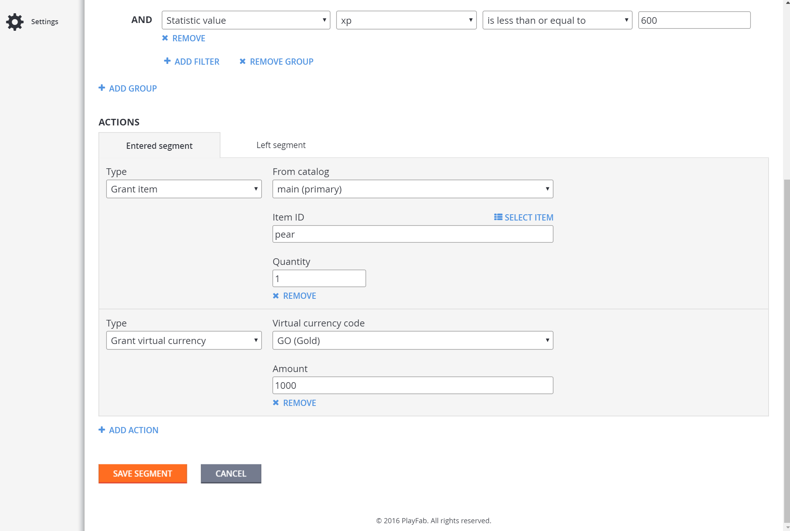  

### Brave, brave sir 8fa79815413d472d

Normally your player would reach 550 XP as the result of [UpdatePlayerStatistics](xref:titleid.playfabapi.com.client.playerdatamanagement.updateplayerstatistics) or a CloudScript function. But you can adjust player statistics manually.

1. First, open a tab to the Dashboard and keep it open so you can see what happens
2. In another tab, go to your player's Statistics tab
3. Click on their "xp" statistic and change it to 550 (and hit save player statistics).

   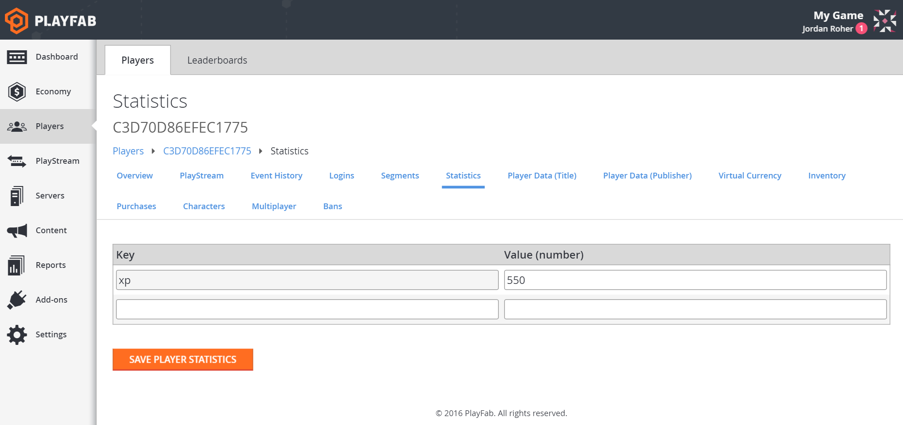  

4. In the PlayStream tab you should see three events:
    - "Player statistic changed," the one you caused, with an orange line noting the segment change and a red line for each triggered action
    - "Player inventory item added," set on the Segment enter action
    - "Player virtual currency balance changed," also set on the Segment enter action

   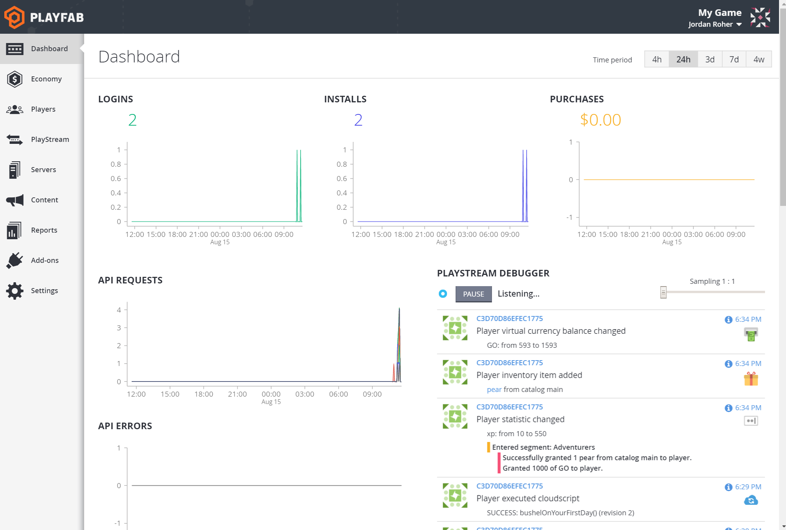  

Pretty neat, huh?

Once you've set up Push Notifications (see [Push Notification Basics](../../engagement/push-notifications/push-notification-basics.md)) you can send players personalized messages when they enter and exit segments. Executing CloudScript is another great way to interact with your players and test new rewards.

## Step 4: Override a store

Another cool thing you can do with segments is show different stores to players in different segments. This allows you to give different prices to your VIP players, or incentivize lapsed players. Since you have a store and a player in a segment, you can see how this works.

### Check existing prices

Before we do anything fancy, let's get a baseline for your player.

1. In your game, call [GetStoreItems](xref:titleid.playfabapi.com.client.title-widedatamanagement.getstoreitems) and get your store
    - CatalogVersion: "main"
    - StoreId: "fruits"

2. You should see the prices from before, with apples that cost 4 gold, pears that cost 2 and grapes for 1

   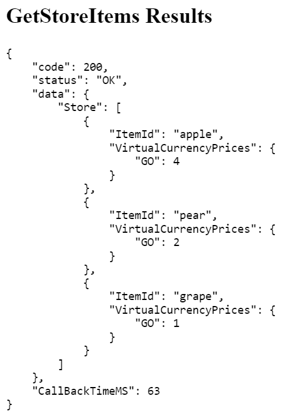  

### Store override

Now to make magic.

1. Go to Economy > Catalogs
2. Select your "main" catalog
3. Go to the Stores tab
4. Check the box next to the "fruits" store
5. Click **Duplicate**, then confirm in the popup

There should be a new store in the list called "fruits (1)."

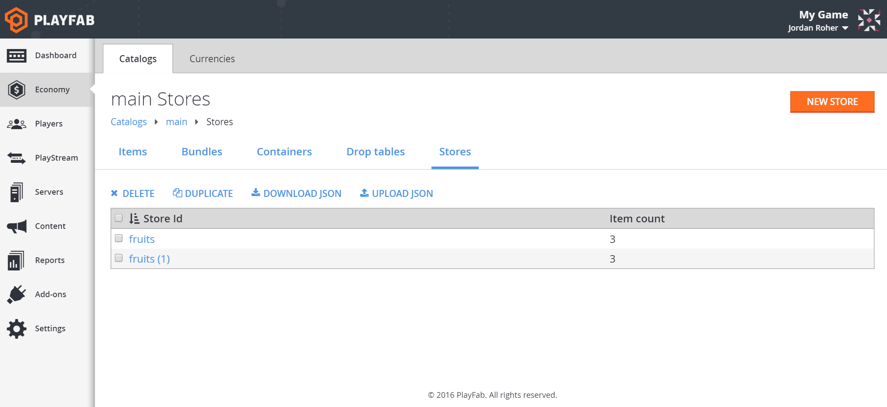  

1. Click on the store "fruits (1)"
2. Change its ID to "fruits-adventurers" (the name isn't actually important)

You could reduce prices manually, but let's use the auto-adjuster.

1. Click **Modify prices**
2. In the popup, change the percentage to 50 to cut prices in half
3. Click **Save**

   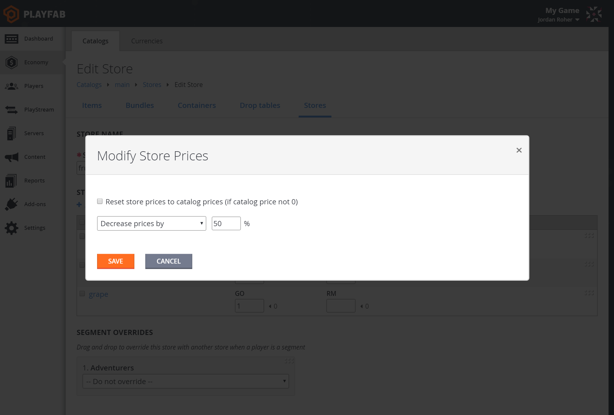  

4. Instant savings! Click **Save store**

   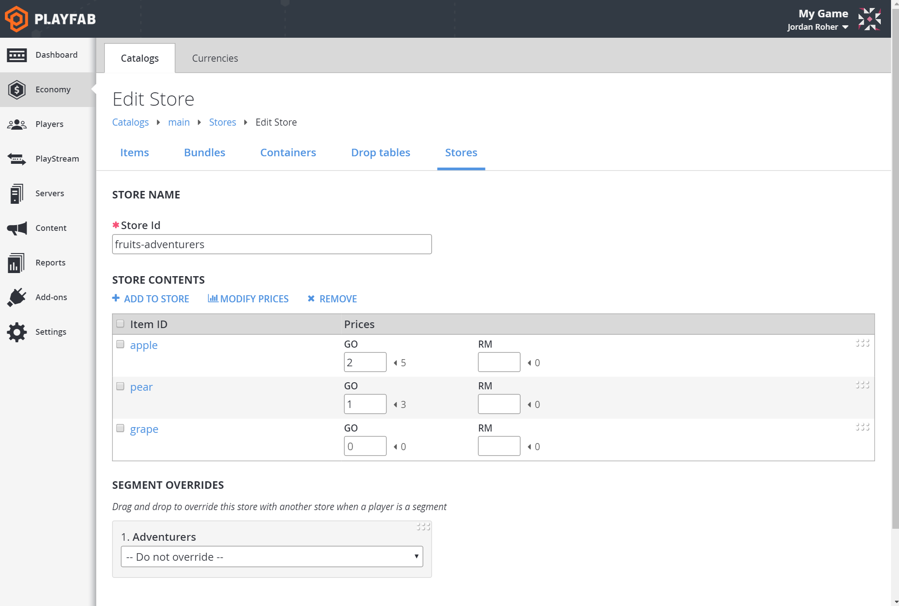  

### Segment… ation

Maybe you saw the area labeled "Segment overrides." Yep, we'll be using that. It only appears when you have at least one store and one segment.

1. Click on the original store, "fruits"
2. In the "Segment Overrides" section you'll see the segment "Adventurers"
3. Click the -- **Do not override** -- dropdown and change it to "fruits-adventurers"
4. Click **Save store**

     

When a normal player sends a request for the contents of the store "fruits," they'll get the normal store. But any player in the "Adventurers" segment will get the "fruits-adventurers" store.

### Pricing magic

Now that you've set the override, let's buy a pear on the cheap.

1. In your game, call [GetStoreItems](xref:titleid.playfabapi.com.client.title-widedatamanagement.getstoreitems) and get your store
    - CatalogVersion: "main"
    - StoreId: "fruits"

   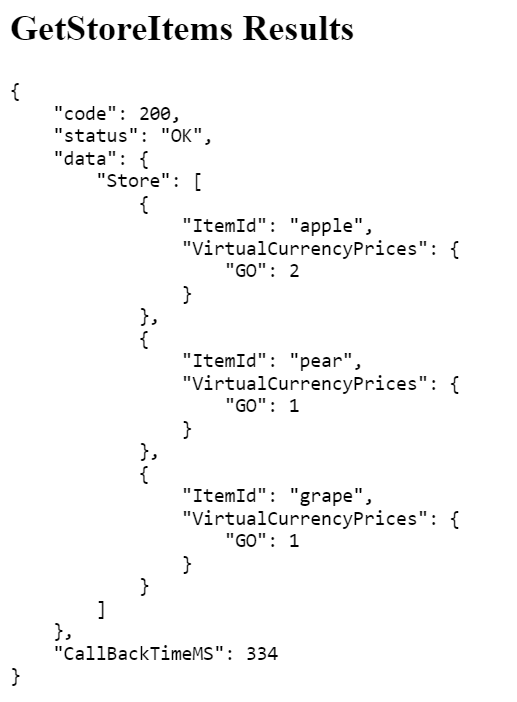  

2. Check out those low low prices!
3. In your game, call [PurchaseItem](xref:titleid.playfabapi.com.client.playeritemmanagement.purchaseitem) and buy a pear for the new price
    - CatalogVersion: "main"
    - StoreId: "fruits"
    - ItemId: "pear"
    - VirtualCurrency: "GO"
    - Price: 1

   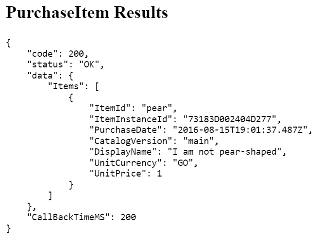  

### Pear-ishible stores

Since segments can be time-based (e.g. last login between December 1st and December 31st), you can use store overrides to create holiday discounts. Store overrides are also great for changing the order of items and even changing the whole selection!

Finally, we're going to look at some other features of PlayFab

[Go to chapter 4 - Try out content management](try-out-content-management.md)