# Chapter 1 - Getting started with Players and Tournaments

This is the first chapter of our tutorial [Getting Started with PlayFab](getting-started-with-playfab.md) that contains the following chapters:

- **Chapter 1 - Get started with Players and Tournaments**.

- [Chapter 2 - Setting up your game's in-game economy](set-up-your-games-in-game-economy.md).

- [Chapter 3 - Exploring automation](explore-automation.md).

- [Chapter 4 - Trying out Content Management](try-out-content-management.md).

## Overview

Chapter 1 contains the following steps to get you started with **Players** and **Tournaments**:

- [Step 1: Getting started and making your first API call](#step-1-getting-started-and-making-your-first-api-call)
- [Step 2: Updating your Login mechanism](#step-2-updating-your-login-mechanism)
- [Step 3: Using remote configuration data](#step-3-using-remote-configuration-data)
- [Step 4: View your Player profile in the Game Manager](#step-4-view-your-player-profile-in-the-game-manager)
- [Step 5: Create a basic Leaderboard](#step-5-create-a-basic-leaderboard)
- [Step 6: PlayStream Events](#step-6-playstream-events)

## Step 1: Getting started and making your first API call

We have **SDKs** for all major game engines and languages.

Choose an environment from the list below, and follow the link to the appropriate **Quickstart** guide. These guides will walk you through installing your environment, creating a new test project, and making your first **API** call.

Pick your **SDK**:

- [Unity](../../../sdks/unity3d/quickstart.md)
- [HTML5 (Javascript)](../../../sdks/javascript/quickstart.md) 
- [Flash (ActionScript3)](../../../sdks/actionscript/quickstart.md)
- [C#](../../../sdks/c-sharp/quickstart-c-sharp.md)
- [Cocos2d-x](../../../sdks/cocos2d-x/quickstart.md) 
- [Xamarin](../../../sdks/c-sharp/quickstart-xamarin.md) 
- [Node](../../../sdks/nodejs/quickstart.md) 
- [Java](../../../sdks/java/quickstart.md) 
- [Defold (Lua)](../../../sdks/lua/quickstart-defold.md) 
- [Corona (Lua)](../../../sdks/lua/quickstart-corona.md)  
- [Windows - C++](../../../sdks/xplatcpp/quickstart-windows.md) 
- [Linux - C++](../../../sdks/xplatcpp/quickstart-linux.md)  

## Step 2: Updating your Login mechanism

The first step in adding **PlayFab** to any game is always logging in the **Player**. Logging in the **Player** returns a **security token** that is needed for all other **API** calls.

The **Quickstart** guides in Step 1 utilize a test **TitleId** - but from *now on*, you should be using your *own*.

Create a **Title** in **Game Manager**, and update your environment with your own **TitleId**.

### Obtaining your TitleId

**TitleId's** are obtained from the **Game Manager**.  If you haven't already, [register for a free **PlayFab** developer account](https://developer.playfab.com/en-us/sign-up), then [login to the **Game Manager**](https://developer.playfab.com/en-us/login).

Once you have logged in, select **Settings**. The **TitleId** for your game should be present in the field below the name.

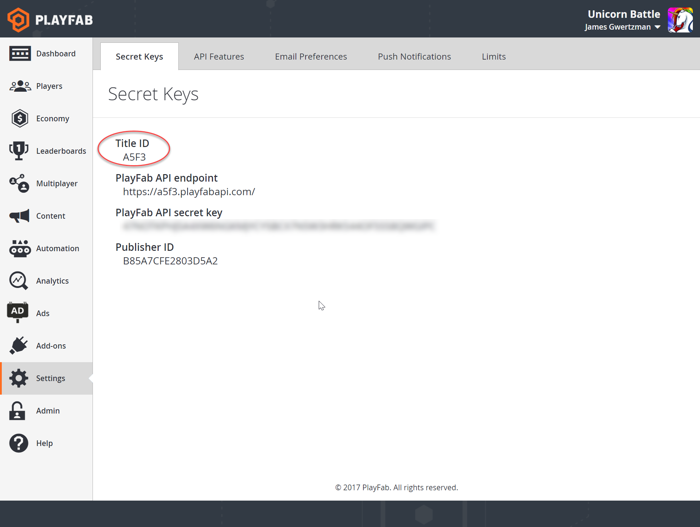  

The **SDK** guide that you followed in Step 1 should have included instructions on how to enter your **Title ID**.

### Login

**PlayFab** makes it easy to authenticate **Players**. On a smartphone you can login with the **iOS** or **Android Device ID** for easy authentication with zero friction for the **Player**.

We *also* support authentication with **Windows**, **Google**, **Kongregate**, **Facebook**, **Steam**, and **Twitch** accounts, as well as **username/password**, **email/password,** or an **ID** you generate.

For this tutorial, we'll demonstrate authentication using the last method - [LoginWithCustomID](xref:titleid.playfabapi.com.client.authentication.loginwithcustomid), which uses an arbitrary string generated by your title, or your own game servers.

> [!NOTE]
> The recommended path for most **Titles** is to use authentication mechanisms that align to the devices and platforms on which your **Title** is shipping. So, for example, on **Android** or **iOS**, use the device-specific login **API** calls to get **Players** into the game quickly, and then incentivize them to add a cross-device authentication mechanism later as part of the game experience (as shown in [this post](https://playfab.com/first-impressions-count-best-practices-friction-free-player-authentication/)).

After a login call, you can call other functions in the **Client API** (listed under **Client**, in the [PlayFab API Reference](../../../api-references/index.md)) . Some, like [UpdatePlayerStatistics](xref:titleid.playfabapi.com.client.playerdatamanagement.updateplayerstatistics) and [AddUserVirtualCurrency](xref:titleid.playfabapi.com.client.playeritemmanagement.adduservirtualcurrency) are disabled by default until you allow them on the **API Features** page in **Game Manager** (and you can specifically enable or disable any **Client API** calls using [Permission Policies](https://playfab.com/blog/permission-policies/)).

> [!TIP]
> If you look at the **PlayStream Debugger** on the **Dashboard** tab of the **Game Manager**, you will see several events connected to logging you in.

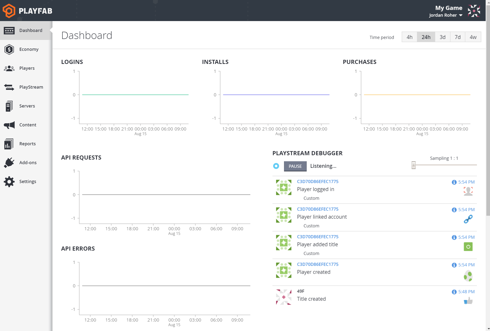  

You can select the **Information** circle to view the raw **JSON** of that event.

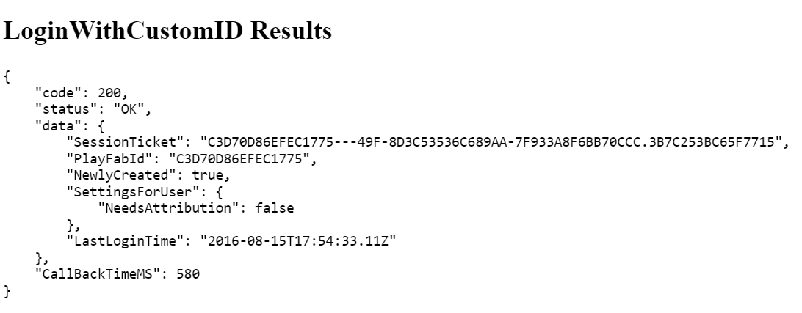  

## Step 3: Using remote configuration data

Storing **Configuration** information about your game on **PlayFab** is a smart idea, because you can then change that data at any time. This is much more useful than hard-coding that information in your game, and having to update your **Client** to change anything.

**Configuration Data** for your game is stored in what we call **Title Data**.

Examples of **Configuration Data** might include how much XP a **Player** earns from each match, a maximum movement speed, or a feedback URL. You can store **JSON** in the **Title Data** if your game requires more complex data.

1. Go to **Content**.

1. Slect **Title Data**.

1. Add a few **Keys** and **Values** (doesn't matter what they are).
1. Select the **Save Title Data** button.

   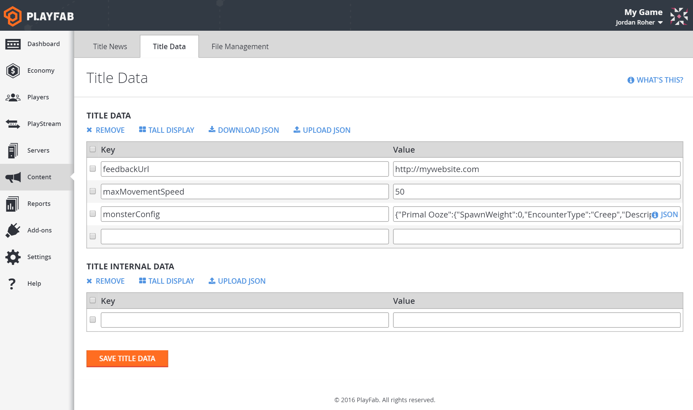  

That's all you have to do in the **Game Manager**.

1. In your game, call [GetTitleData](xref:titleid.playfabapi.com.client.title-widedatamanagement.gettitledata).
2. You should see the keys and values you just added.

   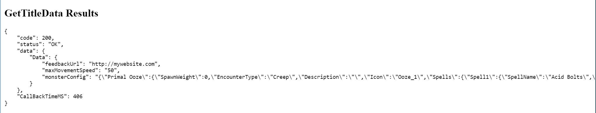  

**Title Data** is a great way to tweak your game balance while it's in development, or to run special events post-launch.

## Step 4: View your Player profile in the Game Manager

You should now have a new **Player** created, identified with the **Custom ID** you configured earlier.

1. Go to the **Players** tab.
2. You should see the **Player** you just created.

   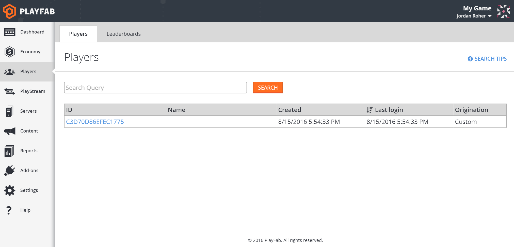  

3. If not, paste the **Custom ID** from above into the query box and select **Search**.
4. Select that **Player**.

From the **Overview** tab you can:

- See the **Player's** email address.

- See when they were created (**Provisioned**).
- Change their **Statistics**.
- Look at login **Events**.
- Manage **Characters**.
- Check on their inventory, and much more.

On the **Player's PlayStream** tab you can watch their **Events** come in live.

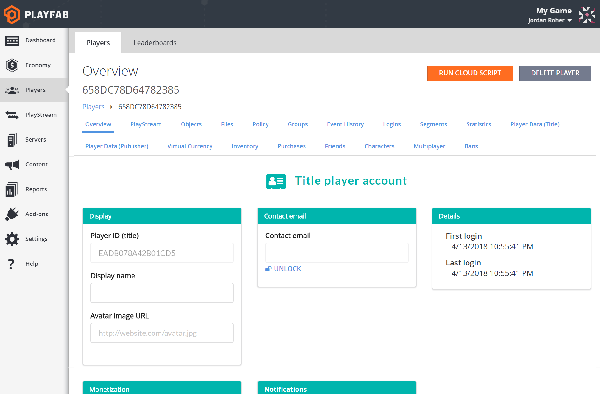  

### Custom ID vs User ID

The **Player's Custom ID** is *not* the same as their **User ID**.

**User ID** is automatically generated by **PlayFab** and used to track the **Player** if they log in using different methods.

> [!NOTE]
> Some games *do* choose to expose the **User ID** to the **Player**, to help with customer support requests.

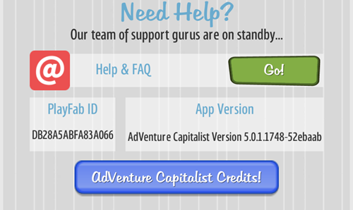  

## Step 5: Create a basic Leaderboard

Let's create a **Statistic** for this **Player** so you can try out our **Leaderboard** feature, and later, some **Player** segmentation capabilities.

> [!WARNING]
> Unlike **Title Data**, you cannot *delete* or *rename* a **Statistic** once it's created. If you don't want to have an **xp Statistic** forever, give it a different name.

- Go to the **Player's Statistics** tab.

- Add a **Key** labeled **xp** and set the value to **0**.
- Select **Save Player Statistics**.

   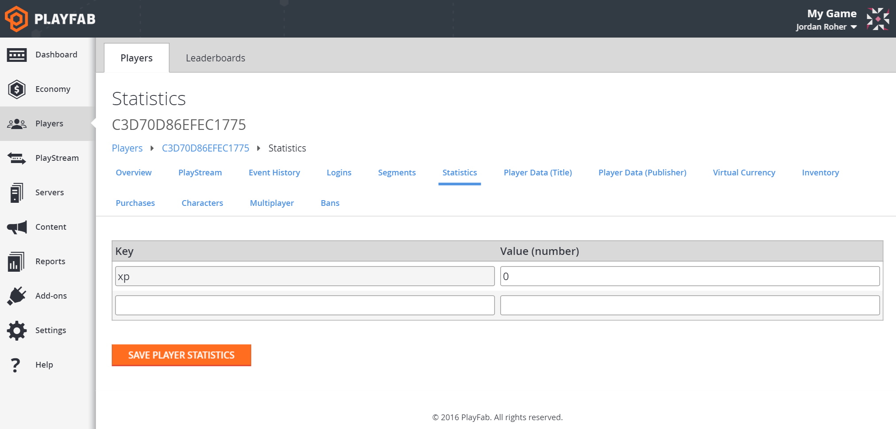  

- In your game, call [GetPlayerStatistics](xref:titleid.playfabapi.com.client.playerdatamanagement.getplayerstatistics).
- You should see an **xp Statistic** with a value of **0**.

   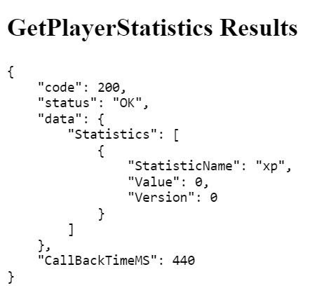  

**Statistics** are a great place to store:

- **Experience Points**.
- Number of **Wins** and **Losses**.
- **Headshots** (or anything you want tallied).

Every **Statistic** automatically creates its own **Leaderboard**, so you can track who's doing the best (and worst) in your game.

Select **Leaderboards** on the **Players** tab to see the current progress.

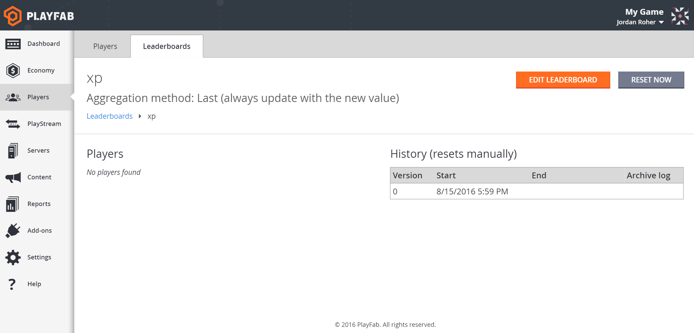  

## Step 6: PlayStream Events

Select the **PlayStream** tab for this **Player** (next to **Overview**). You should see a **Login Event** and the **Statistic Change Event**.

> [!TIP]
> Keep this window open while you do other things and you'll be able to see more events pop up.

Now that you have a **Player**, some **Title Data**, and a **Statistic**, let's create a **Currency** and start your game's economy!

[Go To Chapter 2 - Set up your game's in-game economy](set-up-your-games-in-game-economy.md)
