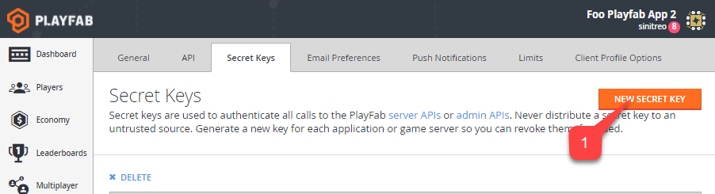

# Getting PlayFab Developer Keys

A PlayFab Developer Key is used to authorize an application to use PlayFab Admin and Server APIs for a specific title. A Developer Key is strongly coupled with a PlayFab Title.

## Acquiring a Developer Key

In Game Manager, navigate to your title and click "Settings" left-menu **(1)**. Then select the "Secret Keys" tab **(2)**. Locate the default key **(3)**:

  

## Multiple Keys

Generally, the default key is sufficient to authorize your application for Admin and Server API calls. However, you may also click the "New Secret Key" button **(1)**:

  

Fill in the key title **(1)**, optional expiration date **(2)**, and click the "Save Secret Key" button **(3)**:

  

This will create a new key that you may use to authorize Admin and Server API calls.

### Use case for multiple keys

You may need temporary keys if you are outsourcing some work to another company. You may also need to revoke a key that has accidentally been made public. You can create new keys and revoke keys as needed.