# Chapter 2 - Set up your game's in-game economy

This is chapter 2 of our tutorial [Getting Started with PlayFab](getting-started-with-playfab.md) that contains the following chapters:

[Chapter 1 - Get started with players and tournaments](get-started-with-players-and-tournaments.md)
**Chapter 2 - Set up your game's in-game economy**
[Chapter 3 - Explore automation](explore-automation.md)
[Chapter 4 - Try out content management](try-out-content-management.md)

## Overview

Chapter 2 contains the following steps to get you started setting up your game's in-game economy:

[Step 1: Set up a virtual currency for your game](#step-1-set-up-a-virtual-currency-for-your-game)
[Step 2: Add catalog items](#step-2-add-catalog-items)
[Step 3: Purchase an item using virtual currency](#step-3-purchase-an-item-using-virtual-currency)
[Step 4: Create a store with a discounted price](#step-4-create-a-store-with-a-discounted-price)

## Step 1: Set up a virtual currency for your game

PlayFab supports a robust game economy with multiple currencies, item bundles, stores, and random result tables (drop tables).

### Rags to riches

1. Go to Economy > Currencies
2. Click **New currency** and change these fields:
    - Currency code (2 uppercase characters): "GO"
    - Display name: "Gold"
3. Click **Save currency**

The deposit and recharge fields are useful for energy currencies that reset every day, but we won't use them for this example.

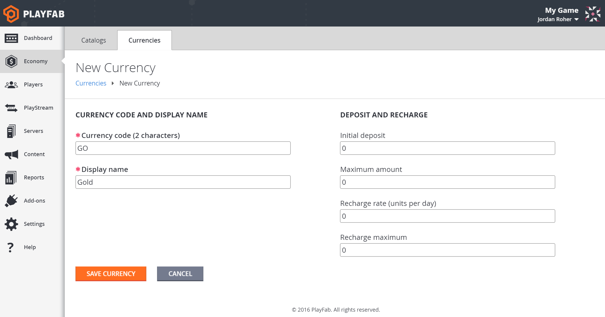  

### Pay it forward

Now you can give players virtual currency directly. Since it can be dangerous to give clients the ability to call [AddUserVirtualCurrency](https://api.playfab.com/documentation/Client/method/AddUserVirtualCurrency), let's add money from the Game Manager.

1. Go to the player's Virtual Currency tab

   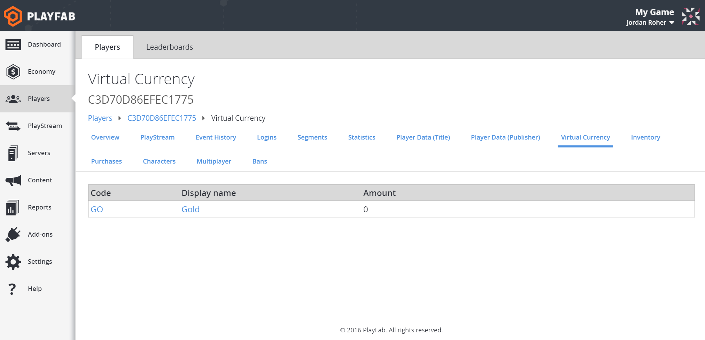  

2. Click on the "GO" currency
3. Change the Amount to 100
4. Click Save virtual currency

   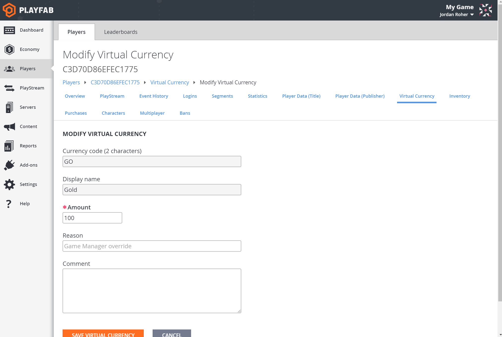  

Now you have 100 gold. What can you do with it? Buy an item! Let's make some.

## Step 2: Add catalog items

No sense having money if you can't spend it. Let's create a catalog, which is a collection of items. You can create catalogs that correspond to the platforms on which you're releasing your game, or major version numbers, whatever you like.

> [!PRO TIP]
> We don't recommend creating catalogs to differentiate types of items, as you can filter items effectively using classes, tags, and stores. Multiple catalogs are better suited to different versions of your game.

### Make a catalog

1. Go to Economy > Catalogs
2. Create a new catalog named "main"

   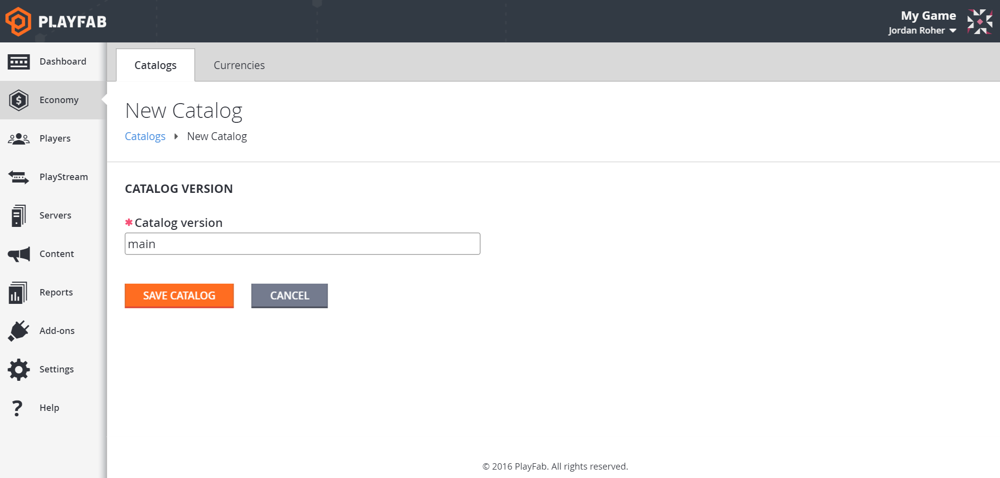  

3. An item with the ID of "One" has been added automatically

   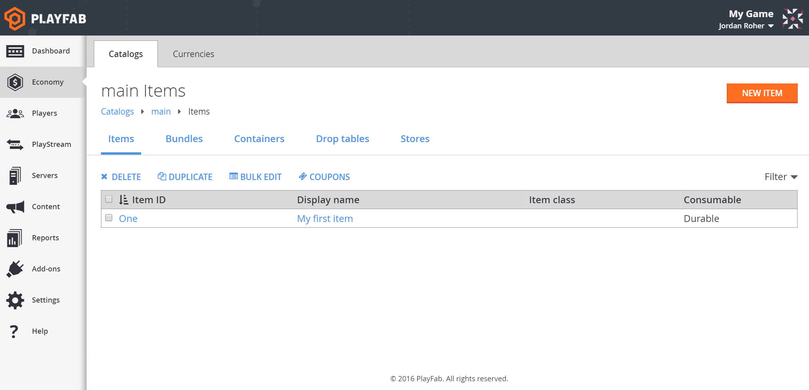  

4. Click on **One** and change these fields:
    - Item ID: "apple"
    - Display name: "Perfectly normal apple"
5. At the bottom of the form is the **Prices** section, where you define how much an item costs in your game's virtual currency
6. Set the apple's price in gold ("GO") to 5
7. Click **Save item**

     

> [!PRO TIP]
> If you plan on selling items for real money, you can set how much the item costs in real money ("RM"), which is expressed in United States cents. An item that costs $4.99 should have a RM value of 499. This is a more advanced topic than this tutorial though.

> [!WARNING]
> If you remove all items from a catalog, the catalog disappears.

## Step 3: Purchase an item using virtual currency

Who's hungry for apples? Jerry? Let's get the catalog and attempt to make a purchase.

1. In your game, call [GetCatalogItems](https://api.playfab.com/documentation/Client/method/GetCatalogItems)
    - CatalogVersion: "main"
2. Verify that you see an "apple" with a "GO" price of 5

   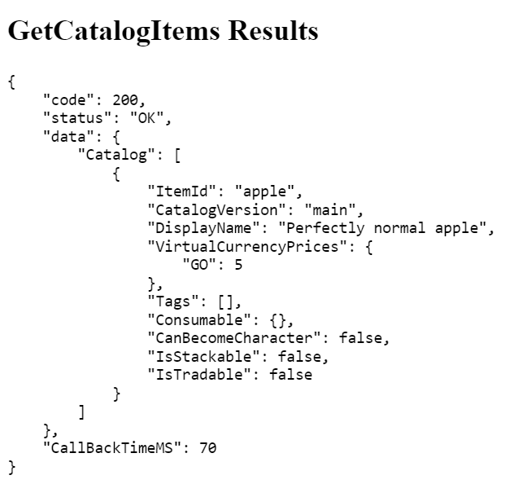  

3. Then call [PurchaseItem](https://api.playfab.com/documentation/Client/method/PurchaseItem) to buy the apple
    - CatalogVersion: "main"
    - ItemId: "apple"
    - VirtualCurrency: "GO"
    - Price: 5

     

4. Finally, call [GetUserInventory](https://api.playfab.com/documentation/Client/method/GetUserInventory) and take a look at your inventory.

   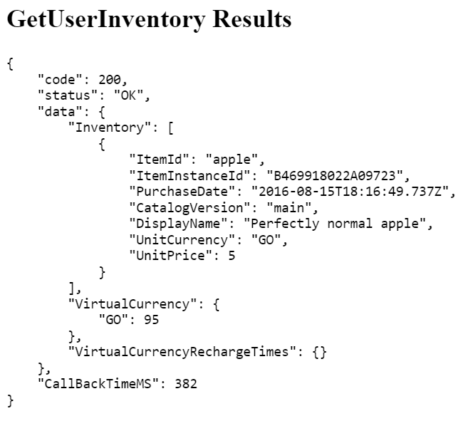  

Now you have an apple!

Check the player's PlayStream tab, you should have seen a "Player vc item purchased" event.

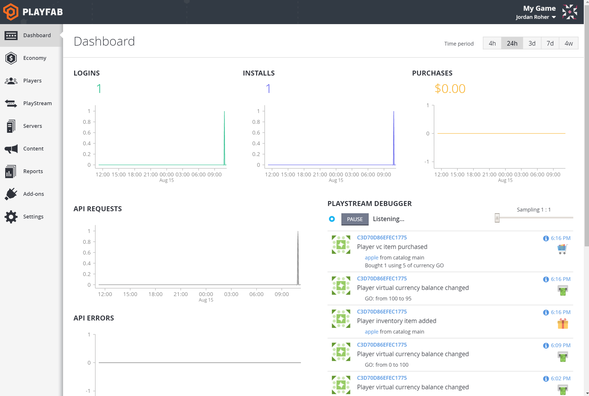  

That player's Inventory tab will show the apple. You can also revoke the item or grant yourself more apples on the Inventory tab.

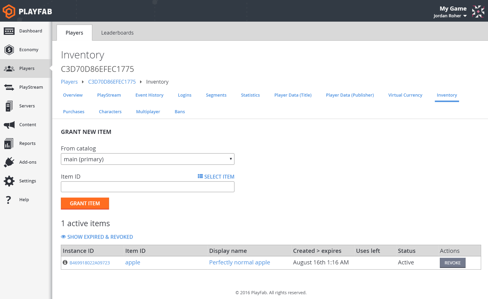  

And now the player has only 95 gold coins left...

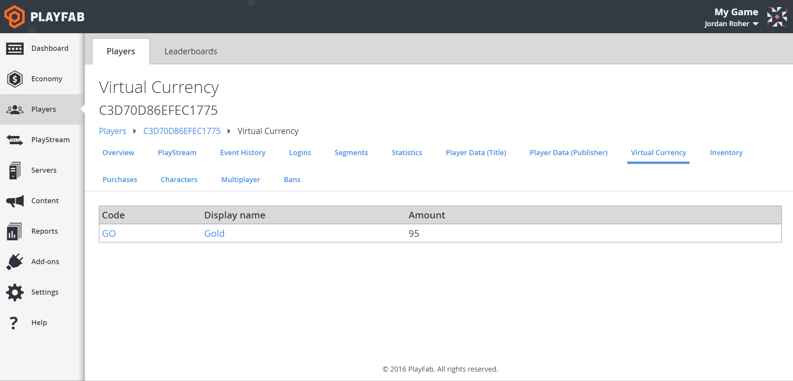  

## Step 4: Create a store with a discounted price

Buying items out of the catalog is fine, but it's not how most games structure their purchases. Whether you're making an idle clicker, an RPG, a FPS, or an endless runner, you probably have stores in your game where players can buy weapons, armor, or running shoes. Our solution for this is Stores, a subset of your catalog with prices you can override. It also enables some amazing functionality in PlayStream (we'll get to that later).

As this tutorial is slowly evolving into Harvest Moon, let's make a store to sell fruit.

### Add more items

It's not much of a store if you only have one thing to sell (that would be the Apple Store, *rimshot*).

1. Go to Economy > Catalogs
2. Select your "main" catalog
3. Click **New item** a few times and create some items
    - "apricot" with "GO" cost of 4
    - "pear" with "GO" cost of 3
    - "grape" with no "GO" cost (don't select any prices)

> [!NOTE]
> You don't have to assign a virtual currency price to items in the catalog for them to appear in a Store.

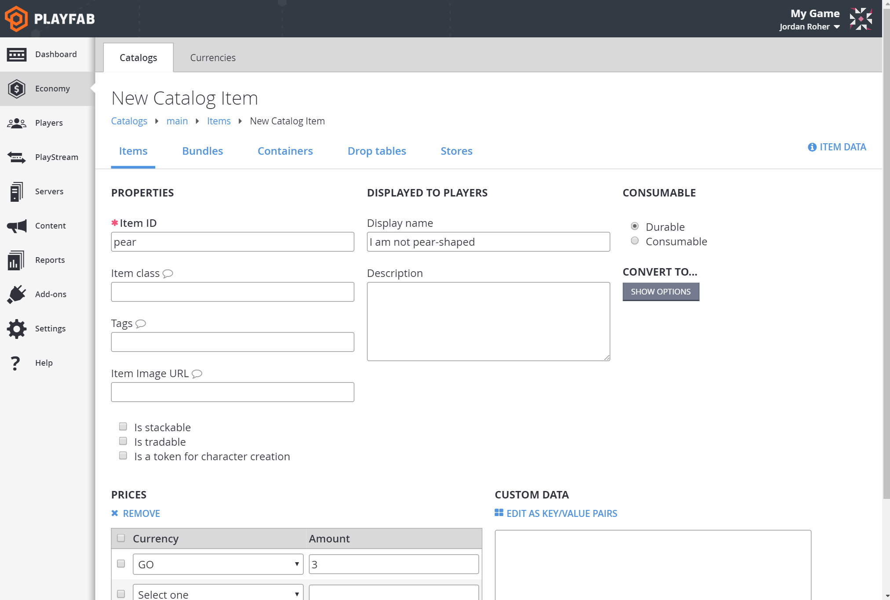  

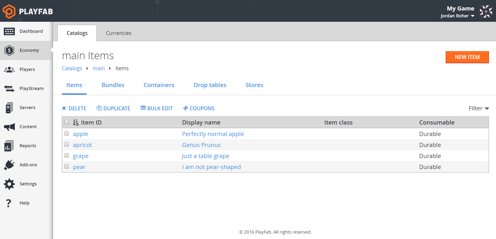  

### Stocking the shelves

You should now have a few items with prices. Let's make a store to sell them to the player.

1. Go to the Stores tab in the "main" catalog
2. Click **New store** and give it an ID
    - Store Id: "fruits"
3. Click **Add to store**
4. This popup shows all items, bundles, and containers in the current catalog.

   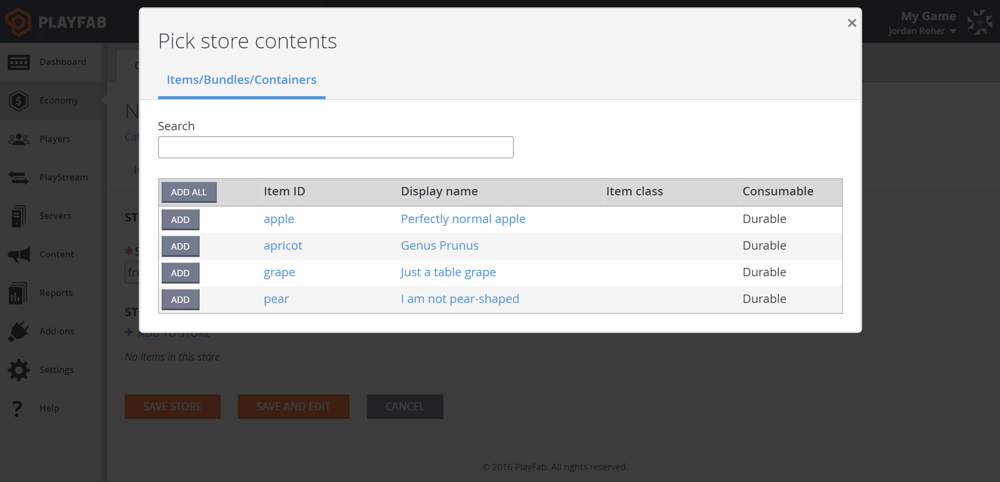  

5. Click the Add button next to a few items to add them to your store

You should see your items listed in the store, but they're not valid until they have at least one price.

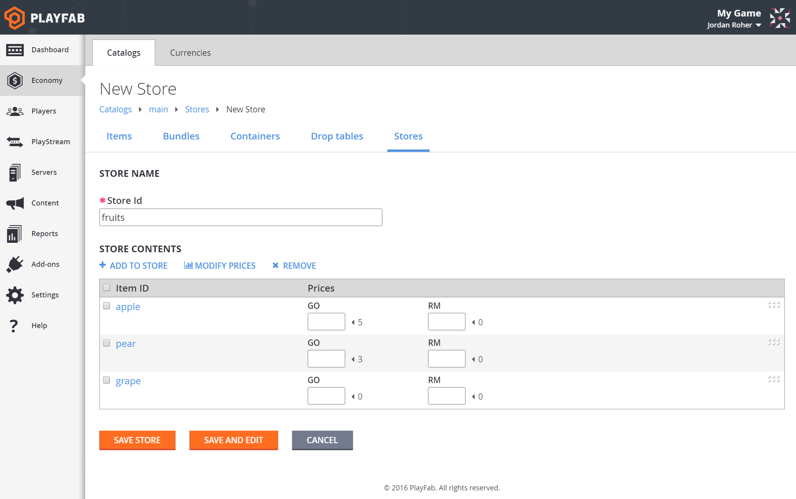  

### How to use Stores

- The little static number with the arrow (e.g. <5) next to the price text box is the original catalog price.
- Drag and drop the rows to rearrange the order of the items.
- You only have to enter a price for one box in each row, but you can enter as many prices as you want.
- If you don't enter a price for an item, it will be removed from the store.
- If a store item doesn't have a price in a currency, it can't be bought using that currency.
- Store prices can be higher than catalog prices.
- Zero is a valid price for an item.

### Price it out

1. Add some "GO" prices to your items, but make them lower than the catalog price
    - apple: 4
    - pear: 2
    - grape: 1
2. Click **Save store** when you're done.

   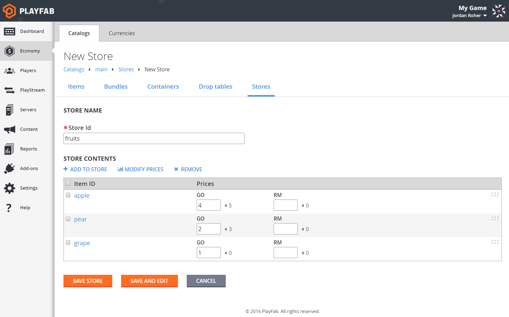  

### Going shopping

You have a store. Let's buy something!

1. In your game, call [GetStoreItems](https://api.playfab.com/documentation/Client/method/GetStoreItems) and get your store
    - CatalogVersion: "main"
    - StoreId: "fruits"
2. Verify you received an object with the list of items in the store and their prices, in the order you selected.

   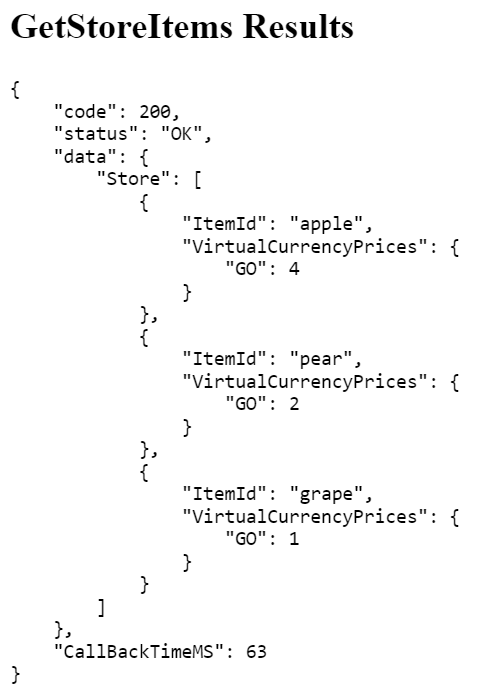  

3. In your game, call [PurchaseItem](https://api.playfab.com/documentation/Client/method/PurchaseItem) and give it the currency and store price of the item you want to buy

    - CatalogVersion: "main"
    - StoreId: "fruits"
    - ItemId: "pear"
    - VirtualCurrency: "GO"
    - Price: 2

   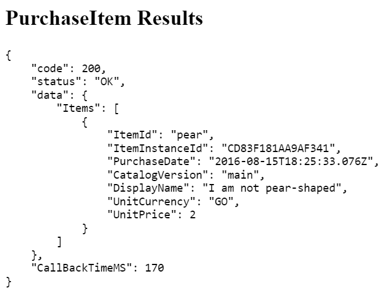  

4. Look in your player's Inventory tab for the pear, and check their Virtual Currency to check that they only spent 2 gold.

You will once again see events in the PlayStream debugger showing the purchase flow from the store.

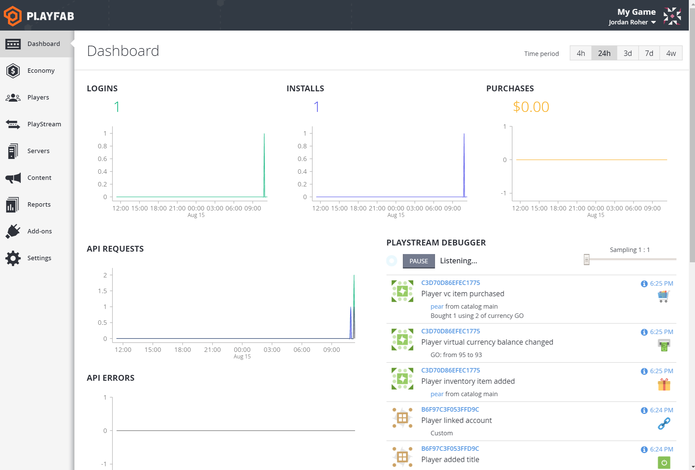  

> [!NOTE]
> If you don't specify the StoreId when calling [PurchaseItem](https://api.playfab.com/documentation/Client/method/PurchaseItem), the purchase will be attempted against the catalog price.

### Going further

Stores are the best way to let players purchase items in your game. You can use the Game Manager to change the order of items and adjust prices at any time.

Using Segments, you can even give special prices to certain players without touching your game code.

Now let's look at another way to interact with players that doesn't require resubmitting your code to an app store.

[Go to chapter 3 - Explore automation](explore-automation.md)
