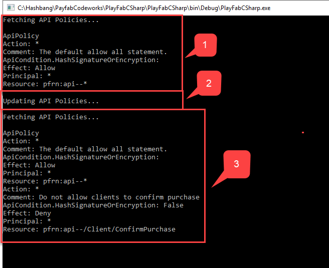

# API access policy

Often times, it is necessary for a title to allow/deny certain APIs from the game client for anti-cheat or other security purposes.

This tutorial will walk you through how to use API permission policies to achieve this.

> [!NOTE]
> This is an advanced guide. Please be aware that it is possible to completely disable client access to your title using this feature.

## Policy control and structure

Policy is a set of rules, a.k.a. Policy Statements, that are applied in a specific situation.

Right now, PlayFab only supports API Access Policy. Thus, by definition, it controls access to API resources.

Policies are fetched and updated using API calls from the PlayFab admin APIs (listed under Admin in the [PlayFab API Reference](../../../api-references/index.md)); specifically, the [GetPolicy](xref:titleid.playfabapi.com.admin.authentication.getpolicy) and [UpdatePolicy](xref:titleid.playfabapi.com.admin.authentication.updatepolicy) methods.

Since we will be utilizing the admin API, see our tutorial [Getting PlayFab Developer Keys](getting-playfab-developer-keys.md). Developer keys will let you authorize for admin API calls.

Each policy contains a list of statements, which act as rules for one or more PlayFab resources.

The code shown below illustrates basic operations with policies (please read the code comments for more details).

```csharp
public void Start() {
    PlayFabSettings.DeveloperSecretKey = "<insert key here>";
    PlayFabSettings.TitleId = "< insert title id here >";
    FetchApiPolicy(UpdateApiPolicy);
}

private void FetchApiPolicy(Action nextAction = null) {
    PlayFabAdminAPI.GetPolicy(new GetPolicyRequest() {
        PolicyName = "ApiPolicy"
    }, result => {
        Debug.Log(result.PolicyName);
        foreach (var statement in result.Statements)
        {
            Debug.Log("Action: "+ statement.Action);
            Debug.Log("Comment: "+ statement.Comment);
            if(statement.ApiConditions != null)
                Debug.Log("ApiCondition.HashSignatureOrEncryption: "+ statement.ApiConditions.HasSignatureOrEncryption);
            Debug.Log("Effect: "+ statement.Effect);
            Debug.Log("Principal: "+statement.Principal);
            Debug.Log("Resource: "+ statement.Resource);
        }

        if (nextAction != null) nextAction();

    },error=>Debug.LogError(error.GenerateErrorReport()));
}

private void UpdateApiPolicy() {
    PlayFabAdminAPI.UpdatePolicy(new UpdatePolicyRequest() {
        PolicyName = "ApiPolicy",
        OverwritePolicy = false, // Append to existing policy. Set to True, to overwrite.
        Statements = new List<PermissionStatement>() {
            new PermissionStatement() {
                Action = "*", // Statement effects Execute action
                ApiConditions = new ApiCondition() {
                    HasSignatureOrEncryption = Conditionals.False // Require no RSA encrypted payload or signed headers
                },
                Comment = "Do not allow clients to confirm purchase",
                Resource = "pfrn:api--/Client/ConfirmPurchase", // Resource name
                Effect = EffectType.Deny, // Do not allow,
                Principal = "*"
            }
        }
    }, result => {
        FetchApiPolicy();
    }, error => Debug.LogError(error.GenerateErrorReport()));
}
```

- The program will fetch and print the existing **Policy (1)**.
- Then update the policy **(2)**.
- Then fetch and print it again **(3)**.

After you run this code for the first time, the (**C#**) output will look like the example shown below.

  

As shown in the preceding picture, a policy consists of several [Permission Statements](xref:titleid.playfabapi.com.admin.authentication.updatepolicy#permissionstatement).

Each Permission Statement consists of the following items:

[RESOURCE](xref:titleid.playfabapi.com.admin.authentication.updatepolicy#permissionstatement) - A string that uniquely identifies one or more PlayFab resources. To describe the API resource, please use the convention shown below.

  `pfrn:api--/API-GROUP/API-CALL`

  `API-GROUP` should be replaced with one of PlayFab APIs: `Client`, `Server` or `Admin`

  `API-CALL` should be replaced with concrete API name (ex. **ConfirmPurchase**, **LoginWithTwitch**, **ReportPlayer** etc.

  A resource string supports wildcards. The following resource string will match any resource.

  `pfrn:api--*`

[ACTION](xref:titleid.playfabapi.com.admin.authentication.updatepolicy#permissionstatement) - A string that describes operation over the resource. Use `*` to match any operation.

[EFFECT](xref:titleid.playfabapi.com.admin.authentication.updatepolicy#permissionstatement) - A string that serves as a rule definition. Use `Allow` or `Deny` to allow or deny operations over the resource.

[PRINCIPAL](xref:titleid.playfabapi.com.admin.authentication.updatepolicy#permissionstatement) - A string that uniquely identifies the class of the user. Use `*` to match any user.

[COMMENT](xref:titleid.playfabapi.com.admin.authentication.updatepolicy#permissionstatement) - A user-defined string that serves to provide more information about the policy statement.

[APICONDITIONS](xref:titleid.playfabapi.com.admin.authentication.updatepolicy#permissionstatement) - An *optional object* that defines advanced rule conditions, for example - Encryption and Signed Headers.

By modifying your policy to use more detailed permission statements, you can set up strong security rules for your application, by only allowing the API you use in your application.
