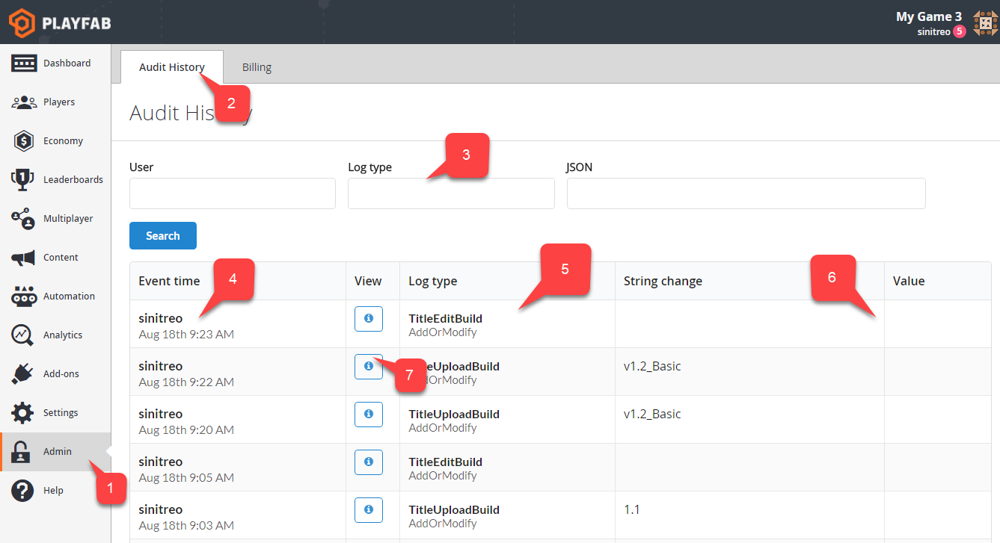

# Audit Logs

Audit logs allow you to observe and analyze the history of important changes made to your title by you or other developers. You are able to detect both important changes and destructive actions, and react accordingly.

## Accessing Audit Logs

To access the audit logs, navigate to your title in Game Manager. Navigate to the "Admin" tab **(1)**, then navigate to the "Audit History" sub-tab **(2)**. You can navigate through the logs using the search panels **(3)**. Each log entry is located in the table. The "Event time" column **(4)** exposes information about the time and author of the change. The "Log type" column **(5)** gives you a clue about the kind of change that was made. The "String change" and "Value" columns **(6)** represent short details of the change. The "View" column **(7)** allows you to access a full JSON description of the change:

  

The "View" column exposes a button to access the JSON body of the change. JSON is displayed in a modal window. It contains the same data as the table **(1)**, plus a raw JSON body specific for each change type **(2)**:

  
