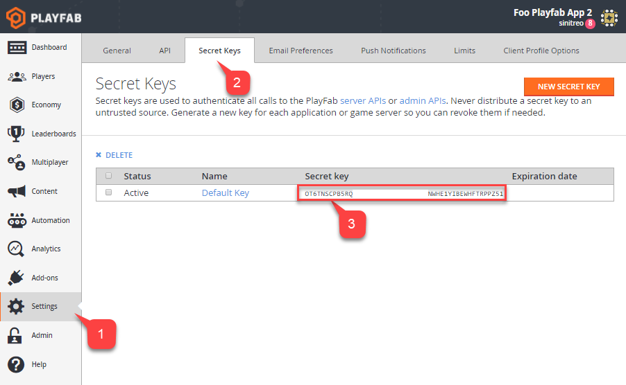

# Getting PlayFab developer keys

A PlayFab developer key is used to authorize an application to use PlayFab Admin and server **APIs** for a specific title. A developer key is strongly coupled with a PlayFab title.

## Acquiring a developer key

In **Game Manager**:

- Navigate to your **Title**.

- Select **Settings** on the menu to the left **(1)**.
- Then select the **Secret Keys** tab **(2)**.
- Locate the default key **(3)** in the field under the **Secret Key** column on the screen.

  

## Multiple keys

Generally, the default key is sufficient to authorize your application for admin and server **API** calls. However, you may also select the **New Secret Key** button **(1)**.

  

- Fill in the title for your **New Key** in the **Name** field provided **(1)**.

- Enter an optional **Expiration Date (2)**.
- Select the **Save Secret Key** button **(3)**.

  

This will create a new key that you may use to authorize admin and server **API** calls.

### Use case for multiple keys

You may need *temporary* keys if you are outsourcing some work to another company. You may also need to *revoke* a key that has accidentally been made public. You can create new keys and revoke keys as needed.