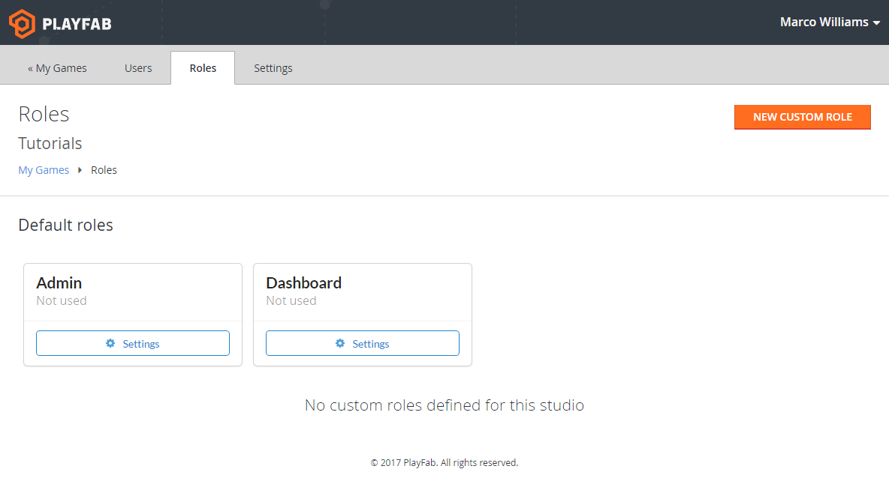

# PlayFab User Roles

PlayFab now supports roles as a more efficient way to manage user permissions within the Game Manager. We're happy to have finally added this feature, since it's been one of the most frequently requested features up till now.

With the introduction of roles, we are phasing out the ability to directly edit user permissions. This is no problem for new titles, who can immediately begin using the new roles system. Existing titles, however, that are using custom permissions, must first migrate these custom permissions over to the new roles system.

First, let's first see how the new roles work, then let's look at how to migrate from the old permissions system to the new roles system.

## Permissions and Roles

PlayFab features a powerful, fine-grained permissions model with more than 80 individual permissions to determine exactly what users are allowed to do. Most features in the Game Manager can be turned off entirely, set to read-only mode, or set to read-write mode.

For example, you may want your customer service rep to be able to edit a player profile, but not view revenue data, and you may want a product manager to be able to view revenue data, but not upload new multiplayer game server builds.

Previously, permissions had to be set individually for each user, and for each title. This was cumbersome, especially for large studios with many users, many titles, and many permission sets. And worst of all, if a permission policy changed, or a new feature was added, you needed to go through and manually edit the permissions for every user.

Now, however, studios can define a role as a collection of permissions, then assign those roles directly to users. You can edit a role at any time, and all users assigned to that role will immediately have their permissions changed. For convenience, you can even assign multiple roles to a user. For example, you could define a "customer support" role, with permission to edit player profiles, and a "data scientist" role with permission to view all events and see all dashboards, and assign both to a single user.

## Creating Custom Roles

The first step in using the new system is to define roles. By default, PlayFab comes with two predefined roles: Title Admin, and Dashboard. Title Admin gives full permissions to a given game title, and Dashboard only gives permission to view the dashboards for the title.

There is also a third, special role -- Studio Admin. Studio Admins are special users who have permission to create titles, define roles, and have automatic Title Admin rights to every title in the studio.

Here are the steps to create a new role:

1. [Login to PlayFab](http://developer.playfab.com/) with your developer account.
2. Ensure you are a studio admin, you will know that you are if you see the following options next to your studio name. If you are not the studio admin, please contact the studio admin to setup the permissions according to this tutorial.

     

3. Click Users and Roles from the list of options.
4. Click the Roles tab at the top of the screen. You should now see a list of all the roles in the system.

     

5. Click the New Custom Role button to create a new role. Give your new role a name, and check off the permissions you wish to include. Generally, all permissions follow this pattern:

    - You can enable or disable the entire feature using the top-most option permission **(1)**
    - You can show or hide the navigation tab using the "tab" permission **(2)**
    - Each permission has a read-only and read-write option. The read-write option has "edit" at the end **(3)** **(4)**

        

6. Click the Save Role button when you're done.

     

## Assigning Roles

Once you've created a role, you can assign the role to users in a title. Roles apply at the title level. If you have five titles, and you wish a given user to have the same role for each title, you must give the user that role for each title. This gives you the most flexibility. Under this system, a given user could be a Title Admin for one title, a Product Manager for another, and a Customer Service rep for a third, all under the same studio.

Here are the steps to assign a role:

1. [Login to PlayFab](http://developer.playfab.com/) with your developer account. As mentioned previously, make sure you are a studio admin.
2. Click Users and Roles from the list of options. You will see a list of users for your studio.
3. Click Settings for the user for whom you wish to assign roles.
4. Click the Roles tab. You will see a list of all titles in your studio, and any roles that user already has for each title.
5. Click Assign Roles for each title for which you wish to give the user a role. You will see a list of your roles. Check off any roles you wish to give the user on that title.
6. After you have assigned roles, be sure to click Save User, otherwise your role assignments will be lost.

## Migrating to the new Roles system

If you have an existing title, and you have already given users custom permissions, we will automatically create new roles for these users. After a user has been migrated to their new custom role, you can rename the role.

Because Studio Admin is a new permission level, this will automatically be granted to users who have Title Admin on all titles in a studio.

## Conclusion

Roles are a powerful and flexible new way to determine who can do what in Game Manager. Going forward, you should use roles to assign permissions. Existing custom permissions will continue to function, but you cannot change the permissions without migrating over to the new roles system.
