# Game Manager quickstart

## Let's begin with the basics: Your Developer Account

Before you can call any PlayFab API, you must [have a PlayFab developer account](https://developer.playfab.com/en-us/sign-up). If you already *have* a PlayFab account, you can skip this step.

Once you have a PlayFab account, navigate to the **PlayFab** home page, [https://playfab.com](https://playfab.com), and log in.

Since PlayFab does not know the name of your game studio or the title of your game, initial values for these fields are assigned. 

- **Unnamed Studio** is the default name of your game studio.

- **Unnamed Title** is the default title of your game, as shown in the following example. You can rename these at any time.

> [!NOTE]
> The Title ID is unique value to your game, which we call a **Title**. You will use this value when you make PlayFab API calls (your **Title ID** will not be **BCFE**).

Your first title is auto-generated by us. If you need a new title later, you can create additional titles by selecting **Create a new game** (but don't do this quite yet, please).

The current **Title** and **User** can be found in the top right of your screen. An **Admin** menu will appear when the **User** is selected (please refer to the example provided below).

## Game Manager Sections

Once you have an account, you can select a **Title** (either the one we created, or one of your own) to follow along. Each **Title** has its own **Game Manager**, which covers the following sections:

- **Dashboard** - An overview of the performance of your title.
- **Players** - **Settings** and **Data** pertaining to your individual players, including player segmentation.
- **Economy** - **Settings** and **Data** pertaining to virtual items, stores, currencies and **Loot** distribution, and coupons.
- **Leaderboards** - Configure leaderboard settings, and view current rankings.
- **Multiplayer** - Configure server hosting, and view match records.
- **Content** - Manage the content for your game - including news, remote configuration, and files.
- **Automation** - Configure the server-side logic for your game - including scriptings, rules, and tasks. Trigger actions based on the events from your title.
- **Analytics** - View reports and event data for your game, and configure how data is routed to other systems.
- **Add-ons** - This is the control center for managing partner integrations.
- **Settings** - Displays the **Settings** and **Data** pertaining to the selected title.
- **Admin** - Contains the **Billing** and **Audit** history.

### Settings

The **Credentials** tab provides basic information that you will use to configure your SDK.

> [!NOTE]
> Never share your PlayFab API Secret Key with anyone; doing so may jeopardize the security of your **Title**.

Your Credentials include:

- **Game Title ID**: The unique identifier for your title in the PlayFab system.
- **PlayFab API Endpoint**: The unique base URI for your title. API calls to this endpoint are tracked in your title reports.
- **PlayFab API Secret Key**: The unique identifier for your game when making **Admin** and **Server API** calls. This key should *only* be shared with trusted members of your development team, since it enables API calls that can affect game data and player accounts.
- **Publisher ID**: The unique identifier for your studio.

### Dashboard
   
The Dashboard displays your basic game statistics and **Key Performance Indicators** (**KPI**s). In the top left, you will find filter controls that limit the information displayed:

- **4h**: Will load data generated within the last 4 hours
- **24h**: Will load data generated within the last 24 hours
- **3d**: Will load data generated within the last 3 days
- **7d**: Will load data generated within the last 7 days
- **mtd**: Will load data generated within the current month

You can see data for previous months in the [Reports Section](#reports).

> [!NOTE]
> In **Game Manager**, all times are displayed in local time.

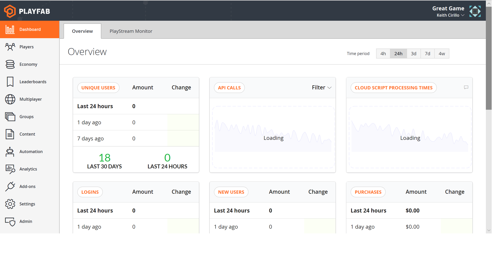

Monitor your **Title's KPIs** and watch your **PlayStream Events** in real time.

The dashboard has six sections. Left to right, top to bottom they are the following.

1. **LOGIN**: The number of logins recorded for the selected time-span.
2. **INSTALL**: The number of accounts created (**Players** logging in for the very first time) for the selected time-span.
3. **REVENUE**: The USD value of real money transactions processed for the selected time-span.
4. **MONTH OVERVIEW**: Useful **KPIs** pulled from the month-to-date data
    - **Revenue**: the USD value of real-money transactions processed
    - **DAU (Daily Active Users)**: the average number of unique **Players** logging in per day
    - **MAU (Monthly Active Users)**: the average number of unique **Players** logging in per month
5. **PLAYSTREAM DEBUGGER**: Will display **Title** events as they are generated in real time.
6. **VIRTUAL CURRENCY TRANSACTIONS**: The number of **Virtual Currency** transactions recorded for the selected time span.

[Back to Game Manager Sections](#game-manager-sections)

### 3. PlayStream

This section houses the control panel for everything that is **PlayStream**. Here you will find a graph of the **PlayStream** activity (filtered for the selected time-span).

The stream debugger (like in other sections) displays **Title Events** as they are generated in real time.

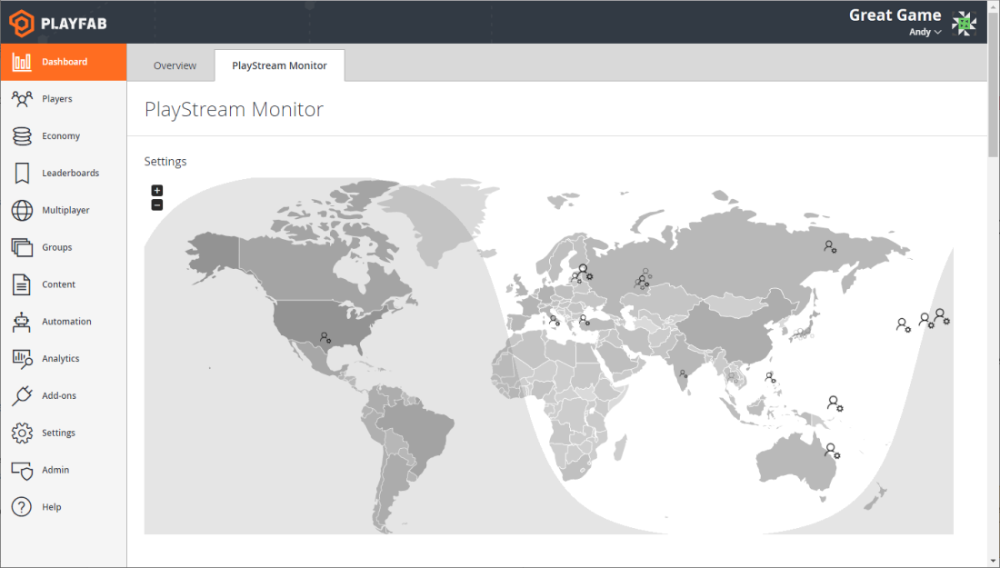

Use the sampling controls to gather more or less events per second.

**PlayStream** is our latest and greatest addition to the **PlayFab** platform. More information will be coming soon on what actions you can do with **PlayStream**.

[Back to Game Manager Sections](#game-manager-sections)

### 4. Players

The **Players** tab presents you with a sorted list by most recent login. Selecting any of the records will take you to that **Player's** overview.

Using the **SEARCH** box, you can easily look for players by **ID**, **Username**, **Display Name**, or **Email**.

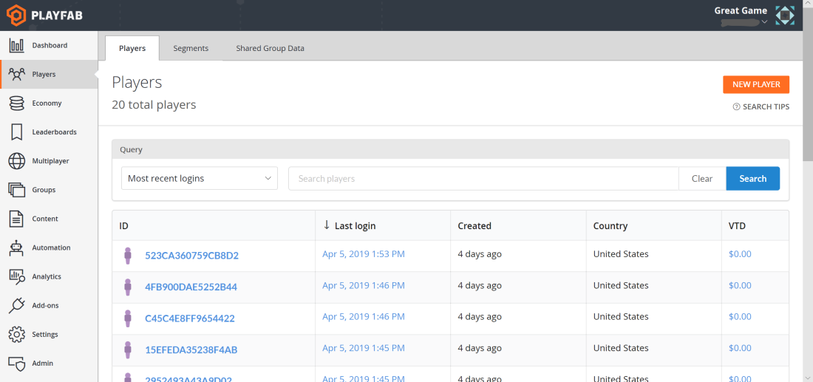

#### Player Overview

This detailed screen provides a wealth of insight into the **Player's** activity. The **Overview** sub-menu contains many links to other **Player**-centric information.

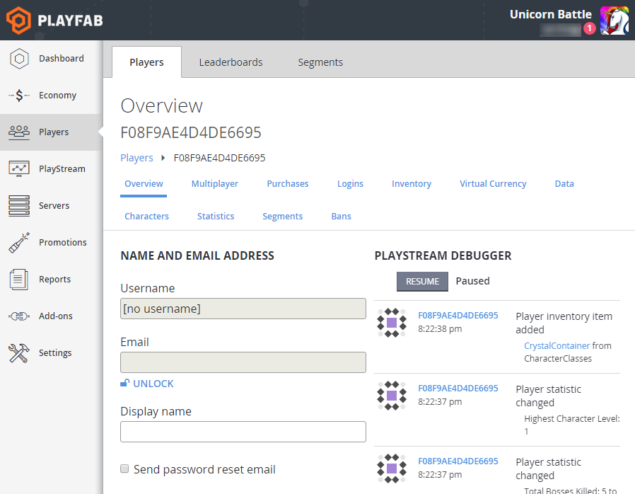

Tools your team can use to remedy defrauded **Players** and identify potential abusers.

- **Overview**- View basic details and linked account status.
- **PlayStream**- View **Player** generated events.
- **Logins**- View **Player** login history.
- **Segments**- View which segments this **Player** has entered.
- **Statistics**- View and edit **Player** statistics.
- **Data**- View and edit **Player** data records.
- **Inventory**- View, grant, and revoke **ItemInstances**.
- **Purchases**- View this **Player's** real money purchase history.
- **Virtual Currency**- View and edit player **Virtual Currency** (**VC**) balances.
- **Characters**- View **Player** owned characters and edit basic details.
- **Multiplayer**- View **Player** match history from multiplayer sessions.
- **Bans**- View **Player Ban** history.

#### Leaderboards

**Leaderboards**, the second tab, displays all the active **Leaderboards** for your **Title**. **PlayFab Leaderboards** are driven by  **Players** statistics. Selecting a statistic will display the corresponding leaders.

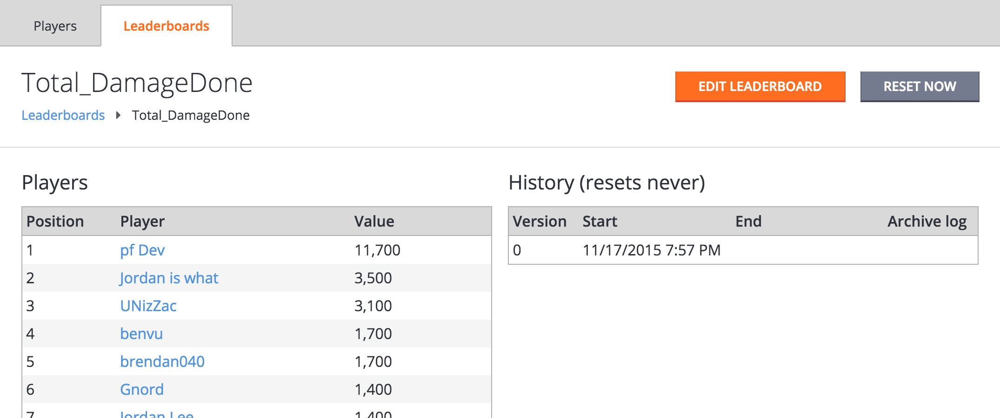

Selecting a **Player Name** will take you to that **Player's** overview.

The **Leaderboards** reset frequency controls when one "season" begins and another ends. Our **Leaderboards** can optionally to reset themselves **hourly**, **daily**, **weekly** and monthly.

Selecting the orange **EDIT LEADERBOARD** button allows you to edit your **Leaderboards's** name as well as the reset frequency.

**Additional Information:**

- [Using resettable statistics and Leaderboards](../../social/tournaments-leaderboards/using-resettable-statistics-and-leaderboards.md)

[Back to Game Manager Sections](#game-manager-sections)

### 5. Economy

At the center of **PlayFab Economies** is the concept of **Catalogs**. 

**Catalogs** are a collection of **Items**, **Currencies**, **Stores**, and **Droptables**. This section provides all the tools needed to manage your game's virtual economy.

As an example, the following image shows **Unicorn Battle's** primary **Catalog**.

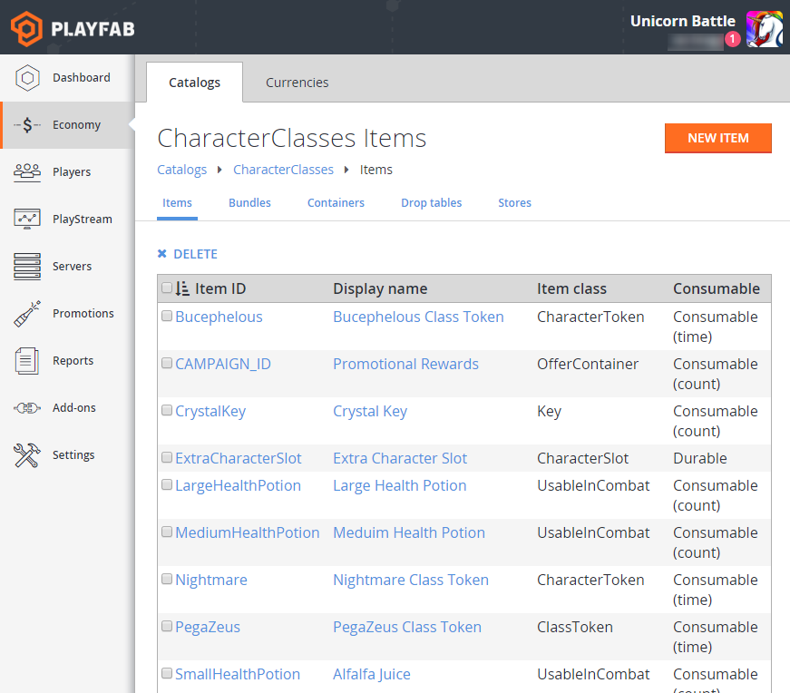

- **Catalog Items** - An **Item** within the **Catalog**. **Items** can be of several different types.
- **Virtual Currencies** - Arbitrary trackers for the mediums that can be exchanged for **Catalog Items**.
- **Stores**- A subset of **Catalog Items** that can be set to prices that are different than those specified by the **Catalog**.
- **Drop Tables** - Control the **Item** distribution when **Players** open **Containers** and **Bundles**.

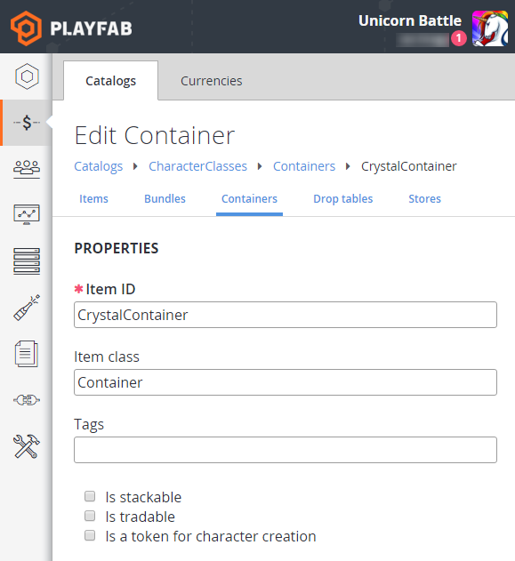

Selecting any **Catalog Item** opens a detailed editor for the **Item** properties.

The following example shows the **Edit Currency** page for the **Unicorn Battle's VC** called **Hearts**. The settings show that it is being used as a "lives" mechanic that regenerates every hour.

**Additional Information:**

- [Catalogs Tutorial](../../commerce/items/catalogs.md)
- [Currencies Tutorial](../../commerce/economy/currencies.md)

[Back to Game Manager Sections](#game-manager-sections)

### 6. Servers

**PlayFab** works with many architectures and game types. Whether you are looking to hosting multiplayer matches, or just need a secure environment that can reduce many common forms of hacking and abuse.

**CloudScript** offers an excellent alternative when compared with the overhead of dedicated game servers.

The servers section of the **Game Manager** has two major roles:

1. The main interface for uploading **CloudScript** files.
2. A control panel for your hosted multiplayer servers.

**Additional Information:**

- [CloudScript quickstart](../../automation/cloudscript/quickstart.md)
- [Building Custom Game Servers Tutorial](../../multiplayer/compute/custom-game-servers.md)

[Back to Game Manager Sections](#game-manager-sections)

### 7. Promotions

The **Promotions** section offers tools for engaging with your **Players**.

The following example shows the active news articles within **Unicorn Battle**.

[Back to Game Manager Sections](#game-manager-sections)

### 8. Add-ons

We have many great vendors, and each one brings something unique to the table. We could tell you all about it here, but its better if you see it for yourself.

- To configure marketplace integrations for your **Title**: Explore the **Add-ons** section of the **Game Manager** for details on the various **Add-ons**.

  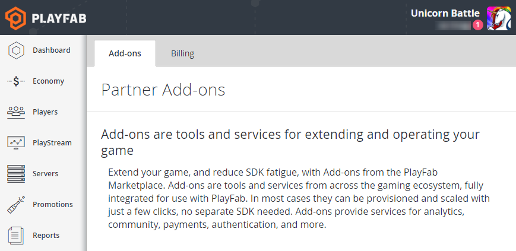

Setup instructions for each **Add-on** may vary. Additional billing information may also be required.

[Back to Game Manager Sections](#game-manager-sections)

### 9. Reports

**PlayFab** generates reports that capture daily and monthly activity. Currently, there are three reports available to all developers:

- **Daily Overview Report**: Reports the daily **KPIs** for your **Title**.
- **Monthly Overview Report**: Reports the aggregated **KPIs** for the month.
- **Monthly Top Spender Report**: Reports the month's top paying **Players**.

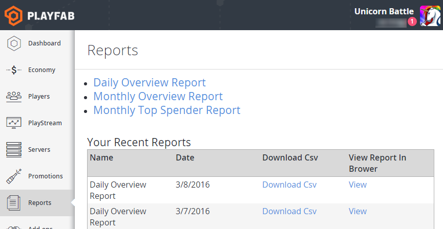

For additional or custom reports, please open a **Feature Request** in our [community forums](https://community.playfab.com/spaces/24/index.html).

[Back to Game Manager Sections](#game-manager-sections)

## Basic Actions

### Editing Profile settings

1. Open the **Admin** menu by selecting the current **User**.
2. Then select **Edit Profile**.
3. Specify **Your Name**, a **Password**, add a **Phone number**, set your **Time zone**, and specify whether you want to enable **Two-Factor Authentication**.
4. Select the **Save Profile** button to save your changes and return to the studios page.

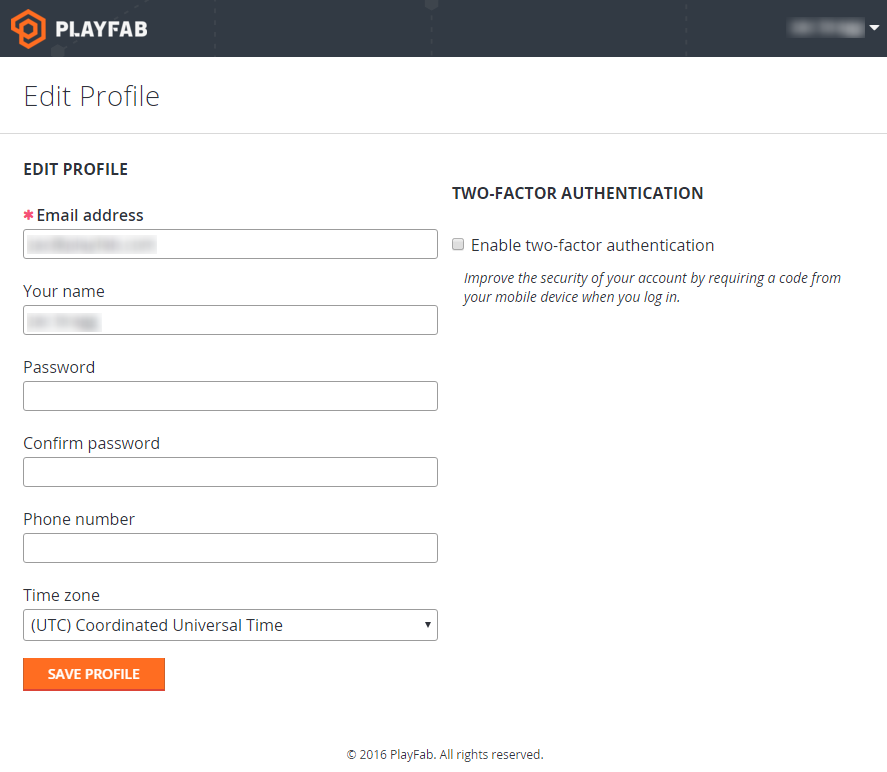

- **Two-Factor Authentication** - Two-factor authentication improves the security of your developer accounts by requiring a code to be supplied when logging in.

### View PlayFab notifications

New notifications will be called out with a pink delimiter containing the number of new notifications.

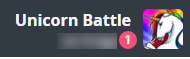

1. Open the **Admin** menu by selecting the current **User**. Then select **News**.
2. View the published notifications.

Notifications include information on new features, **API** updates, and service outages.

### Create and Edit Studios and Titles

#### To add a new Studio

1. Select the orange **NEW STUDIO** button in the top right of the **Studios** page.
2. Enter a **Studio Name**.
3. Save your changes and return to the **Studios** page.

#### To edit an existing Studio

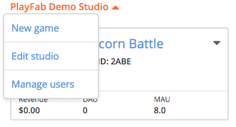

1. Select the down-arrow next to your **Studio's Name**, and then select **Edit Studio**.
2. Make your edits.
3. Save your changes and return to the **Studios** page.

#### To add a new Title

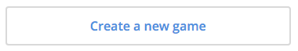

1. Select the **Create a new game** button under your existing **Titles**.
2. Enter your **Title** details. Optionally, this information can be added after **Title** creation.
3. Save your changes and return to the **Studios** page.

#### To edit an existing Title

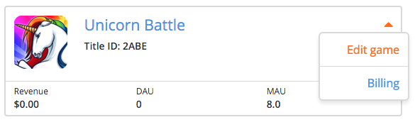

1. Select the down-arrow next to the **Title** you wish to edit and select **Edit game**.
2. Make your edits.
3. Save your changes and return to the **Studios** page.
    - **Title** - An individual instance of a game within **PlayFab**.
    - **Studio** - A group of **Titles** that can share data and developer access.

### Manage Developer accounts

**Developer** accounts are special **PlayFab** accounts permitting access to one or more sections on one or more **Titles** of a given **Studio**.

1. Select the down-arrow next to your **Studio's Name**, and then select **Manage Users**.
2. Add **Developer** accounts using the orange **NEW USER** button in the top right.
3. Remove **Developer** accounts by checking the box next to the account, and then selecting the **X DELETE** link in the top-left, above the **User** table.

If you do not already have a **PlayFab Developer** account, an email will be sent to the address you provided. Upon confirmation, the new account will have access to the **Title**.

## Settings actions

### Toggle API Features

The **API Features** tab provides optional permissions that affect what an **API** set has permission to do. By default, all options are off. Enabling these **Features** will allow your **Title** to be **Client** authoritative at the expense of security.

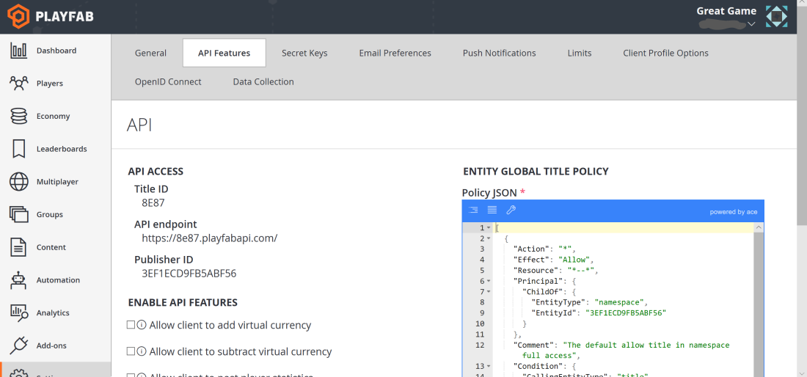

Choose your preferred permissions, and select the **Save API Features** button.

### View and edit Title Data

**Title Data** is accessible from all **API** sets by all **Users**. This makes **Title Data** an ideal place to store your custom **Title** settings.

In the example below, we store: quests, enemy encounter details, achievement thresholds, **Events** and sales data, and more.

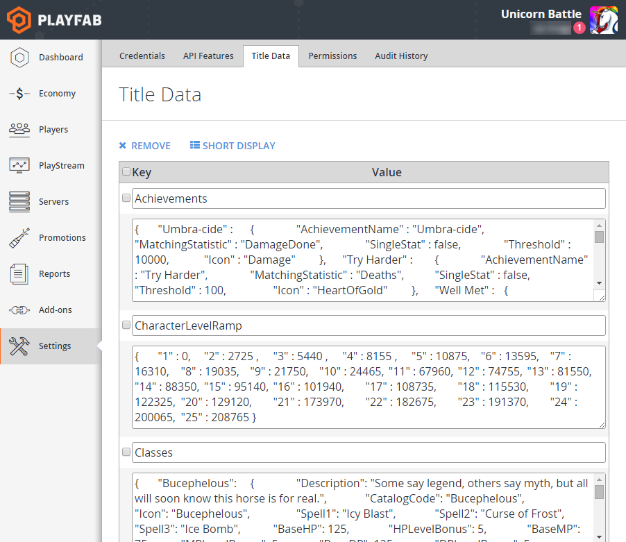

We provide tall and short views that make viewing text blobs easier.

#### Add or edit Title Data Keys

1. Enter text for your **Key** (**Keys** must be unique).
2. Enter text for your value (accepts strings up to 10KB).
3. Save your changes with the orange **SAVE TITLE DATA** button under the data table.

#### Remove Title Data Keys

1. Check the box that corresponds to the row(s) that you wish to remove.
2. Select the **X Remove** link in the top-left, above the **User** table.
3. Save your changes with the orange **SAVE TITLE DATA** button under the data table.

### Update Account Permissions and view Audit History

The **Permissions** tab displays an account table containing all of the **Developer** accounts with access to the current **Title**. 

**Users** are added and removed at the **Studio** level, but individual **Permissions** are set on a per-**Title** level. This flexibility enables you to provide your team with variable access depending on their role.

#### Update Account Permissions

1. Select the **Account** you wish to edit.
2. Select the appropriate **Permissions** (note: **Admins** have view and edit **Permissions** for all sections).
3. Save your changes by selecting the orange **SAVE PERMISSIONS** button.

You can set viewing and editing restrictions for virtually every section within the **Game Manager**.

#### Track changes across your Title

Every action taken within the **Game Manager** is logged for posterity. Check the **Audit History** tab to see what changes have been recently made.

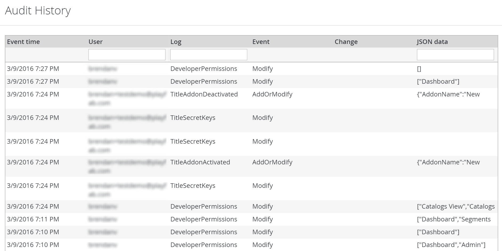

Select any change to view the complete details.

## Promotions Actions

### View or edit Title News

1. Select an old **News Item** to edit or create a new one by selecting **NEW TITLE NEWS**.
2. Enter a **Title**, set the **Status** to **Published**, and enter your text into the **Body** field.
3. Select **SAVE TITLE NEWS** and your **News** is now ready for the **Client** to receive.

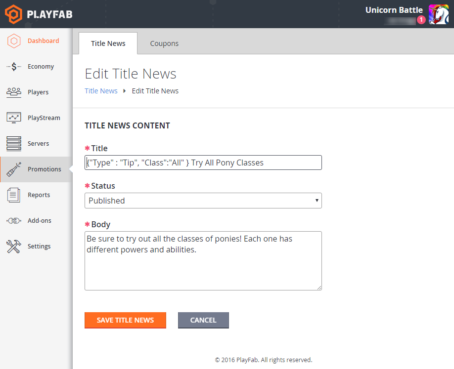

**Title News** makes a great tool for in-game tips or message-of-the-week style communication.

### Generate Coupon Codes

1. Select your primary **Catalog** and the **Item ID** for the **Item** you wish to grant.
2. Choose the appropriate quantity, and select the **GENERATE COUPONS** button.
3. **Game Manager** will generate the codes in a downloadable **.csv** file

This coupon tool works great for generating the digital rewards for "backers" and testers.
