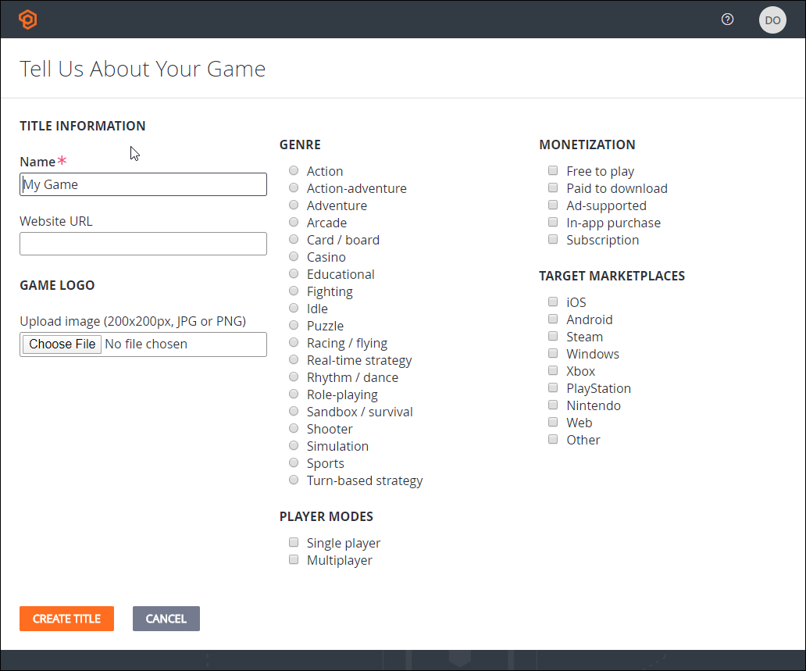

# Quickstart: Game Manager

This quickstart guides you through creating your PlayFab account, creating your Studio, and creating your first Title.

## Create a PlayFab account

On the [PlayFab sign up](https://developer.playfab.com/en-us/sign-up) screen, you can create a PlayFab specific account or use your Microsoft account to sign in.

When you have signed in, you are asked to tell us about yourself and to enter the name of your game studio. If you have not finalized the game studion name, you can change it later.

## Create your first game

To create a game, you must, at a minimum, enter a name for the game. You have the option of specifying additional details about your Title; such as the Title genre,monetization mode, the target marketplaces, and the player mode. These properties are used by the Benchmark comparisons feature and are used to a finer grained view of the benchmark data. You can choose to set these at a later time.

## Your studios and Titles

When you have successfully created your account, studio, and first game, Game Manger opens in the dashboard for your Title.

The next time you log in, Game Manager will open the **My Studios and Titles** page. From there you can select a Title to open its dashboard. For a detailed introduction to the features of Game Manager, see [Game Manger reference](reference.md)

## Next steps

- [PlayFab User Roles](playfab-user-roles.md)
- [Getting started for developers](../../../personas/developer.md)
