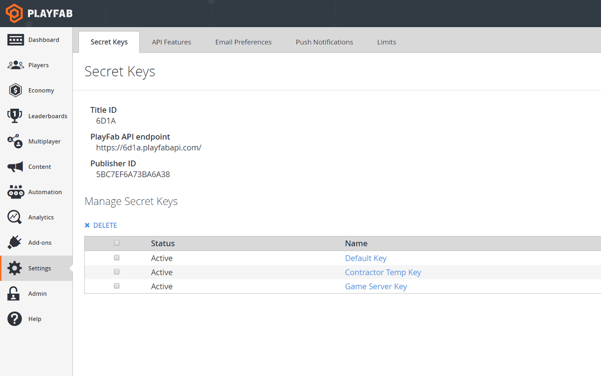
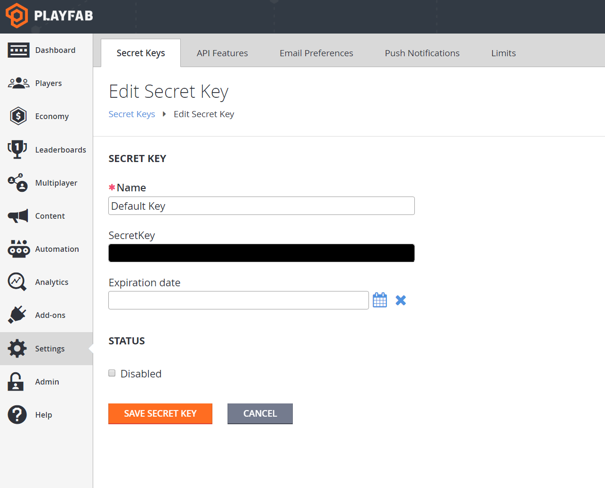

# Secret Key Management

PlayFab has introduced a feature for managing secret keys. Keys can now be created, deleted, disabled, and set to expire. This lets you rotate the secret keys for your titles, which was previously quite hard to do. It also allows you to grant temporary access to your titles.

Now, on the Settings -> Secret Keys tab in Game Manager, you will see a list of your keys. On this list you’ll find options for deleting keys, the status of each key, the key’s name, value, and expiration time, if it has one. This table lets you audit the keys that are available.

  

You can rename, enable, disable, or set expirations for existing keys via the dashboard. Clicking on a key, you see options for these. Each title will start with a default key. 

To rotate your keys, perform the following steps:

1. Create a new key. Here, you will enter the name of the key, and an optional expiration time.
2. Change your code to use your new key instead of the old key,
3. Disable your old key.

Even if, for any reason, your old key was compromised, this rotation will leave your title in a secured state. This flow is zero-downtime, and each stage can be rolled back safely. If there are issues at step one, you can simply delete your new key. No one should be using it. At step two, both keys are active, so you can roll your code forward or back safely. At step three, you can re-enable the key while you fix whatever was still depending on it. Once this whole process is complete, you do not need to delete the old key. If you delete that key, it cannot be recovered. The delete is permanent, and irrevocable.

  

Expiring keys can be useful for giving someone temporary access to your title. If you have a contractor working on your game, you can give them keys that only have access for as long as you expect them to need it. Expiration times can be changed, though, to extend the lifetime of a secret key.