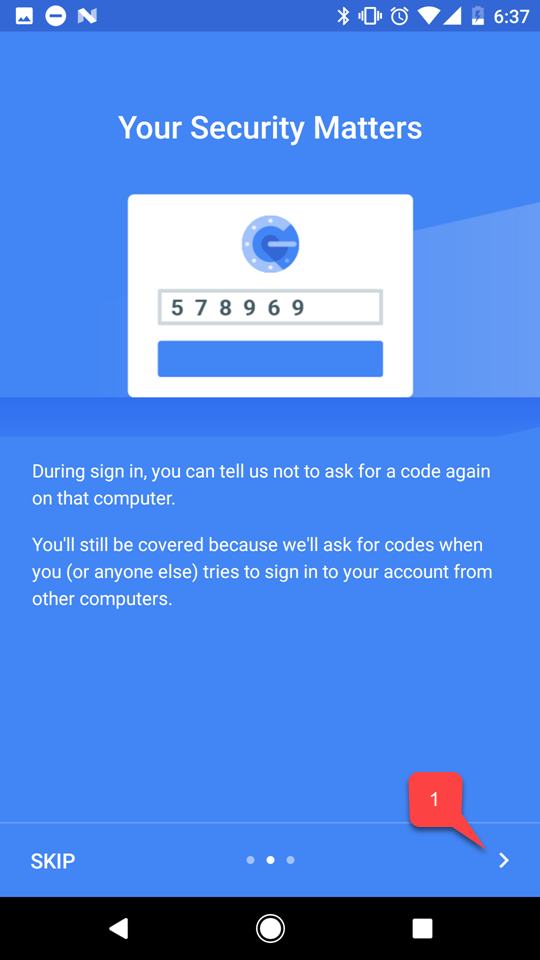
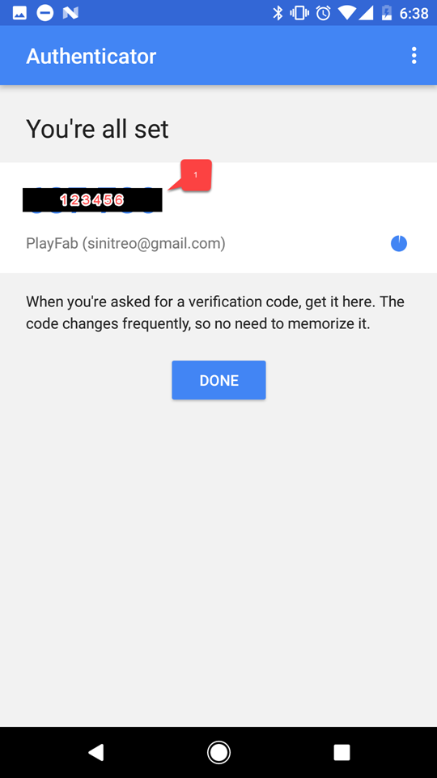
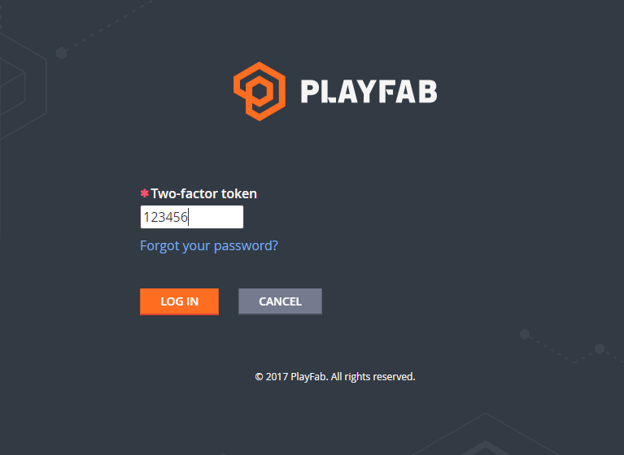

# Two-Factor Authentication

Two-Factor Authentication allows you to reinforce security on your PlayFab Game Manager account by adding one more step to the authentication process. It does so by adding a device-factor to the authentication process, which only allows you to authenticate if you possess a certain device, specifically registered for this purpose.

## Configuring Two-Factor Authentication

Install a two-factor authentication app to your device. You can search on your own application or select your platform from the following list:

- [iPhone, iPad, and iPod Touch](https://itunes.apple.com/us/app/google-authenticator/id388497605?mt=8)
- [Android phone or tablet](https://play.google.com/store/apps/details?id=com.google.android.apps.authenticator2)
- [Windows phone or tablet](https://www.windowsphone.com/en-us/store/app/authenticator/e7994dbc-2336-4950-91ba-ca22d653759b)

The steps are basically similar on all the platforms. This example shows an Android-based device and a Google Authenticator application.

Once the application is downloaded, open it and follow the instructions. Click "Begin" **(1)**:

  

Follow through the tutorial for the app if any **(1)**:

  

Then select one of two options to add your PlayFab account. You may either scan a bar-code **(1)**, or type in the key manually **(2)**:

  

Whichever option you choose, follow to the PlayFab website and navigate to Game Manager. Click the account panel **(1)** and navigate to "My Profile" **(2)**:

  

Account settings will open. Make sure the "Enable two-factor authentication" checkbox is checked. Depending on which option you have chosen, use the code **(1)** or a bar-code **(2)** to add a new account using the application on your device.

  

Once this is done, you will obtain a two-factor code:

 

Head back to the profile settings in the PlayFab Game Manager and enter the code you received **(1)**, then select "Save" **(2)**:

## Testing

Log out of your PlayFab account and try to log in again. The first step of the authentication process will look normal:

The second step will require you to use your two-factor code. The code is available at any time, and you can access it using the application you installed on your device:

Once the correct two-factor code has been entered, you should be logged in.

This concludes setting up Two-Factor Authentication for PlayFab.
