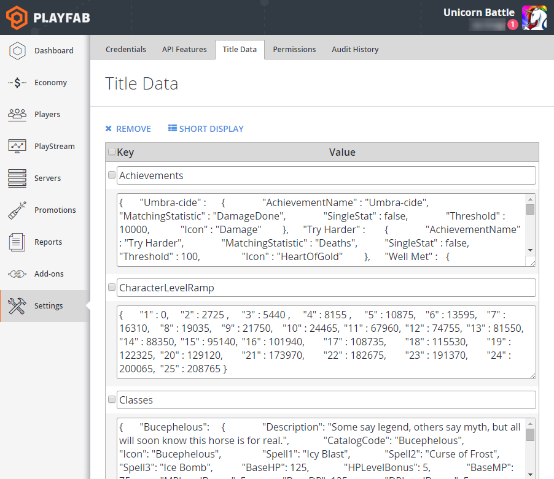

# Title Data Quickstart

This Quickstart describes how to programmatically create and use **Title Data**.

This an important topic because storing a game's configuration data remotely, on the server, where it can be changed at any time, is one of the most basic reasons to use a service like **PlayFab**.

Title data is represented as **Key/Value Pairs (KVPs)**, that can only be associated with a specific **Title**.

> [!NOTE]
> Title data values are copied and distributed to potentially *hundreds* of machines in the **PlayFab** cluster server. As part of this process, **Title Data** is cached and changes may take up to *fifteen minutes* to refresh in those caches. **Title Data** is best suited for **Global Constant/Static Data**, and is *not suitable* or reliable as **Global Variables**.

## Getting Title Data

### From the game client

Use [GetTitleData](xref:titleid.playfabapi.com.client.title-widedatamanagement.gettitledata) from the **PlayFabClientAPI** to get the **KVPs** for a specific **Title**. The following code example displays the values of all of the **Title Data**.

```csharp
public void ClientGetTitleData() {
    PlayFabClientAPI.GetTitleData(new GetTitleDataRequest(),
        result => {
            if(result.Data == null || !result.Data.ContainsKey("MonsterName")) Debug.Log("No MonsterName");
            else Debug.Log("MonsterName: "+result.Data["MonsterName"]);
        },
        error => {
            Debug.Log("Got error getting titleData:");
            Debug.Log(error.GenerateErrorReport());
        }
    );
}
```

### From the game server

Use [GetTitleData](xref:titleid.playfabapi.com.server.title-widedatamanagement.gettitledata) from the **PlayFabServerAPI** to get the **KVPs** for a specific title. The following code example displays the values of all of the title data.

```csharp
public void ServerGetTitleData() {
    PlayFabServerAPI.GetTitleData( new GetTitleDataRequest(),
        result => {
            if (result.Data == null || !result.Data.ContainsKey("MonsterName")) Debug.Log("No MonsterName");
            else Debug.Log("MonsterName: " + result.Data["MonsterName"]);
        },
        error => {
            Debug.Log("Got error getting titleData:");
            Debug.Log(error.GenerateErrorReport());
        });
}
```

## Setting Title Data

It is unlikely that **Title Data** will change very frequently. For most situations, you should use your **Title Data** for static data that is mostly unchanged for the life of the title.

You can set **Title Data** by using the **Game Manager**, or by a server **API** function.

After the **Title Data** is set for initial release, most **Titles** will not make significant changes from that point.

### Setting Title Data using Game Manager

To add data to a **Title**, perform the following steps.

1. Open the **Title** in **Game Manager**.

1. Select **Content**, then **Title Data**.
1. Select **Add Item**.
1. Enter a value for the **Key** and a value for the **Value**. Both the **Key** and the **Value** are stored as strings.
1. Select the **SUBMIT** button to save the new data item.

  

### Setting Title Data by calling the server API in C#

The [SetTitleData](xref:titleid.playfabapi.com.server.title-widedatamanagement.settitledata) **API** is a server **API** that you must call from a dedicated server. You can only set one **Title Data KVP** in each call to **SetTitleData**.

```csharp
public void SetTitleData() {
    PlayFabServerAPI.SetTitleData(
        new SetTitleDataRequest {
            Key = "MonsterName",
            Value = "Dorf"
        }, 
        result => Debug.Log("Set titleData successful"),
        error => {
            Debug.Log("Got error setting titleData:");
            Debug.Log(error.GenerateErrorReport());
        }
    );
}
```

## Internal Title Data

Similarly to **UserData**, **Title Data** has internal storage that is hidden from the client. This data can also be set in the **Game Manager**, or via a server **API**.

### Getting Internal Title Data by calling the server API in C#

```csharp
public void GetTitleInternalData()
{
    PlayFabServerAPI.GetTitleInternalData( new GetTitleDataRequest(),
        result => {
            if (result.Data == null || !result.Data.ContainsKey("PlayFab")) Debug.Log("No PlayFab");
            else Debug.Log("PlayFab: " + result.Data["PlayFab"]);
        },
        error => {
            Debug.Log("Got error getting titleData:");
            Debug.Log(error.GenerateErrorReport());
        }
    );
}
```

### Setting Internal Title Data by calling the server API in C#

```csharp
public void SetTitleInternalData() {
    PlayFabServerAPI.SetTitleInternalData(
        new SetTitleDataRequest {
            Key = "PlayFab",
            Value = "{ \"Status\": \"Secretly Awesome\" }"
        }, 
        result => { Debug.Log("Set titleData successful"); },
        error =>
        {
            Debug.Log("Got error setting titleData:");
            Debug.Log(error.GenerateErrorReport());
        });
}
```

## See Also

- [Using Publisher Data](../../config/titledata/using-publisher-data.md)
- [Player Data Quickstart](../../data/playerdata/player-data-quickstart.md)
- [CloudScript Quickstart](../../automation/cloudscript/cloudscript-quickstart.md)
