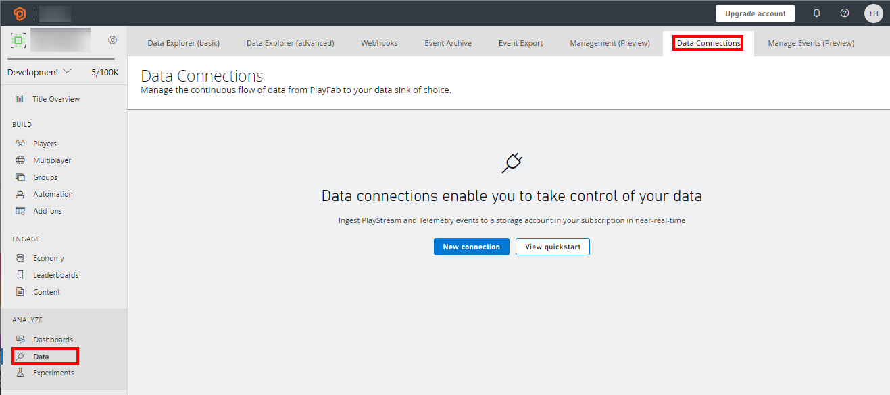
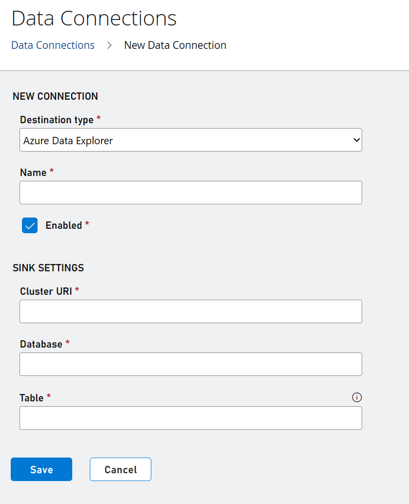

# Configuring your data connection to Azure Data Explorer (ADX)

Data Connections now allows you to export to Azure Data Explorer for near-real time ingestion and distribution of your data. After you configure a data connection with your ADX cluster information, PlayFab exports your data into the ADX cluster specified.

PlayFab requires an Azure Active Directory (AD) app and a Client Secret to authenticate to your ADX cluster. You can use an existing Azure AD app if you would like or create one specifically for this purpose. To create your Azure AD app follow the steps below. 

> [!Note]
> Although you can reuse an existing Azure AD app, we recommend that you fo not reuse an Azure AD app with privileged access to resources critical to your service. 

## Setting up your resource in Azure

### Step 1: Create a new Azure AD app
To create a new Azure AD App, follow the initial steps here: [Create an Azure AD application in Azure Data Explorer | Microsoft Docs](/azure/data-explorer/provision-azure-ad-app#create-azure-ad-application-registration)

### Step 2: Create an ADX Database
You also need to create an ADX Cluster and Database. You can follow the initial steps here:
[Create an Azure Data Explorer cluster and database](/azure/data-explorer/create-cluster-database-portal)

### Step 3: Grant the Azure AD app permission to use the ADX Database
You can then grant the Azure AD app-admin permissions to the ADX database. Follow the initial steps here and when choosing your principals (users, groups, and apps) to use your Azure AD app (you can search for it by name in the search box).
[Manage database permissions in Azure Data Explorer](/azure/data-explorer/manage-database-permissions)

Once your Azure AD app is listed as a “Database Admin,” you can move on to creating the data connection in PlayFab.

## Create an Azure Data Explorer Data Connection in PlayFab

### Step 1: Navigate to the data connections tab

 

- Log in to PlayFab and navigate to your title.
- Select the “Data” section in the left-hand menu
- Select the “Data Connections” tab

### Step 2: Configure a new Data Connection

- Select the “New Connection” button.
- Choose the “Destination Type” to be “Azure Data Explorer”
- Populate the fields using the following values  

| Value | Details |
|:-----------|:-----------|
|Name | The friendly name of your data connection. This name allows you to find the data connection later to edit it. Put a descriptive name here. 
| Cluster URI  | The ADX cluster URI.|
| Database | The database name. The PlayFab ingestion service creates a table in this database and ingest the data to that table. |
| Table | The name of the table in the database that PlayFab ingests the data into. If the table does not exist, then the ingestion service creates the table. |
| Application ID | The Azure AD App ID. |
| Tenant ID | The Azure AD Tenant ID. |

 

> [!Note]
> We recommend using a table name that doesn't exist. If you use an existing table and the schema is not what PlayFab is expecting, then the schema will be modified. 

### Step 3: Ensure that you have granted the Azure Active Directory app access to your Azure Data Explorer cluster before proceeding. 
- Return to your Azure AD App and navigate to the App Registration page.
- Follow the commands as shown in the PlayFab Data Connections setup window. You may copy these commands using the 'copy' icon on the right side of these commands. 
 

Return to your Azure AD App’s “App Registration” to create a client secret. You can follow the steps here to create a new client secret for your app: [How to Create a New Application Secret](/azure/active-directory/develop/howto-create-service-principal-portal#option-2-create-a-new-application-secret) 

Paste the client secret Value into the “Client Secret” box and ensure the “Enabled” checkbox is checked. You can now click “Save.” After the data connection is successfully saved, you should be taken to a page that shows your new data connection with the Status “Enabled.” At this point, your data connection is successfully set up. You should start to see events in your ADX cluster 5-10 minutes after the next event in your title occurs.

