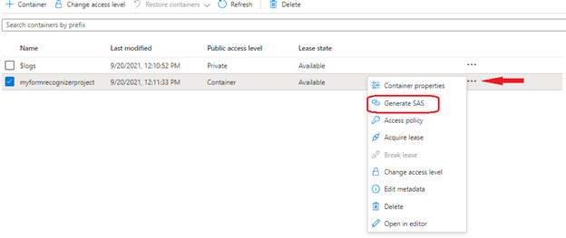
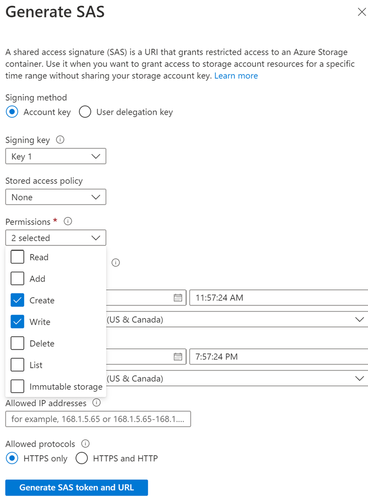
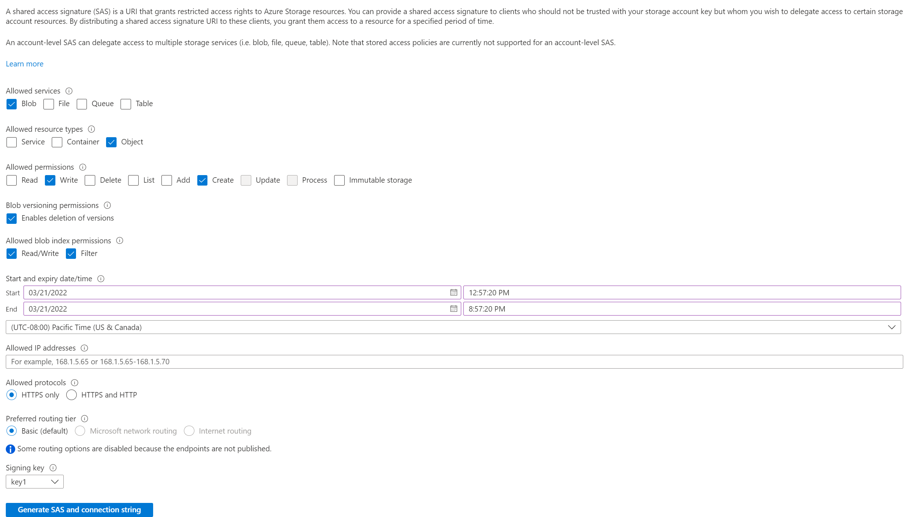

# Data Connections

**Data Connections** enables the continuous near real-time distribution and ingestion of PlayStream and Telemetry data into your chosen and authorized storage resource in your Azure subscription, such as Azure Blob Store.

It provides control of your data in your storage account with less than 5-minute data ingestion latency. The architecture is designed for better batch processing that facilitates Parquet files in blob storage with the highest throughput, low storage cost, and most flexibility. 

You can configure up to three Azure blob storage accounts in the WestUS2 region. In case of failure in data distribution, a built-in automatic retry mechanism is in place to ensure data quality. 

You can get started with Data Connections for event ingestion using PlayFab’s Game Manager portal or scalable APIs.

 

## Why do you need it? 

Data Connections is the replacement for the Event Export and Export to S3 features that currently PlayFab supports. Data Connections allow for faster export in preferred formats for offline processing. You get to bring your storage account for data to be ingested and distributed. That means you get to manage and control the encryption-at-rest policy, the lifetime management policy, and network access. The billing becomes simplified as the costs associated with that storage account are accounted for centrally in your all-up Azure account billing.  

The data is readily available in Parquet blob format. Parquet is a column-oriented data file format designed for efficient data storage and retrieval. It provides efficient data compression and encoding schemes with enhanced performance to handle complex data in bulk, resulting in low latency, higher throughput, and low cost of data storage. It's designed to be a common interchange format for both batch and interactive workloads. Thus, Data Connections enables your endeavors for custom advanced analytics and reporting, to run ad-hoc queries in a cost-optimized manner.

For more optimized cost and data control, you can make use of Data Connections with [Event Sampling](../manage-events-with-sampling/index.md) - Sampling enables you to configure the percentage of events data that you want to receive.

### Grant PlayFab access to your storage container
For Data Connections, you need an Azure subscription and a storage account. 

For existing PlayFab and Azure customers, you can create a storage container on the [Azure portal](https://ms.portal.azure.com/#allservices) and get started with Data Connections on [Azure PlayFab](https://developer.playfab.com/sign-up/). 

For existing PlayFab who are new to Azure, you can sign up for an [Azure subscription](https://ms.portal.azure.com/).

> [!Note]
> Make sure to create your Storage Account in the West US 2, otherwise, egress cost will be applied to your storage account.

For PlayFab to ingest data in your storage account, container details along with authorization using a SAS token are required. To create a SAS token using the Microsoft Azure portal, follow the steps below.

#### Option 1: Create the SAS token on the container level. 
> [!Important]
> Generate and retrieve the shared access signature for your container, not for the storage account itself.

- In the [Azure portal](https://ms.portal.azure.com/#allservices), select **Your storage account > Containers**.
- Select a container from the list.
- Go to the right of the main window and select the three ellipses associated with your chosen container.
- Select **Generate SAS** from the dropdown menu to open the **Generate SAS** window.

 

- Define **Permissions** by selecting or clearing the appropriate checkbox. Make sure the **Create** and **Write** permissions are selected.

 

- Specify the signed key **Start** and **Expiry** times. 
- Select **Generate SAS token and URL**.
- The **Blob SAS token** query string appears in the lower area of the window.
- Copy and paste the **Blob SAS token** values into a **secure location for use in the Azure PlayFab Data Connections**. It's displayed only once and can't be retrieved after the window is closed.

#### Option 2: Create the SAS token on the account level.
> [!Important]
> Generate and retrieve the shared access signature for your storage account itself.

- In the [Azure portal](https://ms.portal.azure.com/#allservices), select **Your storage account** 
- Select a **Shared access signature** from the list under **Security + Networking**.
- Define **Services** by selecting **blob** and clearing other checkboxes. 
- Define **Resource Type** by selecting **Object** and clearing other checkboxes. 
- Make sure the **Create** and **Write** permissions are selected.
- Specify the signed key **Start** and **Expiry** times. 
- Select **Generate SAS token and URL**.
- The Blob SAS token query string appears in the lower area of the window.
- Copy and paste the **Blob SAS token** values into a **secure location for use in the Azure PlayFab Data Connections**. It's displayed only once and can't be retrieved after the window is closed.

 
