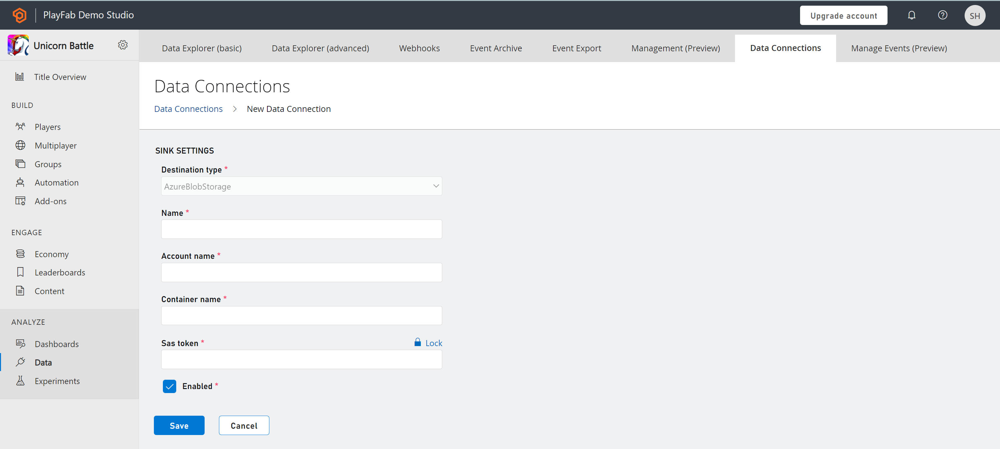

# Data Connections quickstart

## Pre-requisite:
- For Data Connections, you need an Azure subscription and a storage account. 
- For PlayFab to ingest data in your storage account, container details along with authorization using a SAS token are required. To create a SAS token using Microsoft Azure portal, follow the steps below.

> [!Important]
> Make sure to create your Storage Account in the West US 2, otherwise, egress cost will be applied to your storage account.

## Create a Data Connection

A Connection is created to integrate your storage resource with PlayFab and retrieve the PlayStream and Telemetry data. You can configure up to three data connections in the “enabled (active)” state. 
From the Game Manager:
- Navigate to your **Title**
- Select **Data** from the menu on the left
- Select **Data Connections** from the **Data** tabs
- Select **New Connection**, new data connections configuration page is opened
- Define **Sink Setting** of Azure Blob Storage type
    *	Enter **Name**
    *	Enter **Account Name**
    *	Enter **Container Name**
    *	Enter **SAS Token** as generated in the Azure portal
- Select **Save**
    *	With the default check on **Enabled**, the connection between PlayFab and the customer’s resource is established once saved.
    *	With uncheck on **Enabled**, the connection between PlayFab and the customer’s resource is validated but not established until saved.

## Manage Connections
The Data Connections overview (landing) page displays the available connections categorized as **enabled** or **disabled** as a **status**. You can have up to 3 enabled connections to the blob storage account at any time. 
The Data Connections overview page can also be used to manage connections by selecting any Connections’ ellipsis (…). Two actions comprising Edit and Delete can be taken on the connections. 

