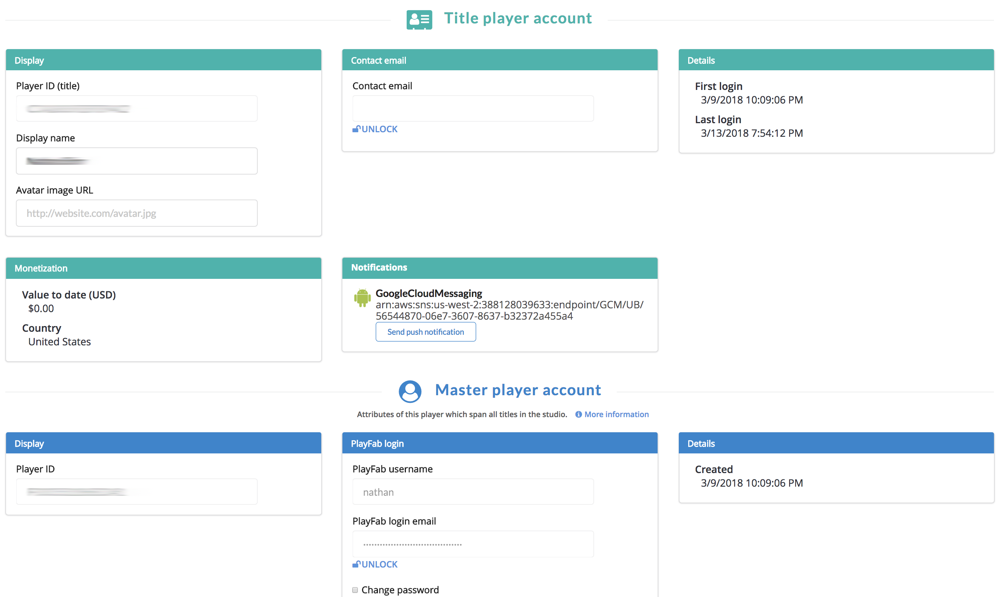

# Getting started with Entities

Read our introductory blog [here](https://api.playfab.com/blog/introducing-entities-objects-and-files)!

The Entity API introduces new access patterns that are designed to alleviate the pain points of the current account and data systems. With the existing APIs, saving a data value has separate API calls for "Title" access (client/[GetTitleData](https://api.playfab.com/documentation/client/method/GetTitleData), admin/[GetTitleData](https://api.playfab.com/documentation/admin/method/GetTitleData), server/[GetTitleData](https://api.playfab.com/documentation/server/method/GetTitleData)), "Player" access (client/[GetUserReadOnlyData](), client/[UpdateUserData](https://api.playfab.com/documentation/client/method/GetUserReadOnlyData), client/[UpdateUserPublisherData](https://api.playfab.com/documentation/client/method/UpdateUserPublisherData)), and "Character" access (client/[GetCharacterData](https://api.playfab.com/documentation/client/method/GetCharacterData), client/[UpdateCharacterData](https://api.playfab.com/documentation/client/method/UpdateCharacterData)). In the new API scheme, a single call supports saving a data value for a title, player, character, and every other future entity type. combined with powerful access rules that replicate and expand the current system behavior of custom data in a better interface. In some regards, these changes are not backwards compatible. However, using them will not change the behavior of the existing APIs.

## Terminology

Entities are any PlayFab concept which can contain data. Currently we have a number of built in entity types: "title", "master_player_account", "title_player_account" and "character". This system will be expanded, so you will see future entity types added to cover guilds or groups, game servers, and more.

Because this is a new API, we are refining some of the terms used in other API methods:

- **title** - This concept is unchanged. Your title may contain global information available to all players. This is similar to [TitleData](https://api.playfab.com/documentation/client/method/GetTitleData). It is identified by the Title ID (TitleId) of the game/application.
- **master_player_account** - This entity type allows you to share information about a player across multiple games within a studio. This is similar to [UserPublisherData](https://api.playfab.com/documentation/client/method/GetUserPublisherData). It is identified by the PlayFab ID (PlayFabId) of the player, which is returned as part of any login or any call to retrieve account information for the player account (for example, [Client/GetAccountInfo](https://api.playfab.com/documentation/client/method/GetAccountInfo)).
- **title_player_account** - This concept is based on User/Player in the existing API methods. Each player may contain some information for the current title. This is similar to [UserData](). This is identified by the Entity ID (Entity.Id) you get back in the [EntityTokenResponse](https://api.playfab.com/documentation/Client/datatype/PlayFab.Client.Models/PlayFab.Client.Models.EntityTokenResponse) object on any login where you specify LoginTitlePlayerAccountEntity as true.
- **character** - This concept is unchanged. Your player may own characters, which can each contain some information. This is similar to [CharacterData](https://api.playfab.com/documentation/client/method/GetCharacterData). It is identified by the Character ID (CharacterId) of the character.

See the [Available built-in Entity types](../../data/entities/available-built-in-entity-types.md) tutorial, for a list of all built-in Entity types.

> [!NOTE]
> Formerly, PlayFabId covered both "master_player" and "title_player" concepts. Separating these concepts simplifies and clarifies the functionality. A player can interact with multiple titles that are all in the same studio, so while they can have unique information as a different player in each title, the owner of the studio also needs to identify that player as a single entity with shared data across titles. This enables things like cross promotion of games and giving players cross-game rewards.

## Entity Initialization

Before you can use any Entity API calls you must get an [EntityToken](https://api.playfab.com/documentation/authentication/datatype/PlayFab.authentication.Models/PlayFab.authentication.Models.GetEntityTokenResponse). You do this by using any normal login call, with a new optional parameter [LoginTitlePlayerAccountEntity](https://api.playfab.com/documentation/client/datatype/PlayFab.client.Models/PlayFab.client.Models.LoginWithCustomIDRequest) set to true, or by calling the [GetEntityToken](https://api.playfab.com/documentation/Authentication/method/GetEntityToken) API method.

```csharp
PlayFabAuthenticationAPI.GetEntityToken(new GetEntityTokenRequest(),
(entityResult) =>
{
    var entityId = entityResult.Entity.Id;
    var entityType = entityResult.Entity.Type;
}, OnPlayFabError); // Define your own OnPlayFabError function to report errors
```

This API method returns an [Authentication/EntityKey](https://api.playfab.com/documentation/Authentication/datatype/PlayFab.Authentication.Models/PlayFab.Authentication.Models.EntityKey) object, which contains the Id and Type, which you should save. If called from the client, this typically represents the logged-in-player. Called from game-servers, this will represent your title. With the entityId and entityType, you can make other calls to other Entity API methods.

You should save a reference to the entityId and entityType to use in other API calls (Each API has an EntityKey structure, above). EntityToken is handled internally by the SDK, so you can ignore that.

## Entity Objects

Entity Objects allow you to read and write small JSON-serializable objects attached to an entity. All Entity types support the same GetObjects and SetObjects methods. The following examples demonstrate setting and reading an object on a title_player_account:

```csharp
var data = new Dictionary<string, object>()
{
    {"Health", 100},
    {"Mana", 10000}
};
var dataList = new List<SetObject>()
{
    new SetObject()
    {
        ObjectName = "PlayerData",
        DataObject = data
    },
    // A free-tier customer may store upto 3 objects on each entity
};
PlayFabDataAPI.SetObjects(new SetObjectsRequest()
{
    Entity = new EntityKey {Id = entityId, Type = entityType}, // Saved from GetEntityToken, or a specified key created from a titlePlayerId, CharacterId, etc
    Objects = dataList,
}, (setResult) => {
    Debug.Log(setResult.ProfileVersion);
}, OnPlayFabError);
```

```csharp
var getRequest = new GetObjectsRequest {Entity = new EntityKey {Id = entityId, Type = entityType}};
PlayFabDataAPI.GetObjects(getRequest,
    result => { var objs = result.Objects; },
    OnPlayFabError
);
```

## Entity Files

Entity Files allow you to read and write files attached to an entity, in any format. The following example demonstrates a full Entity-File loop - logging in, loading a file, and uploading a new file:

```csharp
#if !DISABLE_PLAYFABENTITY_API && !DISABLE_PLAYFABCLIENT_API

using PlayFab;
using PlayFab.Internal;
using System;
using System.Collections.Generic;
using System.Text;
using UnityEngine;

public class EntityFileExample : MonoBehaviour
{
    public string entityId; // Id representing the logged in player
    public string entityType; // entityType representing the logged in player
    private readonly Dictionary<string, string> _entityFileJson = new Dictionary<string, string>();
    private readonly Dictionary<string, string> _tempUpdates = new Dictionary<string, string>();
    public string ActiveUploadFileName;
    public string NewFileName;
    public int GlobalFileLock = 0; // Kindof cheap and simple way to handle this kind of lock

    void OnSharedFailure(PlayFabError error)
    {
        Debug.LogError(error.GenerateErrorReport());
        GlobalFileLock -= 1;
    }

    void OnGUI()
    {
        if (!PlayFabClientAPI.IsClientLoggedIn() && GUI.Button(new Rect(0, 0, 100, 30), "Login"))
            Login();
        if (PlayFabClientAPI.IsClientLoggedIn() && GUI.Button(new Rect(0, 0, 100, 30), "LogOut"))
            PlayFabClientAPI.ForgetAllCredentials();

        if (PlayFabClientAPI.IsClientLoggedIn() && GUI.Button(new Rect(100, 0, 100, 30), "(re)Load Files"))
            LoadAllFiles();

        if (PlayFabClientAPI.IsClientLoggedIn())
        {
            // Display existing files
            _tempUpdates.Clear();
            var index = 0;
            foreach (var each in _entityFileJson)
            {
                GUI.Label(new Rect(100 * index, 60, 100, 30), each.Key);
                var tempInput = _entityFileJson[each.Key];
                var tempOutput = GUI.TextField(new Rect(100 * index, 90, 100, 30), tempInput);
                if (tempInput != tempOutput)
                    _tempUpdates[each.Key] = tempOutput;
                if (GUI.Button(new Rect(100 * index, 120, 100, 30), "Save " + each.Key))
                    UploadFile(each.Key);
                index++;
            }
            // Apply any changes
            foreach (var each in _tempUpdates)
                _entityFileJson[each.Key] = each.Value;

            // Add a new file
            NewFileName = GUI.TextField(new Rect(100 * index, 60, 100, 30), NewFileName);
            if (GUI.Button(new Rect(100 * index, 90, 100, 60), "Create " + NewFileName))
                UploadFile(NewFileName);
        }
    }

    void Login()
    {
        var request = new PlayFab.ClientModels.LoginWithCustomIDRequest
        {
            CustomId = SystemInfo.deviceUniqueIdentifier,
            CreateAccount = true,
            LoginTitlePlayerAccountEntity = true
        };
        PlayFabClientAPI.LoginWithCustomID(request, OnLogin, OnSharedFailure);
    }
    void OnLogin(PlayFab.ClientModels.LoginResult result)
    {
        entityId = result.EntityToken.Entity.Id;
        entityType = result.EntityToken.Entity.Type;
    }

    void LoadAllFiles()
    {
        if (GlobalFileLock != 0)
            throw new Exception("This example overly restricts file operations for safety. Careful consideration must be made when doing multiple file operations in parallel to avoid conflict.");

        GlobalFileLock += 1; // Start GetFiles
        var request = new PlayFab.DataModels.GetFilesRequest { Entity = new PlayFab.DataModels.EntityKey { Id = entityId, Type = entityType } };
        PlayFabDataAPI.GetFiles(request, OnGetFileMeta, OnSharedFailure);
    }
    void OnGetFileMeta(PlayFab.DataModels.GetFilesResponse result)
    {
        Debug.Log("Loading " + result.Metadata.Count + " files");

        _entityFileJson.Clear();
        foreach (var eachFilePair in result.Metadata)
        {
            _entityFileJson.Add(eachFilePair.Key, null);
            GetActualFile(eachFilePair.Value);
        }
        GlobalFileLock -= 1; // Finish GetFiles
    }
    void GetActualFile(PlayFab.DataModels.GetFileMetadata fileData)
    {
        GlobalFileLock += 1; // Start Each SimpleGetCall
        PlayFabHttp.SimpleGetCall(fileData.DownloadUrl,
            result => { _entityFileJson[fileData.FileName] = Encoding.UTF8.GetString(result); GlobalFileLock -= 1; }, // Finish Each SimpleGetCall
            error => { Debug.Log(error); }
        );
    }

    void UploadFile(string fileName)
    {
        if (GlobalFileLock != 0)
            throw new Exception("This example overly restricts file operations for safety. Careful consideration must be made when doing multiple file operations in parallel to avoid conflict.");

        ActiveUploadFileName = fileName;

        GlobalFileLock += 1; // Start InitiateFileUploads
        var request = new PlayFab.DataModels.InitiateFileUploadsRequest
        {
            Entity = new PlayFab.DataModels.EntityKey { Id = entityId, Type = entityType },
            FileNames = new List<string> { ActiveUploadFileName },
        };
        PlayFabDataAPI.InitiateFileUploads(request, OnInitFileUpload, OnInitFailed);
    }
    void OnInitFailed(PlayFabError error)
    {
        if (error.Error == PlayFabErrorCode.EntityFileOperationPending)
        {
            // This is an error you should handle when calling InitiateFileUploads, but your resolution path may vary
            GlobalFileLock += 1; // Start AbortFileUploads
            var request = new PlayFab.DataModels.AbortFileUploadsRequest
            {
                Entity = new PlayFab.DataModels.EntityKey { Id = entityId, Type = entityType },
                FileNames = new List<string> { ActiveUploadFileName },
            };
            PlayFabDataAPI.AbortFileUploads(request, (result) => { GlobalFileLock -= 1; UploadFile(ActiveUploadFileName); }, OnSharedFailure); GlobalFileLock -= 1; // Finish AbortFileUploads
            GlobalFileLock -= 1; // Failed InitiateFileUploads
        }
        else
            OnSharedFailure(error);
    }
    void OnInitFileUpload(PlayFab.DataModels.InitiateFileUploadsResponse response)
    {
        string payloadStr;
        if (!_entityFileJson.TryGetValue(ActiveUploadFileName, out payloadStr))
            payloadStr = "{}";
        var payload = Encoding.UTF8.GetBytes(payloadStr);

        GlobalFileLock += 1; // Start SimplePutCall
        PlayFabHttp.SimplePutCall(response.UploadDetails[0].UploadUrl,
            payload,
            FinalizeUpload,
            error => { Debug.Log(error); }
        );
        GlobalFileLock -= 1; // Finish InitiateFileUploads
    }
    void FinalizeUpload()
    {
        GlobalFileLock += 1; // Start FinalizeFileUploads
        var request = new PlayFab.DataModels.FinalizeFileUploadsRequest
        {
            Entity = new PlayFab.DataModels.EntityKey { Id = entityId, Type = entityType },
            FileNames = new List<string> { ActiveUploadFileName },
        };
        PlayFabDataAPI.FinalizeFileUploads(request, OnUploadSuccess, OnSharedFailure);
        GlobalFileLock -= 1; // Finish SimplePutCall
    }
    void OnUploadSuccess(PlayFab.DataModels.FinalizeFileUploadsResponse result)
    {
        Debug.Log("File upload success: " + ActiveUploadFileName);
        GlobalFileLock -= 1; // Finish FinalizeFileUploads
    }
}
#endif
```

## Deconstructing this example

- GlobalFileLock is a very simplistic way to avoid file collisions, specifically designed for this example.
  - Independent file actions will not cause any issues.
  - Each file action requires many steps and multiple API calls, so don't try to access the same file in multiple ways at the same time.
  - If you are very careful, you won't need any locking mechanism.
  - If you want to do something complicated, your locking mechanism may be much more complex.
- OnGUI is a very old, but very dense way to build a Unity GUI entirely within script.
  - Your GUI will be much better, and game specific.
- All PlayFab features first require a login or authentication.
- LoadAllFiles() will do exactly as it says. For the current logged in entity, load all files saved to PlayFab.
  - This requires multiple steps:
    - Asking PlayFab where the files are located,
    - And then downloading them separately.  
- UploadFile(string fileName) saves files to the service for the entity.
  - For simplicity, this example saves one file at a time, but files can be uploaded atomically in sets as well.
  - The steps for this are:
    - Initialize an atomic upload operation,
    - Uploading all files,
    - And then Finalize an atomic upload operation.
  - The entity will not consider the file upload complete, nor reflect any changes to other callers until the Finalize step has returned successfully.

## Game Manager and Entities

The Game Manager allows you to manipulate Objects and Files for Players. The Player Overview has been updated to show both the Title Player and Master Player account information.

  

In addition, Files and Objects now have their own sections in the Players tab.

  
