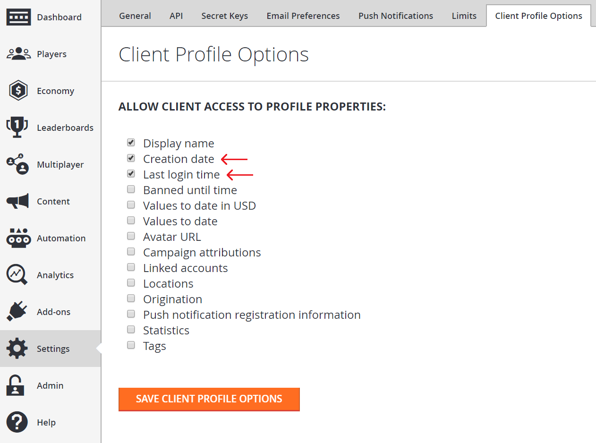

# Getting player profiles

This tutorial walks you through how to use the [GetPlayerProfile](https://api.playfab.com/documentation/server/method/GetPlayerProfile) call to get a player’s profile with [PlayerProfileViewConstraints](https://api.playfab.com/documentation/Client/datatype/PlayFab.Client.Models/PlayFab.Client.Models.PlayerProfileViewConstraints) properties that are enabled from your title’s setting. Specifically, we will be getting a player’s profile, created date, and last login time.

## Requirements

For this tutorial, basic knowledge of how to create a player for your title is needed so that you can perform a GetPlayerProfile on the player. Refer to the [Getting Started with PlayFab](https://api.playfab.com/docs/general-getting-started) tutorial which will run you through the process of creating a player for the title.

It is also worthwhile to read the [Game Manager Tour](https://api.playfab.com/docs/tutorials/landing-analytics/game-manager-tour) tutorial if you are unfamiliar with the Game Manager, as it is the place where we configure profile constraints.

## Step 1 - Create a user with a display name

The first step is to create a player and add a display name to the user. This example will create a new user with the display name "UnicornTossMaster".

```csharp
void CreatePlayerAndUpdateDisplayName() {
    PlayFabClientAPI.LoginWithCustomID( new LoginWithCustomIDRequest {
        CustomId = "PlayFabGetPlayerProfileCustomId",
        CreateAccount = true
    }, result => {
        Debug.Log("Successfully logged in a player with PlayFabId: " + result.PlayFabId);
        UpdateDisplayName();
    }, error => Debug.LogError(error.GenerateErrorReport()));
}

void UpdateDisplayName() {
    PlayFabClientAPI.UpdateUserTitleDisplayName( new UpdateUserTitleDisplayNameRequest {
        DisplayName = "UnicornTossMaster"
    }, result => {
        Debug.Log("The player's display name is now: " + result.DisplayName);
    }, error => Debug.LogError(error.GenerateErrorReport()));
}
```

The response should show "Successfully logged in a player with PlayFabId: SOME_PLAYFAB_ID” followed by "The player's display name is now: UnicornTossMaster"

## Step 2 - Making a player profile call

Now that there is a player that we can call and get a player profile for, the next step is to make a very basic profile for the player.

In the following C# example is a basic [GetPlayerProfile](https://api.playfab.com/documentation/server/method/GetPlayerProfile) call

```csharp
void GetPlayerProfile(string playFabId) {
    PlayFabClientAPI.GetPlayerProfile( new GetPlayerProfileRequest() {
        PlayFabId = playFabId,
        ProfileConstraints = new PlayerProfileViewConstraints() {
            ShowDisplayName = true
        }
    }, 
    result => Debug.Log("The player's DisplayName profile data is: " + result.PlayerProfile.DisplayName),
    error => Debug.LogError(error.GenerateErrorReport()));
}
```

In the response there will be a [PlayerProfileModel](https://api.playfab.com/documentation/server/datatype/playfab.server.models/PlayFab.Server.Models.PlayerProfileModel) object which will contain the display name "UnicornTossMaster" for the player.

## Step 3 - Attempting to get player created time and last login time

In the [PlayerProfileModel](https://api.playfab.com/documentation/server/datatype/playfab.server.models/PlayFab.Server.Models.PlayerProfileModel) object there is a fair amount of data about the player. In the previous step, a GetPlayerProfile was issued and the response that was received only contained display name information. The next step is to get even more profile data for the player. To do so, we will call GetPlayerProfile with additional fields in the [ProfileConstraints](https://api.playfab.com/documentation/Client/datatype/PlayFab.Client.Models/PlayFab.Client.Models.PlayerProfileViewConstraints) request parameter.

The following C# example modifies the GetPlayerProfile method from step 2 and calls GetPlayerProfile to request the Created and LastLogin fields from the [PlayerProfileModel](https://api.playfab.com/documentation/server/datatype/playfab.server.models/PlayFab.Server.Models.PlayerProfileModel). However, **this will be an unsuccessful call at this step!!!**

```csharp
void CreatePlayerAndUpdateDisplayName(string playFabId) {
    PlayFabClientAPI.GetPlayerProfile( new GetPlayerProfileRequest() {
        PlayFabId = playFabId,
        ProfileConstraints = new PlayerProfileViewConstraints {
            ShowDisplayName = true,
            ShowCreated = true,
            ShowLastLogin = true
        }
    }, 
    result => Debug.Log("The player's profile Created date is: " + result.PlayerProfile.Created),
    error => Debug.LogError(error.GenerateErrorReport()));
}
```

This call should result in an error with an error code 1303 RequestViewConstraintParamsNotAllowed and an error message stating that there are “Invalid view constraints” with a JSON output of constraints that the title currently has set. The error message is because we have not yet configured the ability to show Created and LastLogin in our title’s profile constraint settings.

## Step 4 - Configuring player profile view constraints for the title

In order to get more data from the [PlayerProfileModel](https://api.playfab.com/documentation/server/datatype/playfab.server.models/PlayFab.Server.Models.PlayerProfileModel) when we call the [GetPlayerProfile](https://api.playfab.com/documentation/server/method/GetPlayerProfile) API, we will need to configure the constraints on the data to be available. These settings are in the Title’s settings in game manager.

To configure constraints for the title, in Game Manager, go to Settings -> Client Profile Options. Notice that under "ALLOW CLIENT ACCESS TO PROFILE PROPERTIES:", only “Display name” is checked. This is what allowed us to get the display name in step 1.

Now to enable both Created and LastLogin from the [PlayerProfileModel](https://api.playfab.com/documentation/server/datatype/playfab.server.models/PlayFab.Server.Models.PlayerProfileModel), check “Creation date” and “Last login time”, then click on SAVE CLIENT PROFILE OPTIONS.

  

## Step 5 - Getting player created time and last login time

Now, we will go back to the GetPlayerProfile call in step 3.

Executing the same code again will now return a successful [PlayerProfileModel](https://api.playfab.com/documentation/server/datatype/playfab.server.models/PlayFab.Server.Models.PlayerProfileModel) with data on the user’s creation time, last login, and the display name “UnicornTossMaster”.

## Step 6 - Getting player profile via Login operation

In most cases you will want to get certain player profile data as soon as a player is logged in. The PlayFab API allows you to combine those 2 calls into one. 

The following example shows how to gain Profile information through a Login request, and uses LoginWithCustomId as an example. Please note, this works with every login mechanism:

```csharp
void CreatePlayerAndUpdateDisplayName(string customId) {
    PlayFabClientAPI.LoginWithCustomID( new LoginWithCustomIDRequest() {
        CustomId = customId,
        // Define info request parameters
        InfoRequestParameters = new GetPlayerCombinedInfoRequestParams() {
            // And make sure PlayerProfile is included
            GetPlayerProfile = true,
            // Define rules for PlayerProfile request
            ProfileConstraints = new PlayerProfileViewConstraints() {
                // And make sure that both AvatarUrl and LastLogin are included.
                ShowAvatarUrl = true,
                ShowLastLogin = true,
            }
        }
    },
    result =>
    {
        // Extract the data you have requested
        var avatarUrl = result.InfoResultPayload.PlayerProfile.AvatarUrl;
    },
    error => Debug.LogError(error.GenerateErrorReport()));
}
```
