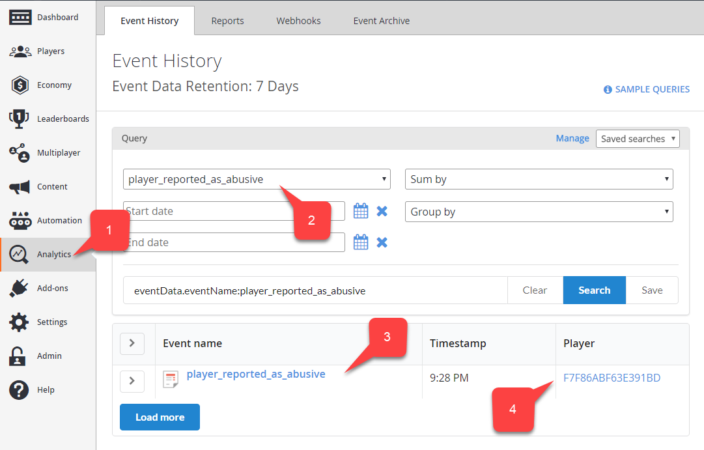
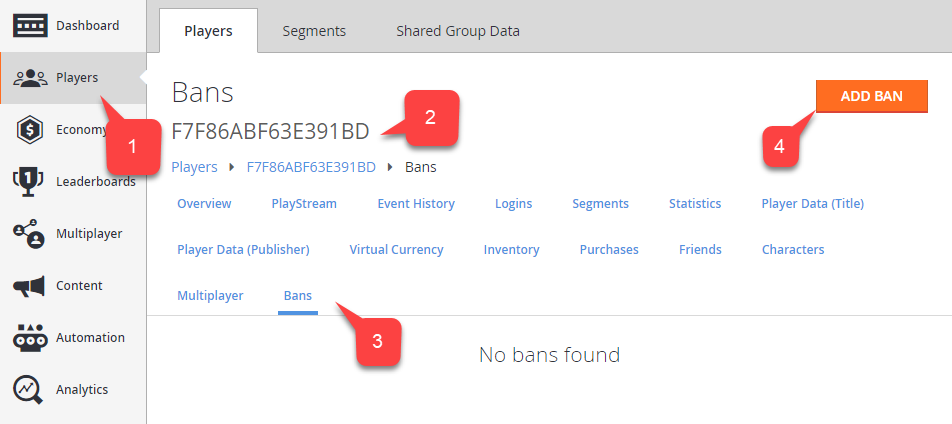
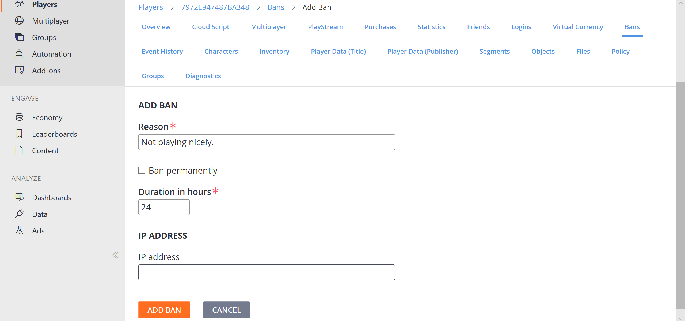

# Player Ban system

The Player Ban feature allows you to restrict access to the game for certain players that break the rules. Bans can be temporary or permanent.

The following tutorial shows you how to utilize the ban system exposed through the PlayFab API and Game Manager.

## Identify

While your game may have a custom system to identify cheaters and rule-breakers, PlayFab offers a player-to-player reporting mechanism. In essence, you rely on your players to report other problematic players. Use the following snippet in your client code to let the client report a specific player:

```chsarp
public void ReportPlayer(string problematicPlayerId, string reason) {
    PlayFabClientAPI.ReportPlayer(new ReportPlayerClientRequest() {
        ReporteeId = problematicPlayerId,
        Comment = reason
    }, result => {
        //... Handle success
    }, error => {
        Debug.Log(error.GenerateErrorReport());
    });
}
```

This API call will produce a report event, which you will be able to locate via the analytics tool **(1)**. Select the 'player_reported_as_abusive' event type **(2)**. This will show the desired events **(3)** and the reported player ID **(4)**:

  

## Applying Bans

Once the problematic player is identified, you may apply a ban. A community management rep may also apply a ban using Game Manager. Navigate to the 'Players' tab **(1)** and locate the problematic player **(2)**. Navigate to ban settings **(3)** and click "Add Ban" **(4)**:

  

A form will pop up. Type in the ban reason **(1)**. Select if you want to ban permanently **(2)**. If not, specify the amount of hours **(3)**. Optionally, ban by a specific IP address **(4)**. Finally, click "Add Ban" **(5)**:

  

If everything is set correctly, you will see a new ban in the table. You may optionally remove the ban manually **(1)**:

  

Alternatively, you may use the Server SDK to apply a ban via code with the following snippet:

```chsarp
public void AddBan(string playerId, uint hours) {
    PlayFabServerAPI.BanUsers(new BanUsersRequest() {
        Bans = new List<BanRequest>() {
            new BanRequest() {
                DurationInHours = hours,
                PlayFabId = playerId,
                Reason = "Automatic ban for WH",
            }
        }
    }, result => {
        //... Handle success
    }, error => {
        Debug.Log(error.GenerateErrorReport());
    });
}
```

Bans applied this way will also be displayed in the table of bans for the target player in Game Manager.

Note, that Cloud Script is different from the other samples and demonstrates how an automated system may ban a player.

Note also that Server SDK methods provide more options, such as IP and MAC address ban.

Each ban you apply gets an assigned ID. Consider the following Server SDK API methods for precise ban management:

- [GetUserBans](https://api.playfab.com/documentation/server/method/GetUserBans)
- [RevokeAllBansForUser](https://api.playfab.com/documentation/server/method/RevokeAllBansForUser)
- [RevokeBans](https://api.playfab.com/documentation/server/method/RevokeBans)
- [UpdateBans](https://api.playfab.com/documentation/server/method/UpdateBans)
