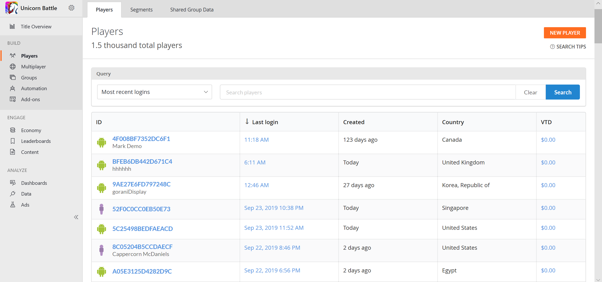
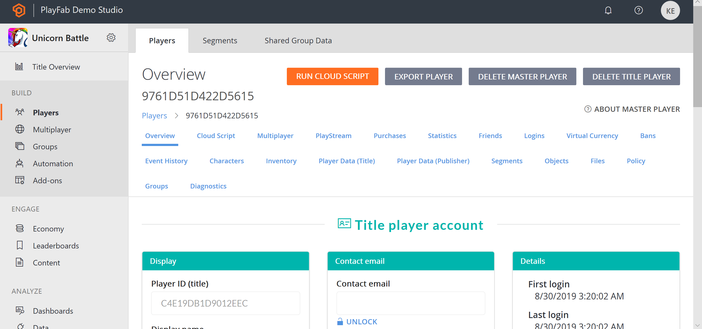

# Using Player details

## Access Player Details

To access Player details, navigate to [Players](../../data/playerdata/using-the-players-page.md) **(1)** using the sidebar menu, then locate the player you need, and click the ID label **(2)**.

  

## Overview

The Player Overview (or details page) is a starting point for controlling your player. A lot of other player pages are available from this page (we'll list them later in this tutorial).

  

1. **Player ID**, always let's you see which player you are working with.
2. The Player toolbar, gives you access to various **player-related pages**.
3. The **Run CloudScript** button gives you access to cloud scripting on behalf of the player. Read more about this in our tutorial [Using CloudScript](../../automation/cloudscript/using-cloudscript.md).
4. Information panels contain **general information** about the player account.
5. The PlayFab account panel, offers pages for **managing a player's PlayFab account** (described later in this tutorial).
6. The Accounts panel allows **linking** to different **accounts** for a single player record (described later in this tutorial).

## Player Toolbar Overview

  

PlayFab offers a wide set of pages for fine tuning and analyzing your player. These pages are available from the player toolbar panel, and consist of the following items:

- [Event History](../../automation/playstream-events/event-history.md) for a general overview of events.
- [Logins](player-logins.md) for inspecting a player's login attempts.
- [Segments](player-segments.md) for inspecting the segments that a player belongs to.
- [Statistics](using-player-statistics.md) for inspecting and manipulating a player's statistical values.
- [Player Data (Title)](../../config/titledata/using-title-data.md) for managing account data within the current scope.
- [Player Data (Publisher)](using-player-publisher-data.md) for managing account data across several titles.
- Virtual Currency
- [Inventory](player-inventory.md) for managing the items that a player owns.
- Purchases
- [Friends](../../social/friends-groups/friends-lists.md) for managing a player's friends list.
- Characters
- Multiplayer
- [Bans](player-bans.md)

## Managing a Player Account

A PlayFab account contains critical, identifying, player data. As an administrator, you can change some of this data.

  

1. **PlayFab ID** - The Player ID. Identifies the player you are currently inspecting.
2. **Display name** - Allows you to edit the display name for this player.
3. **Username** - A read-only field for inspecting the player's username. Username can be empty. When present, it can be used for a player to log in using a username and password.
4. **Email** - This field is hidden and locked due to PII concerns. The Email field can be empty. When present, it can be used for player to log in using email and password. You may use the "Lock" icon button to unlock and change the email value.  
5. **Change password** - When set, this can be used to assign a new password for the user. This setting is mutually exclusive with **Send password reset email**.
6. **Send password reset email** - When set, this allows you to send a **password recovery** email when an email value is present. This setting is mutually exclusive with **Change password**.
7. **Avatar image URL** - This field allows you to force **change avatar** for the user.
8. **Update PlayFab account** - Use this button to **commit** any changes you make on this account screen.

Additionally, you can manage linking. Read more about linking in our tutorial on [Account linking](../../authentication/linking-unlinking/account-linking.md).

  

It is only possible to manually link Custom ID, Android Device, or iOS Device accounts. For more sophisticated options (Steam, GameCenter, etc.) consider using other Client Account Management APIs listed in our [PlayFab API Reference documentation](../../../api-references/index.md).

## Running Cloud Script

The **Run CloudScript** button on the Player Overview page opens the following screen:

  

1. **Run CloudScript** button - Allows you to access a Player's CloudScript settings.
2. **Revision** - Lets you select the revision of the CloudScript to use. Click **Refresh** to grab the latest changes.
3. **Function name** - Lets you select the function to run. The list of available functions is based on your CloudScript revision content.
4. **Arguments** - Lets you supply optional JSON arguments.
5. **Run CloudScript** - Use this button to **commit** any changes you make on this screen.