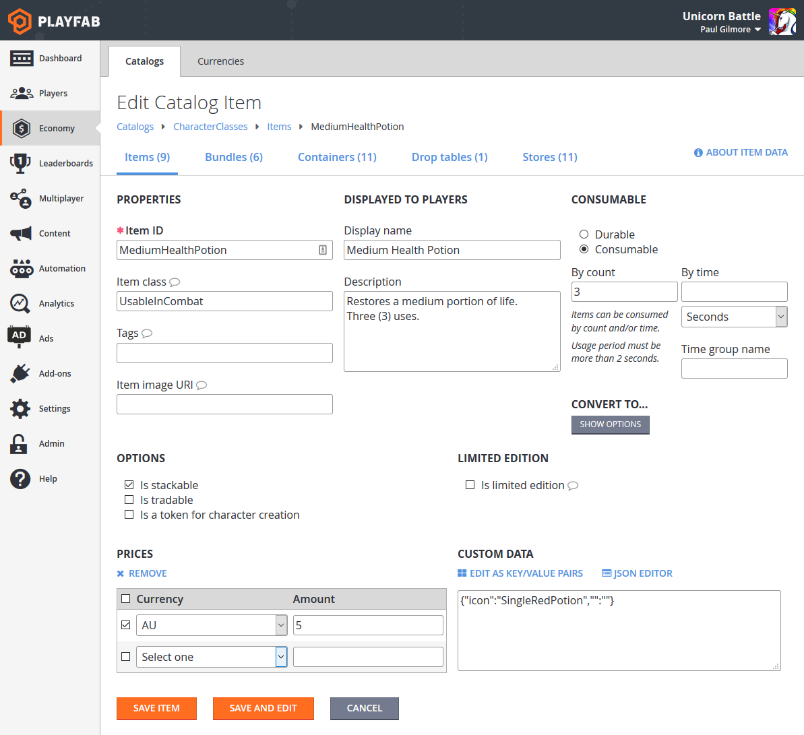
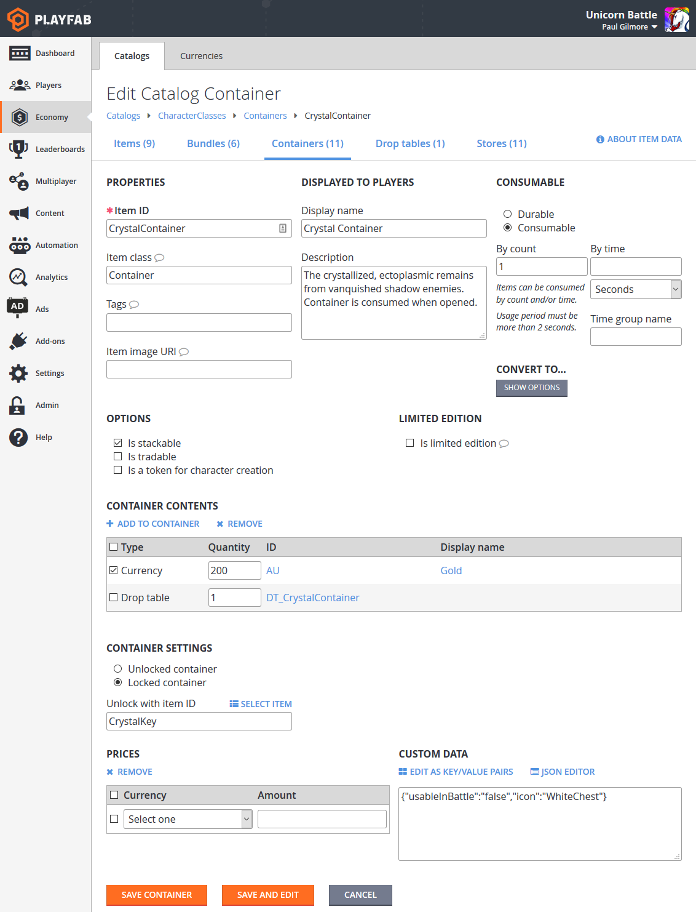

# Player inventory

**Requirement**: In order to use Player Inventory, you must have a Catalog defined for your title. Please read our [Catalogs](../../commerce/items/catalogs.md) tutorial for more information. You can, optionally, also define Stores for your Catalog. While a Catalog is the list of all items available in the game, a Store is a subset of items from the Catalog, optionally with unique pricing. Multiple Stores can be defined per Catalog, so that you can have distinct sets of items for presentation to the player based upon user Segmentation or other factors.

Once you have defined a Catalog through the [Game Manager](https://developer.playfab.com/) or though our Admin [SetCatalogItems](xref:titleid.playfabapi.com.admin.title-widedatamanagement.setcatalogitems) or [UpdateCatalogItems](xref:titleid.playfabapi.com.admin.title-widedatamanagement.updatecatalogitems) API calls, you will be able to use a wide variety of inventory API calls on the client and server.

## API Overview

All inventory API calls are designed to be server-authoritative and secure. Used properly, customers will not be able to cheat or acquire items they did not earn.

Client:

- Buy Items with virtual currency: [PurchaseItem](xref:titleid.playfabapi.com.client.playeritemmanagement.purchaseitem)
- Real money purchases: [StartPurchase](xref:titleid.playfabapi.com.client.playeritemmanagement.startpurchase), [PayForPurchase](xref:titleid.playfabapi.com.client.playeritemmanagement.payforpurchase), [ConfirmPurchase](xref:titleid.playfabapi.com.client.playeritemmanagement.confirmpurchase)
- View items a player has: [GetUserInventory](xref:titleid.playfabapi.com.client.playeritemmanagement.getuserinventory)
- Remove Items: [ConsumeItem](xref:titleid.playfabapi.com.client.playeritemmanagement.consumeitem), [UnlockContainerInstance](xref:titleid.playfabapi.com.client.playeritemmanagement.unlockcontainerinstance)
- Trade Items: [OpenTrade](xref:titleid.playfabapi.com.client.trading.opentrade), [GetPlayerTrades](xref:titleid.playfabapi.com.client.trading.getplayertrades), [AcceptTrade](xref:titleid.playfabapi.com.client.trading.accepttrade), [CancelTrade](xref:titleid.playfabapi.com.client.trading.canceltrade)

Server:

- Gift/Grant Items: [GrantItemsToUser](xref:titleid.playfabapi.com.server.playeritemmanagement.grantitemstouser)
- View Items: [GetUserInventory](xref:titleid.playfabapi.com.server.playeritemmanagement.getuserinventory)
- Modify items: [ModifyItemUses](xref:titleid.playfabapi.com.server.playeritemmanagement.modifyitemuses), [UpdateUserInventoryItemCustomData](xref:titleid.playfabapi.com.server.playeritemmanagement.updateuserinventoryitemcustomdata)
- Remove Items: [RevokeInventoryItem](xref:titleid.playfabapi.com.server.playeritemmanagement.revokeinventoryitem), [ConsumeItem](xref:titleid.playfabapi.com.server.playeritemmanagement.consumeitem), [UnlockContainerInstance](xref:titleid.playfabapi.com.server.playeritemmanagement.unlockcontainerinstance)

Below, we will show code blocks that call these API methods and set up basic use-cases for player inventory.

For reference, these examples come from Unicorn Battle, an example game we built to demonstrate PlayFab features. The AU virtual currency used below is "Gold", a free currency earned by fighting monsters (See our [Currencies](../../commerce/economy/currencies.md) tutorial).

Before we get started, we will be defining a few utility functions that will be used and reused in most of the examples in this guide.

```csharp
// **** Shared example utility functions ****

// This is typically NOT how you handle success
// You will want to receive a specific result-type for your API, and utilize the result parameters
void LogSuccess(PlayFabResultCommon result) {
    var requestName = result.Request.GetType().Name;
    Debug.Log(requestName + " successful");
}

// Error handling can be very advanced, such as retry mechanisms, logging, or other options
// The simplest possible choice is just to log it
void LogFailure(PlayFabError error) {
    Debug.LogError(error.GenerateErrorReport());
}
```

## Client-only Example: Purchase and Consume a Health Potion

Client API call order: [PurchaseItem](xref:titleid.playfabapi.com.client.playeritemmanagement.purchaseitem), [GetUserInventory](xref:titleid.playfabapi.com.client.playeritemmanagement.getuserinventory), [ConsumeItem](xref:titleid.playfabapi.com.server.playeritemmanagement.consumeitem)

First we must begin by defining the item in our Catalog:

  

CatalogItem requirements for the "Health Potion" in this example:

- PurchaseItem requires a positive item price (5 AU).
- ConsumeItem requires the item to be Consumable, with a positive item count (3).
- The player making the purchase must have 5 AU available in their virtual currency balance.

The code for each call:

```csharp
void MakePurchase() {
    PlayFabClientAPI.PurchaseItem(new PurchaseItemRequest {
        // In your game, this should just be a constant matching your primary catalog
        CatalogVersion = "CharacterClasses",
        ItemId = "MediumHealthPotion",
        Price = 5,
        VirtualCurrency = "AU"
    }, LogSuccess, LogFailure);
}

void GetInventory() {
    PlayFabClientAPI.GetUserInventory(new GetUserInventoryRequest(), LogSuccess, LogFailure);
}

void ConsumePotion() {
    PlayFabClientAPI.ConsumeItem(new ConsumeItemRequest {
        ConsumeCount = 1,
        // This is a hex-string value from the GetUserInventory result
        ItemInstanceId = "potionInstanceId"
    }, LogSuccess, LogFailure);
}
```

## Example: Player is Granted and Opens a Container

API call order: Server/[GrantItemsToUser](xref:titleid.playfabapi.com.server.playeritemmanagement.grantitemstouser), Client/[UnlockContainerInstance](xref:titleid.playfabapi.com.client.playeritemmanagement.unlockcontainerinstance)

First, we must begin with a container defined in our catalog. For this example, a "Crystal Container". This example also demonstrates opening the container with a key - an optional item which must also be in the player inventory for the UnlockContainerInstance call to be successful.



CatalogItem requirements for the "Crystal Container" in this example:

- The only required element of this example is that "Crystal Container" be defined as a container.
- Containers can optionally define a key item, which is then required to unlock the container - in this case, a "Crystal Key".
- It is highly suggested that your container and any key both be Consumable, with a positive use count, so that they are removed from the player inventory after use.

Server code:

```csharp
void GrantItem() {
    PlayFabServerAPI.GrantItemsToUser(new GrantItemsToUserRequest {
        // In your game, this should just be a constant
        CatalogVersion = "CharacterClasses",
        // Servers must define which character they're modifying in every API call
        PlayFabId = "playFabId",
        ItemIds = new List<string> { "CrystalContainer" }
    }, LogSuccess, LogFailure);
}
```

Client Code:

```csharp
void OpenContainer() {
    PlayFabClientAPI.UnlockContainerInstance(new UnlockContainerInstanceRequest {
        // In your game, this should just be a constant matching your primary catalog
        CatalogVersion = "CharacterClasses",
        ContainerItemInstanceId = "containerInstanceId",
        KeyItemInstanceId = "keyInstanceId"
    }, LogSuccess, LogFailure);
}
```

### Consuming Keys and Containers

In the previous example, it is suggested that the key and/or container is consumable, though that's only a recommendation. If a container and its key (if any) are not consumable, the container can be re-opened infinitely, granting its contents to the player each time. Because the player inventory capacity is not infinite, this pattern is greatly discouraged. When a consumable container is unlocked, both it and the consumable key used automatically have their usage count decremented, removing them from the player inventory when the usage count reaches zero.

### Viable options

Consumable container, no key: The most basic pattern, in which the container is consumed when opened, and there is no key.

Consumable container, consumable key: The simple locked container case, which allows the player to open the container with they key. Both are consumed, and the player can only open a container with uses remaining with a key with uses remaining.

Durable container, consumable key: This allows a player to open the container every time they find a key. The key is consumed, and the container is only opened while the key has uses remaining.

Consumable container, durable key: This allows a player to keep a key that can open all containers for which it is the key item. The container is consumed, but the player retains the ability to open containers with the key later.

## Example: Buying Inventory Items from the Player

There is no built-in API for buying back inventory items from the player, as the process is game specific. However, you can use the existing API methods to craft your own sell item experience: Server/[RevokeInventoryItem](xref:titleid.playfabapi.com.server.playeritemmanagement.revokeinventoryitem) allows you to remove an inventory item, and Server/[AddUserVirtualCurrency](xref:titleid.playfabapi.com.server.playeritemmanagement.adduservirtualcurrency) can return an appropriate amount of virtual currency. It is not currently possible to return real-money through PlayFab API methods.

Items and virtual currencies have a close relationship. For more information, see our [Currencies](../../commerce/economy/currencies.md) tutorial.

The following Cloud Script function combines the two described server calls into a single client-accessible call:

```csharp
var SELL_PRICE_RATIO = 0.75;
function SellItem_internal(soldItemInstanceId, requestedVcType) {
    var inventory = server.GetUserInventory({ PlayFabId: currentPlayerId });
    var itemInstance = null;
    for (var i = 0; i < inventory.Inventory.length; i++) {
        if (inventory.Inventory[i].ItemInstanceId === soldItemInstanceId)
            itemInstance = inventory.Inventory[i];
    }
    if (!itemInstance)
        throw "Item instance not found"; // Protection against client providing incorrect data
    var catalog = server.GetCatalogItems({ CatalogVersion: itemInstance.CatalogVersion });
    var catalogItem = null;
    for (var c = 0; c < catalog.Catalog.length; c++) {
        if (itemInstance.ItemId === catalog.Catalog[c].ItemId)
            catalogItem = catalog.Catalog[c];
    }
    if (!catalogItem)
        throw "Catalog Item not found"; // Title catalog consistency check (You should never remove a catalog/catalogItem if any player owns that item
    var buyPrice = 0;
    if (catalogItem.VirtualCurrencyPrices.hasOwnProperty(requestedVcType))
        buyPrice = catalogItem.VirtualCurrencyPrices[requestedVcType];
    if (buyPrice <= 0)
        throw "Cannot redeem this item for: " + requestedVcType; // The client requested a virtual currency which doesn't apply to this item
    // Once we get here all safety checks are passed - Perform the sell
    var sellPrice = Math.floor(buyPrice * SELL_PRICE_RATIO);
    server.AddUserVirtualCurrency({ PlayFabId: currentPlayerId, Amount: sellPrice, VirtualCurrency: requestedVcType });
    server.RevokeInventoryItem({ PlayFabId: currentPlayerId, ItemInstanceId: soldItemInstanceId });
}

handlers.SellItem = function (args) {
    if (!args || !args.soldItemInstanceId || !args.requestedVcType)
        throw "Invalid input parameters, expected soldItemInstanceId and requestedVcType";
    SellItem_internal(args.soldItemInstanceId, args.requestedVcType);
};
```

### Best Practices

- Make sure to verify all client input information as valid before making any changes.
- Cloud Script is not atomic so call order matters: AddUserVirtualCurrency may succeed and RevokeInventoryItem may fail. It is generally better to give the player something they didn't earn in this process, than to take something away without compensation.

This Cloud Script function can then be accessed from the client:

```csharp
void SellItem()
{
    PlayFabClientAPI.ExecuteCloudScript(new ExecuteCloudScriptRequest
    {
        // This must match "SellItem" from the "handlers.SellItem = ..." line in the Cloud Script file
        FunctionName = "SellItem", 
        FunctionParameter = new Dictionary<string, string>{
            // This is a hex-string value from the GetUserInventory result
            { "soldItemInstanceId", "sellItemInstanceId" },
            // Which redeemable virutal currency should be used in your game
            { "requestedVcType", "AU" },
        }
    }, LogSuccess, LogFailure);
}
```
