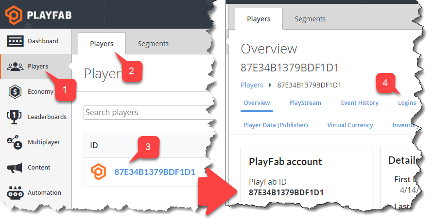

# Player Logins

The Player Logins page offers an overview of all the login attempts for a specific player.

## Access Player Logins

To access the Player Logins page, select "Players" in the sidebar menu **(1)**. Then select the  "Players" tab **(2)**. Locate the player you want to inspect and click the ID label **(3)**. Finally, select "Logins" in the Players Toolbar **(4)**.

  

## Overview

The Player Login page contains the following information:

- **Player ID** - A label that identifies the player you are inspecting.
- **Total login attempts** - The total number of login attempts by this player.
- **date of login attempt** - A human readable Date label for each login attempt.
- **IP address** - A label showing the IP address.
- **Source** - A label that indicates where login attempt came from.
- **Result** - Indicates whether the login attempt was successful.