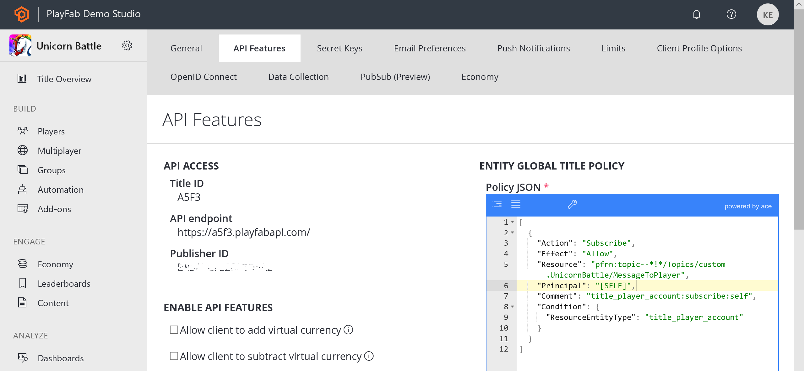

# PlayFab GDPR - Deleting and exporting player data

PlayFab is committed to being General Data Protection Regulation (GDPR) compliant - and as your service provider, ensuring that we provide you with the hooks you need to allow Players to view or delete the data stored about them.

While we can’t provide you with legal advice — *and we do encourage you to seek legal counsel to ensure your compliance with the GDPR* — we are here to help you fulfill your obligations under GDPR.

PlayFab is introducing three new APIs to help you respond to Player data requests:

- [GetPlayedTitleList](xref:titleid.playfabapi.com.admin.accountmanagement.getplayedtitlelist) - Call this API to get a list of TitleIds which have data associated with the given player. This list is scoped by PublisherID and represents the set of titles which would be impacted were you to delete or export this player's data.
- [DeleteMasterPlayerAccount](xref:titleid.playfabapi.com.admin.accountmanagement.deletemasterplayeraccount) - Call this API to delete the records of a given player.
- [ExportMasterPlayerData](xref:titleid.playfabapi.com.admin.accountmanagement.exportmasterplayerdata) - Call this API to export all of the associated data and records of a given player.

> [!NOTE]
> This tutorial focuses on how to use these Admin APIs to export or delete player data. We plan to expose comparable functionality through Game Manager by May 25, 2018.

## Make sure you find all the data

Before using the `DeleteMasterPlayerAccount` or `ExportMasterPlayerData` APIs, it is important to keep in mind that your players might have created multiple Master Player accounts with your studio.

This can happen when a player uses different devices or different credentials to play your title(s). Because they are providing different and unrelated credentials (e.g. a different email address or social media account), we interpret them to be a unique player.

Another way a player may have multiple Master Player accounts is if you have configured your studio to use multiple Publisher IDs; however, having multiple Publisher IDs is not common.

You can check your title's Publisher IDs in the PlayFab Game Manager, on each Title settings menu's **API Features** tab.

  

You know your titles and how they authenticate your players. Before calling `DeleteMasterPlayerAccount` or `ExportMasterPlayerData`, make sure you collect the right set of device IDs and/or credentials from your players.

With these credentials, we can identify the PlayFabIds for *each* Master Player account.

The following APIs will help you translate from credential to `PlayFabId`:

- [GetUserAccountInfo](xref:titleid.playfabapi.com.admin.accountmanagement.getuseraccountinfo) - This API will help you find players by email, `TitleDisplayName`, `PlayFabId`, or a `PlayFabUsername`.
- [GetPlayerIdFromAuthToken](xref:titleid.playfabapi.com.admin.accountmanagement.getplayeridfromauthtoken) - This API will allow you to find a player from a specific `AuthToken` which is granted to the player when they log in.
- [GetPlayFabIDsFromFacebookIDs](xref:titleid.playfabapi.com.server.accountmanagement.getplayfabidsfromfacebookids) - This API derives the player's `PlayFabId` from one or more `FacebookId`(s).
- [GetPlayFabIDsFromSteamIDs](xref:titleid.playfabapi.com.server.accountmanagement.getplayfabidsfromsteamids) - This API derives the player's `PlayFabId` from one or more `SteamIds`.

> [!NOTE]
> All of these APIs are title-specific. The first two are Admin APIs and the last two are Server APIs.

Even if your player only has one PlayFabId, they may have played more than one of your titles with that ID. This means their data request may span multiple titles.

To get this list of titles, call `GetPlayedTitleList` for each PlayFabId. You *may* wish to inform the player their request will impact the returned list of titles.

Additionally, `GetPlayedTitleList` returns `TitleIds`, *not* `Title Names` - consider converting these to `Title Names` before displaying them in a confirmation page.

Here's a little pseudo code to paint a better picture of what we mean...

```csharp
//Here you would iterate through a request of known Ids, Emails, linked accounts  
//or other PlayFab searchable info on the player that you have.
//and store it in user credentials for that player.
user {
  credentials: (email/ids/linked accounts)
}

//create a variable to hold a list of all the PlayFabIds you want to remove.
PlayFabIdList

//create a list of affected titles
AffectedTitles


//Keep track of all your titles, this is important
//and should include all titles across all your namespaces.
foreach(title in <all my titles>){

    //each user record you have for the player, you should have a list of credentials for that player
    //so you can find them in PlayFab
    foreach(cred in user.credentials){
      //There are a few helper Admin and Server API's that help you do this part.
      //See below this pseudo code block for some tips!
      pfid = <find PlayFabId in Title using the credential>
      PlayFabIdList.add(pfid)
    }

    //go through the list of PlayFabIds that you have and fine all titles that
    //performing the action would affect
    foreach(pfid in PlayFabIdList){
      AffectedTitles = title.GetPlayedTitleList(pfid)
    }
}
```

Here is a quick example on how to use **GetPlayedTitleList**.

```csharp
public static async void StartFindTitlesExample(Action<PlayFabError> callback)
{

    var task = await PlayFabAdminAPI.GetPlayedTitleListAsync(new GetPlayedTitleListRequest() {
        PlayFabId = PlayFabId
    });

    if(task.Error != null)
    {
        callback(task.Error);
        return;
    }

    var TitleList = task.Result.TitleIds;
    foreach (var title in TitleList)
    {
        Console.WriteLine(string.Format("Title Found: {0}", title));
    }
    callback(null);
}
```

At this this point you have a list of `PlayFabIds` for this player (based on the credentials they’ve shared) and a list of titles for each `PlayFabId`. Now what?

Now you’re ready to delete or export!

## Deleting a Master Player account

Deleting a Master Player account can be accomplished by using the new `DeleteMasterPlayerAccount` Admin API which is available in all of our SDKs. Please make sure you read the section above, which details how to make sure you have all of a player's PlayFabIds.

When you make a request to delete a player, PlayFab will quickly remove the player's personal information from our core system before sending the request to a queue processing agent, which works to remove any remaining information about the player from ancillary systems and sub-processors.

This API returns immediately and provides a `JobReceiptId`, which you should store for your records. The JobReceiptId is your validation that PlayFab received the request to delete the player.

Once the delete is complete, an email will be sent to the notification email address configured for the title. It will contain the same `JobReceiptId`, which was initially returned by the API. The completion of the task will also trigger a PlayStream event.

Using our Webhook feature, you can register to receive these events on an endpoint of your choosing, and process them as needed. The event will contain a JSON blob that has the `JobReceiptId`.

The following example shows how to use the Admin API with the [C# SDK](../../../sdks/c-sharp/index.md). If you would like to use a different SDK, select one from the list of [PlayFab SDKs](../../../sdks/index.yml).

```csharp
public static async void StartDeleteMasterPlayerExample(Action<PlayFabError> callback)
{
    var task = await PlayFabAdminAPI.DeleteMasterPlayerAccountAsync(new DeleteMasterPlayerAccountRequest()
    {
        PlayFabId = PlayFabId
    });

    if(task.Error != null)
    {
        callback(task.Error);
    }

    var jobReceiptId = task.Result.JobReceiptId;
    var AffectedTitleList = task.Result.TitleIds;
    foreach (var title in AffectedTitleList)
    {
        Console.WriteLine(string.Format("Delete Player - Title Affected: {0}", title));
    }

}
```

> [!REMINDER]
> Because this deletion *cannot be undone*, we suggest confirming with your player that they are comfortable with the scope and impact of their deletion request.

So, once the action has been confirmed… Back to pseudo code.

```csharp
//Make sure we are 100% sure we want to do this.
if ( confirm successful ) {
   //create a variable to store a list of titles the player has already been removed from.
   listOfTitlesRemovedFrom
   //Hang on to the receipts from successful deletes.
   listOfReceipts
   foreach(title in <all my titles>){

       //You only need to remove the Master Player once per namespace, so check that you have not
       //already performed this action in the namespace, or you will get an error that
       //the player is already queued for deletion.
       if(title not in listOfTitlesRemovedFrom){
           foreach(pfid in PlayFabIdList){

              //Note: you should do some error handling around this API call.
              response = title.DeleteMasterPlayerAccount(pfid)
              foreach(titleId in response.titleids){
                listOfTitlesRemoved.add(titleId)
              }
              listOfReceipts.add(response.jobreceiptid)
           }
       }
   }

   //Save listOfReceipts somewhere as proof of deletion.

}
```

## Exporting Master Player account data

When you make a request to export a player's data, the request is sent to a **Queue Processing Agent** (similar to deleting a player).

The `ExportMasterPlayerData` API exports all data associated with the given `PlayFabId`, including data across all your titles, such as:

- **Statistics**

- **Custom Data**
- **Inventory**
- **Purchases**
- **Virtual Currency Balances**
- **Characters**
- **Group Memberships**
- **Publisher Data**
- **Credential Data**
- **Account Linkages**
- **Friends List**
- **PlayStream Event History**.

Please make sure you read the first section above which details how to make sure you have all of a player’s PlayFabIds.

This API immediately returns a `JobReceiptId`, which you should store in your records for future reference. It may take some time before the export is available for download.

 Upon completion of the export, an email containing the URL to download the export dump will be sent to the notification email address configured for the title.

The completion of the task will also trigger a PlayStream event. Using our Webhook feature, you can register to receive these events on an endpoint of your choosing and process as needed. The event will contain a JSON blob that has information such as the **JobReceiptId** and the download URL for the exported data.

The following example is how to use the Admin API with the [C# SDK](../../../sdks/c-sharp/index.md). If you would like to use a different SDK, select one from the list of [PlayFab SDKs](../../../sdks/index.yml).

```csharp
public static async void ExportMasterPlayerExample(Action<PlayFabError> callback)
{
    var task = await PlayFabAdminAPI.ExportMasterPlayerDataAsync(new ExportMasterPlayerDataRequest()
    {
        PlayFabId = PlayFabId
    });

    if(task.Error != null)
    {
        callback(task.Error);
    }

    var jobReceiptId = task.Result.JobReceiptId;

    Console.WriteLine(string.Format("Export Player Request Received - Receipt: {0}", jobReceiptId));

    callback(null);
}
```

> [!NOTE]
> The URL will be available for up to 30 days after the export has completed. After this time, the file will be deleted, and you will need to initiate a *new* export request.

## Other considerations

It is easy to do harm with these APIs. Exporting data for or deleting the *wrong* player could be very damaging and it is *permanent*!

It is your responsibility as the game developer to verify that the credentials are owned by the player requesting an export or deletion of their player data. PlayFab does *not* provide any type of verification when using these APIs.

However PlayFab *does* offer an [email verification feature](../../engagement/emails/using-a-rule-to-verify-a-contact-email-address.md). But our solution is not the only option for verification. You can create your *own* process too.

Regardless of which technology you use, we suggest that you do some sort of verification before performing any of these actions.

## Are we done yet?

You should receive an email when your request has completed. If, for some reason, it never arrives (because that happens sometimes in our digital world), contact us at [privacy@playfab.com](mailto:privacy@playfab.com) with a request for verification.

Please provide the `JobReceiptId` in that email, and we will respond letting you know the status of that job.
