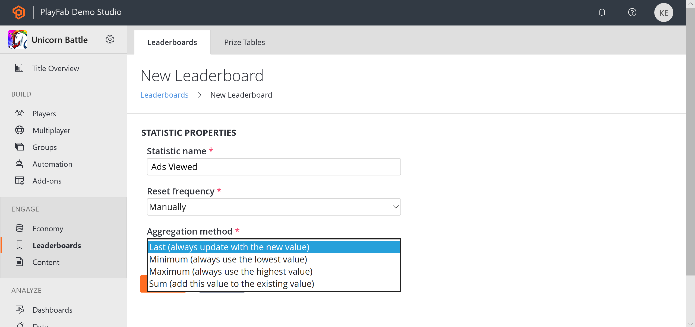

# Using Player Statistics

This tutorial describes how to create and use **Player Statistics**.

**Player Statistics** are stored as **Key Value Pairs** where the **Key** is a string and the **Value** is a **32-bit integer** (for compatibility with languages which do not support **64-bit**).

**Player Statistics** are also used by **Leaderboards**. This guide covers **Player Statistics** exclusively. If you wish to read about how **Player Statistics** and **Leaderboards** work together, please read our tutorial [Using resettable statistics and leaderboards](../../social/tournaments-leaderboards/using-resettable-statistics-and-leaderboards.md).

> [!NOTE]
> As a point of clarification, in some documentation and **API** calls, you may find the term **UserStatistics**. For the purposes of this discussion, the terms **User** and **Player** are identical and interchangeable.

In the **Game Manager**, the **Players** tab provides access to the **users/players** for your **Title**, and within that, their **Statistics**. **Player Statistics** refers *specifically* to information bound to a **Player**, *not* analytics information about **Players**.

### Client API 

The **Client** has access to read **Player Statistics**, but to prevent cheating, the **Client** is *not able* to update **Statistics** by default.

To enable this:

- [Log into PlayFab].(https://developer.playfab.com/en-us/my-games)
- Select your **Title**.
- Select **Settings** from the menu to the left.
- Select the **API Features** tab.
- Find and activate **Allow client to post Player Statistics**.

> [!NOTE]
> Doing this disables a security layer for your **Title**, allowing **Players** to post arbitrary scores to all of their **Statistics**. If your game has any competitive play aspect, we would recommend that you *never* post **Statistics** from the **Client**.

## Statistics are Public Information

There are no private or server-only **Statistics**. A **Player** can always read all of their own **Statistics** via [GetPlayerStatistics](xref:titleid.playfabapi.com.client.playerdatamanagement.getplayerstatistics), and  can read all other **Players' statistics** via **Leaderboard API** calls. This is true even if you *don't* display a **Statistic** in-game, or use **Leaderboards**.

The only exception to this would be if you disable **Client** features through our [API Access Policy](../../config/gamemanager/api-access-policy.md). Please refer to that link for more information on how to use the policy settings for **Titles**, as that is an advanced topic which is not covered by this tutorial.

## Setting Statistics

The following **Unity/C#** code creates (or updates if it already exists) a **strength Statistic** value for a **Player**.

```csharp
PlayFabClientAPI.UpdatePlayerStatistics( new UpdatePlayerStatisticsRequest {
    // request.Statistics is a list, so multiple StatisticUpdate objects can be defined if required.
    Statistics = new List<StatisticUpdate> {
        new StatisticUpdate { StatisticName = "strength", Value = 18 },
    }
},
result => { Debug.Log("User statistics updated"); },
error => { Debug.LogError(error.GenerateErrorReport()); });
```

## Getting Statistics

The following **Unity/C#** code retrieves all current **Statistic** values for a **Player**.

```csharp
void GetStatistics()
{
    PlayFabClientAPI.GetPlayerStatistics(
        new GetPlayerStatisticsRequest(),
        OnGetStatistics,
        error => Debug.LogError(error.GenerateErrorReport())
    );
}

void OnGetStatistics(GetPlayerStatisticsResult result)
{
    Debug.Log("Received the following Statistics:");
    foreach (var eachStat in result.Statistics)
        Debug.Log("Statistic (" + eachStat.StatisticName + "): " + eachStat.Value);
}
```

## Aggregation Method

**PlayFab** supports some convenience options for **Statistic Aggregation**. The 4 options include:

- **Last**
- **Min**
- **Max**
- **Sum**

You can create a **Statistic** definition via the [CreatePlayerStatisticDefinition](xref:titleid.playfabapi.com.admin.playerdatamanagement.createplayerstatisticdefinition) **API** call, though it's not required. Any call to update a **Player Statistic** for the **Title** will *automatically* create the default **Statistic** definition, using the **Last Aggregation** method. 

To change a **Statistic Aggregation** method, you can use the **Game Manager** or the [UpdatePlayerStatisticDefinition](xref:titleid.playfabapi.com.admin.playerdatamanagement.updateplayerstatisticdefinition) **API** call.

To edit a **Statistic Definition** in **Game Manager**:

- [Log into PlayFab].(https://developer.playfab.com/en-us/my-games)
- Select your **Title**.
- Select **Leaderboards** from the menu on the left (**Statistics** and **Leaderboards** are closely related).
- Select the existing **Statistic** you want to modify, or - 
- Select the **New Leaderboard** button.
  - For an existing **Statistic**, you'll have another page, with an **Edit Leaderboard** button.

- At this point you should see the page shown below.

    

Some examples of how to use **Statistic Aggregation**:

- **Max** and **Min** can be used to save **best/worst** scores such as **Headshots** or **Accuracy**:
  - In short, they apply the rule of: **if this is higher (or lower) than the existing score, update the score**.
  - Post the **Statistic** for the session ending, and the **Min/Max Aggregation** takes care of whether or not to update.
  - These can be very useful for [resettable leaderboards](../../social/tournaments-leaderboards/using-resettable-statistics-and-leaderboards.md), as well as a [PlayStream Rule](https://playfab.com/introducing-playstream/) that grants achievements.

- **Sum** could be used to save **Experience Points**:
  - You post the **Experience** gained this battle, and it is added to the existing **Statistic** value for the **Player**.

- **Last** allows you to manage the stat yourself:
  - Each time you post a **Statistic**, the most recent value is used.

## Leaderboards

A **Leaderboard** is generated for all statistics saved in **PlayFab**. Accessing a **Leaderboard** for a specific stat is optional.

**Reset Frequency** and **Aggregation** methods play a major role in how dynamic the **Leaderboards** are in your game. The **Tournaments** feature focuses on **Leaderboards** with automatic reset frequencies, and is described in the tutorial [Using resettable statistics and leaderboards](../../social/tournaments-leaderboards/using-resettable-statistics-and-leaderboards.md).

We encourage you to use **Statistics** in every manner relevant to your game. You can use **Resettable Statistics** to run daily tournaments, and **Long-term Statistics** like **Experience Points**, side-by-side.
