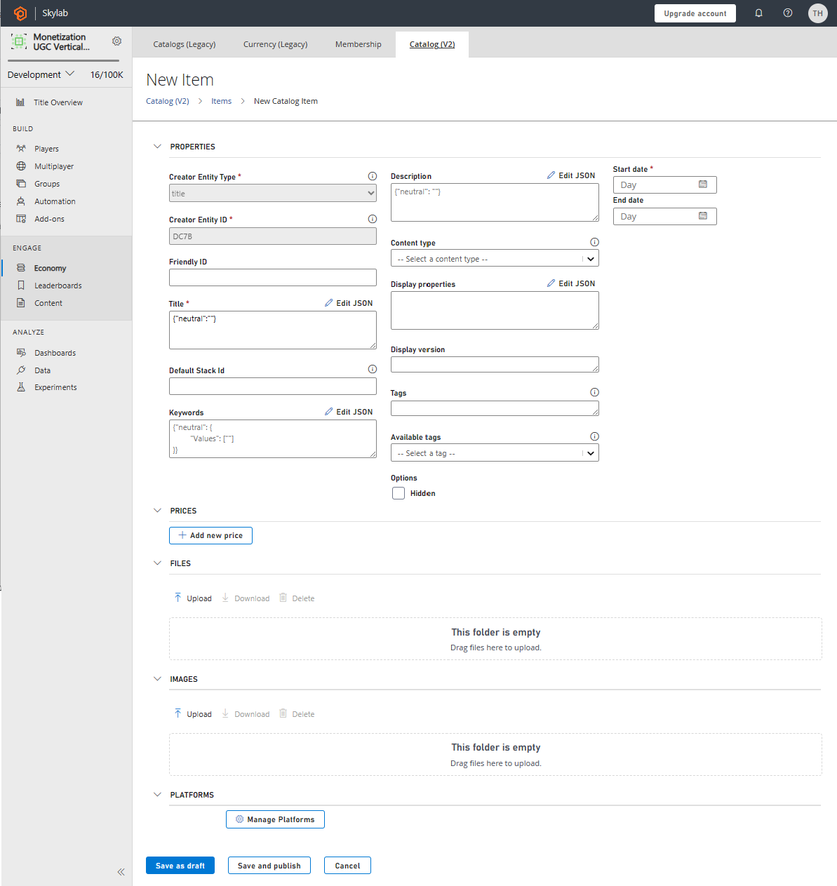

# Catalog overview

[!INCLUDE [notice](../../../includes/_economy-deprecation.md)]

This overview describes the **Catalog V2** tab in the **Economy** section in **Game Manager**. It describes the Catalog feature in PlayFab Economy V2, and goes over all of the field properties for the various Item Types.

## What is a catalog?

A Catalog is used to define items that a player can purchase or that you can award to a player. Many games offer the player items for purchase such as a shield, a level-unlock, or a power-up. These items are specified in a catalog and often sold for virtual currency or real money. PlayFab's Catalog offers an easy way to manage your game's virtual items and can hold every item available in your game.

## Item field references

This section describes each field in the **Catalog V2** section of the **Economy** area in **Game Manager**.

When you first create a title, your catalog is empty. You won't see any items in the **Catalog** section until you create them.

The following tabs exist in the **Catalog v2** section:

Tab | Description | Reference
---|---|---
**Items** | Things that have a value in virtual currency or real money that can be purchased or awarded. | [PlayFab Economy V2 Items](../inventory/items-and-inventory-overview.md)
**Currency** | Virtual currency can be used to purchase other catalog items. | [PlayFab Economy V2 Currencies](../tutorials/currencies.md)
**UGC** | User Created items. | [PlayFab Economy V2 UGC](../ugc/index.md)
**Bundles** | Collections of items and virtual currency that unpack into a player's inventory when granted. A bundle can be linked to real world purchases using the Marketplace Mapping field. | [PlayFab Economy V2 Bundles](../bundles.md)
**Stores** | Stores allow you to override base catalog prices for items. | [PlayFab Economy V2 Stores](../stores.md)
**Subscriptions** |   Virtual subscriptions allow you to grant time based access to durable goods. | [PlayFab Economy V2 Subscriptions](../subscriptions.md).

Each of these is an Item Type that can be used within your Catalog. Bundles 

### Catalog V2 item fields

When you select a **Catalog V2**, the **Items** tab, and choose **NEW ITEM**, you'll see the following page:

  

The **New Item** page contains these fields. Unless *_noted_*, these fields are optional:

* **PROPERTIES**
  * **Creator Entity Type**:
    A *_system created_* field that tells you the type of Entity creator. 
  * **Creator Entity ID**:
    A unique ID for the entity creator. In Game Manager, this ID is set to the value of the title.
  * **Friendly ID**:
  A field that can used for easier reference in code. Friendly IDs are optional for all items and must be unique within the catalog.
  * **Title**:
  A *_required_* field for the common name of the Item that is normally displayed to the player. Simple localization of **Title** is supported by using locale keys. For more information, see [Economy V2 Localization](../catalog/Localization.md).
  * **Default Stack ID**:
  Items can be stored in inventory as stacks each with their own amount and differentiated by StackId. If not defined, inventory actions will use _default_ as the StackId.  For more information, see [Economy Stacks](../inventory/stacks.md).
  * **Keywords**:
  Keywords can be used for basic search filtering. They are a dictionary of localized keywords in JSON format. For an example, see [Economy V2 Localization](../catalog/Localization.md).
  * **Description**:
  A dictionary of localized item descriptions in JSON format. 
  * **Content Type**:
  You can select an item Content Type using this dropdown. Content Types are defined in Catalog Settings (Title Settings > Economy).
  * **Display Properties**:
  A JSON blob you can use for custom item properties.
  * **Display Version**:
  A field you can use to version to your Display Properties. 
  * **Tags**:
  This field contains tags that you can use to organize your catalog items for search. Tags can be inputed as comma-delimited text strings. These strings are pre-defined in Catalog Settings (Title Settings > Economy).
  * **Available Tags**
  Convenient dropdown for selecting Item tags already defined in the Catalog Config.
  * **OPTIONS**
     * **Hidden**:
   There is currently a single option available for Items listed in this section. This option, *_Hidden_*, keeps the Item from being exposed with search.
  * **Start Date**:
     A *_required_* date field for when the Item should be made available in search.
  * **End Date**:
    A date field to designate when the Item should be made unavailable in search.
* **PRICES**
  * **Add New Price**:
    You can use this section to specify one or more purchase price(s) for the item. 
* **FILES**
  * **Upload**:
    Here you can upload content to be stored in the public catalog that can be associated with this item.
* **IMAGES**
  * **Upload**:
    Here you can upload various images, including thumbnails and screenshots, for item displays in your in-game catalog. 
* **PLATFORMS**
  * **Manage**:
    You can specify which platforms this item is for. The Platform list is defined in Catalog Settings (Title Settings > Economy).  

### Saving your items to a Draft or a Publish state
The Economy V2 catalog supports a *_Draft_* item state. When you *Save as Draft* the item metadata is available via direct call but is not exposed to public search. When you are ready to make your item public you set it to a *_Published_* state. You can read more about this on our [Item Status](../catalog/item-status.md) page.

## Example of item creation

To create an **Item**:

1. Open **Game Manager** and select **Economy** on the left side bar.
1. Select the **Catalogs V2** tab.
1. Select the **NEW ITEM** button.
    1. Fill out the the required items fields:
        * **Title** (JSON ex. {"NEUTRAL":"My New Amazing Item"}).
        * **Start Date** (select today's date).
1. Select the **SAVE AND PUBLISH** button and this takes you back to the Items page.
1. To add more items, select **NEW ITEM** and repeat steps 3 – 5.

### Catalog V2 currency fields

When you select **Catalog V2**, open the **Currency** tab, and choose **NEW CURRENCY**, you'll open the **New Currency** page.

Currencies contain all of the same fields as the [Catalog V2 Item Fields](#catalog-v2-item-fields).

### Catalog V2 UGC fields

When you select a **Catalog V2**, open the **UGC** tab, and choose **NEW ITEM**, you'll open the **New User Generated Content** page.

User Generated Content contains all of the same fields as the [Catalog V2 Item Fields](#catalog-v2-item-fields), *plus* this field:

* **MODERATION STATE**
  * **Moderation State**:
 An easy way to mark an item as Approved, Awaiting Moderation, or Rejected. Moderation State can only be modified on a published item.  

### Catalog V2 bundle fields

When you select **Catalog V2**, open the **Bundles** tab, and choose **NEW BUNDLE**, you'll open the **New Bundle** page.

This page contains all of the fields in [Catalog V2 Item Fields](#catalog-v2-item-fields), *plus* these fields:

* **ITEMS**
  * **Add**:
Bundles allow you to group multiple items together into a single item. You can create bundles of items that are often purchased together, or items that are only available for a limited time. For more information, see our documentation on [Economy V2 Bundles](../bundles.md). 

* **MARKETPLACE MAPPING**
  * **Marketplace**, **Marketplace ID**:
 You can link your in-game item to one or more marketplace items for redemption scenarios. For more information, see our documentation on [Economy V2 In-App Purchases](../tutorials/getting-started-with-unity-and-android.md).

### Catalog V2 store fields

When you select **Catalog V2**, open the **Stores** tab, and choose **NEW STORE**, you'll open the **New Store** page.

Stores Contain all of the same fields in [Catalog V2 Item Fields](#catalog-v2-item-fields), *plus* this field:

* **ITEMS**
  * **Add**:
Stores can contain any other item type in the Catalog. All Catalog content will retain their base cost or can be purchased from this store for the prices listed here. For more information, see our documentation on [Economy V2 Stores](../stores.md).

We hope you find the new Catalog to be a powerful and flexible tool for creating engaging and rewarding experiences for your players. To learn more, take a closer look at [Economy V2 Quickstart](../quickstart.md).

### See Also
* [PlayFab Economy V2 Items](../inventory/items-and-inventory-overview.md)
* [PlayFab Economy V2 Currencies](../tutorials/currencies.md)
* [PlayFab Economy V2 UGC](../ugc/index.md)
* [PlayFab Economy V2 Bundles](../bundles.md)
* [PlayFab Economy V2 Stores](../stores.md)
* [PlayFab Economy V2 Subscriptions](../subscriptions.md) 
