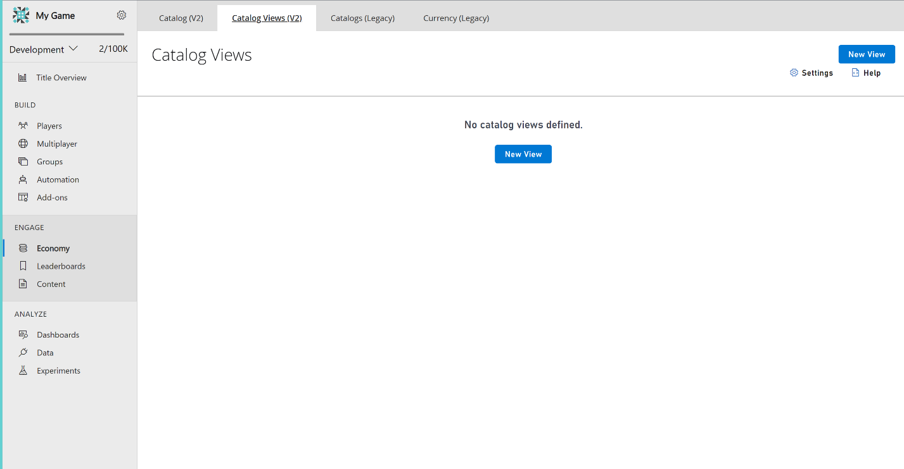
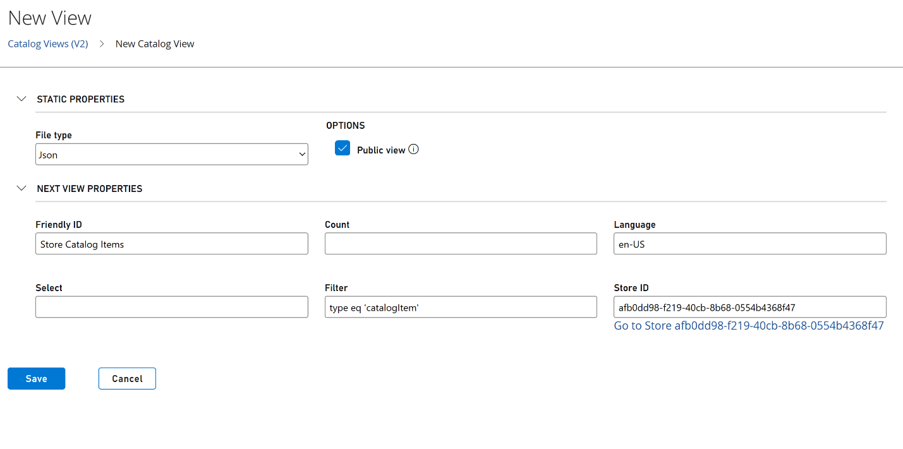
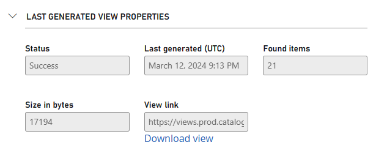
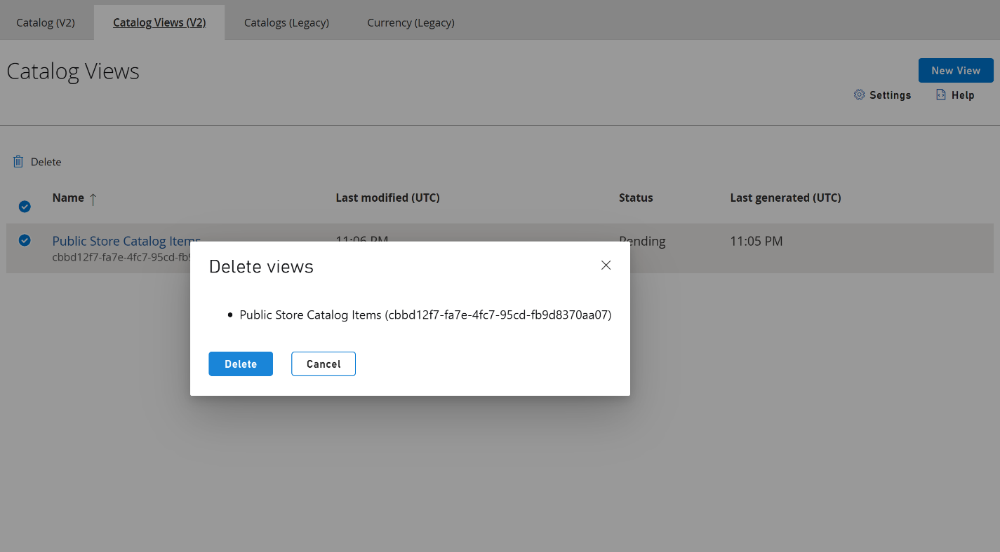

# Catalog Views (Private Preview)

> [!NOTE]
> Catalog Views is currently in **Private Preview**. For access to this feature, send an email to **PFEconomyPreviews@microsoft.com** with the subject **Access to Catalog Views Private Preview** along with your PlayFab Title ID to be able to start using the feature in your environment.

Games load items during boot-up to ensure a smooth and seamless player experience. By preloading essential assets such as main menu graphics, character models, and environment textures, games can minimize latency and provide players with faster access to the game's content. However, loading items during boot-up in games can take a long time due to various factors such as the size and complexity of assets, network latency, asset compression and decompression, etc. To combat this issue, PlayFab Economy V2 is introducing Catalog Views. 

Catalog Views is a regularly updated storage blob of query results, accessible through a content delivery network (CDN). These Public/Private Views can then be called upon to populate the game. This asynchronous updating enhances performance by applying caching mechanisms, therefore reducing the need for frequent Search queries. This approach not only enhances overall efficiency but also reduces costs by minimizing the number of API calls made to PlayFab.

## Definitions

- **Catalog View**: Is a collection of metadata that defines a search query. It is used to regularly update a blob, representing the search results, in an asynchronous manner.

- **Catalog View Blob**: the blob that gets created by a catalog view representing a Search query.  

- **Public View**: a public view is the default access state of a view. This type of view generates a public blob, which is accessible through a CDN. This blob contains information that is public to any user, consistent with Search’s behavior. For example, title exclusive items are excluded and as are items outside of their start/end date range. A catalog view can either be a title view or a public view. 

- **Title View**: a title view is a catalog view intended to be used by the title rather than by a user, as it includes all of the item metadata. This type of view generates a private blob, which is accessible through a CDN via a SAS token, which can be obtained via a GetView API call. A catalog view can either be a title view or a public view. 

- **Refresh Delay**: the minimum amount of time before refreshing (updating) a view blob. Please note,  all views in preview have a one day refresh delay and this delay only applies to updating a view blob. The initial creation for a view blob occurs as soon as the view is processed. 

## Concepts 

- **Included Catalog Items**: views can only contain published items and can't be used with draft items. The items included in a view blob are determined by the access state of the view (title/public) and the provided search query. 

- **Limits**: 

  - At this time, up to 10 catalog views can be created. 

  - A view blob can only be up to 500 mb and can only contain up to 10,000 items. 

  - A view’s search query complexity is limited in the same way that Search itself is limited and is enforced at view creation/update. 

- **CDN Configuration**: 

  - View blobs are provided through views.prod.catalog.playfab.com 

  - The CDN has a 30-minute cache, meaning if you delete a view, the view blob may still be accessible in the CDN for 30 minutes. 

- **View Blob Supported File Extensions**: 

  - Json (.json) 

  - JsonLines (.jsonl) 

  - GZippedJson (.gz.json) 

  - GZippedJsonLines (.gz.jsonl) 

- **Statuses**: As the view blob is generated asynchronously, the status of the last view blob’s generation is added to the view. The statuses are explained in more detail here: 

  - **Success**: The view blob generated successfully with no errors. 

  - **FileSizeExceeded**: This error occurs when creating the view blob, indicating that either the file size byte limit or the included items count limit was exceeded. Customer is required to review that the file size of 500 mb and item count of 10,000 is not exceeded.

  - **Error**: A fatal, unexpected error occurred while processing the view blob. PlayFab engineers are notified and will proceed with an investigation. 

  - **StoreDoesNotExist**: The view specifies a deleted store. Customer is required to review that the correct StoreID was entered.

  - **TransientError**: A transient connection error occurred while trying to talk to one of the required services. PlayFab engineers are notified and will proceed with an investigation.  

  - **PartialSuccess**: The view blob was generated successfully, but some items had to be dropped due to invalid metadata. If those items are needed, the customer is required to review and fix the invalid metadata. 

  - **Pending**: There's no ‘last view blob generation status’, as the view is freshly created and pending processing. Customer action isn't required. 

## Create and Update Catalog Views on Game Manager

### Prerequisites

1. Catalog Views is currently in Private Preview. Send an email to **PFEconomyPreviews@microsoft.com** with the subject **Access to Catalog Views Private Preview** along with your PlayFab Title ID to be able to start using the feature in your environment.
2. Sign in to [PlayFab portal](https://playfab.com).
3. Navigate to your title.

### Create a New View
1. Select **Economy** > **Catalog Views (V2) (Preview)** > **New View**

2. Fill in the **Static Properties** by selecting the preferred **File Type** and whether it is a **Public or Title** view
3. Fill in the **Next View Properties**. While all fields are optional, providing values for some fields helps narrow the query for more precise results.
   - **Friendly ID** - Refers to the name of your new view. Ex: Top 10 Items, Christmas Sale Items, etc. 
   - **Count** - Refers to the count of items you would like to query Ex: 1000.
   - **Language** - Refers to the language encoding of your items. Ex: en-US, en-CAN, etc.
   - **Select** - Refers to the specific property you would like to query. Ex: Name, Price, etc.
   - **Filter** - Filter your catalog items. Ex: type eq 'sword' to filter all the swords in your catalog.
   - **Store ID** - Refers to the Store ID within your catalog you would like to query from.
 
4. Once a view is successfully created, a download link is visible to download the view in the format originally selected.

#### Delete a View
1. To delete a View, navigate to the **View Overview page** > select the **View** > **Delete**

