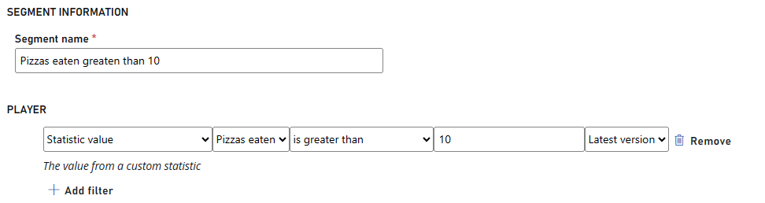
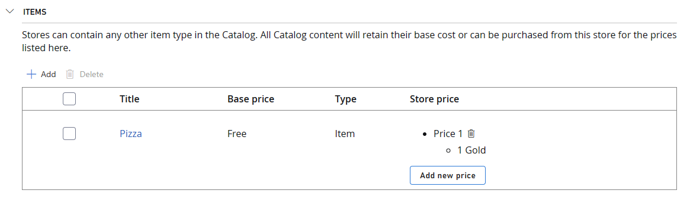
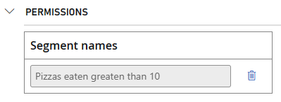
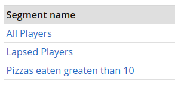

# Economy V2 targeted offers

As a game developer, monetization is a critical aspect of your business. Balancing player value, revenue, and retention is essential. Targeted offers provide a powerful solution: dynamic pricing that tailors prices or items to different player segments based on their characteristics and behaviors. For instance, you can offer discounts to new players, free items to lapsed ones, or premium currency bonuses to loyal users. This new feature simplifies targeted offer creation with the potential to enhance game revenue.

## Ways to create a targeted offer

Here's how you can use PlayFab to create targeted offers for your title.

### Segment-exclusive stores

These are stores that can only be accessed by players who belong to one or more [segments](../playerdata/player-segments.md). Segments are groups of players that share certain attributes or behaviors, such as location, virtual currency balance, last sign in date, or churn risk. You can create segments in PlayFab using various predicates, and assign actions that are performed when a player enters or exits a segment. Segment-exclusive stores allow you to create different stores for different segments, and show them only to the relevant players.

> [!NOTE]
> For more information about configuring segments, see our [player segment configuration guide](../playerdata/player-segment-configuration.md).

## Create a segment-exclusive store

Targeted offers reach players by using [stores](../economy-v2/stores.md). To cater to different player segments, you can set up individual stores, each offering the same items but with varying prices. To ensure that these distinct price points align with their intended segments, you need to configure each store accordingly. For this example, we're going to create a segment-exlusive store for pizzas targeting players that have eaten more than 10 pizzas. Here’s how:

### Prerequisites

- Have at least one player available in your title
- Have at least one item in your catalog
- Have at least one currency in your catalog (or an item you want to use as currency)
- Have a "pizzas eaten" leaderboard that can be used as a statistic

### Create a segment

1. In [Game Manager](https://developer.playfab.com/), navigate to **Build** > **Players** > **Segments**.
2. Select **New segment** on the top right of the page.
3. Add your segment information, in this case, we're going with "Pizzas eaten greater than 10" as the segment name.
4. For the **Player** section, select **statistic value**, then **pizzas eaten** is greater than 10.
5. Save your segment.

### Create a segment-exclusive store

1. In [Game Manager](https://developer.playfab.com/), navigate to **Engage** > **Economy** > **Stores**.
2. Select **New store** from the top right of the page.
3. Fill out the details you wish your store has.
4. Add an item to your store, we're adding an item called "Pizza".
5. Add a price to your item, we're adding "Gold".

    

6. Under **Permissions**, from the **Segments** drop-down menu, select your segment, we're selecting "Pizzas eaten greater than 10".

    

7. Save your store.

### Verify if a player is part of a segment

1. In [Game Manager](https://developer.playfab.com/), navigate to **Build** > **Players**.
2. Search for the player you want to verify.
3. Select the **Segments** tab where you see a list of all the segments a player belongs to.
4. You see a segment if the player complies with the condition you set when creating said segment.

    

## Examples of targeted offers

These features enable you to create targeted offers in various ways, depending on your game design and monetization goals. Here are some examples of how we think some of you can use these features to create targeted offers:

### Last sign in date-based offers

You can create segments based on the last sign in date of your players, and create segment-exclusive stores that offer different prices or items for different levels of engagement. For example, you can offer a free item to players who haven't logged in for more than seven days, and a regular price item to players who have logged in recently.

### Churn risk-based offers

You can create segments based on the churn risk of your players, and create segment-exclusive stores that offer different prices or items for different levels of retention. For example, you can offer a discounted bundle to players who are in the high risk churn segment, and a regular price bundle to players who are in the low risk churn segment.

### Event-based offers

You can create scheduled tasks or rules that trigger inventory actions based on certain events or dates. For example, you can grant an event currency or an event item to all players at the start of an event, and delete them from all players at the end of the event. You can also create segment-exclusive stores that offer event-related items or discounts during the event period.

## Benefits of targeted offers

Including targeted offers in your game can bring you many benefits, such as:

### Increased revenue

By offering different prices or items to different segments of your players, you can optimize your revenue and conversion rates. You can also incentivize your players to spend more or buy more frequently, by offering them personalized and relevant offers.

### Improved retention

By offering different prices or items to different segments of your players, you can improve your retention and loyalty rates. You can also re-engage your lapsed players, or reward your loyal players, by offering them free or discounted items.

### Enhanced engagement

By offering different prices or items to different segments of your players, you can enhance your engagement and satisfaction rates. You can also create more variety and excitement in your game, by offering event-based or subscription-based offers.

### Reduced complexity

By using PlayFab's features for targeted offers, you can reduce the complexity and overhead of creating and managing your own dynamic pricing system. You can also use PlayFab's powerful and flexible tools and services, such as segments, inventory, catalog, and billing, to create and deliver your targeted offers.

## See also

* [Economy V2 overview](../economy-v2/overview.md)
* [Segments](../playerdata/player-segments.md)
* [Stores](../economy-v2/stores.md)
