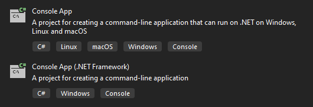
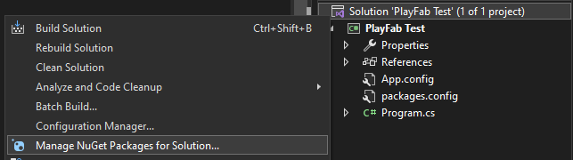
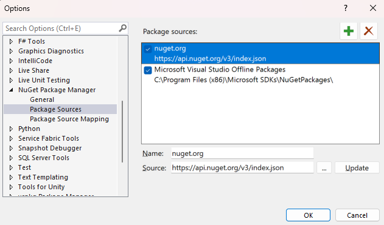
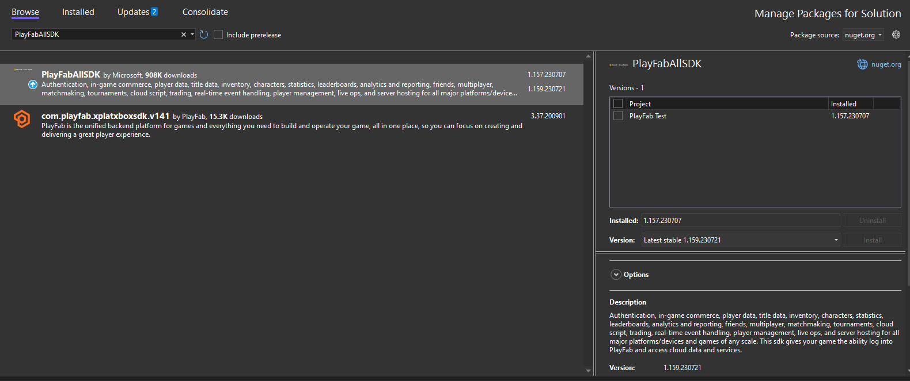

# Part 1 - Environment Setup

This page guides you in the first step towards creating your first game using PlayFab's Economy API. The focus is on setting up your coding environment.

## Prerequisites

1. Have [Visual Studio 2022](https://visualstudio.microsoft.com/downloads/) or later installed.

> [!NOTE]
> For the purpose of this guide, we will be working on a VS Solution named "PlayFab Test," so some screenshots will make reference to that. In your local example, unless you named it the same, it will reflect the name you choose for your project.

## Step 1 – Set up a C# Console Application in Visual Studio 2022

The first step is to set up a C# Console Application in Visual Studio (VS). What we do in this step serves as the foundation upon which you build your game.

To do this, open VS and create a new project. An "Add a new project" window greets you. Here you get various project type options depending on your VS installation, alongside some dropdown menus acting as filters, one of which is labeled "All languages." One of the first options should be "C#," select it.

After selecting "C#" you get some filtered down options for your project type, choose either "Console App" or "Console App (.NET Framework)." For this example, we chose "Console App."

The main difference between both project types is that "Console App" runs on Windows, macOS, and Linux; while "Console App (.NET Framework)" runs solely on Windows. It's up to you if you want to run your game on other operating systems, if so, you may want to choose "Console App."

Once you have selected one of the project types, a blank project should have been created and made available in your VS, then we can move on to Step 2!

## Step 2 - Add the PlayFab NuGet package to the project

To get all of the PlayFab APIs and available functions, you must first import them using the NuGet package manager that comes built-in with VS.

To interact with the package manager, select your Solution (.sln) file from the Solution Explorer tab, right-click it, and select "Manage NuGet packages for Solution...", as shown in next screenshot.

If you followed the steps so far, the package manager should now be open in VS. Make sure you have the **nuget.org** listed under the "Package Source" dropdown on the upper right corner of the package manager. If you don't, don't worry, it's as simple as clicking the ⚙️ icon next to the dropdown and adding it as shown in the next screenshot.

Once you have the appropriate source added to the package manager, you should now be able to search for the PlayFab SDK, called **PlayFabAllSDK**. This search should return some available packages, the one you're looking for shares the exact name mentioned previously, and looks like this:

Once installed you can start using all of the PlayFab API functions! We can now move on to the next step.
