# Part 2 - Using Game Manager

Before we start coding, we need to understand [Game Manager](https://developer.playfab.com) and setup some things.

## Prerequisites

1. [Part 1 - Environment Setup](../craftingGame/crafting-game-environment.md)
2. A [PlayFab developer account](https://developer.playfab.com). It's free to sign up for one.

## Step 1 - Create your Studio

After a successful sign-in (or sign up), you'll now be able to create your brand new Game Studio! To do so, as soon as you log into [Game Manager](https://developer.playfab.com), you see a **New Studio** button. Once clicked, you'll be prompted to name your Studio. You may name it however you like. For this example, we named it "New Game Studio."

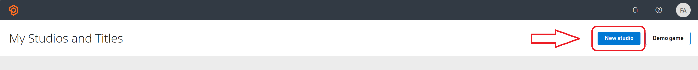

Once your **Studio** is created, it will be visible in your **My Studios and Titles** screen, or by going into [Game Manager](https://developer.playfab.com) and logging in.

## Step 2 - Create your Title

To create a new Title, follow these steps:

- On your **My Studios and Titles** in [Game Manager](https://developer.playfab.com), look for three dots on the right of the **Upgrade account button** (if you already have a plan bought and linked to your logged in account, you'll only see the three dots) and select it.
- Once selected, this will open a menu with different options, choose **New title**.

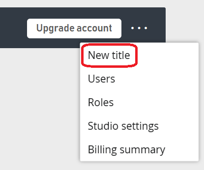

- Input your title's information, such as the name, Website URL, and Game Logo in case you have any of those already. If you don't, no worries, you can always add them later.

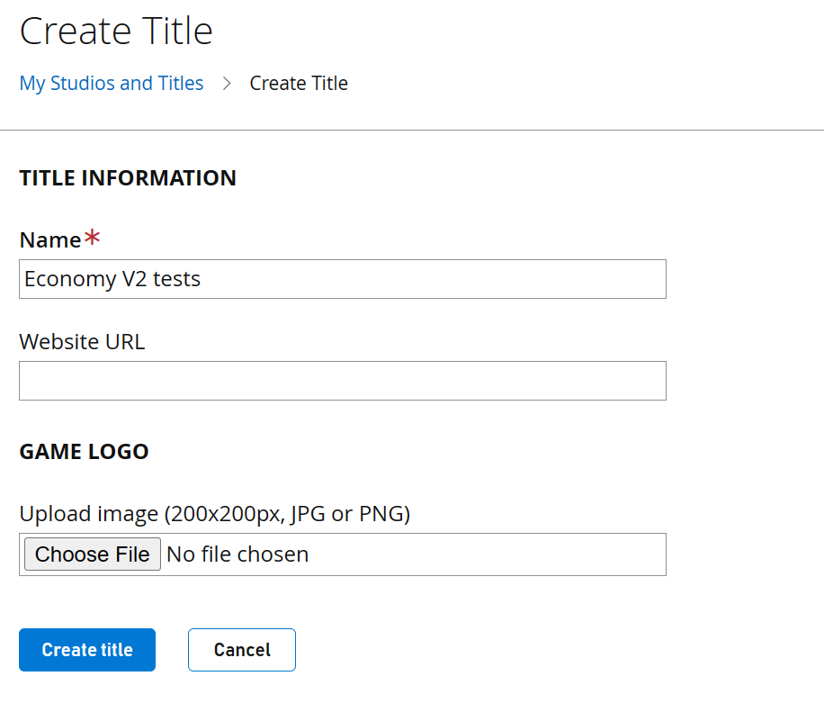

- Click **Create title**
- Once created, your Title will now show up under your previously created Studio. It shows up in a 'card' in which you'll see your Title's logo, name, plan, and ID, and a button shown as a gear ⚙️ icon that takes you to some other Title settings.

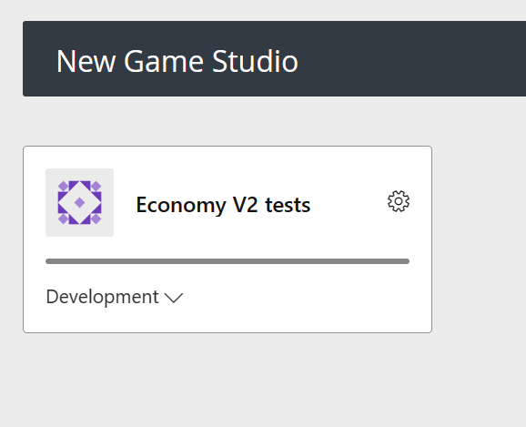

## Step 3 - Get your Title ID and your Secret Key

Now that you have both your Studio and your Title created, it's time to get your Title ID and your Developer Secret Key. Both of which will be used when you start coding and will serve as the linking points in your development environment that point back to the specific Title upon which authentication and transactions are executed.

The easiest way to get the **Title ID** is just by looking at your Title in your Studio screen. In the card corresponding to your Title. On the bottom right of that card, you'll see the "ID" tag followed by a 5-digit alphanumeric code, this is your ID.

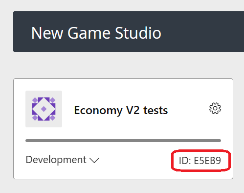

Moving on to getting your **Developer Secret Key**:

- Sign in into [Game Manager](https://developer.playfab.com).
- Selecting your title card in the Studio screen. This will open the title's overview page.
- On the top left corner, next to the Title's name, select the gear icon ⚙️.
- Choose the **Title settings** option.

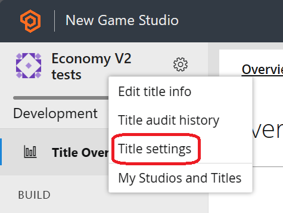

- Select the **Secret Keys** navbar option towards the top of the screen.

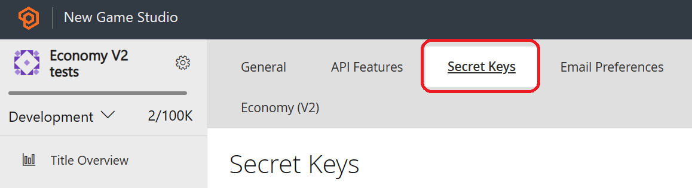

- You'll see that we have automatically generated one for you called **Default Key**. This is your Developer Secret Key, which we'll use in the next part of this tutorial to set up the coding environment settings.

Congratulations on getting this far! You should now have your Studio and your Title set up and properly configured as well as your Title ID and your Developer Secret Key at hand (or at least know where you can get it if needed).

## Step 4 - Create your first item

Given that what we're building is a crafting game, we'll need to create our items in Game Manager so that they're available for players as soon as they start (and to you to start coding).

### [Game Manager](#tab/create-item-gm)

- Sign in into [Game Manager](https://developer.playfab.com).
- Go to **My Studios and Titles** page and select your game title to display the dashboard.
- From the left navigation menu, select **Engage** > **Economy**.

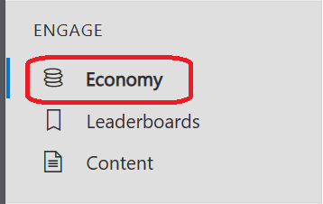

- On the **Economy** page, select the **Items** tab and then select **New Item**. You can also find other tabs such as **Currency**, **UGC**, **Bundles**, and **Stores**.

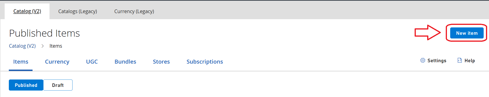

- After selecting it, you'll be redirected to a form in which you'll be prompted to add the details you want your new item to have. On this screen, you'll also be able to set some of the item's properties such as Prices, Files, Images, and Platforms the item will be available on.

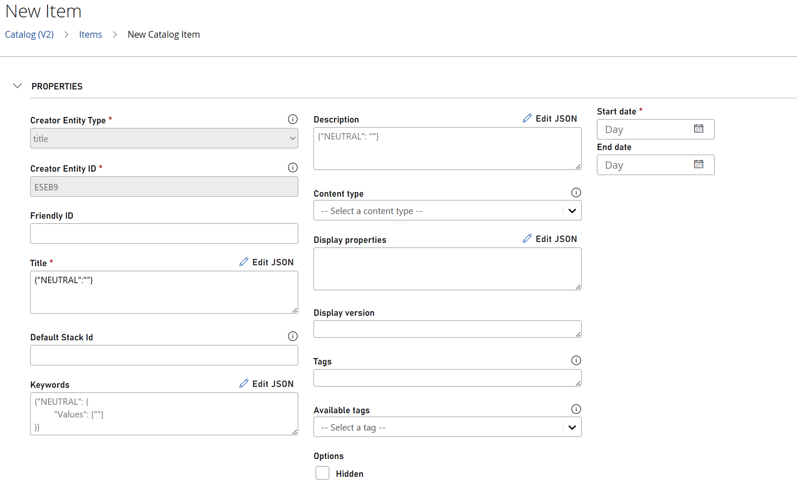

- Once you have added all the required information and any additional information you wanted to add to your item, towards the bottom of the New Item screen, you'll get two distinct options to continue:

    **1. Save as draft**: This creates a draft item, it will not be available in your game (not even through search, purchase, and so forth.)

    **2. Save and publish**: This will save and publish your item to your game right away, meaning it's searchable, active, and purchasable.

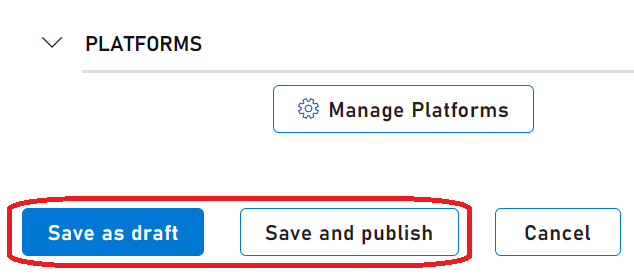

As soon as you have saved your changes, the item will now be either in a draft state, or published, depending on your choice.

### [API](#tab/create-item-api)

To create an item using PlayFab's API, you must use the **CreateDraftItem** call, under **catalog/createDraftitem**. This works similarly as the other examples of creating items, with the slight difference that by default the item created will end up being a draft item unless specified otherwise.

There's a **Publish** boolean in which, if true, the item is published directly without being saved as a draft.

The following JSON is an example of a **CreateDraftItem** request body. Not all the fields are required, so feel free to trim that JSON to your needs/likings.

For more information, see [CreateDraftItem](/rest/api/playfab/economy/catalog/create-draft-item).

```json
{
  "Item": {
    "Type": "ugc",
    "Title": {
      "NEUTRAL": "Neutral title",
      "en-US": "US English title"
    },
    "Description": {
      "NEUTRAL": "Neutral description",
      "en-US": "US English description"
    },
    "Keywords": {
      "NEUTRAL": {
        "Values": [
          "Keyword_1",
          "Keyword_2"
        ]
      }
    },
    "ContentType": "example item",
    "CreatorEntity": {
      "Id": "someId",
      "Type": "title_player_account",
      "TypeString": "title_player_account"
    },
    "IsHidden": false,
    "Tags": [
      "pirates",
      "holiday"
    ],
    "DisplayVersion": "1.0.0",
    "CreationDate": "2018-08-17T22:32:10.472Z",
    "Contents": [
      {
        "Id": "00000000-0000-0000-0000-000000000001",
        "Url": "https://endpoint.blob.core.windows.net/some-identifier-private/00000000-0000-0000-0000-000000000001/textures.zip",
        "MaxClientVersion": "2.4.1",
        "MinClientVersion": "2.0.0"
      }
    ],
    "Images": [
      {
        "Id": "00000000-0000-0000-0000-000000000003",
        "Type": "Thumbnail",
        "Url": "https://endpoint.blob.core.windows.net/some-identifier-private/00000000-0000-0000-0000-000000000003/splashscreen_thumb.jpg"
      }
    ],
    "DisplayProperties": {
      "mapDetails": {
        "mapType": "desertIsland",
        "gameMode": "capture",
        "maxPlayers": 16
      },
      "averageMatchLengthInSeconds": 947
    },
    "DefaultStackId": "Static_Default_Stack_Id"
  },
  "Publish": false
}
```

***

> [!NOTE]
> For more information on Items, Inventories, and other Economy functions and terms, see our [Economy V2 Documentation](/gaming/playfab/features/economy-v2/).

## Step 5 - Use Catalog to view and edit your items

If you go back to **Engage** > **Economy** in your left navbar (like you did in [Step 4](#step-4---create-your-first-item)), you'll see the same list of options/tabs mentioned above. The page defaults to the **Items** tab in which you'll then get another option to filter the items by Published or by Draft, and it shows all your items in the selected category.

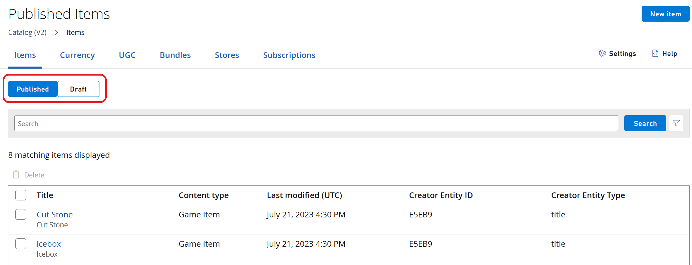

Now that you can view/list all your Published or Draft items in a single place, you're free to edit them individually or delete them in bulk. To delete them, select the ones you want to delete and press the **Delete** button.

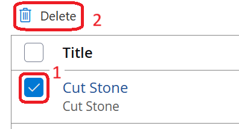

In order to edit an item, select the item's title and that takes you to a screen identical to the New Item screen mentioned before, with all the properties and custom fields you might have added to the item when created (or since it's last update) and allow you to customize and save them by scrolling to the end of the page and selecting the **Edit draft item** button (right next to the **Edit draft item** button, there's also going to be a **Delete** button, which is another way of deleting an item).

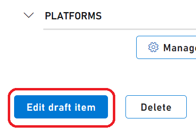

## Step 6 - (Tip) Make an item free for purchase

> [!TIP]
> This step is optional as it will cover one of the ways we recommend as to how to make an item free for purchase. The method used is going to be creating a new "Free Item" to be used as a price with a quantity of 0 in the item you want to be free.

> [!NOTE]
> You may think that the way to make an item free, is to not put a price on it. Currently, this is not the case, if you create an item without the price, we will consider it as **unpurchaseable**.

To create a "Free Item" that can be used as a price for the item you want to have as free, you have to follow the same steps you took in [Step 4](#step-4---create-your-first-item), this is just like creating a 'regular' item. You don't have to give it too much thought in terms of the properties or values you add to that item as it will not be an item you should have as active in your game, its purpose is just to be set as a price. There's no need to put a price on it either.

Once you have two items created (the "Free Item," and the item you want to be free), you must edit the item you want to be free in order to set a price for it. To do so, from your items list, select the desired item and select its name, just as we walked through in [Step 5](#step-5---use-catalog-to-view-and-edit-your-items), to get to the item edit screen. If you scroll down to the end and enable **Edit Mode**, the "Prices" section will now have an **Add new price** button under it.

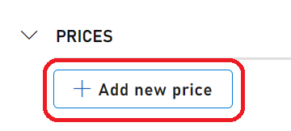

After clicking **Add new price** a window pops up with a list of all your current items for you to choose one to be the price (you can also filter by "Items," "UGC Items," and "Currencies"), and also search for a specific text. In our case, there's just one other item there, the "Free Item" (unless you already created multiple items).

If you select the "Add" option right next to your "Free Item" you'll then get prompted to select the amount of "Free Item" you want as a price, in order to set this new item as free, you must change this value (which defaults as 1) to a Zero.

After completing setting up the price, you must save and publish the change, and you're done! This item is now available to be purchased for free! We look into how to purchase an item (even a free one) through C# and through direct API calls later on.

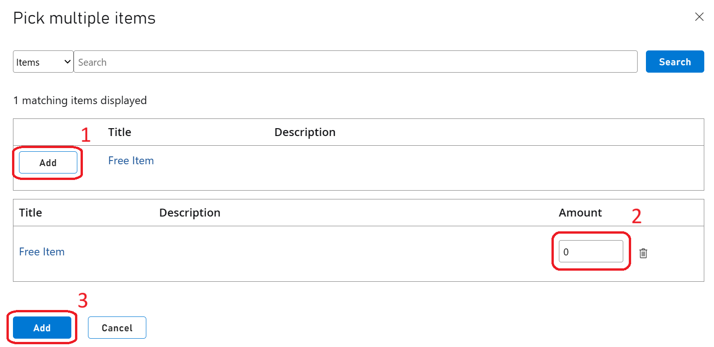

## Step 7 - Add a FriendlyId

> [!TIP]
> This is another optional step, it will cover how to edit an existing item to add a **FriendlyId**. This way, you can search for the item using this **FriendlyId** instead of the item's long alphanumeric id given by default.

To add a FriendlyId, you must go to **Economy** > **Items** and select the desired item. Once selected, enable **Edit mode** so you can make changes to the item.

In the following screenshot, you can see the **FriendlyId** field (highlighted in red). This is where you can put a friendlier name or ID for your item and it will be instantly linked to that particular item.

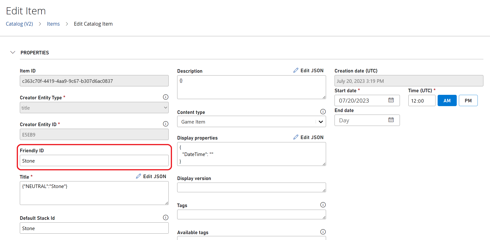
