# Getting Started with Economy v2, Unity, and Android

[!INCLUDE [notice](../../../includes/_economy-release.md)]

This tutorial shows you how to set up In-App Purchasing (IAP) using PlayFab, the Unity + IAP Service, and the Android Billing API.

## Before we start

The Android Billing API and PlayFab work together to provide an IAP experience for your client:

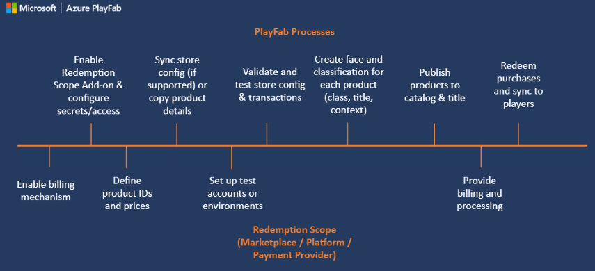

Start by setting up your **Product IDs** and **Prices** via PlayMarket. Initially, all the products are _faceless_ - digital entities your player is able to purchase - but no meaning to PlayFab players.

To make those entities useful, we need to mirror them in the PlayFab item catalogs. PlayFab turns faceless entities into bundles, containers, and individual items.

Each has their own unique face, with:

* **Titles**
* **Descriptions**
* **Tags**
* **Types**
* **Images**
* **Behaviors**

All items are linked to market products by sharing IDs.

The best way to access real money items available for purchase is to use [GetItems](/rest/api/playfab/economy/catalog/get-items).

The ID of the item is the link between PlayFab and any external IAP system. So we pass the item ID to the IAP service.

At this point, the purchase process begins. The player interacts with the IAP interface and - if the purchase is successful - you obtain a receipt.

PlayFab validates the receipt and register the purchase, granting the PlayFab player the items that they just bought.

## Setting up a client application

This section shows you how to configure an application to test IAP using PlayFab, UnityIAP, and the Android Billing API.

Prerequisites:

* A Unity project.
* The [PlayFab Unity SDK](/gaming/playfab/sdks/unity3d/) imported and configured to work with your title.
* An editor like [Visual Studio](/visualstudio/gamedev/unity/get-started/getting-started-with-visual-studio-tools-for-unity) installed and configured to work with your Unity project.

Our first step is setting up UnityIAP:

1. Navigate to **Services**.
2. Make sure the **Services** tab is selected.
3. Select your **Unity Services** profile or organization.
4. Select the **Create** button.

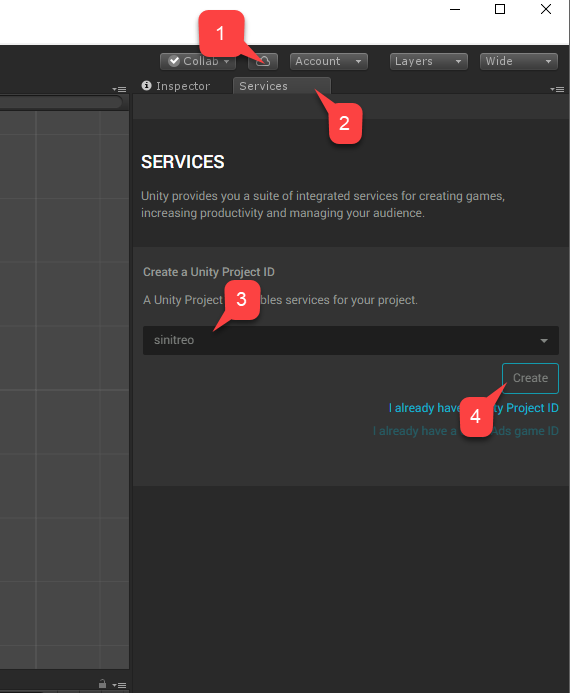  

1. Next, navigate to the **In-App Purchasing (IAP)** service.

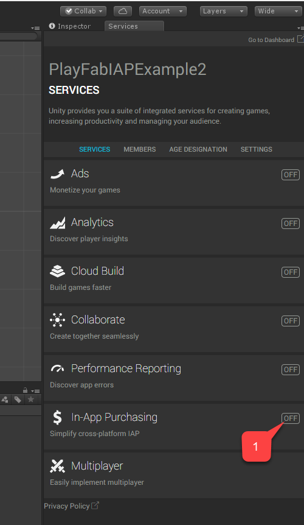  

1. Make sure to enable the **Service**, by setting the **Simplify cross-platform IAP** toggle.

2. Then select the **Continue** button.

  

A page with a list of plugins appears.

1. Select the **Import** button.

  

Continue the Unity install, and import procedure up to the point where it has imported all the plugins.

1. Verify that the plugins are in place.
2. Then create a new script, called **AndroidIAPExample.cs**.

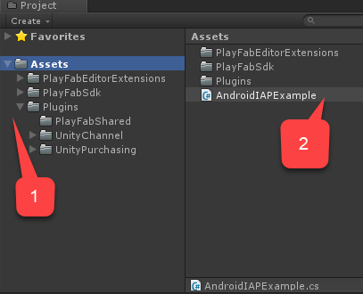  

`AndroidIAPExample.cs` containing the following code (refer to the code comments for further explanation).

```csharp
using System;
using System.Collections.Generic;
using System.Linq;
using System.Threading.Tasks;

using UnityEngine;
using UnityEngine.Purchasing;
using UnityEngine.Purchasing.Extension;

using PlayFab;
using PlayFab.ClientModels;
using PlayFab.EconomyModels;

/// <summary>
/// Unity behavior that implements the the Unity IAP Store interface.
/// Attach as an asset to your Scene.
/// </summary>
public class AndroidIAPExample : MonoBehaviour, IDetailedStoreListener
{
    // Bundles for sale on the Google Play Store.
    private Dictionary<string, PlayFab.EconomyModels.CatalogItem> _googlePlayCatalog;

    // In-game items for sale at the example vendor.
    private Dictionary<string, PlayFab.EconomyModels.CatalogItem> _storefrontCatalog;

    private string _purchaseIdempotencyId = null;

    private PlayFabEconomyAPIAsyncResult _lastAPICallResult = null;

    private static readonly PlayFabEconomyAPIAsync s_economyAPI = new();

    private static IStoreController s_storeController;

    // TODO: This callback is for illustrations purposes, you should create one that fits your needs
    public delegate void PlayFabProcessPurchaseCallback(PurchaseProcessingResult result);

    /// <summary>
    /// Event that is triggered when a purchase is processed.
    /// </summary>
    /// <remarks>
    /// TODO: Subscribe to this event in your game code to handle purchase results.
    /// </remarks>
    public event PlayFabProcessPurchaseCallback PlayFabProcessPurchaseEvent;

    /// <summary>
    /// True if the Store Controller, extensions, and Catalog are set.
    /// </summary>
    public bool IsInitialized => s_storeController != null
                             && _googlePlayCatalog != null
                             && _storefrontCatalog != null;

    // Start is called before the first frame update.
    public void Start()
    {
        Login();
    }

    /// <summary>
    /// Attempts to log the player in via the Android Device ID.
    /// </summary>
    private void Login()
    {
        // TODO: it is better to use LoginWithGooglePlayGamesService or a similar platform-specific login method for final game code.

        // SystemInfo.deviceUniqueIdentifier will prompt for permissions on newer devices.
        // Using a non-device specific GUID and saving to a local file
        // is a better approach. PlayFab does allow you to link multiple
        // Android device IDs to a single PlayFab account.
        PlayFabClientAPI.LoginWithCustomID(new LoginWithCustomIDRequest()
        {
            CreateAccount = true,
            CustomId = SystemInfo.deviceUniqueIdentifier
        }, result => RefreshIAPItems(), PlayFabSampleUtil.OnPlayFabError);
    }

    /// <summary>
    /// Queries the PlayFab Economy Catalog V2 for updated listings
    /// and then fills the local catalog objects.
    /// </summary>
    private async void RefreshIAPItems()
    {
        _googlePlayCatalog = new Dictionary<string, PlayFab.EconomyModels.CatalogItem>();
        SearchItemsRequest googlePlayCatalogRequest = new()
        {
            Count = 50,
            Filter = "AlternateIds/any(t: t/type eq 'GooglePlay')"
        };

        SearchItemsResponse googlePlayCatalogResponse;
        do
        {
            googlePlayCatalogResponse = await s_economyAPI.SearchItemsAsync(googlePlayCatalogRequest);
            Debug.Log("Search response: " + JsonUtility.ToJson(googlePlayCatalogResponse));

            foreach (PlayFab.EconomyModels.CatalogItem item in googlePlayCatalogResponse.Items)
            {
                _googlePlayCatalog.Add(item.Id, item);
            }

        } while (!string.IsNullOrEmpty(googlePlayCatalogResponse.ContinuationToken));

        Debug.Log($"Completed pulling from PlayFab Economy v2 googleplay Catalog: {_googlePlayCatalog.Count()} items retrieved");

        _storefrontCatalog = new Dictionary<string, PlayFab.EconomyModels.CatalogItem>();
        GetItemRequest storeCatalogRequest = new()
        {
            AlternateId = new CatalogAlternateId()
            {
                Type = "FriendlyId",
                Value = "villagerstore"
            }
        };

        GetItemResponse storeCatalogResponse;
        storeCatalogResponse = await s_economyAPI.GetItemAsync(storeCatalogRequest);
        List<string> itemIds = new();

        foreach (CatalogItemReference item in storeCatalogResponse.Item.ItemReferences)
        {
            itemIds.Add(item.Id);
        }

        GetItemsRequest itemsCatalogRequest = new()
        {
            Ids = itemIds
        };

        GetItemsResponse itemsCatalogResponse = await s_economyAPI.GetItemsAsync(itemsCatalogRequest);
        foreach (PlayFab.EconomyModels.CatalogItem item in itemsCatalogResponse.Items)
        {
            _storefrontCatalog.Add(item.Id, item);
        }

        Debug.Log($"Completed pulling from PlayFab Economy v2 villagerstore store: {_storefrontCatalog.Count()} items retrieved");

        InitializePurchasing();
    }

    /// <summary>
    /// Initializes the Unity IAP system for the Google Play Store.
    /// </summary>
    private void InitializePurchasing()
    {
        if (IsInitialized) return;

        var builder = ConfigurationBuilder.Instance(StandardPurchasingModule.Instance(AppStore.GooglePlay));

        foreach (PlayFab.EconomyModels.CatalogItem item in _googlePlayCatalog.Values)
        {
            string googlePlayItemId = item.AlternateIds.FirstOrDefault(item => item.Type == "GooglePlay")?.Value;
            if (!string.IsNullOrWhiteSpace(googlePlayItemId))
            {
                builder.AddProduct(googlePlayItemId, ProductType.Consumable);
            }
        }

        UnityPurchasing.Initialize(this, builder);
    }

    /// <summary>
    /// Draw a debug IMGUI for testing examples.
    /// Use UI Toolkit for your production game runtime UI instead.
    /// </summary>
    public void OnGUI()
    {
        // Support high-res devices.
        GUI.matrix = Matrix4x4.TRS(new Vector3(0, 0, 0), Quaternion.identity, new Vector3(3, 3, 3));

        if (!IsInitialized)
        {
            GUILayout.Label("Initializing IAP and logging in...");
            return;
        }

        if (!string.IsNullOrEmpty(_purchaseIdempotencyId) && (!string.IsNullOrEmpty(_lastAPICallResult?.Message)
                                                           || !string.IsNullOrEmpty(_lastAPICallResult?.Error)))
        {
            GUILayout.Label(_lastAPICallResult?.Message + _lastAPICallResult?.Error);
        }

        GUILayout.Label("Shop for game currency bundles.");
        // Draw a purchase menu for each catalog item.
        foreach (PlayFab.EconomyModels.CatalogItem item in _googlePlayCatalog.Values)
        {
            // Use a dictionary to select the proper language.
            if (GUILayout.Button("Get " + (item.Title.ContainsKey("en-US") ? item.Title["en-US"] : item.Title["NEUTRAL"])))
            {
                BuyProductById(item.AlternateIds.FirstOrDefault(item => item.Type == "GooglePlay").Value);
            }
        }

        GUILayout.Label("Hmmm. (Translation: Welcome to my humble Villager store.)");
        // Draw a purchase menu for each catalog item.
        foreach (PlayFab.EconomyModels.CatalogItem item in _storefrontCatalog.Values)
        {
            // Use a dictionary to select the proper language.
            if (GUILayout.Button("Buy "
                + (item.Title.ContainsKey("en-US") ? item.Title["en-US"] : item.Title["NEUTRAL"]
                + ": "
                + item.PriceOptions.Prices.FirstOrDefault().Amounts.FirstOrDefault().Amount.ToString()
                + " Diamonds"
                )))
            {
                Task.Run(() => PlayFabPurchaseItemById(item.Id));
            }
        }
    }

    /// <summary>
    /// Integrates game purchasing with the Unity IAP API.
    /// </summary>
    public void BuyProductById(string productId)
    {
        if (!IsInitialized)
        {
            Debug.LogError("IAP Service is not initialized!");
            return;
        }

        s_storeController.InitiatePurchase(productId);
    }

    /// <summary>
    /// Purchases a PlayFab inventory item by ID.
    /// See the <see cref="PlayFabEconomyAPIAsync"/> class for details on error handling
    /// and calling patterns.
    /// </summary>
    async public Task<bool> PlayFabPurchaseItemById(string itemId)
    {
        if (!IsInitialized)
        {
            Debug.LogError("IAP Service is not initialized!");
            return false;
        }

        _lastAPICallResult = new();

        Debug.Log("Player buying product " + itemId);

        if (string.IsNullOrEmpty(_purchaseIdempotencyId))
        {
            _purchaseIdempotencyId = Guid.NewGuid().ToString();
        }

        GetItemRequest getVillagerStoreRequest = new()
        {
            AlternateId = new CatalogAlternateId()
            {
                Type = "FriendlyId",
                Value = "villagerstore"
            }
        };

        GetItemResponse getStoreResponse = await s_economyAPI.GetItemAsync(getVillagerStoreRequest);
        if (getStoreResponse == null || string.IsNullOrEmpty(getStoreResponse?.Item?.Id))
        {
            _lastAPICallResult.Error = "Unable to contact the store. Check your internet connection and try again in a few minutes.";
            return false;
        }

        CatalogPriceAmount price = _storefrontCatalog.FirstOrDefault(item => item.Key == itemId).Value.PriceOptions.Prices.FirstOrDefault().Amounts.FirstOrDefault();
        PurchaseInventoryItemsRequest purchaseInventoryItemsRequest = new()
        {
            Amount = 1,
            Item = new InventoryItemReference()
            {
                Id = itemId
            },
            PriceAmounts = new List<PurchasePriceAmount>
            {
                new()
                {
                    Amount = price.Amount,
                    ItemId = price.ItemId
                }
            },
            IdempotencyId = _purchaseIdempotencyId,
            StoreId = getStoreResponse.Item.Id
        };

        PurchaseInventoryItemsResponse purchaseInventoryItemsResponse = await s_economyAPI.PurchaseInventoryItemsAsync(purchaseInventoryItemsRequest);
        if (purchaseInventoryItemsResponse == null || purchaseInventoryItemsResponse?.TransactionIds.Count < 1)
        {
            _lastAPICallResult.Error = "Unable to purchase. Try again in a few minutes.";
            return false;
        }

        _purchaseIdempotencyId = "";
        _lastAPICallResult.Message = "Purchasing!";
        return true;
    }

    private void OnRegistration(LoginResult result)
    {
        PlayFabSettings.staticPlayer.ClientSessionTicket = result.SessionTicket;
    }

    public void OnInitialized(IStoreController controller, IExtensionProvider extensions)
    {
        s_storeController = controller;

        extensions.GetExtension<IGooglePlayStoreExtensions>().RestoreTransactions((result, error) => {
            if (result)
            {
                Debug.LogWarning("Restore transactions succeeded.");
            }
            else
            {
                Debug.LogWarning("Restore transactions failed.");
            }
        });
    }

    public void OnInitializeFailed(InitializationFailureReason error)
    {
        Debug.Log("OnInitializeFailed InitializationFailureReason:" + error);
    }

    public void OnInitializeFailed(InitializationFailureReason error, string message)
    {
        Debug.Log("OnInitializeFailed InitializationFailureReason:" + error + message);
    }

    public void OnPurchaseFailed(UnityEngine.Purchasing.Product product, PurchaseFailureReason failureReason)
    {
        Debug.Log($"OnPurchaseFailed: FAIL. Product: '{product.definition.storeSpecificId}', PurchaseFailureReason: {failureReason}");
    }

    public void OnPurchaseFailed(UnityEngine.Purchasing.Product product, PurchaseFailureDescription failureDescription)
    {
        Debug.Log($"OnPurchaseFailed: FAIL. Product: '{product.definition.storeSpecificId}', PurchaseFailureReason: {failureDescription}");
    }

    /// <summary>
    /// Callback for Store purchases. Subscribe to PlayFabProcessPurchaseEvent to handle the final PurchaseProcessingResult.
    /// <see href="https://docs.unity3d.com/Packages/com.unity.purchasing@4.8/api/UnityEngine.Purchasing.PurchaseProcessingResult.html"/>
    /// </summary>
    /// <remarks>
    /// This code does not account for purchases that were pending and are
    /// delivered on application start. Production code should account for these cases.
    /// </remarks>
    /// <returns>Complete immediately upon error. Pending if PlayFab Economy is handling final processing and will trigger PlayFabProcessPurchaseEvent with the final result.</returns>
    public PurchaseProcessingResult ProcessPurchase(PurchaseEventArgs purchaseEvent)
    {
        if (!IsInitialized)
        {
            Debug.LogWarning("Not initialized. Ignoring.");
            return PurchaseProcessingResult.Complete;
        }

        if (purchaseEvent.purchasedProduct == null)
        {
            Debug.LogWarning("Attempted to process purchase with unknown product. Ignoring.");
            return PurchaseProcessingResult.Complete;
        }

        if (string.IsNullOrEmpty(purchaseEvent.purchasedProduct.receipt))
        {
            Debug.LogWarning("Attempted to process purchase with no receipt. Ignoring.");
            return PurchaseProcessingResult.Complete;
        }

        Debug.Log("Attempting purchase with receipt " + purchaseEvent.purchasedProduct.receipt);
        GooglePurchase purchasePayload = GooglePurchase.FromJson(purchaseEvent.purchasedProduct.receipt);
        RedeemGooglePlayInventoryItemsRequest request = new()
        {
            Purchases = new List<GooglePlayProductPurchase>
            {
                new()
                {
                    ProductId = purchasePayload.PayloadData?.JsonData?.productId,
                    Token = purchasePayload.PayloadData?.JsonData?.purchaseToken
                }
            }
        };

        PlayFabEconomyAPI.RedeemGooglePlayInventoryItems(request, result =>
        {
            Debug.Log("Processed receipt validation.");

            if (result?.Failed.Count > 0)
            {
                Debug.Log($"Validation failed for {result.Failed.Count} receipts.");
                Debug.Log(JsonUtility.ToJson(result.Failed));
                PlayFabProcessPurchaseEvent?.Invoke(PurchaseProcessingResult.Pending);
            }
            else
            {
                Debug.Log("Validation succeeded!");
                PlayFabProcessPurchaseEvent?.Invoke(PurchaseProcessingResult.Complete);
                s_storeController.ConfirmPendingPurchase(purchaseEvent.purchasedProduct);
                Debug.Log("Confirmed purchase with Google Marketplace.");
            }
        },
        PlayFabSampleUtil.OnPlayFabError);

        return PurchaseProcessingResult.Pending;
    }
}

/// <summary>
/// Utility classes for the sample.
/// </summary>
public class PlayFabEconomyAPIAsyncResult
{
    public string Error { get; set; } = null;

    public string Message { get; set; } = null;
}

public static class PlayFabSampleUtil
{
    public static void OnPlayFabError(PlayFabError error)
    {
        Debug.LogError(error.GenerateErrorReport());
    }
}

/// <summary>
/// Example Async wrapper for PlayFab API's.
/// 
/// This is just a quick sample for example purposes.
/// 
/// Write your own customer Logger implementation to log and handle errors
/// for user-facing scenarios. Use tags and map which PlayFab errors require your
/// game to handle GUI or gameplay updates vs which should be logged to crash and
/// error reporting services.
/// </summary>
public class PlayFabEconomyAPIAsync
{
    /// <summary>
    /// <see href="https://learn.microsoft.com/rest/api/playfab/economy/catalog/get-item"/>
    /// </summary>
    public Task<GetItemResponse> GetItemAsync(GetItemRequest request)
    {
        TaskCompletionSource<GetItemResponse> getItemAsyncTaskSource = new();
        PlayFabEconomyAPI.GetItem(request, (response) => getItemAsyncTaskSource.SetResult(response), error => 
        {
            PlayFabSampleUtil.OnPlayFabError(error);
            getItemAsyncTaskSource.SetResult(default);
        });
        return getItemAsyncTaskSource.Task;
    }

    /// <summary>
    /// <see href="https://learn.microsoft.com/rest/api/playfab/economy/catalog/get-items"/>
    /// </summary>
    public Task<GetItemsResponse> GetItemsAsync(GetItemsRequest request)
    {
        TaskCompletionSource<GetItemsResponse> getItemsAsyncTaskSource = new();
        PlayFabEconomyAPI.GetItems(request, (response) => getItemsAsyncTaskSource.SetResult(response), error => 
        {
            PlayFabSampleUtil.OnPlayFabError(error);
            getItemsAsyncTaskSource.SetResult(default);
        });
        return getItemsAsyncTaskSource.Task;
    }

    /// <summary>
    /// <see href="https://learn.microsoft.com/rest/api/playfab/economy/inventory/purchase-inventory-items"/>
    /// </summary>
    public Task<PurchaseInventoryItemsResponse> PurchaseInventoryItemsAsync(PurchaseInventoryItemsRequest request)
    {
        TaskCompletionSource<PurchaseInventoryItemsResponse> purchaseInventoryItemsAsyncTaskSource = new();
        PlayFabEconomyAPI.PurchaseInventoryItems(request, (response) => purchaseInventoryItemsAsyncTaskSource.SetResult(response), error => 
        {
            PlayFabSampleUtil.OnPlayFabError(error);
            purchaseInventoryItemsAsyncTaskSource.SetResult(default);
        });
        return purchaseInventoryItemsAsyncTaskSource.Task;
    }

    /// <summary>
    /// <see href="https://learn.microsoft.com/rest/api/playfab/economy/catalog/search-items"/>
    /// </summary>
    public Task<SearchItemsResponse> SearchItemsAsync(SearchItemsRequest request)
    {
        TaskCompletionSource<SearchItemsResponse> searchItemsAsyncTaskSource = new();
        PlayFabEconomyAPI.SearchItems(request, (response) => searchItemsAsyncTaskSource.SetResult(response), error => 
        {
            PlayFabSampleUtil.OnPlayFabError(error);
            searchItemsAsyncTaskSource.SetResult(default);
        });
        return searchItemsAsyncTaskSource.Task;
    }
}

[Serializable]
public class PurchaseJsonData
{
    public string orderId;
    public string packageName;
    public string productId;
    public string purchaseToken;
    public long   purchaseTime;
    public int    purchaseState;
}

[Serializable]
public class PurchasePayloadData
{
    public PurchaseJsonData JsonData;

    public string signature;
    public string json;

    public static PurchasePayloadData FromJson(string json)
    {
        var payload = JsonUtility.FromJson<PurchasePayloadData>(json);
        payload.JsonData = JsonUtility.FromJson<PurchaseJsonData>(payload.json);
        return payload;
    }
}

[Serializable]
public class GooglePurchase
{
    public PurchasePayloadData PayloadData;

    public string Store;
    public string TransactionID;
    public string Payload;

    public static GooglePurchase FromJson(string json)
    {
        var purchase = JsonUtility.FromJson<GooglePurchase>(json);

        // Only fake receipts are returned in Editor play.
        if (Application.isEditor)
        {
            return purchase;
        }

        purchase.PayloadData = PurchasePayloadData.FromJson(purchase.Payload);
        return purchase;
    }
}
```

1. Create a new **GameObject** called **Code**.
1. Add the `AndroidIAPExample` component to it (click-and-drag, or).
1. Make sure to **Save** the scene.

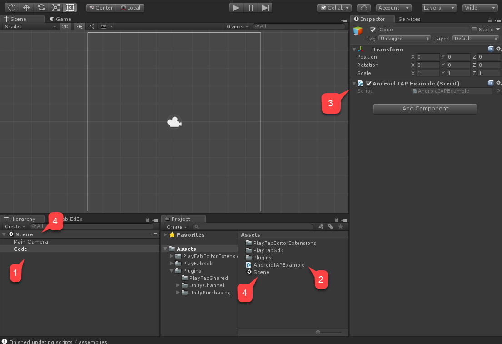  

Finally, navigate to **Build Settings**.

1. Verify that your scene has been added to the **Scenes In Build** area.
2. Make sure that the **Android** platform has been selected.
3. Move to the **Player Settings** area.
4. Assign your **Package Name**.

> [!NOTE]
> Make sure to come up with your _own_ package name to avoid any **PlayMarket** collisions.

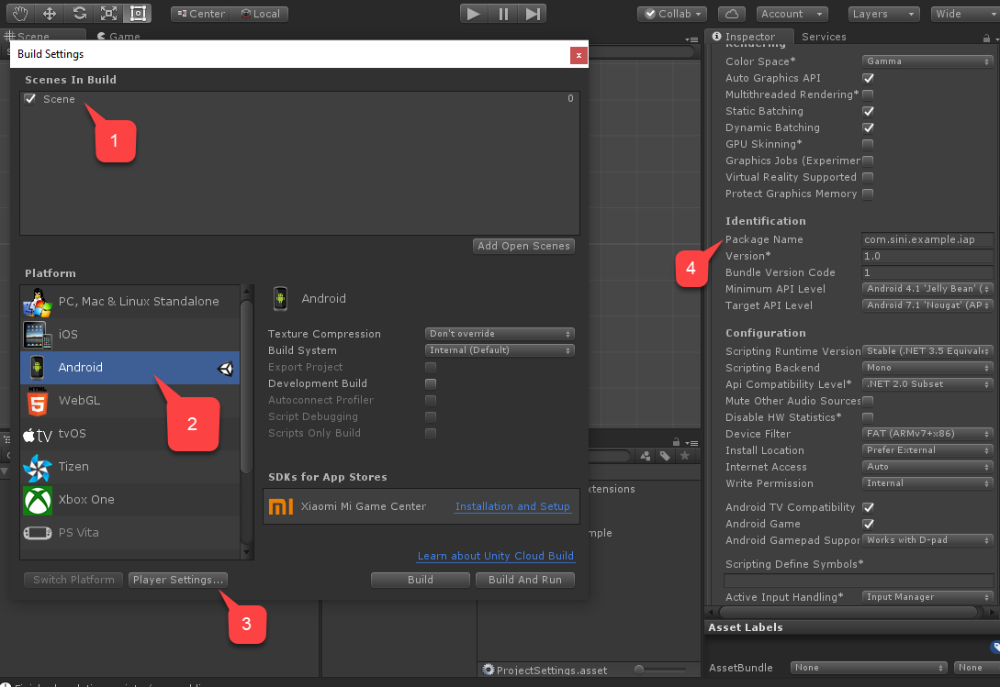  

Finally, build the application as usual, and ensure there's an APK.

In order to test, we need to configure PlayMarket and PlayFab.

## Setting up a PlayMarket application for IAP

This section describes the specifics of how to enable IAP for your PlayMarket application.

> [!NOTE]
> Setting up the application itself is beyond the scope of this tutorial. We assume you already _have_ an application, and that is configured to publish at least Alpha releases.

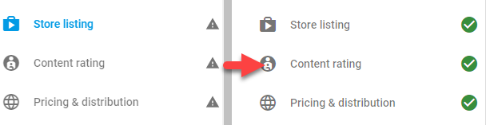  

Useful notes:

* Getting to that point requires you to have an APK uploaded. Use the APK we constructed in the previous section.
* Upload the APK as an _Alpha_ or _Beta_ Application to enable the IAP sandbox.
* Configuring **Content Rating** includes questions about how IAP is enabled in the application.
* PlayMarket _doesn't_ allow Publishers to use or test IAP. Pick _another_ Google account for testing purposes, and add it as a tester for your Alpha/Beta build.

1. Publish the application build.
1. Select **In-app products** from the menu.
    * If you're asked for a **Merchant Account**, link or create one.
1. Select the **Add New Product** button.

    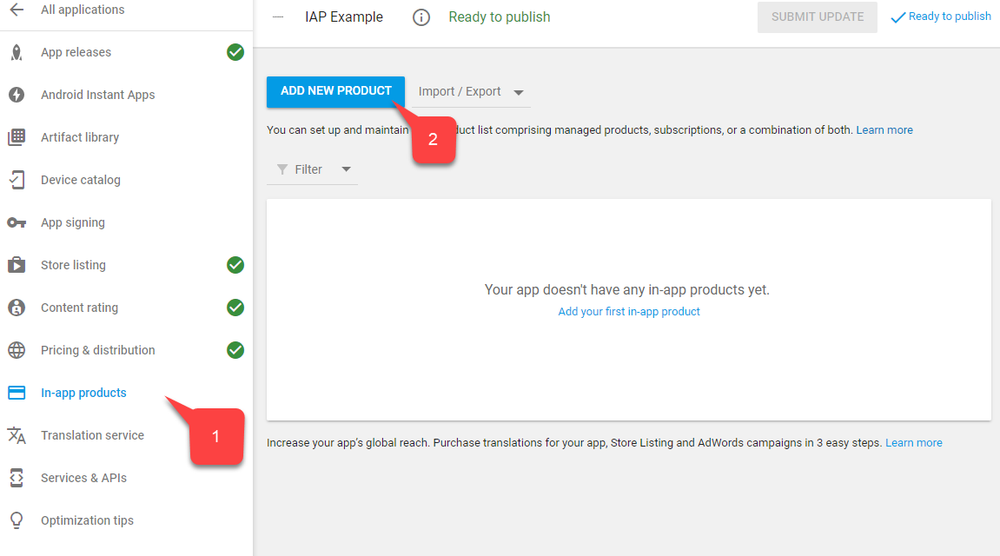  

1. On the new product screen, select **Managed Product**.
1. Give it a descriptive _Product ID_ such as `100diamonds`.
1. Select **Continue**.

      

1. PlayMarket requires you to fill in a **Title (1)** and a **Description (2)**, for example `100 Diamonds` and `A pack of 100 diamonds to spend in-game`.

    **Data Item** data comes exclusively from the PlayFab service, and only requires IDs to match.

      

1. Scroll further and select the **Add a price** button.

    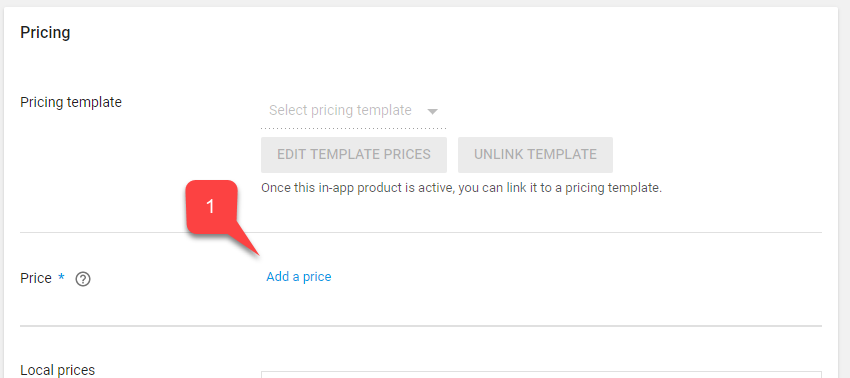  

1. Enter a valid price such as "$0.99" (notice how price is converted for each country/region independently).
1. Select the **Apply** button.

    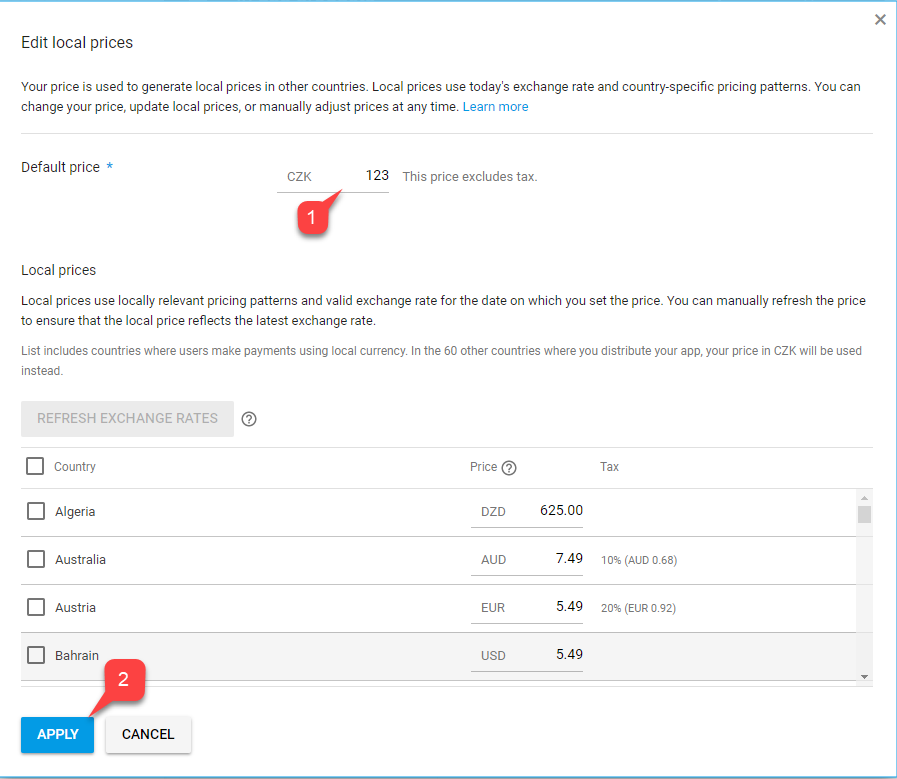

1. Finally, scroll back to the top of your screen, and change the status of the item to **Active**.

    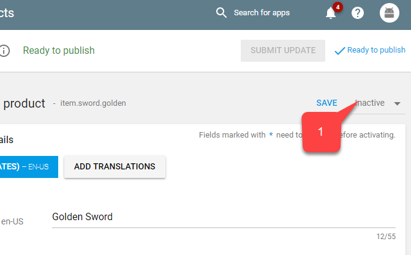  

1. Save the **Licensing Key** to link PlayFab with PlayMarket.
1. Navigate to **Services & APIs** in the menu.
1. Then locate and save the **Base64** version of the **Key**.


The next step is enabling IAP testing. While sandbox is automatically enabled for Alpha and Beta builds, we need to set up accounts that are authorized to test the app:

1. Navigate to **Home**.
1. Locate and select the **Account details** in the menu to the left.
1. Locate the **License Testing** area.
1. Verify that your **Test Accounts** are in the list.
1. Make sure the **License Test Response** is set to **RESPOND_NORMALLY**.

Don't forget to apply the settings!

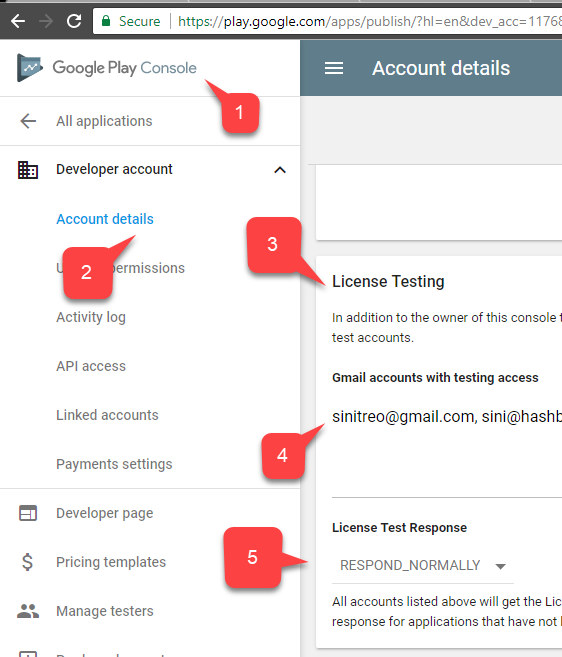  

The Play Market side of the integration should be set up at this point.

## Setting up a PlayFab title

Our last step is configuring a PlayFab title to reflect our products, and integrate with the Google Billing API.

1. Select **Add-ons**.
1. Then, select the **Google** add-on.

  

1. Fill in your **Package ID**.
1. Fill in the **Google App License Key** that you acquired in the previous section.
1. Commit your changes by selecting the **Install Google** button.

Our next step is reflecting our 100 Diamonds bundle in PlayFab:

### [Game Manager](#tab/create-currency-gm)

1. Create a new Economy Catalog (V2) Currency.
1. Edit the **Title** and add a **Description** - for example, `Diamonds`, `Our in-game currency of choice.`.
1. Add a **Friendly ID** to make it easier to find your currency, `diamonds`.
1. Select **Save and publish** to complete your changes.
1. Observe your currency in the **Currency** list.

1. Next, create a new Economy Catalog (V2) Bundle.
1. Edit the **Title** and add a **Description** - for example, `100 Diamonds Bundle`, `A pack of 100 diamonds to spend in-game.`.

    ```JSON
    {
        "NEUTRAL": "100 Diamonds Bundle",
        "en-US": "100 Diamonds Bundle",
        "en-GB": "100 Diamonds Bundle",
        "de-DE": "100 Diamantenbüschel"
    }
    ```

    > [!NOTE]
    > Keep in mind that this data has _nothing to do_ with the **Play Market Item Title** and **Description** - it is independent.

1. You can use Content type to organize your bundles - for example, `appstorebundles`. Content types are managed in ⚙️ > Title Settings > Economy (V2).
1. Track real-world prices by adding localized pricing to the Display properties.

    ```json
    {
        "prices": [
            "en-us": 0.99,
            "en-gb": 0.85,
            "de-de": 0.45
        ]
    }
    ```

1. Add a new Item to the Bundle. Select Currencies in the filter and choose the Currency you created in the previous set. Set the Quantity to match the amount of Currency you want to sell in this bundle.
1. Add a new Platform for the "GooglePlay" Marketplace. If you don't already have the GooglePlay Marketplace, you can create it in the Economy Settings page. Set the **Marketplace ID** to match the Google Play Console Product ID you created in the previous section.
1. Select **Save and publish** to complete your changes.
1. Observe your bundle in the **Bundles** list.

### [REST API](#tab/create-currency-api)

***

Next, we can set in-game purchases for players to spend their currency on with a PlayFab store to represent an in-game NPC vendor:

### [Game Manager](#tab/create-items-gm)

1. Create a new Economy Catalog (V2) Item.
1. Edit the **Title** and add a **Description** - for example, "Golden Sword", "A sword made of gold.".
1. You can add localized keywords to help players find your item in the store. Add Tags and a Content type to help you organize your items for later retrieval via API. Use Display Properties for storing game data such as armor values, a relative path to art assets, or any other data you need to store for your game.
1. Add a new price and select the Currency you created in the previous step. Set the Amount to the price you want set by default. You can override the Price later in any Store you create.
1. Select **Save and publish** to complete your changes.
1. Observe your item in the **Items** list.
1. Finally, create a new Economy Catalog (V2) Store.
1. Edit the **Title** and add a **Description** - for example, `Villager Store`, `A humble store run by a humble villager.`.
1. Give it a **Friendly ID** to make retrieval easier, for example `villagerstore`.
1. Add the item you created in the previous step to the store. You can add multiple items to a store, and override any default prices if necessary.
1. Select **Save and publish** to complete your changes.
1. Observe your store in the **Stores** list.

### [REST API](#tab/create-items-api)

***

We've concluded the setup for your PlayFab title.

## Testing

For testing purposes, download the app using the Alpha/Beta release.

* Make sure to use a test account and a real Android device.
* Once you start the app, you should see IAP initialized, and _one button_ representing your item.
* Select that button.

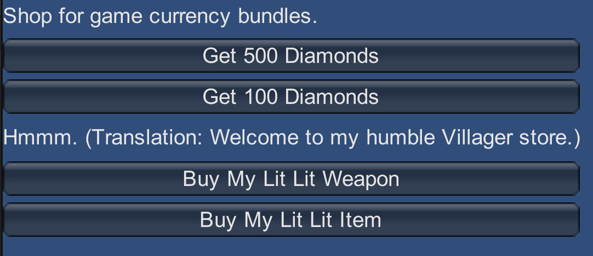  

The IAP purchase is initiated. Follow the Google Play instruction up to the point where purchase is successful.

  

Finally, navigate to your title in the PlayFab **Game Manager** dashboard and locate **New Events**.

Verify the purchase was provided, validated, and piped to the PlayFab ecosystem.

You have successfully integrated UnityIAP and the Android Billing API into your PlayFab application!

## Next Steps

1. Build a Unity UI Toolkit interface for purchasing to replace the demo IMGUI display.
1. Create a custom Unity Logger to handle PlayFab errors and display them to the user.
1. Add icon images to your PlayFab Items Images field to display in the Unity UI.
