One of the first scenarios we wanted to cover with the Economy V2 Catalog was managing multiple in-game vendors. The inspiration here was Sea of Thieves, and the way they build engagement with various characters and factions within the game representing different shops and characters you can interact with. In this article, I will show you how to use PlayFab's catalog, Game Manager, the PlayFab SDK, Tags, and the search API to create multiple in-game vendor displays.

<div align="center">
    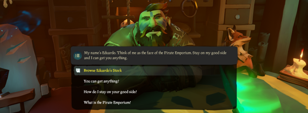
</div>

## Setting up your Catalog items using Game Manager
This first step is relatively simple and can be done using Game Manager. Navigate to your Title Settings in Game Manager, then to the Economy V2 tab.

<div align="center">
    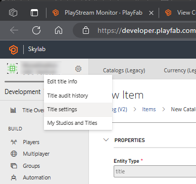
</div>

Under Economy V2, we will create a set of Tags for our In-Game Vendors. These can be whatever you want but in our case we are going to have an Item, Sword, and Pistol vendor, so those are also the names of the tags we will use.

<div align="center">
    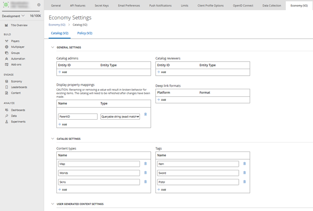
</div>

Save your configuration, then Navigate to Economy -> Catalog V2 -> Currency, click the New Currency button and use the form to create a new currency. You can name the currency whatever you want (we are calling ours Gold) but take note of your Currency ID because we will be using that later.   

<div align="center">
    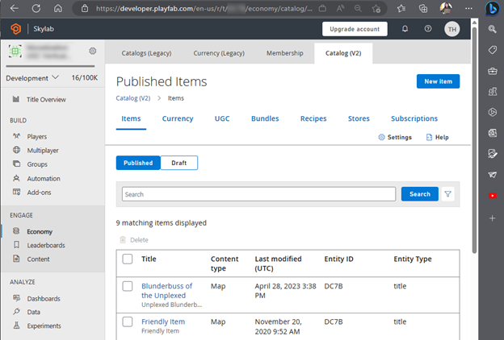
</div>

Now you can create items using both the Currency and the Tags. 
Navigate to Economy -> Catalog V2 -> Items. 

<div align="center">
    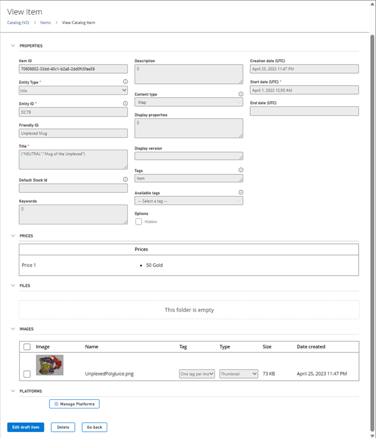
</div>

From here you can create new items using both the Gold Currency and the various search Tags. We are also adding small, 100x100 pixel Thumbnail images to the item for display in game. You also can specify various metadata here such as type, localized title and description, content type, or customized display properties. You can also upload other images or content for your items. 
For the purposes of this demo and testing, we created 2 items of each type.

## Using the PlayFab Unity SDK to make a Client Call
We will be building from the instructions and code sample here [Unity3D quickstart - PlayFab | Microsoft Learn]. You will want to follow these steps closely to:

 * Download and install the PlayFab SDK
 * Set your initial title settings in your Unity client
 * Make your first API call

After you are able to install and set up your first client call into PlayFab move onto the next set of steps.

## Fetching catalog items using a Seach query
We are going to create a new script to queue up our calls to our Catalog. I’m calling this CatalogCaller.cs. After creating the script I’ll attach it to an empty GameObject (calling this PlayFabManager) in my Unity scene to make it available to the UX when I need it. This is also where I placed the PlayFabLogin script.

<div align="center">
    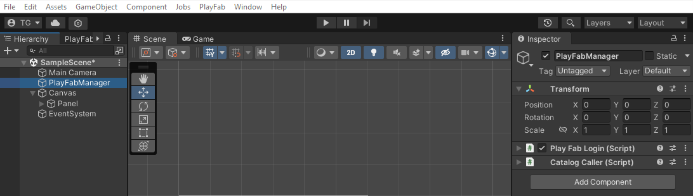
</div>

We need to add some libraries to CatalogCaller so that we can understand PlayFab’s native Economy Models, and leverage Unity’s lists, UI (user interfaces), TextMeshPro and network calling library.
```csharp
using PlayFab;
using PlayFab.ClientModels;
using UnityEngine;
using PlayFab.EconomyModels; //For economy call parsing
using UnityEngine.UI; //For updating images in the UI
using UnityEngine.Networking; //For fetching URLs
using System.Collections; // For the version of IEnumerator we want to use
using System.Collections.Generic; // To leverage Unity's lists and dictionaries
using TMPro; //To programmatically update textmesh pro items in the UX
```
We also want to make some declarations at the top of the class – two unity GameObject arrays for holding images and text, and a placeholder to help us hold onto the Item price. 
```csharp
public string priceAmount = ""; //Placeholder used to pass prices around
public GameObject[] guiThumbs = new GameObject[4]; //Images
public GameObject[] guiPrices = new GameObject[4]; //Prices
```
In Unity we want to create a vendor store view with Sea of Thieves as the inspiration.

<div align="center">
    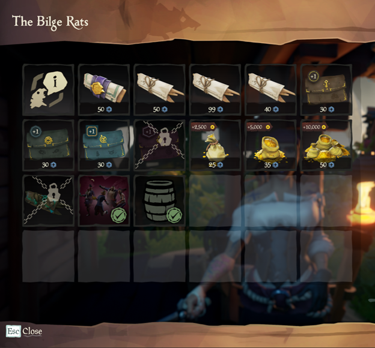

</div>

This is a fairly clean interface with a set of thumbnail images and prices. To replicate this, I’ve created a Unity Prefab item called ‘StoreListing’ which is a simple Canvas Panel with a Button/Raw Image component and a Text (TextMeshPro) component.

<div align="center">
    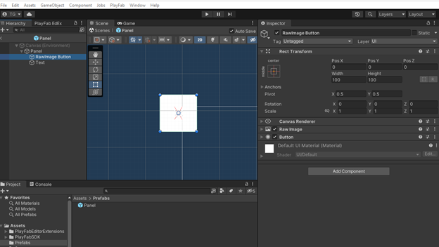

</div>

In the scene I set up a Unity Canvas with a Panel that holds a set of these StoreListing prefabs. I then populate my custom script arrays (GUI Thumbs and GUI Prices) with each StoreListing’s RawImage and Text objects so that we will have them at runtime to populate.

<div align="center">
    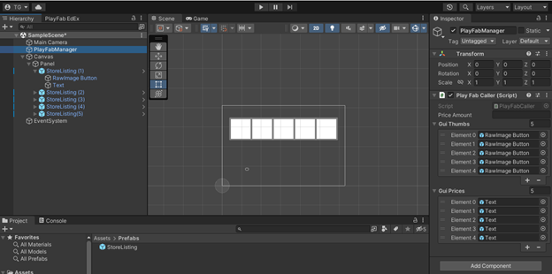

</div>

We will also add some simple buttons to use for calling the catalog functions, one for each type (Items, Swords, and Pistols).

<div align="center">
    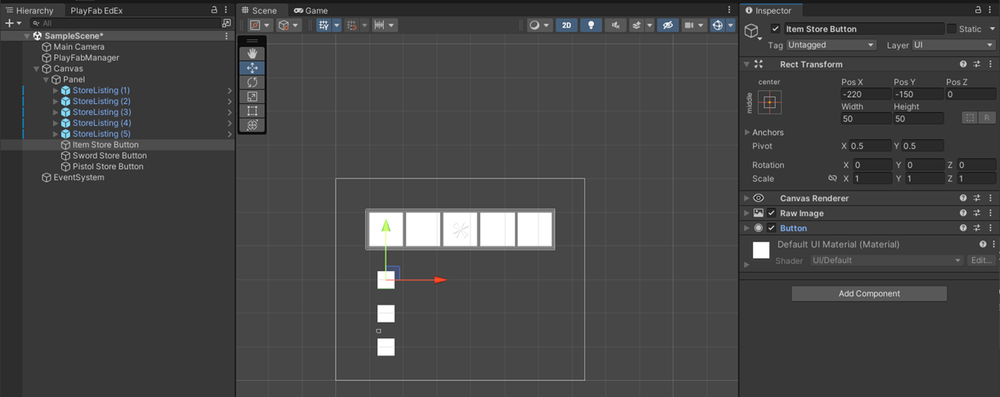

</div>

With all of this in place we can now do some real coding. We need a public function for calling the catalog, se create a SwordCatalogCaller() function. We set up a new SearchItemsRequest using Filter to look solely for items with the sword Tag inside this function. We will also add ordering this by Last Modified date so that we get the most recent items first and limit the count to 10. 
We then then a search call items with this request and call with new custom methods for success and failure.
```csharp
public void SwordCatalogCaller()
{
   var catalogRequest = new SearchItemsRequest 
   { 
       Filter = "Tags/any(t: t eq 'Sword')", 
       OrderBy = "lastModifiedDate asc",
       Count = 10 
   };

    PlayFabEconomyAPI.SearchItems(catalogRequest, OnCatalogFetchRequestSuccess, OnCatalogFetchRequestFailure);
}


private void OnCatalogFetchRequestFailure (PlayFabError error)
{
    Debug.Log("Waw wah wah....");
    Debug.Log(error);
}

private void OnCatalogFetchRequestSuccess (SearchItemsResponse result)
{
    Debug.Log("Whoop - search items response received");

    if(result != null)
    {
        //Do Something
    }
}
```
## Parsing the Catalog Search Call
So now we can call search and get a result. We need to parse that result by making updates to OnCatalogFetchRequestSuccess. First, we will create a list to hold our CatalogItems, explicitly using EconomyModels so that we don’t conflict with Legacy V1:
```csharp
//explicitly using EconomyModels so we dont conflict with Legacy V1
List<PlayFab.EconomyModels.CatalogItem> thisList = result.Items; 
```
Then we need to create a loop through that run through that list.
```csharp
for (int i = 0; i < thisList.Count; i++) //Iterate through all of the returned catalog items 
{
}
```
Within our loop, we add an if statement to double check that any given item has both an image and a price before we proceed. 
```csharp
if (thisList[i].Images != null & thisList[i].PriceOptions.Prices != null)
{
} 
```
If an item gets this far, we want to get the actual price. Since Items in PlayFab can have multiple prices, the object model holds them within their own class and a nested list. This can be tricky to parse in the SDK. We do it here using nested loops. We are also only grabbing the “Gold” prices referencing the ItemID from our Currency definition we grabbed earlier when creating the currency in Game Manager. We assign the price to our Price List in this iteration of our for loop.
```csharp
foreach (PlayFab.EconomyModels.CatalogPrice price in pricingList)
{
    List<PlayFab.EconomyModels.CatalogPriceAmount> pricingAmounts = price.Amounts;
    foreach (PlayFab.EconomyModels.CatalogPriceAmount listprice in price.Amounts)
    {
        if (listprice.ItemId == "c0cf70d1-5112-445f-8521-817d3547cae4")
        {
            priceAmount = listprice.Amount.ToString() + " Gold";
        }
    }
}
```
Now that we have a price we need the image. We follow a similar pattern by pulling the images into a list:
```csharp
List<PlayFab.EconomyModels.Image> imageList = thisList[i].Images;
```
Then we double check that we are dealing with a Thumbnail URL and if so, call a Coroutine that will fetch the image and populate the UX (we will put together the Coroutine in the next section). 
```csharp
foreach (PlayFab.EconomyModels.Image imageRef in imageList)
{
    if (imageRef.Type == "Thumbnail")
    {
    StartCoroutine(UseMyImage(imageRef.Url, priceAmount, i)); 
    }
}
```
Altogether OnCatalogFetchRequest now looks like this:
```csharp
private void OnCatalogFetchRequestSuccess (SearchItemsResponse result)
{
        Debug.Log("Whoop - search items response received");
//explicitly using EconomyModels so we dont conflict with V1
List<PlayFab.EconomyModels.CatalogItem> thisList = result.Items; 
//Iterate through all the returned catalog items
for (int i = 0; i < thisList.Count; i++) 
{ 
   if (thisList[i].Images != null & thisList[i].PriceOptions.Prices != null) 
   {
   	List<PlayFab.EconomyModels.Image> imageList = thisList[i].Images;
   	List<PlayFab.EconomyModels.CatalogPrice> pricingList = thisList[i].PriceOptions.Prices;
   	foreach (PlayFab.EconomyModels.CatalogPrice price in pricingList)
                    {
                         List<PlayFab.EconomyModels.CatalogPriceAmount> pricingAmounts = price.Amounts;
                         foreach (PlayFab.EconomyModels.CatalogPriceAmount listprice in price.Amounts)
                        {
                            if (listprice.ItemId == "c0cf70d1-5112-445f-8521-817d3547cae4")
                            {
                                priceAmount = listprice.Amount.ToString() + " Gold";
                            }
                        }
                    }
                     //grab the thumbnail URL to fetch and the Gold Price for our display
                     foreach (PlayFab.EconomyModels.Image imageRef in imageList)
                    {
                        if (imageRef.Type == "Thumbnail")
                        {
                            StartCoroutine(UseMyImage(imageRef.Url, priceAmount, i)); 
                        }
                    }
                }
    }
}
```
## Fetching the Thumbnails and Populating the Unity UI

The final part of this is to use Unity’s IEnumerator coroutine to download the actual Thumbnail images and populate our UI. We start with a method declaration that gets the Thumbnail URL, Price as a string, and an integer that marks the item placement from the caller. We declare a texture to use and make a get texture request using the URL.
```csharp
public IEnumerator PopulateMyStoreItem(string ItemUrl, string ItemPrice, int ItemPosition)
{
Texture2D tex = new Texture2D(100,100);
UnityWebRequest request = UnityWebRequestTexture.GetTexture(ItemUrl);
```
Then we move to a SendWebRequest and look for failures in the result. If everything works out, we grab the content and push it into the Item using the arrays we initially declared and the item’s position in them. 
```csharp
yield return request.SendWebRequest(); 
        if(request.result == UnityWebRequest.Result.ConnectionError)
        {
            Debug.Log("WebRequest Failed");
            Debug.Log(request.error);
        }
        else
        {
            tex = DownloadHandlerTexture.GetContent(request);
            if (tex != null)
            {
                Debug.Log("downloaded Valid Texture - URI: " + ItemUrl.ToString()); 
                Debug.Log("downloaded Valid Texture - attmepting to put it into UX"); 
                guiThumbs[ItemPosition].GetComponent<RawImage>().texture = tex;
                guiPrices[ItemPosition].GetComponent<TMP_Text>().text = ItemPrice;
            }

            
        }
```
Now we just need to add the function to one of our buttons. Drag the PlayFabManager onto the the button runtime only field, and choose the ItemCatalogCaller function. 

<div align="center">
    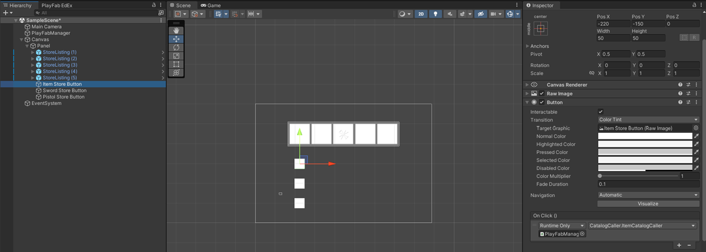

</div>

We now have a button that will pull the content for our Item vendor into our Canvas for display. 

<div align="center">
    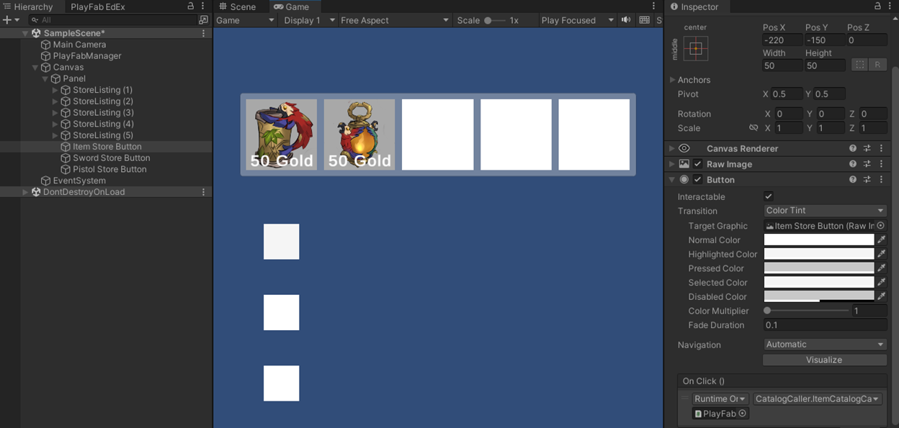

</div>

To update this to work for a different vendor we just need change our SearchItemsRequest. I can create a couple new search queries with copy past to look for different tags:
```csharp
public void SwordCatalogCaller()
    {
        var catalogRequest = new SearchItemsRequest 
        { 
            Filter = "Tags/any(t: t eq 'Sword')", 
            OrderBy = "lastModifiedDate asc",
            Count = 10 
        };

         PlayFabEconomyAPI.SearchItems(catalogRequest, OnCatalogFetchRequestSuccess, OnCatalogFetchRequestFailure);
    }

    public void ItemCatalogCaller()
    {
        var catalogRequest = new SearchItemsRequest 
        { 
            Filter = "Tags/any(t: t eq 'Item')", 
            OrderBy = "lastModifiedDate asc",
            Count = 10 
        };

         PlayFabEconomyAPI.SearchItems(catalogRequest, OnCatalogFetchRequestSuccess, OnCatalogFetchRequestFailure);
    }

    public void PistolCatalogCaller()
    {
        var catalogRequest = new SearchItemsRequest 
        { 
            Filter = "Tags/any(t: t eq 'Pistol')", 
            OrderBy = "lastModifiedDate asc",
            Count = 10 
        };

         PlayFabEconomyAPI.SearchItems(catalogRequest, OnCatalogFetchRequestSuccess, OnCatalogFetchRequestFailure);
    }
```
And we are done! The final version of the CatalogCaller script should look like this:
```csharp
using PlayFab;
using PlayFab.ClientModels; //For login
using UnityEngine;
using PlayFab.EconomyModels; //For economy call parsing
using UnityEngine.UI; //For calling into the UX
using UnityEngine.Networking; //For fetching URIs
using System.Collections; // For the version of IEnumerator we wnat to use
using System.Collections.Generic; // To leverage Unity's lists and dictionaries
using TMPro; //To programatically update textmesh pro items

public class CatalogCaller : MonoBehaviour
{

    public string priceAmount = ""; //String Placeholder used to pass the prices around
    public GameObject[] guiThumbs = new GameObject[4]; //UX Images
    public GameObject[] guiPrices = new GameObject[4]; // UX Prices


    public void SwordCatalogCaller()
    {
        var catalogRequest = new SearchItemsRequest 
        { 
            Filter = "Tags/any(t: t eq 'Sword')", 
            OrderBy = "lastModifiedDate asc",
            Count = 10 
        };

         PlayFabEconomyAPI.SearchItems(catalogRequest, OnCatalogFetchRequestSuccess, OnCatalogFetchRequestFailure);
    }

    public void ItemCatalogCaller()
    {
        var catalogRequest = new SearchItemsRequest 
        { 
            Filter = "Tags/any(t: t eq 'Item')", 
            OrderBy = "lastModifiedDate asc",
            Count = 10 
        };

         PlayFabEconomyAPI.SearchItems(catalogRequest, OnCatalogFetchRequestSuccess, OnCatalogFetchRequestFailure);
    }

    public void PistolCatalogCaller()
    {
        var catalogRequest = new SearchItemsRequest 
        { 
            Filter = "Tags/any(t: t eq 'Pistol')", 
            OrderBy = "lastModifiedDate asc",
            Count = 10 
        };

         PlayFabEconomyAPI.SearchItems(catalogRequest, OnCatalogFetchRequestSuccess, OnCatalogFetchRequestFailure);
    }

    private void OnCatalogFetchRequestSuccess (SearchItemsResponse result)
    {
        Debug.Log("Whoop - search items response received");

         List<PlayFab.EconomyModels.CatalogItem> thisList = result.Items; //explicitly using EconomyModels so we dont conficlit with Legacy V1
            for (int i = 0; i < thisList.Count; i++) //Iterate through all of the returned catalog items
            { 
                if (thisList[i].Images != null & thisList[i].PriceOptions.Prices != null) 
                {
                    List<PlayFab.EconomyModels.Image> imageList = thisList[i].Images;
                     
                    List<PlayFab.EconomyModels.CatalogPrice> pricingList = thisList[i].PriceOptions.Prices;
                     
                    foreach (PlayFab.EconomyModels.CatalogPrice price in pricingList)
                    {
                         List<PlayFab.EconomyModels.CatalogPriceAmount> pricingAmounts = price.Amounts;
                         foreach (PlayFab.EconomyModels.CatalogPriceAmount listprice in price.Amounts)
                        {
                            if (listprice.ItemId == "c0cf70d1-5112-445f-8521-817d3547cae4")
                            {
                                priceAmount = listprice.Amount.ToString() + " Gold";
                            }
                        }
                    }

                     //grab the thumbnail URL to fetch and the Gold Price for our display
                     foreach (PlayFab.EconomyModels.Image imageRef in imageList)
                    {
                        if (imageRef.Type == "Thumbnail")
                        {
                            StartCoroutine(PopulateMyStoreItem(imageRef.Url, priceAmount, i)); //coroutine for web request fetch
                        }
                    }

                }
            }

        if(result != null)
        {
            
            foreach (PlayFab.EconomyModels.CatalogItem item in thisList)
            {
                 Debug.Log("Found an item!");
                 if (item.ContentType != null)
                 {
                    Debug.Log("item Content Type: " + item.ContentType.ToString());
                 }
                 if (item.Id != null)
                 {
                    Debug.Log("item ID: " + item.Id.ToString()); //note casing here - its tricksy
                 }
                 if (item.DisplayProperties != null)
                 {
                   Debug.Log("item DisplayProperties: " + item.DisplayProperties.ToString()); 
                 }
                 if (item.Description != null)
                 {
                    foreach(KeyValuePair<string, string> itemDescription in item.Description)
                    Debug.Log("item Description: " + itemDescription.ToString()); 
                 }
                if (item.Title != null)
                 {
                    foreach(KeyValuePair<string, string> titleString in item.Title)
                    Debug.Log("item Title: " + titleString.ToString()); 
                 }
                 if (item.ItemReferences != null)
                 {
                    List<PlayFab.EconomyModels.CatalogItemReference> itemReferenceList = item.ItemReferences;
                    foreach (PlayFab.EconomyModels.CatalogItemReference itemRef in itemReferenceList)
                    {
                         Debug.Log("item Reference Found: "); 
                    }
                 }
                 if (item.Images != null)
                 {
                    List<PlayFab.EconomyModels.Image> imageList = item.Images;
                    foreach (PlayFab.EconomyModels.Image imageRef in imageList)
                    {
                        Debug.Log("item image Found: "); 
                        Debug.Log("Item image ID: " + imageRef.Id);
                        Debug.Log("Item image TAG: " + imageRef.Tag);
                        Debug.Log("Item image Type: " + imageRef.Type);
                        Debug.Log("Item image URL: " + imageRef.Url);
                    }
                 }
                 if (item.PriceOptions.Prices != null)
                 {
                    Debug.Log("Prices Exist!" + item.PriceOptions.Prices.ToString());
                    List<PlayFab.EconomyModels.CatalogPrice> pricingList = item.PriceOptions.Prices;

                    Debug.Log("Pricing List Length is" + pricingList.Count.ToString());

                    foreach (PlayFab.EconomyModels.CatalogPrice price in pricingList)
                    {
                        Debug.Log("Catalog Price Found: " + price.ToString());

                        List<PlayFab.EconomyModels.CatalogPriceAmount> pricingAmounts = price.Amounts;
                        Debug.Log("Catalog Price AmountFound: " + pricingAmounts.ToString());

                        foreach (PlayFab.EconomyModels.CatalogPriceAmount listprice in price.Amounts)
                        {
                            Debug.Log("Catalog Price CRAPPPPPPP@!!@: " + listprice.ItemId.ToString());
                            Debug.Log("Catalog Price CRAPPPPPPP@!!@: " + listprice.Amount.ToString());
                        }
                    }
                 }
            }
            
        }
        else 
        {
            Debug.Log("Waw wah wah....");
        }
    }

    public IEnumerator PopulateMyStoreItem(string ItemUrl, string ItemPrice, int ItemPosition)
    {
        Texture2D tex = new Texture2D(100,100);

        UnityWebRequest request = UnityWebRequestTexture.GetTexture(ItemUrl);
        yield return request.SendWebRequest(); 
        if(request.result == UnityWebRequest.Result.ConnectionError)
        {
            Debug.Log("WebRequest Failed");
            Debug.Log(request.error);
        }
        else
        {
            tex = DownloadHandlerTexture.GetContent(request);
            if (tex != null)
            {
                Debug.Log("downloaded Valid Texture - URI: " + ItemUrl.ToString()); 
                Debug.Log("downloaded Valid Texture - attmepting to put it into UX"); 
                guiThumbs[ItemPosition].GetComponent<RawImage>().texture = tex;
                guiPrices[ItemPosition].GetComponent<TMP_Text>().text = ItemPrice;
            }

            
        }
    }

    private void OnCatalogFetchRequestFailure (PlayFabError error)
    {
        Debug.Log("Waw wah wah....");
        Debug.Log(error);
    }

}
```


