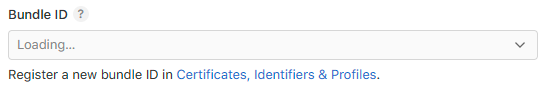
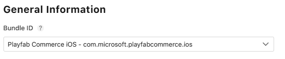
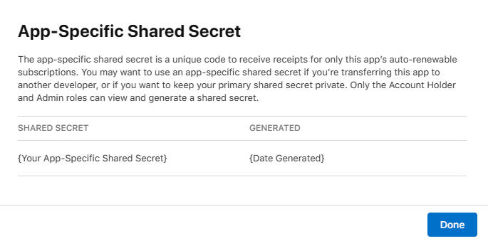
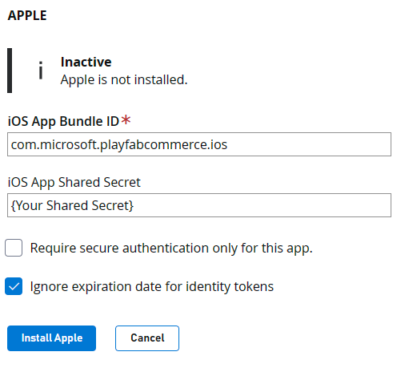

# Marketplace integration: Apple

This tutorial shows you how to successfully integrate an Apple App Store application into your Title in Game Manager.

## Prerequisites

1. Access to [App Store Connect](https://appstoreconnect.apple.com/).
2. An app already [created](https://developer.apple.com/help/app-store-connect/create-an-app-record/add-a-new-app) in the **App Store Connect**.
3. A Title created in [Game Manager](https://developer.playfab.com/).

## Step 1: Get the iOS App Bundle ID

The **iOS App Bundle ID** is a unique identifier for your app on the App Store. Used to differentiate your app from other on the platform, and is typically in a reverse-DNS format, such as `com.yourcompany.yourappname`. The bundle ID is often generated when creating an app for the first time by following the [Certificates, Identifiers & Profiles](https://developer.apple.com/account/resources/identifiers/bundleId/add/bundle) link part of the create-an-app window.

To get the **iOS App Bundle ID** for your app, go into the [Apps section](https://appstoreconnect.apple.com/apps) of the **App Store Connect** and select your desired app. For this tutorial, we have an app already created called `PlayFabCommerce_IOS`. Once selected, you see the general app overview page, from where you should navigate to **App Information** under **General** on the left navigation menu.

This displays your app's general information, from where you find your **iOS App Bundle ID** under the **General Information** section. Remember, the ID is the text following a reverse DNS format. In this case, it's `com.microsoft.playfabcommerce.ios`.

## Step 2: Get the App-Specific Shared Secret

The **App-Specific Shared Secret** is another unique code used to verify receipts for the app's autorenewable subscriptions or in-app purchases. You can read more about it in [Apple's documentation](https://developer.apple.com/help/app-store-connect/configure-in-app-purchase-settings/generate-a-shared-secret-to-verify-receipts). 

To get your app's **App-Specific Shared Secret**, navigate to the **App Information** section under **General** for your desired app. Such as what we did in [Step 1](#step-1-get-the-ios-app-bundle-id). Scroll down to the **App-Specific Shared Secret** section and select **Manage**.

This displays a window with your **App-Specific Shared Secret** alongside the date it was generated.

> [!NOTE]
> Only users with the Account Holder and the Admin roles can view and generate a shared secret.

## Step 3: Link to PlayFab through Game Manager

Now that you have both your **iOS App Bundle ID** and your **App-Specific Shared Secret**. It's time to link it to your **Title** in PlayFab's [Game Manager](https://developer.playfab.com/).

1. Open [Game Manager](https://developer.playfab.com/) and select your **Title**.

2. Once inside your Title screen, select the **Add-ons** option from the left navbar.

3. Search for and select the **Apple** option.

4. On the right side of the screen, select the **Install Apple** button, which displays a set of information you must include before completing the integration.

5. For the **iOS App Bundle ID** use the ID obtained from [Step 1](#step-1-get-the-ios-app-bundle-id) and for the **iOS App Shared Secret** use the secret value obtained from [Step 2](#step-2-get-the-app-specific-shared-secret).

    

6. Press **Install Apple**. It validates your data and, if successful, changes the notice above the fields you just completed to **Apple is installed**.