# Marketplace integration: Google

This tutorial shows you how to successfully integrate a Google Play application into your title in Game Manager.

## Prerequisites

1. A Google Account.
2. An app in the [Google Play Console](https://play.google.com/console/developers).
3. Access to [Google Cloud](https://cloud.google.com/).
4. An existing Google Cloud project.

## Step 1: Create a service account

The first step you need to complete is creating a service account. This is done through the [Google Cloud Platform](https://cloud.google.com/) (GCP).

1. From the top navigation bar, select the menu button on the top left corner.

2. Select **IAM & Admin**, then **Service Accounts**.

3. From the top of the page, select **Create Service Account**.

    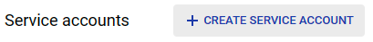

4. Fill out the service account details, then select **Create and Continue**.

    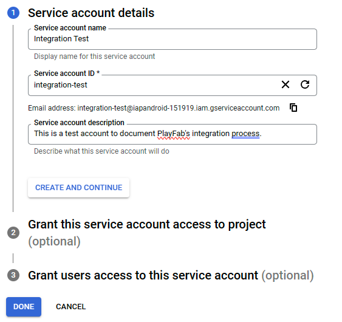

5. Grant access to the new service account from the **Select a role** dropdown options by looking for **Service Account Actor**.

    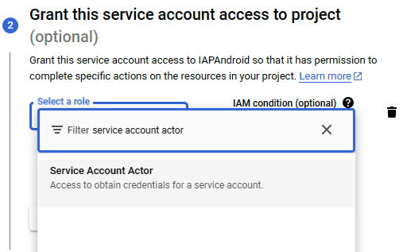

6. Press **Done** (you can skip the **Grant users access to this service account** step).

Once the Service Account is created, you're directed back to the **Service Accounts** page that shows a list of all the service accounts under the specified project.

### Add permissions to an existing service account

This substep intends to show you how to add the project permissions to an existing Service Account, or if you missed adding the permissions when creating an account.

1. Go into the **IAM & Admin** section in GCP from the top left navbar menu.

2. Select **Grant Access** from the start of the list of Service Accounts.

    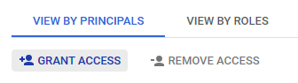

3. Select the desired service account in the **New principals** box. It searches for your Service Account title through all existing service accounts in the project, prompting you to select the specific option corresponding to the desired service account.

    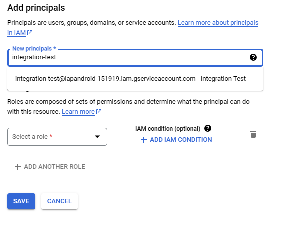

4. Assign the **Service Account Actor** role by searching for it in the **Select a role** dropdown.

5. Press **Save**.

## Step 2: Get account credentials

Once you have your **Service Account** created and available, the next step is to get a JSON file that contains your **Private Key** (Credentials) which are to be added to your **Title** in **Game Manager**. To do this, follow the next steps:

1. From [GCP](https://cloud.google.com/), open the left navbar menu and under **IAM & Admin** choose **Service Accounts**.

2. This loads the list of all service accounts under the current project. Look for the one you want to get credentials from and select it. (In this case, our service account is called **Integration Test**, hence it shows up as "integration-test@.....").

    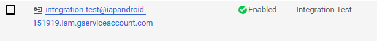

3. You're shown a screen with your service account details alongside tabs on the upper part of the screen, select the **Keys** tab.

4. Select **Add Key** > **Create new key**.

5. Select **JSON** as your **Key type** and press **Create**.

6. This downloads a .json file to your computer. Open it and make sure you have the **Private Key**.

    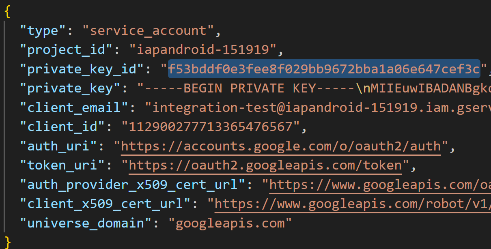

> [!NOTE]
> Ensure you properly and securely save that JSON file to protect your data, you will need to use it later in this tutorial.

## Step 3: Link to Google Play Console

It's time to move on to the [Google Play Console](https://play.google.com/console/developers) to link your newly created credentials with your game.

> [!NOTE]
> This step assumes you have completed the prerequisite of already having an app created and ready in the Google Play Console. If you don't have it, this is the time to create it.

1. Open the [Google Play Console](https://play.google.com/console/developers).

2. From the left navigation menu, select **Users and permissions**.

3. On the right-hand side of the screen, select **Invite new users**.

    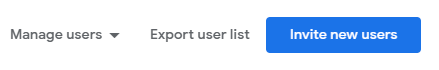

4. In the Email address field, add the email address of your service account from GCP. It should look something like this: `integration-test@iapandroid-151919.iam.gserviceaccount.com`.

5. You see some tabs in the **Permissions** section, the **App permissions** should be selected by default. Select the **Add app** option.

    

6. From the list of apps, choose the one you want your account to be linked to. In this case, it's **Economy V2 Playfab Test App**. Once selected, press **Apply**.

    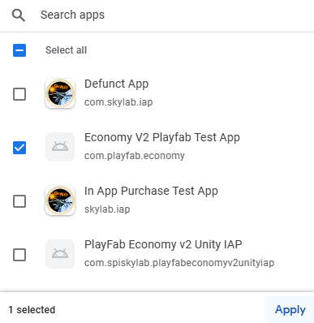

7. A window pops up asking you to specify the type of permissions you want to give that account in your app. Choose **Manage orders and subscriptions** under **Financial data** and then press **Apply**.

8. You're redirected to the **Invite user** screen again (where you added the account's email address and set the app permissions). But this time, you should press **Invite user** at the bottom right of the screen. Then press the **Send invite** confirmation message.

    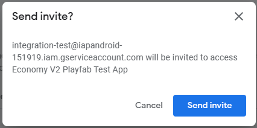

Once the invite was sent, you're able to see your service account under the **Users** list in the **Users and permissions** screen.

## Step 4: Link to PlayFab through Game Manager

Now that your service account was created in **Google Cloud Platform** and successfully linked to your app in the **Google Play Console**. It's time to link it to your studio and your game in PlayFab's **Game Manager**.

1. Open [Game Manager](https://developer.playfab.com/) and select your **Title**.

2. Once inside your Title screen, select the **Add-ons** option from the left navigation menu.

3. Search for and select the **Google** option.

4. On the right side of the screen, select **Install Google**, which displays a set of information you must include before completing the integration.

5. For the **Google App package ID** you should use one from the **Google Play Console**, in our case it's: `com.playfab.economy`, the rest of the fields for this example are optional. The only other required field is the **Service Account Key** field, in which you should paste the contents of the JSON file gotten from the **Google Cloud Platform**.

    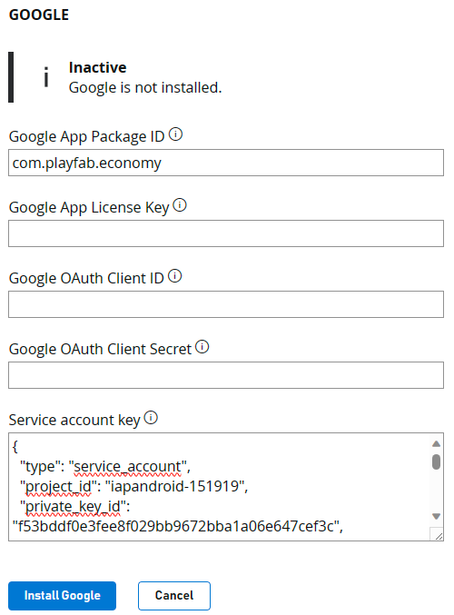

6. Press **Install Google**. This validates the data you input in the previous step and you notice that the service account key was simplified and just shows the **Private Key Id**.

## Next steps

- [Set up a PlayFab bundle that can be purchased from Google Play Store](../marketplace-redemption/google.md)
