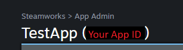
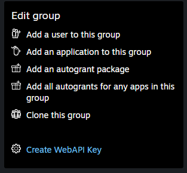
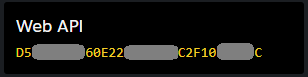

# Marketplace integration: Steam

This tutorial shows you how to successfully integrate a Steam application into your title in Game Manager.

## Prerequisites

1. A [SteamWorks Partner](https://partner.steamgames.com/) account.
2. An app already created in Steamworks.
3. A Title already created in [Game Manager](https://developer.playfab.com).
4. A [SteamWorks Group](https://partner.steamgames.com/doc/gettingstarted/managing_users#5) already created with your desired Admin Members and Application.

## Step 1: Get your Steam Application ID

To integrate your Steam application into Game Manager, you need to obtain your **Steam Application ID**. Follow these steps:

1. Sign in to your [SteamWorks Partner](https://partner.steamgames.com/) account.
2. Navigate to **Apps & Packages** > **All Applications**.
3. Select your desired app from the list.
4. Your **Steam Application ID** can be obtained from either:
    - The URL: https://partner.steamgames.com/apps/landing/**{Your Application ID}**
    - Right next to name of your app's title (in this example, the app's title is "TestApp")

        

Once you obtained your **Steam Application ID**, proceed to the next step to obtain your **Steam WebAPI Key**.

## Step 2: Obtain your SteamWeb API Key

To integrate your Steam application into Game Manager, you also need to obtain your **Steam Web API Key**.

1. Sign in to your [SteamWorks Partner](https://partner.steamgames.com/) account.
2. Navigate to **Users & Permissions** > **Manage Groups**.
3. Select your desired Group.
4. If no **WebAPI Key** was generated before, select **Generate WebAPI Key** from the menu on the right.
    - This generates a new **WebAPI Key** and display it just below the previously selected button.

    

5. If a **WebAPI Key** was previously generated, copy the key from the **Web API** box on the right.

    

Once you obtained your **Steam WebAPI Key**, proceed to the next step of enabling the Steam Add-on in Game Manager.

## Step 3: Enable the Steam Add-on in Game Manager

After getting your **Steam Application ID** and your **Steam WebAPI Key**, you need to enable the Steam Add-on in [Game Manager](https://developer.playfab.com).

1. Sign in to your [Game Manager](https://developer.playfab.com) account.
2. Navigate to the **Add-ons** section on the left navigation menu.
3. Select the **Steam Add-on**.
4. Select **Install Steam**.
5. Add your **Steam Application ID** and your **Steam Web API Key**.
6. Select **Install**.

## See also

- [How to successfully integrate an Apple app into Game Manager](../marketplace-integrations/apple.md)
- [How to successfully integrate a Google app into Game Manager](../marketplace-redemption/google.md)
