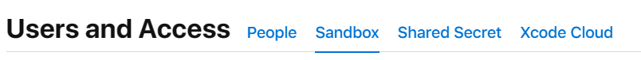
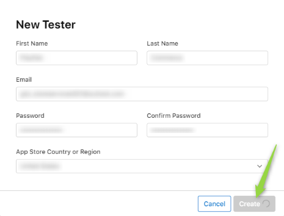
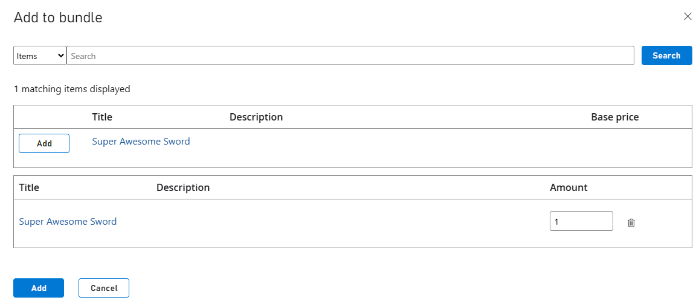
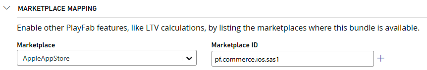
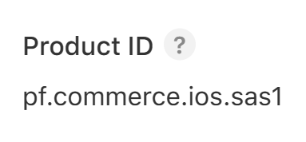
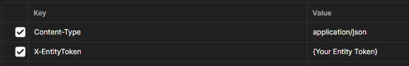

# Set up a PlayFab subscription that can be purchased from the Apple App Store

> [!NOTE]
> IOS Subscription Redemption is currently in **Private Preview**. For access to this feature, send an email to **PFEconomyPreviews@microsoft.com** with the subject **PlayFab Mobile Subscriptions** along with your PlayFab Title ID and we will enable the feature in your environment.
> 
This tutorial shows you how to successfully create a PlayFab subscription, add it to your game in the Apple App Store for players to purchase, and how to redeem the items contained in it.

## Prerequisites

1. A Title in PlayFab [Game Manager](https://developer.playfab.com/).
2. An existing [integration between the selected Title in PlayFab and the Apple App Store](../marketplace-integrations/apple.md).
3. Access to [App Store Connect](https://appstoreconnect.apple.com/).
4. An app already [created](https://developer.apple.com/help/app-store-connect/create-an-app-record/add-a-new-app) in the **App Store Connect**.
5. An [In-App Purchase](https://developer.apple.com/help/app-store-connect/manage-in-app-purchases/create-consumable-or-non-consumable-in-app-purchases/) created within your **App** in the **App Store Connect**. Your **In-App Purchase** should include [Pricing](https://developer.apple.com/help/app-store-connect/manage-in-app-purchases/set-a-price-for-an-in-app-purchase) and [Localization](https://developer.apple.com/documentation/appstoreconnectapi/app_store/in-app_purchase/in-app_purchase_localizations).
6. A [Payment Queue](https://developer.apple.com/documentation/storekit/skpaymentqueue) with its corresponding [Transaction Observer](https://developer.apple.com/documentation/storekit/in-app_purchase/original_api_for_in-app_purchase/setting_up_the_transaction_observer_for_the_payment_queue) already part of your app.

## Step 1: Create test users

In order for you to properly test a purchase without incurring in real-money payments, start by creating a test user for your app.

1. Navigate to the [App Store Connect](https://appstoreconnect.apple.com/) > **Users and Access**.
2. Select **Sandbox**.

    

3. Select the plus sign (**+**) button next to **Test Accounts**.
4. Fill the form and select **Create**.

    

## Step 2: Create a Subscription in Game Manager

> [!NOTE]
> Before creating a subscription in **Game Manager**, ensure that you have already created and published the items you want to add to the bundle in your Catalog. In this tutorial, we assume that you have already created a PlayFab catalog item called the **Super Awesome Sword**. If you need guidance on how to create an item, please refer to [this step](../craftingGame/crafting-game-game-manager.md#step-4---create-your-first-item). 

1. Go to [Game Manager](https://developer.playfab.com/) and navigate to your **Title**.
2. From the left navigation menu, choose **Engage** > **Economy**.
3. Select the **Subscriptions** .

    

4. Select **New Subscription**.
5. Add any information you want to the **Subscription**, such as items and prices. In this tutorial, use **The Super Awesome Sword Subscription** as the name.
6. Scroll down to the end of the page and select **Save and publish** if you want it to be redeemable by players right away. Select "Save as draft" if you want to publish it at a later date.

    

### Add an item to your Subscription

A subscription by itself doesn't grant access of any items to a player. We need to link items to it so that the player inventory is aware of what items that player has access.

To add items to your subscription, follow these steps:

1. Go to the **Items** section in edit mode.
2. Select **Add**. A window appears showing all your catalog items.
3. You can filter by type or search for a specific item.
4. Find our **Super Awesome Sword** and select **Add** next to it.
5. Finally, select the **Add** button at the bottom.

This adds the item to your subscription.



## Step 3: Enable marketplace mapping

To ensure that, when a player purchases a subscription from your app, it gets properly purchased and assigned in Game Manager, you must configure the **Marketplace Mapping**. This can be done while creating your subscription in Game Manager or by going back to the subsription in **Edit mode** after it has been created.

1. Navigate to your subsription in edit mode.
2. Scroll down to the **Marketplace Mapping** section.
3. From the **Marketplace** dropdown, select your desired marketplace. (For this tutorial, it's **AppleAppStore**).
4. For your **Marketplace ID**, make sure to use the same as your **Product ID** in the **App Store Connect**. In this tutorial, we used **pf.commerce.ios.sas1**.
5. To finish, select the **+** at the right side of that row and **Save** your changes.



## Step 4: Make a purchase

> [!TIP]
> To find out more about this topic, see [In-App Purchases](https://developer.apple.com/design/human-interface-guidelines/in-app-purchase).
> 
> For an overview on how to configure In-App Purchases, see [Apple's Developer Documentation](https://developer.apple.com/help/app-store-connect/configure-in-app-purchase-settings/overview-for-configuring-in-app-purchases/).

Now you have your **IAP** created in the **App Store Connect**, your **Subscription** configured with **Item**(s) in **Game Manager**, and the **Marketplace Mapping** of your **Subscription** set up. Let's move on to purchasing the subscription from your **App**.

After you have your IAP item exposed and purchasable from your app, you can use the **Test User** we created in [Step 1](#step-1-create-test-users) to purchase your IAP on your app. Once this is complete, Apple's API should return a **receipt** which you have to then use with PlayFab's redemption API to validate the purchase and ensure access to the **subscription** to the player.

## Step 5: Redeem your In-App Purchase

Once your get your **receipt** from Apple's API, you must use PlayFab's **RedeemAppleAppStoreInventoryItems** API call to successfully redeem your IAP. In this case, it should grant the **The Super Awesome Sword Subscription** to the authenticated player, which then grants access to the **Super Awesome Sword** catalog item.

### Check both IDs are matching

Before making your redemption call, you must ensure that both the **Alternate ID** you used in **Game Manager** for your marketplace mapping, matches the **Product ID** in the **App Store Connect**.

The following screenshot is from within your bundle in **Game Manager**, the **Marketplace ID** is what we call the **AlternateId**, basically it's another way of identifying your bundle.


From the [App Store Connect](https://appstoreconnect.apple.com/), go to **My Apps**, select your desired app, then navigate to **Features** > **In-App Purchases** from the left navigation menu, finally, select your IAP, and from the IAP metadata you see the **Product ID**.



### Get the player authenticated

To redeem an item, use [RedeemAppleAppStoreInventoryItems](/rest/api/playfab/economy/inventory/redeem-apple-app-store-inventory-items). But before that, we must ensure that the player looking to redeem the item(s) gets properly authenticated in your app, for which you use the [LoginWithApple](/rest/api/playfab/client/authentication/login-with-apple).

After a successful **LoginWithApple** call, PlayFab's API returns an **EntityToken** that you have to use as part of your **RedeemAppleAppStoreInventoryItems** headers with a `X-EntityToken` key. Which would look like this if you're using an API platform to test.



### Make the redemption call

With your player authenticated, both your IDs checked and matching, and your **receipt** from the app purchase made by your player. You're ready to make the redemption call. For this, use the **RedeemAppleAppStoreInventoryItems** API call.

```json
{
    "Receipt": "{Your receipt}"
}
```

The redemption call has only a single value and that's the **receipt** returned by Apple after a successful purchase of your IAP.

A successful response would include a `200 status code` alongside data such as a **timestamp** and a **MarketplaceTransactionId**.

After a successful redemption call is executed, you should be able to see a **Super Awesome Sword** in your authenticated player's inventory. 

## See also

- [How to successfully integrate an Apple app into Game Manager](../marketplace-integrations/apple.md)
- [Set up a PlayFab bundle that can be purchased from Apple App Store](../marketplace-redemption/apple.md)
- [How to successfully integrate a Google app into Game Manager](../marketplace-integrations/google.md)

