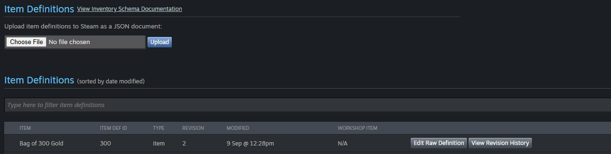
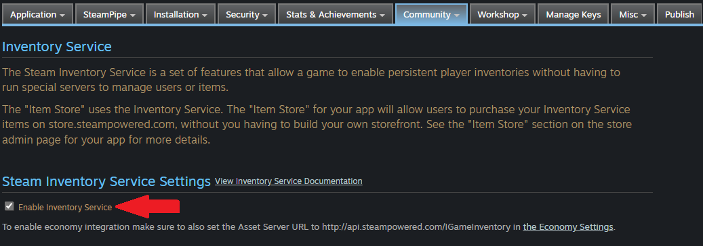
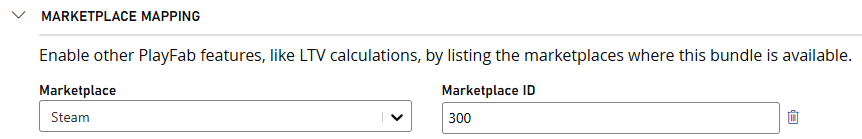

# Set up PlayFab and Steam to enable purchases

This tutorial shows you how to successfully integrate both PlayFab and Steam in a way that it allows for purchase flows to work and the redemption of items purchased.

## Prerequisites

1. A Title in PlayFab's [Game Manager](https://developer.playfab.com/).
2. An app already created and available in [Steamworks](https://aka.ms/Steamworks).
3. An existing integration between the selected Title and Steam, for which you can see [Marketplace integration: Steam](../marketplace-integrations/steam.md).

>[!NOTE]
> You can find a high level overview of the steps required to make this integration work from Steam's perspective in [Steam's documentation](https://aka.ms/SteamDocsInventory).

## Step 1: Create item definitions

You need to start by creating and uploading some [item definitions](https://aka.ms/SteamItemDefinition).

Once you have created your item definition and saved your JSON file, you can navigate to your app's Inventory Service and upload your item definition here by following the next steps:

1. Navigate to [Steamworks](https://aka.ms/Steamworks).
2. Select "Apps & Packages" > "All Applications" from the top navigation menu.
3. Select your desired app from the list of "All Apps."
4. Scroll down and select "Edit Steamworks Settings" under "Technical Tools."
5. Select "Community" > "Inventory Service."
6. Navigate to the "Item Definitions" section and browse for your desired item definition JSON file.
7. Select "Upload."

Your item definition schema should look something like this:

```json
{
  "appid": "452820",
  "itemdefid": "300",
  "Timestamp": "2024-09-09T19:28:27Z",
  "modified": "20240909T192827Z",
  "date_created": "20240909T192827Z",
  "type": "item",
  "display_type": "",
  "name": "Bag of 300 Gold",
  "price": "1;VLV0",
  "quantity": 1,
  "description": "A super awesome bag of 300 gold!",
  "background_color": "3C352E",
  "name_color": "7D6D00",
  "promo": "owns:3223900",
  "tradable": false,
  "marketable": false,
  "commodity": false
}
```

Once your item definition is uploaded, it should appear as in the next screenshot:



>[!NOTE]
> You can learn more about item definition schemas in [Steamworks Documentation](https://aka.ms/SteamItemDefinition).

## Step 2: Enable Inventory Service

Now that you have your item definitions uploaded, you must turn on your app's **Inventory Service**. This action can be done through the same page in which you uploaded your item definitions by:

1. Navigating to the "Inventory Service" page for your app through the URL: `https://partner.steamgames.com/apps/inventoryservice/{YourAppID}`.
2. Enabling Inventory Service by checking the "Enable Inventory Service" checkbox.



## Step 3: Set an Asset Server Key

Once Inventory Service is enabled, you must make sure that your **Asset Server Key** is set. This Key must match your **Publisher Web API Key** created during your initial integration, specifically Step 2 of the [Steam Integration documentation](../marketplace-integrations/steam.md#step-2-obtain-your-steamweb-api-key).

>[!NOTE]
> You can also follow the steps listed in Steam's documentation to [Create a Publisher Web API Key](https://aka.ms/SteamWebAPIKey).

Once you have your **Publisher Web API Key** follow the next steps to set it as the **Asset Server Key**:

1. Navigate to your app's "Economy Settings" under the "Community" tab, or by following the URL `https://partner.steamgames.com/apps/economy/{YourAppID}`
2. Scroll until you see the **Asset Server Key** field and add your **Publisher Web API Key**.

## Step 4: Create and map PlayFab items

Now that you have **Inventory Service** enabled for your Steam app, and your item definition uploaded, it's time to go into [Game Manager](https://developer.playfab.com/) and configure your items.

For more information about creating a new item, see our [documentation](../craftingGame/crafting-game-game-manager.md#step-4---create-your-first-item).

After your item was created, you must now add this item to a new (or existing) **Bundle**. If this is your first time creating a **Bundle**, you can refer to our tutorial: [Set up a PlayFab bundle that can be purchased from Google Play Store](../marketplace-redemption/google.md) for information on [creating a new Bundle](../marketplace-redemption/google.md#create-a-bundle-using-game-manager) and [adding items to a Bundle](../marketplace-redemption/google.md#add-items-to-your-bundle).

Once your Item and Bundle have been created, you must now link the Bundle to the item definition you submitted to Steam. To do this, you must make note of the `itemdefid` you gave your item in your item definition JSON.


From the screenshot above, you can see that the `itemdefid` of our item is `300`, now you must navigate to your Bundle in Game Manager in edit mode, and scroll down to the **Marketplace Mapping** section of your Bundle.

In here, you must select **Steam** as your Marketplace, input **300** as your Marketplace ID, and select the plus sign right next to the Marketplace ID field to lock in your changes. Once this is done, you're free to **Save**.



## Step 5: Authenticate your player

Before moving on to redeeming your purchased item, you must ensure that the player looking to redeem the item is properly authenticated in your app, for which you must use [LoginWithSteam](/rest/api/playfab/client/authentication/login-with-steam).

After a successful call to PlayFab's `LoginWithSteam` you get a `200` response that includes an `EntityToken` that you have to use in your redemption call.

## Step 6: Redeem a purchase

With Steam set up, your player authenticated using PlayFab's `LoginWithSteam` API and your bundle mapped to the item definition, you can now make the redemption call to Steam. For this, we use the [RedeemSteamInventoryItems](/rest/api/playfab/economy/inventory/redeem-steam-inventory-items) API call.

For this API call to work successfully, you must make sure to include the `EntityToken` returned in [Step 5](#step-5-authenticate-your-player) after your player was successfully authenticated, as part of the headers in the API call.

The way redemption works for Steam is that once the `RedeemSteamInventoryItems` call is made, it goes through all Steam's inventory looking for the matching `itemdefid` and redeems it.

A successful response includes a `200` status code alongside other data part of the [RedeemSteamInventoryItemsResponse](/rest/api/playfab/economy/inventory/redeem-steam-inventory-items) such as `TransactionIds`, and lists of failed or successful redemptions.

Each redemption action will also trigger a corresponding event in the player's transaction history that can be retrieved from the **Transaction history (V2)** tab under the specified player's overview page.

Alongside the record in the player's transaction history, a PlaySteam event is also triggered and logged. You can access these logs for your Title by going into the **Data** page under the **Analyze** section of the left navigation bar in [Game Manager](https://developer.playfab.com/). Here you can edit queries to search for specific records or run it with the default settings to get everything. There should be a record under the **Event name** of `items_redeemed`.

>[!NOTE]
> You may see more than one `items_redeemed` PlayStream event logged, this is because even though you may have redeemed just one bundle, the number of events corresponds to the number of items within each bundle.

>[!NOTE]
> If you look at other redemption tutorials such as [Set up a PlayFab bundle that can be purchased from Google Play Store](../marketplace-redemption/google.md) or [Set up an In-App Purchase using PlayFab and the Apple App Store](../marketplace-redemption/apple.md) you may notice there's an additional step after redemption, called **Consumption** or **Finalize Transaction** respectively.
>
> In Steam's case, consumption is done when the `RedeemSteamInventoryItems` API call is made, so there's no need for any additional steps after redeeming items. Nonetheless, it's worth noting that because consumption is made automatically during a successful redemption, the items matching the `itemdefid` will not longer be available in Steam's inventory.

## Step 7: Durable support (optional)

Steam DLC (Downloadable Content) is a system PlayFab doesn't currently integrate with. We suggest developers use Steam promo rules to grant inventory items from an app ownership perspective.

This means that **before** making a redemption call using `RedeemSteamInventoryItems`, you must call [AddPromoItems](https://aka.ms/SteamPromoItems) from the Steam client using their SDK.

`AddPromoItems` checks the promo:owns:**ID** and confirms it exists in the player's owned apps. If so, then it adds the item whose ID matches the `itemdefid` in the item definition.

>[!NOTE]
> We don't currently support subscriptions.

## See also

- [Get started: Crafting game](../craftingGame/game-context.md)

- [Fraud prevention quickstart](/gaming/playfab/features/economy-v2/fraud-prevention/quickstart)
