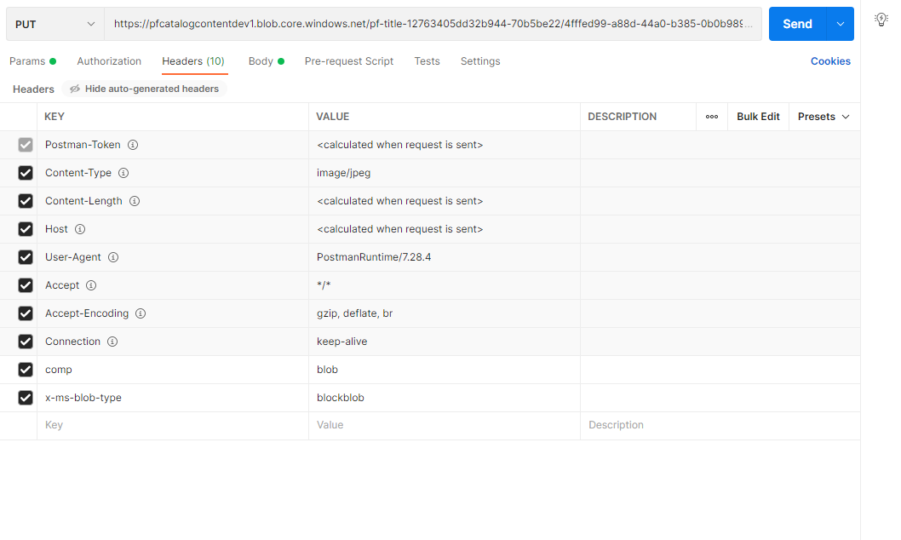
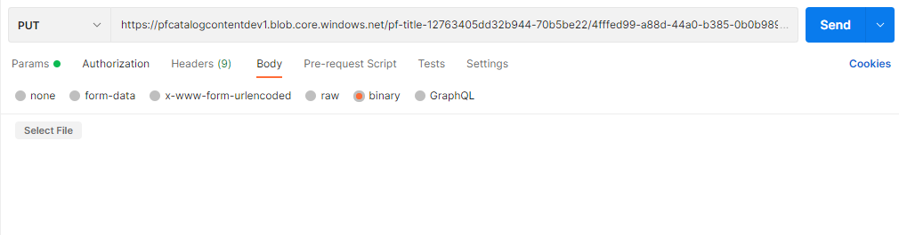
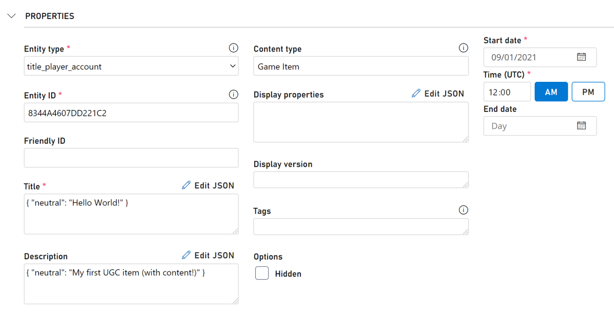

# Publish your first user generated content

[!INCLUDE [notice](../../../includes/_economy-release.md)]

This tutorial walks you through publishing UGC with content through both APIs and the Game Manager UX, diving into more detail than the quickstart.

## Requirements

* A [PlayFab developer account](https://developer.playfab.com)
* A UGC-enabled title

## Via APIs

In this section, we will leverage the [Postman Collections](/gaming/playfab/sdks/postman/postman-quickstart) to interact with the PlayFab UGC APIs, but you can leverage any of our [SDKs](/gaming/playfab/sdks/playfab-sdk-intro).

### Create Blob URLs

* The UGC system works with the PlayFab Entity Model, so we need to use entity tokens instead of session tickets to call these APIs. You can learn how to get a title entity token in the [Postman Collections Quickstart](/gaming/playfab/sdks/postman/postman-quickstart).

* The UGC system leverages [Azure Blob Storage](/azure/storage/blobs/storage-blobs-introduction) to store all content (files and images) associated with your title's UGC. To upload the content, we first need to call the  `CreateUploadUrls` API, passing in the file names and sizes (in bytes) to create the new blobs. For example, if I wanted to upload a text file and PNG image, I would pass in the following to the request body:

    ```JSON
    {
      "Files": [
        {
          "FileName": "HelloWorld.txt",
          "FileSize": 12
        },
        {
          "FileName": "PlayFabLogo.png",
          "FileSize": 20725
        }
      ]
    }
    ```

* The response will include an `Id` and `Url` for each piece of content:

    ```JSON
    {
        "code": 200,
        "status": "OK",
        "data": {
            "UploadUrls": [
                {
                    "Id": "[Content ID]",
                    "Url": "[Content Url + '?' + Token]",
                    "FileName": "HelloWorld.txt"
                },
                {
                    "Id": "[Image ID]",
                    "Url": "[Image Url + '?' + Token]",
                    "FileName": "PlayFabLogo.png"
                }
            ]
        }
    }
    ```

  > [!NOTE]
  > Each create token (returned in the "Url" field of the response) is valid for 6 hours, after which you will not be able to upload content to the blob. If you did not upload any content to the blob, it will get cleaned up by our service and you will need to create a new blob by calling `CreateUploadUrls` again. This URL will also not allow access to content until is has been uploaded to a draft item where it will receive a different (now publicly accessible) URL

  > [!NOTE]
  > Each blob should only be used in **one** item. If you wish to have a piece of content repeated in multiple items, you should re-upload the content to different blobs.

### Upload Content to Blobs

There are a few different ways to [upload your content to these URLs](https://cloud.netapp.com/blog/azure-cvo-blg-how-to-upload-files-to-azure-blob-storage)

#### Via Postman

* Create a `PUT` request with the URL generated from calling `CreateUploadUrls` and by adding the `comp: blob` and `x-ms-blob-type: blockblob` as headers:


* Then you can upload the file by selecting *binary* as the Body type:


#### Via AzCopy

* Another option is using the AzCopy tool. You can download the tool and [get started with AzCopy](/azure/storage/common/storage-use-azcopy-v10) here.
* In your terminal of choice, call azcopy with the following parameters:

    ```powershell
    [relative path to azcopy.exe] copy [relative path to local content] [Url + '?' + Token]
    ```

### Create the Draft UGC

* Now that the files and images have been successfully uploaded, you can call `CreateDraftItem`, passing in the URLs of the content and images, to create your first item in the draft catalog:

    ```JSON
    {
      "Item": {
        "Type": "ugc",
        "Title": {
          "NEUTRAL": "Hello World!"
        },
        "Description": {
          "NEUTRAL": "My first UGC item (with content!)"
        },
        "ContentType": "Game Item",
        "IsHidden": false,
        "Contents": [
          {
            "Id": "[Content ID]",
            "Url": "[Content Url]"
          }
        ],
        "Images": [
          {
            "Id": "[Image ID]",
            "Type": "Thumbnail",
            "Url": "[Image Url]"
          }
        ]
      },
      "Publish": false,
      "AllowOverwrite": false
    }
    ```

    > [!NOTE]
    > When uploading images to items, every image must be classified with a `Type` parameter. This can either be a "Thumbnail" or a "Screenshot". Each item is limited to only one image of a "Thumbnail" type and by default, [Searches](../catalog/search.md#select) will return the "Thumbnail" image (if it exists) by default.

* The response will return the metadata you passed in, along with an item ID:

    ```json
    {
    "code": 200,
    "status": "OK",
    "data": {
        "Item": {
            ...
            "Id": "e5427509-1b72-4ee1-9e6c-03fc055a94f3",
            ...
        }
      }
    }
    ```

    > [!NOTE]
    > The content/image URLs returned by the created draft item and the original `CreateUploadUrls` call will be different. Regardless of how you chose to upload content, you can test that the upload was successful by copying the base Url (before the '?') and navigating to it in your browser. This will only return the image **after** it has been uploaded to a draft item, not by using the URL from `CreateUploadUrls`.

* The draft UGC item now exists in the draft catalog! As long as the UGC item is not yet published, it will not be searchable via the public catalog. You can find this UGC item by calling either of the following APIs:

  * `GetDraftItem`, passing in the item ID obtained from the `CreateDraftItem` response
  * `GetDraftItems`, passing in a list of known item IDs
  * `GetEntityDraftItems`, passing in an Entity ID and/or passing in the ContinuationToken from each previous response to page through the list of draft items
  
> [!NOTE]
> If you wanted to publish immediately, you could change the `Publish` field to true

* When you are ready to publish the UGC item, call `PublishDraftItem`, passing in the item ID (obtained from the `CreateDraftItem` response).
* If your UGC item contains multiple particularly large files, publishing the item can take some time, and when there are many other players concurrently uploading content, this process can take even more time. You can check on the status of the publish by calling `GetItemPublishStatus`, passing in the item ID (obtained from the `CreateDraftItem` response). There are a few possible statuses:
  * `Succeeded` - the UGC item has successfully published
  * `Pending` - the UGC item is still in the process of getting published
  * `Failed` - the UGC item publish failed and will not get published until the offending content has been modified
  * `Unknown` - this is the default status, and will be returned before calling `PublishDraftItem` on the UGC item
  * `Canceled` - an internal error has occurred, please try publishing the item again (if you see this status multiple times, please reach out to the PlayFab engineering team)
* Once the UGC item has been successfully published, you can search for it via `SearchItems` or grab it directly via `GetItem` if you have the item ID.
* You can make changes to the UGC item before or after publishing by doing the following:
  * Call `GetDraftItem`, passing in the item ID (obtained from the `CreateDraftItem` response)
  * Copy the UGC item's data (everything in the `data` field)
  * Call `UpdateDraftItem`, passing in the modified UGC item's data
  * If you want to update any of the files or images, you would need to create another blob by calling `CreateUploadUrls` again
  * Republish the UGC item by calling `PublishDraftItem`

## Via Game Manager

In this section, we will create a UGC item completely within the Game Manager experience - no code necessary!

### Create the Draft Catalog Item

* Navigate to the UGC page by selecting **Economy** > **Catalog (v2)**.
* Select **New Item**.
* Fill out the appropriate metadata for your UGC item:

    | Field Name    | Value                                                 |
    | ------------- | ----------------------------------------------------- |
    | Entity type   | title_player_account                                  |
    | Entity ID     | [your player ID]                                      |
    | Content type  | Game Item                                             |
    | Start date    | [any date in the past]                                |
    | Title         | `{ "NEUTRAL": "Hello World!" }`                       |
    | Description   | `{ "NEUTRAL": "My first UGC item (with content!)" }`  |

    

* Under the **Files** and **Images** sections, upload the appropriate content by selecting the **Upload** button.
* Select **Save and publish**.
* The UGC item will now automatically be created as a draft item and published to the public catalog - you will now be able to find this item in the table with other published UGC items.

> [!NOTE]
> There is currently no way to check the draft item or publishing status within Game Manager - this can only be done via the APIs

* If you want to make any changes to the published UGC item, you can do so by doing the following:
  * Select the published UGC item from the table
  * Make the appropriate edits
  * Select **Save and publish**

## Troubleshooting

* Invalid Request - The content type 'Game Item' is not supported.
  * If content types have been specified in your title's config (either through `GetCatalogConfig`/`UpdateCatalogConfig` or in Game Manager under the **Economy Settings** tab), you will need to add **Game Item** to the list, or change the content type to one your title already supports
* Invalid Request - This title is not configured to use this service.
  * Your title currently has UGC disabled - you can enable this by updating your title's config (through `GetCatalogConfig`/`UpdateCatalogConfig`, in Game Manager under the **Economy Settings** tab, or by navigating to the **Economy > Catalog (Preview)** tab and selecting **Enable**)

## Next Steps

You now have published UGC items in your catalog! You can leverage `SearchItems` to create content discovery experiences for your players.

> [!div class="nextstepaction"]
> [Search >](../catalog/search.md)
