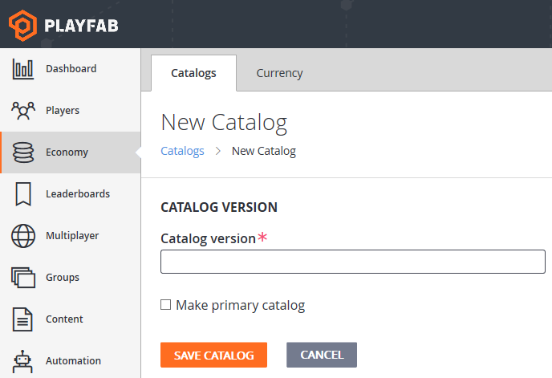
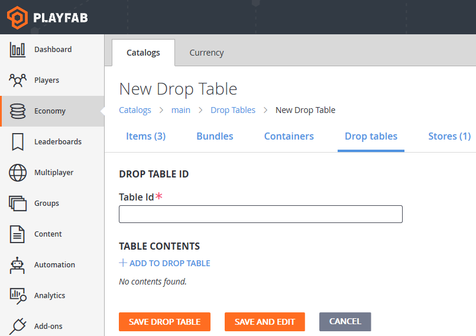
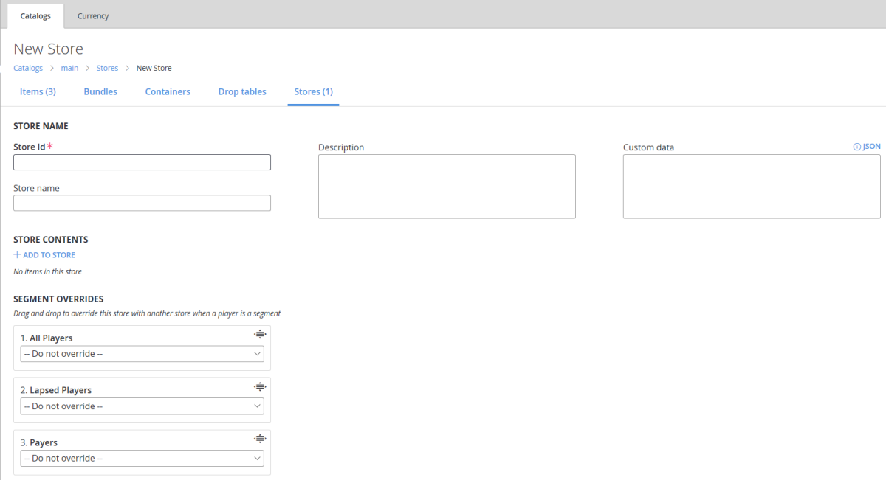

# Catalogs (Legacy Economy)

[!INCLUDE [notice](../../../includes/_economy-deprecation.md)]

This tutorial describes the **Catalogs** tab in the **Economy** section in **Game Manager**. Catalogs are used to define items that the player can purchase or that you can award to a player.

## What is a catalog?

Many games offer the player items for purchase such as a shield, a level-unlock, or a power-up. These items are specified in a catalog in units of either virtual currency or real money. Catalogs offer an easy way to manage your game's virtual items and can hold every item available in your game.

Before a player can purchase an item from a catalog, you must first create the items.

PlayFab’s [Player Item Management (Server)](xref:titleid.playfabapi.com.server.playeritemmanagement) and [Player Item Management (Client)](xref:titleid.playfabapi.com.client.playeritemmanagement) APIs support many strategies for item purchasing, including:

* Simple real money or virtual currency purchases of items.
* Triggered item grants based on buying another item.
* Locked (with a potentially purchasable key) and unlocked boxes.
* Random result tables.
* Non-purchasable items that are granted based on events within a game.

> [!NOTE]
> In catalogs, the currency type of **RM** is reserved for **real money**, which is in cents USD. $1.99 is represented as **RM 199**.

## Field reference

This section describes each field in the **Catalogs** section of the **Economy** area in **Game Manager**.

When you first create a title, you have no catalogs. You won't see any fields in the **Catalogs** section until you create a catalog by selecting the **NEW CATALOG** button.

Once a catalog is created, you'll see the following tabs in the **Catalogs** section:

* **Items** - Things that have a value in virtual currency or real money that can be purchased or awarded. For more information, see [PlayFab items](index.md).
* **Bundles** - Collections of items and virtual currency that unpack into a player's inventory when granted.
* **Containers** - Collections of items and virtual currency that remain as an item in the player's inventory until opened.
* **Drop Tables** - Collections of items and virtual currency you can use to reward players.
* **Stores** - Stores serve a subset of catalog items. These items can be offered at alternative prices to prices set in the catalog. For more information, see [PlayFab Stores](../stores/index.md).

### New Catalog fields

When you select **NEW CATALOG** from the main **Catalogs** tab, you'll see the following page:

  

The **New Catalog** page (shown above) contains these fields:

* **Catalog version**
  A *required* field. The name of your catalog that is shown in the **Catalogs** tab.
* **Make primary catalog**
  Indicates whether the catalog is the primary catalog for your game.

### New Catalog Item fields

When you select a **Catalog** and choose **NEW ITEM**, you'll see the following page:

  

The **New Catalog Item** page (shown above) contains these fields:

* **PROPERTIES**
  * **Item ID**:
    This *required* field is the unique identifier for the item within the Catalog. The item ID must be unique within the Catalog, but you can have multiple catalog versions containing items with the same item ID.
  * **Item Class**:
    This *optional* field is an identifier you can use to help manage your catalog items.
  * **Tags**:
    This *optional* field contains tags that you can use to organize your catalog items. Like the field name implies, the tags are comma-delimited text strings.
  * **Item image URI**:
    This *optional* field allows you to provide a URI to an image of the item.
* **OPTIONS**
  * **Is stackable**:
    Marking an item as **Stackable** allows only one item of this type in the inventory and increments the quantity count of the item.
  * **Is tradable**:
    Indicates whether the item is tradeable via the trade API calls.
  * **Is a token for character creation**:
Indicates whether the item is involved in character creation.

* **PRICES**
  * **Currency**:
    Specifies the currency used for the item's cost. Real money (RM) is always available as it's built into PlayFab.

  * **Amount**:
    This field is *required* when a currency is selected. It indicates the units of currency for the item's cost.

* **DISPLAYED TO PLAYERS**
  * **Display Name**:
    This *optional* field is the name displayed for the catalog item. One common usage is when you want to offer the item in your in-game store. Display names don't need to be unique.

  * **Description**:
    This *optional* field is the description for the catalog Item. One common usage is when you want to offer the item in your in-game store.

* **LIMITED EDITION**
  * **Is limited edition**:
    Indicates whether there's a limited supply of this item.

* **CONSUMABLE**
  Indicates whether the item is **Durable** or **Consumable**.

* **CONVERT TO**:
  Allows you to convert the item to a bundle or container when it's saved.

* **CUSTOM DATA**
  This *optional* field allows you to enter attributes for the item as Key Value Pairs (KVPs). Only the key is required for each attribute. The KVPs can be entered as a string in the text box, or if **EDIT AS KEY/VALUE PAIRS** is selected, entered in the following fields:
  * **Key**:
    A *required* field. The index to the **Attribute Value**.
  * **Value**:
    This *optional* field is the value of the attribute. If not set, the value is *null*.

### New Catalog Bundle fields

When you select a **Catalog**, open the **Bundles** tab, and choose **NEW BUNDLE**, you'll open the **New Catalog Bundle** page.

This page contains all of the fields in the [New Catalog Item](#new-catalog-item-fields) page, *plus* this field:

* **BUNDLE CONTENTS**:
  * **ADD TO BUNDLE**
    Displays a list of all the items, currencies, and drop tables in the catalog and allows you to select which ones to add to the bundle.

### New Catalog Container fields

When you select a **Catalog**, open the **Containers** tab, and choose **NEW CONTAINER**, you'll open the **New Catalog Container** page.

This page contains all of the fields in the [New Catalog Item](#new-catalog-item-fields) page, *plus* this field:

* **CONTAINER CONTENTS**:
  * **ADD TO CONTAINER**
    Displays a list of all the items, currencies, and drop tables in the catalog and allows you to select which ones to add to the container.

### New Drop Table fields

When you select a **Catalog**, open the **Drop tables** tab, and choose **NEW DROP TABLE**, you'll see the following page:

  

The **New Catalog Drop Table** page contains these fields:

* **DROP TABLE ID**:
  * **Table Id**:
    This *required* field is the unique identifier for the drop table within the catalog. The value of **Table Id** must be unique within the catalog, but you can have multiple catalog versions containing drop tables with the same **Table Id**.

* **TABLE CONTENTS**:
  * **ADD TO DROP TABLE**
    Displays a list of all the items and drop tables in the catalog and allows you to select which ones to add to the drop table.

### New Store fields

When you select a **Catalog**, open the **Stores** tab, and choose **NEW STORE**, you'll see the following page:

  

The **New Store** page contains these fields:

* **STORE NAME**:
  * **Store Id**:
    This *required* field is the unique identifier for the store within the catalog. The value of **Store Id** must be unique within the catalog, but you can have multiple catalog versions containing stores with the same **Store Id**.
  * **Store name**
    This *optional* field is the name displayed for the store. Display names don't need to be unique.
  * **Description**:
    This *optional* field is the description for the store.
  * **Custom data**
    This *optional* field allows you to enter attributes for the store as Key Value Pairs (KVPs). Only the key is required for each attribute. The KVPs are entered in the text box as JSON. Selecting the **JSON** label above the box provides a format for entry.
* **STORE CONTENTS**:
  * **ADD TO STORE**
    Displays a list of all the items in the catalog and allows you to select which ones to add to the store.
* **SEGMENT OVERRIDES**:
    These *optional* fields allow you to set which player segments will be able to use your store.

> [!NOTE]
> For detailed information on creating and using stores in your game, see our [Stores quickstart](../stores/quickstart.md).

## Example of Catalog creation

To create a **Catalog**:

1. Open **Game Manager** and select **Economy** on the left side bar.
1. Select the **Catalogs** tab.
1. Select the **NEW CATALOG** button.
1. Enter a **Catalog version** (like *My Catalog*).
    * An item with the ID of **One** is added automatically.
1. Select **One**. (The **Edit Catalog Item** page has the same fields as the [**New Catalog Item**](#new-catalog-item-fields) page described above).
    1. Edit or add some properties, such as:
        * **Item ID** (ex. **shield_level_5**).
        * **Display name** (ex. **Level 5 Shield**).
        * **Description** (ex. **Strong defense against projectile attacks**).
1. Set a price by selecting a currency and amount, for example:
    1. Set the **Currency** to **Gold** (For more information, see [Currencies](../tutorials/currencies.md).)
    1. Set the **Amount** to **250**.
1. Select **SAVE ITEM**.
1. You're returned to the **Items** page for your catalog. To add more items, select **NEW ITEM** and repeat steps 5 – 7.

## Uploading a catalog

To upload a JSON file to create a catalog in Game Manager, perform the following steps:

1. Select your **Game** in **Game Manager**.
1. Select **Economy**.
1. Select **Catalogs**.
1. Select **UPLOAD JSON**.
1. Select your JSON file and choose **UPLOAD FILE**.

> [!NOTE]
> You can also save or upload catalogs as JSON files using the Admin APIs [GetCatalogItems](xref:titleid.playfabapi.com.admin.title-widedatamanagement.getcatalogitems) and [SetCatalogItems](xref:titleid.playfabapi.com.admin.title-widedatamanagement.setcatalogitems).
