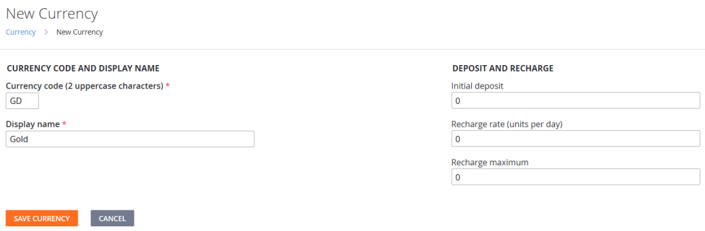
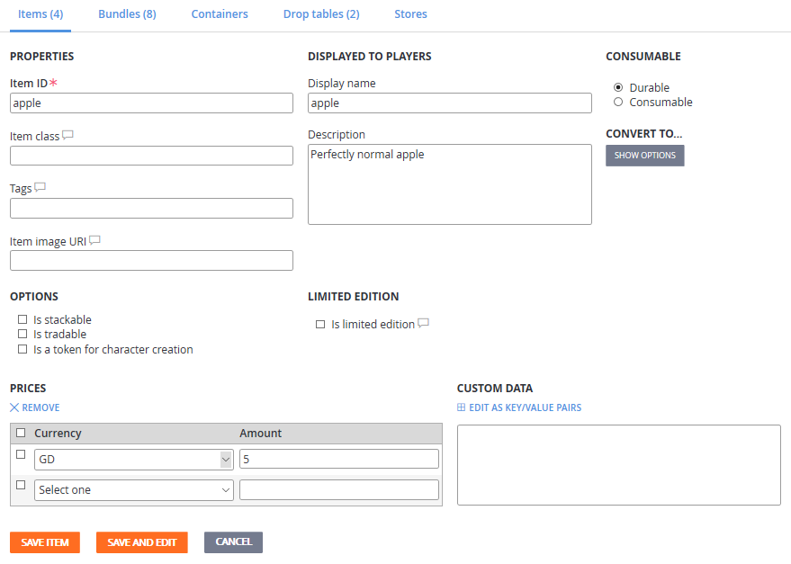

# Quickstart (Legacy Economy)

[!INCLUDE [notice](../../includes/_economy-deprecation.md)]

Making monetization work is one of the biggest challenges in games. PlayFab simplifies this experience by building on top of three foundational pieces: Currencies, Items, and Inventory.

In this quickstart, you will:

1. Set up a virtual currency.
1. Create an item.
1. Add an item to a player's inventory.
1. Learn the next steps for customizing your economy.

## Setting up a virtual currency

Virtual currencies are the foundation of in-game economies. Players and characters can be granted these currencies, which can then be used to buy or trade items.

Items can have a cost in either a virtual currency or real money. Each title can support multiple arbitrary virtual currencies, providing flexibility for your game to implement any medium of exchange (for example, gold, gems, hearts, or interstellar credits).

To create a virtual currency:

1. Open **Game Manager** and select **Economy** on the left side bar.
1. Select the **Currency** tab.
1. Choose **New Currency** and change these fields (as shown in the image below):
   * Set **Currency code (2 uppercase characters)** to **GD**.
   * Set **Display name** to **Gold**.
1. Select **SAVE CURRENCY**.

Now that a currency has been set up, catalog items can be assigned prices corresponding to the virtual currency.

## Creating an item

Many games offer the player items for purchase such as a shield, a level-unlock, or a power-up. These items are specified in a catalog. Before the player can purchase an item from a catalog, you must create the items to populate it.

To create a catalog with an item:

1. Select **Economy** on the left side bar and select the **Catalogs** tab.
1. Choose the **NEW CATALOG** button and enter **main** as the **Catalog version**. An item with the ID of **One** is added automatically.
1. Select **One** and change these fields (as shown in the image below):

   * Set **Item ID** to **apple**.
   * Set **Display name** to **apple**.
   * Set **Description** to **Perfectly normal apple**.

1. The **PRICES** section is at the bottom of the form.
1. Set the apple's price in gold (**GD**) to **5**.
1. Select the **SAVE ITEM** button.

## Adding an item to a player inventory

PlayFab's [Player Item Management (Server)](xref:titleid.playfabapi.com.server.playeritemmanagement) and [Player Item Management (Client)](xref:titleid.playfabapi.com.client.playeritemmanagement) APIs support many strategies for item purchasing:

* Real money
* Virtual currency
* Triggered item grants based on buying another item
* Locked (with a loot-able/purchasable key) and unlocked boxes
* Random result tables
* Non-purchasable items that are granted based on paid or free events within a game
* And more scenarios, especially with [Azure Functions](../automation/cloudscript-af/index.md)

**Add an item to a player's inventory by purchasing it with virtual currency.**

1. In your game, sign in as a player that has been given virtual currency. ([Giving virtual currency to a player](items/quickstart.md#giving-virtual-currency-to-a-player) has more information, if needed.)
1. Call [GetCatalogItems](xref:titleid.playfabapi.com.client.title-widedatamanagement.getcatalogitems) with the following parameter in the request:
   * `CatalogVersion = "main"`
1. Verify that the `Catalog` in the result contains an **apple** with a **GD** price of **5**.
1. Call [PurchaseItem](xref:titleid.playfabapi.com.client.playeritemmanagement.purchaseitem) to buy the **apple**, with these parameter values in the request:

   * `CatalogVersion = "main"`
   * `ItemId = "apple"`
   * `VirtualCurrency  = "GD"`
   * `Price =  5`

1. Finally, call [GetUserInventory](xref:titleid.playfabapi.com.client.playeritemmanagement.getuserinventory) and look in the result of that method. In the array of items in the player's `Inventory` - you should see an apple!

## Next Steps for customizing your economy

Once you have a Catalog with Items supported by Virtual Currencies, you can light up your economy with:

* **Real World Purchases**: Our [Getting started with PlayFab, Unity IAP, and Android](tutorials/getting-started-with-unity-iap-android.md) and our [Non-receipt payment processing](tutorials/non-receipt-payment-processing.md) tutorials help you connect your virtual economy with existing stores.
* **Leveraging your Catalog**: To create Bundles, Containers and Drop Tables. For more information, see our [Catalogs](items/catalogs.md) tutorial.
* **Using Item attributes**: To define multiple prices and specify stackable, tradable, and limited edition [Items](items/index.md).
* **Setting up unique in-game vendors or Sales events**: Using [Stores and Sales](tutorials/stores-and-sales.md).
* **Creating some player Segments and use Stores**: To drive different item and bundle offers to your players regardless of where they are in your game lifecycle. For an example, see our [Custom stores for player segments](tutorials/custom-stores-for-player-segments.md) tutorial.
* **Gathering economic data**: Enabling you to improve and iterate your game using PlayFab [Reports](../analytics/reports/index.md).
