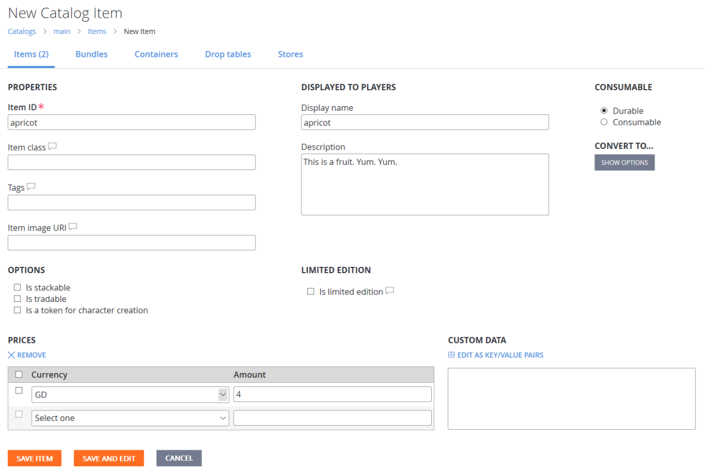
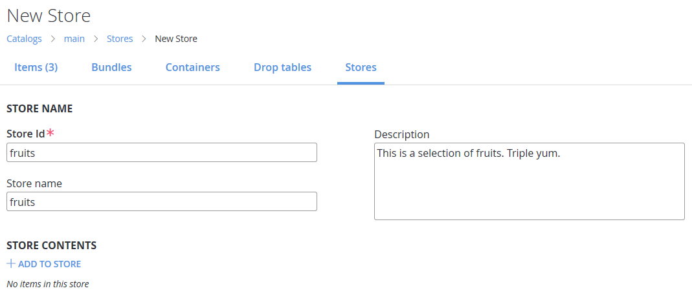
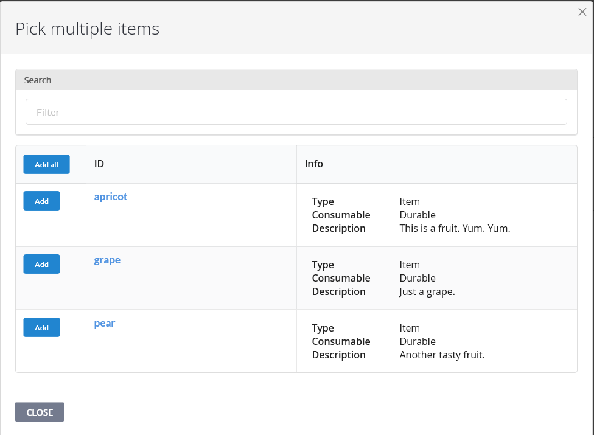
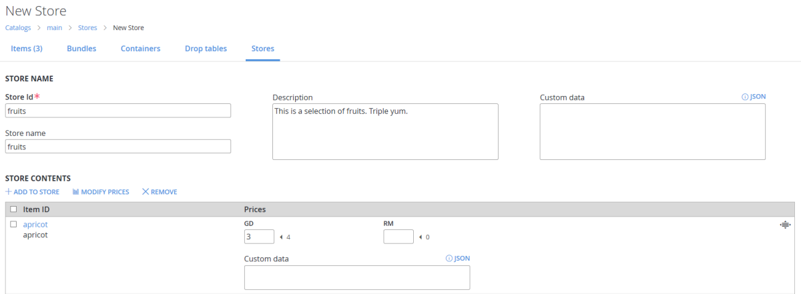

# Stores Quickstart (Legacy Economy)

[!INCLUDE [notice](../../../includes/_economy-deprecation.md)]

Stores are the best way to let players purchase items in your game.

As shown in the [Items quickstart](../items/quickstart.md), PlayFab supports buying items out of a catalog, but that's not how most games structure their purchases. Whether you're making an idle clicker, an RPG, an FPS, or an endless runner, you probably have vendors in your game. Places where players can buy weapons, armor, or running shoes.

Our solution for in-game vendors and shops is Stores, a subset of your catalog with prices you can override.

In this stores quickstart, you will:

* Add items to a catalog with regular prices.
* Create a store that contains the same items with discounted prices.
* Use PlayFab APIs to purchase an item from the store.
* Use information in the Game Manager to confirm that the item was purchased at the discounted store price.  

## Adding items to a catalog

First, let's add some Items to sell in your catalog:

1. Open **Game Manager** and select **Economy** on the left side bar.
1. Select the **Catalogs** tab, and open your **main** catalog.
1. Select **New Item** a few times, and create some items:
    * **apricot** with a **GD** price of **4**.
    * **pear** with a **GD** price of **3**.
    * **grape** with no **GD** price (don't select any prices).

> [!TIP]
> You don't have to assign a virtual currency price to items in a catalog for them to appear in a store.

In the following example, an item called **apricot** is added to the **main** catalog with a **GD** price of **4**.

## Creating a store

You should now have a few items with prices in your catalog. Let's create a store to sell them to a player.

1. Open your **main** catalog and select **Stores**.
1. Select **New store**.
1. Set the **Store Id** and **Store name** to **fruits** (as shown in the following example).
    
1. Select **ADD TO STORE**.
    * A pop-up screen - like the one shown below - will display all the items, bundles, and containers in the current catalog.
1. Add a few items to your store by selecting the **Add** button next to the item.
    

## Setting the store price for an item

You should now see your items listed in the **STORE CONTENTS**, but they're not valid until they have at least one price.

The little static number (for example, **< 4**) next to the price text box is the original catalog price. You only have to enter a price for *one* box in each row, but you can enter as many prices as you want.

* If you don't enter any price for an item, it will be removed from the store.
* If a store item doesn't have a price in a currency, it can't be bought using that currency.
* Store prices can be higher than catalog prices, and zero is a valid price for an item.

> [!TIP]
> You can drag-and-drop the rows in the store contents to rearrange the order of the items.

1. Add some **GD** prices to your items, but make them lower than the catalog prices:
    * **Apricot: 3**.
    * **Pear: 2**.
    * **Grape: 1**.
2. Select **SAVE STORE** when you're done.

In the following example, an item called **apricot** with a catalog price of **4 GD** is given a store price of **3 GD**.

## Purchasing an item from the store

Now that you have a store, let's use the PlayFab APIs to buy an item from the store in your game.

1. Get your store by calling [GetStoreItems](xref:titleid.playfabapi.com.client.title-widedatamanagement.getstoreitems) with these parameters in the request:
    * `CatalogVersion = "main"`
    * `StoreId = "fruits"`
2. The `Store` field in [GetStoreItemsResult](xref:titleid.playfabapi.com.client.title-widedatamanagement.getstoreitems#getstoreitemsresult) should contain a list of your store items and their prices.
3. Call [PurchaseItem](xref:titleid.playfabapi.com.client.playeritemmanagement.purchaseitem) with values in the request that specify the currency and store price of the item you want to buy.
    * `CatalogVersion = "main"`
    * `StoreId = "fruits"`
    * `ItemId = "pear"`
    * `VirtualCurrency = "GD"`
    * `Price = 2`

> [!TIP]
> If you don't specify the **`StoreId`** when calling [PurchaseItem](xref:titleid.playfabapi.com.client.playeritemmanagement.purchaseitem), the purchase is attempted against the catalog price.

## Confirming the purchase price

Open Game Manager, and confirm that the purchase was made at the store price of two GD.

1. Select **Players** from the left side bar to open the **Players** tab.
2. Select the **ID** of the player that purchased the item.
3. Check the following information for the player:
   * Open the **Inventory** tab. The inventory should now contain a **pear**.
   * Open the **Virtual Currency** tab. Check the virtual currency **Amount** to verify that the player only spent 2 GD.
   * Open the **PlayStream** tab. You'll see events showing the purchase flow from the store. Events include a [Player virtual currency item purchased](../../../api-references/events/player-vc-item-purchased.md) event, and a [Player virtual currency balance changed](../../../api-references/events/player-virtual-currency-balance-changed.md) event showing that the virtual currency balance changed by two GD.

> [!TIP]
> You can use the Game Manager to change the order of items in your store and adjust prices at any time.

## Next steps

Now that you've learned how to create and utilize stores in your game, you're ready to explore some more advanced uses of stores.

For example, by using segments with stores, you can give special prices to certain players without touching your game code.

* [Custom stores for player segments](../tutorials/custom-stores-for-player-segments.md)
* [Best practices for store segmentation](../tutorials/best-practices-for-store-segmentation.md)
