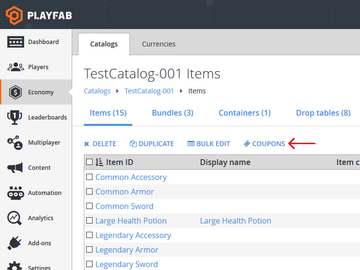
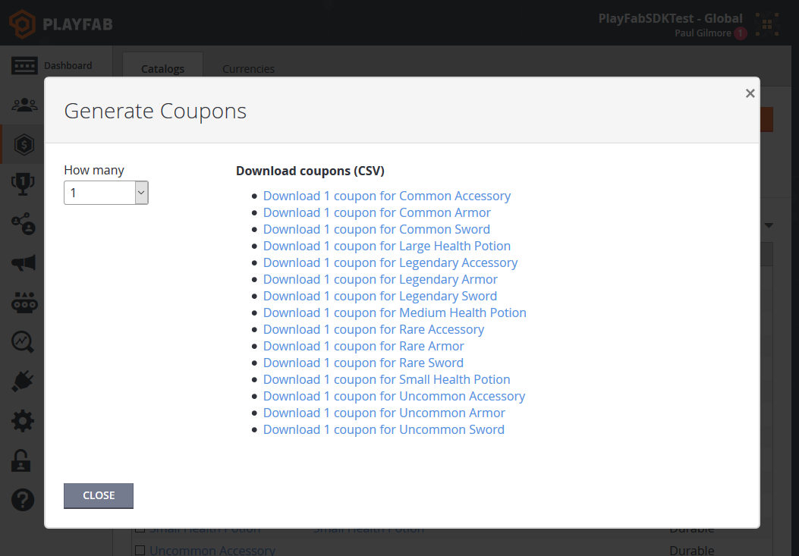
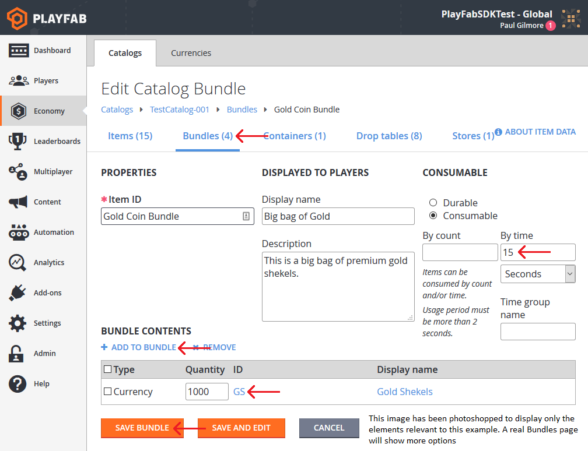

# Coupons and promotions (Legacy Economy)

[!INCLUDE [notice](../../../includes/_economy-deprecation.md)]

Coupons are string tokens that you can generate for your customers use to redeem inventory items in their game. Combined with bundles or CloudScript, these coupons could be used to trigger almost any functionality in your game.

## Requirements

- Familiarity with [Catalogs](../items/catalogs.md), bundles, and containers.
- Familiarity with [Game Manager](../../../gamemanager/quickstart.md).
- Familiarity with [Player Inventory](../../data/playerdata/player-inventory.md).

## Generate and redeem coupon instructions

All of the examples that follow share the first basic step of generating a coupon. This is done in Game Manager.

From **Game Manager**:

- Navigate to your **Title**.
- Select **Economy** from the menu to the left.
- Go to your **Catalogs** tab.

In any of the three tab-sections: **Items**, **Bundles**, and **Containers**, there is a **Coupons** link.

  

The link opens a window which lets you generate coupons for any of the items in the section. If you wish to create coupons for a specific item:

- Select **Coupons** in the **Items** tab.
- Bundle **Coupons** under **Bundles**, and Container **Coupons** under **Containers**.

The pop-up window is similar to the one we have provided below. (Your list of items should match your title. The displayed items are described in our [Drop Tables](drop-tables.md) tutorial).

  

To complete the coupon generation:

- Select a quantity of **Coupons** to generate.

- Then select the **Item** the **Coupons** should generate.
- The **CSV** text file with a list of **Coupons** can then be downloaded

Selecting one of the links in the example generates the following ten comma-separated **Coupons**.

```xml
65g-d4q5-zph,ahs-aofk-5ip,rqp-pk6c-yuu,58d-64h9-a6q,zxk-jtmi-5a1,oeu-6e4z-365,mfy-euhb-qj3,ru9-r1ux-wzy,shj-54cm-5oh,719-7hxc-pzz
```

Finally, the customer can redeem a coupon if you provide a GUI which lets them input the code, which then calls [RedeemCoupon](xref:titleid.playfabapi.com.client.playeritemmanagement.redeemcoupon).

```csharp
// Unity/C#
void UseCoupon(string couponCode)
{
    var primaryCatalogName = "TestCatalog-001"; // In your game, this should just be a constant matching your primary catalog
    var request = new RedeemCouponRequest
    {
        CatalogVersion = primaryCatalogName,
        CouponCode = couponCode // This comes from player input, in this case, one of the coupon codes generated above
    };
    PlayFabClientAPI.RedeemCoupon(request, LogSuccess, LogFailure);
}
```

### Example case: Inventory item coupon

The most straightforward way to use coupons is gifting an inventory item. Once you have created your catalog, you can generate coupons for regular items by following the previous instructions we have already discussed. There are no other special steps for this case.

### Example case: Virtual currency coupon *or*  multiple items coupon

Coupons can't grant [Virtual Currency](currencies.md) directly, and they can only grant a single item.

However, bundles can be used to convert inventory items seamlessly into groups of items or virtual currency. In the VC example, you should create a new bundle item, with VC contents.

Set the bundle to expire in **15 seconds**. This way, the player will immediately see the VC as soon as they open the bundle, and they will not see the intermediate item.

  

Multiple items work the same way:

- Create a bundle with multiple items - or even [Drop Tables](drop-tables.md).
- Set it to expire in **15 seconds**.
- The coupon can generate the bundle.
- The bundle is then converted to multiple items.
- The intermediate bundle item disappears.

## Usage scenarios

- Physical rewards at conventions:
  - You can print your list of coupon codes, and hand them out as swag at conventions.
- Out-of-game communication such as forums, [Push Notifications](../../engagement/push-notifications/quickstart.md) and email.
  - Send your players coupon codes *directly*, as part of re-acquisition campaigns or other community outreach.
- Tournaments:
  - Send coupons to the top ranked players when using [Resettable Leaderboards](../../social/tournaments-leaderboards/using-resettable-statistics-and-leaderboards.md).

> [!NOTE]
> You can also give out inventory items directly in this case, so pick whichever is more relevant to your game.

## Best practices

Using the PlayFab inventory, you should keep inventory sizes relatively small - *less than 100 items total* per player.  A bundle granting *too many items* may be throttled or rate-limited.
