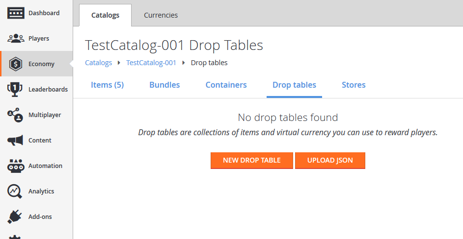
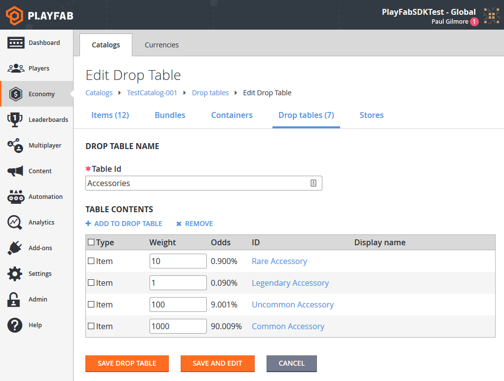
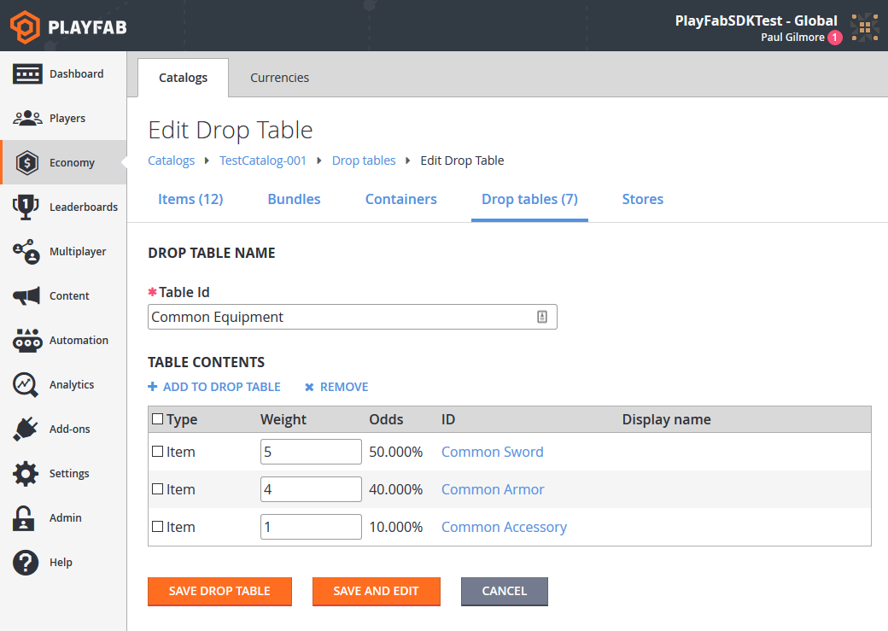
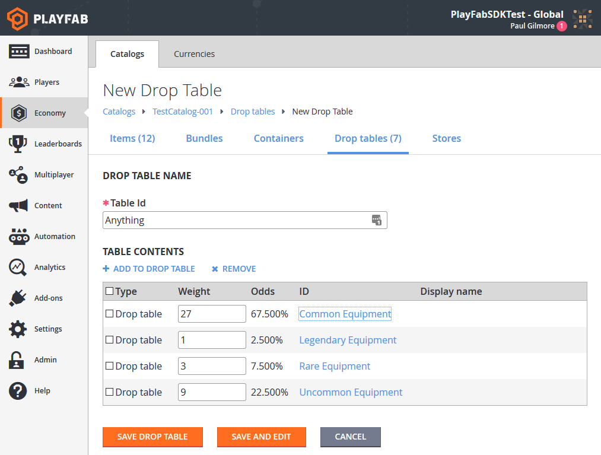
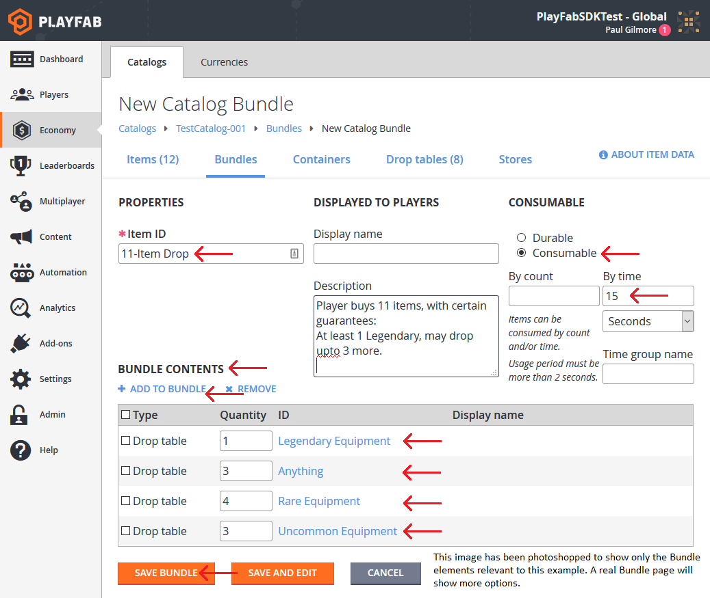

# Drop tables (Legacy Economy)

[!INCLUDE [notice](../../../includes/_economy-deprecation.md)]

This tutorial shows you the steps for creating drop tables using the PlayFab Game Manager.

Drop tables allow you to randomly generate [inventory items](../../data/playerdata/player-inventory.md), and *sequential* drop tables can provide some randomness to player rewards.

- We assume that you're already  familiar with [Catalogs](../items/catalogs.md), [Inventory](../../data/playerdata/player-inventory.md), and the PlayFab [Game Manager](../../../gamemanager/quickstart.md).
- You must have a *primary catalog* - which contains standard, non-bundle/non-container items.
- You must have defined at least *one* virtual currency, which you'll use as a "free" in-game currency.

You may use your own set of items, but our goal is to create an overlapping categorization of items.

As an example, we'll use the following table of items:

|                   | Accessory                 | Armor                | Sword           |
|-------------------|:--------------------------|:---------------------|:----------------|
| **Common**        | Common Accessory          | Common Armor         | Common Sword    |
| **Uncommon**      | Uncommon Accessory        | Uncommon Armor       | Uncommon Sword  |
| **Rare**          | Rare Accessory            | Rare Armor           | Rare Sword      |
| **Legendary**     | Legendary Accessory       | Legendary Armor      | Legendary Sword |

Once you have set up a similar set of items to work with in your catalog, we're ready to build the drop tables.

## Building drop tables

In Game Manager:

1. Navigate to your **Title**.
2. Select **Economy** from the menu on the left.
3. Go to the **Catalogs** tab and choose your primary catalog.
4. Select **Drop Tables**.

Your screen should be similar to this example.

  

Begin building **Drop Tables** based on each of your item descriptors. Our first categorization is **Equipment Type**, so we'll create a new **Drop Table** called **Accessories**.

1. Select the **New Drop Table** button.
2. Set the **Table Id** to **Accessories**.
3. Select **ADD TO DROP TABLE**. The **Pick multiple items** pop-up will appear.
4. Add these items by selecting the **Add** button next to their **ID**:
   - **Common Accessory**
   - **Uncommon Accessory**
   - **Rare Accessory**
   - **Legendary Accessory**
5. Select the **Close** button.

6. Adjust the **Weight** values for the items according to rarity:

   - **Common**: 1000
   - **Uncommon**: 100
   - **Rare**: 10
   - **Legendary**: 1

   The weights indicate how frequently the items should drop in comparison to one another. For the example shown here, you'll drop approximately **1000 Commons** for every **Legendary**.

7. Select **SAVE DROP TABLE**.

  

With **Accessories** completed, follow the same steps to create drop tables for **Armors** and **Weapons**.

Our other categorization is by rarity, so we'll create an alternate set of tables starting with **Common Equipment**.

1. Select the **New Drop Table** button.
2. Set the **Table Id** to **Common Equipment**.
3. Select **ADD TO DROP TABLE**. The **Pick multiple items** pop-up will appear.
4. Add these items by selecting the **Add** button next to their **ID**:
   - **Common Accessory**
   - **Common Armor**
   - **Common Sword**
5. Select the **Close** button.

6. Adjust the **Weight** values for the items according to how the **Common Equipment** options will be in that slot:

   - **Common Accessory**: 1
   - **Common Armor**: 4
   - **Common Sword**: 5

7. Select **SAVE DROP TABLE**.

  

### Using drop tables

You can access drop tables programmatically using these two PlayFab Server API methods:

1. [GetRandomResultTables](xref:titleid.playfabapi.com.server.playeritemmanagement.getrandomresulttables)
2. [EvaluateRandomResultTable](xref:titleid.playfabapi.com.server.playeritemmanagement.evaluaterandomresulttable)

Using [GetRandomResultTables](xref:titleid.playfabapi.com.server.playeritemmanagement.getrandomresulttables), you can read the raw drop table data that we've entered into Game Manager.

> [!NOTE]
> **`GetRandomResultTables`** does *not* roll random values or award results. The API lets you read the data and parse the information however you see fit.

### Option 1

```csharp
public void ReadDropTableData() {
    PlayFabServerAPI.GetRandomResultTables(new GetRandomResultTablesRequest() {
        TableIDs = new List<string> { "Accessories", "Common Equipment" }
    }, result => {
        Debug.Log("Completed getting drop tables");
    }, error => {
        Debug.LogError(error.GenerateErrorReport());
    });
}
```

The result handler will receive the structure information for the drop table that we created, formatted as a [GetRandomResultTablesResult](xref:titleid.playfabapi.com.server.playeritemmanagement.getrandomresulttables#getrandomresulttablesresult).

Alternately, you can let PlayFab evaluate the table *for* you, and give you a single item result using the [EvaluateRandomResultTable](xref:titleid.playfabapi.com.server.playeritemmanagement.evaluaterandomresulttable) API. Doing so returns the `itemId` that can be used to generate a single item, rolled according to the weights provided.

You can then make a second call, which creates the item and gives it to the player.

### Option 2

```csharp
public void Grant(string playFabId, string tableId) {
    // First, roll a random number and evaluate the drop table
    PlayFabServerAPI.EvaluateRandomResultTable(new EvaluateRandomResultTableRequest()
    {
        TableId = tableId
    }, result => OnRandomResultTableResponse(result, playFabId), OnError);
}

public void OnRandomResultTableResponse(EvaluateRandomResultTableResult tableResult, string playFabId) {
    // Second, take the result and grant it to the player
    PlayFabServerAPI.GrantItemsToUser(new GrantItemsToUserRequest {
        PlayFabId = playFabId,
        ItemIds = new List<string> { tableResult.ResultItemId }
    }, result =>
    {
        // Handle Result
    }, OnError);
}

public void OnError(PlayFabError error) {
    Debug.LogError(error.GenerateErrorReport());
}
```

To summarize:

**Option 1** - Allows you to load the data once, cache it, and perform the roll *yourself* on your own game server. This option has lower latency due to fewer calls to PlayFab, and allows you to customize the rolls based on game-specific logic.

**Option 2** - Lets PlayFab do more of the work, but remember - multiple API calls means *higher* latency.

### Advanced drop table usage (setting up a loot crate)

Drop tables can be linked from bundles and containers. Bundles are a great option for virtual currency stores, where a single purchase yields a stack of random items.

For example, let's say we have an **11 Item bundle** with specific drop rules. In this case, it's a customer-facing selling point that we'll guarantee one legendary item. We'll also *restrict* it, so that the player can't get *too* lucky, and receive **11 legendaries**.

### New Drop Table

Let's build a drop table that can literally drop *anything* - in fact, we'll actually call it **Anything**.

When creating this drop table, give it *other* drop tables as its options (on the **Pick multiple items** pop-up, select the **Drop Tables** tab to add other drop tables), and assign them appropriate weights.

  

## Adding a bundle

At this point, we're done with drop tables and we'll add a **Bundle**.

1. Select **Economy** from the menu on the left.
2. Go to the **Catalogs** tab and choose your primary catalog.
3. Select **Bundles** and choose **New Bundle**.
4. Set the **Item Id** to **11-Item Drop**, select **Consumable** and choose **By time** **15 Seconds**.
5. Select **ADD TO BUNDLE**.
6. In the **Pick multiple items** pop-up, select the **Drop tables** tab.
7. Add the drop tables by selecting the **Add** button next to their **ID**.
8. Set the **Quantity** fields to the values shown in the image below.
9. Select **SAVE BUNDLE**.

  

The **Bundle** that we've created for this example uses several features:

- All items of *any* kind must have an **Item ID**.
- A **Bundle** counts as its own Item, and its contents are delivered at the same time it's granted. For this reason, we're making the **Bundle** itself consumable, and it expires 15 seconds after delivery.
- We add different **Drop tables** in different quantities to ensure that **11 Items** are delivered, but different items roll on different tables.
  - First, we guarantee at least **1 legendary item**, so the first slot will roll on **Legendary Equipment**.
  - The next 3 slots roll on **Anything**, which can roll more **Legendaries**, or roll less desirable common equipment. These rolls will define a *good* roll vs. a *bad* one, as these three items can vary widely.
  - Finally, we fill in the remaining slots with guaranteed **Rare** and **Uncommon** items, ensuring that an **11 Item** roll isn't *too* good or bad.

## Conclusion

A drop table generates a single item randomly from a list of potential items and weights. Bundles and containers can be one of the simplest ways to deliver one or more items to a player using drop tables.

You can manually use a drop table from [CloudScript](../../automation/cloudscript/writing-custom-cloudscript.md), using one of these Server API methods:

1. [GetRandomResultTables](xref:titleid.playfabapi.com.server.playeritemmanagement.getrandomresulttables)
2. [EvaluateRandomResultTable](xref:titleid.playfabapi.com.server.playeritemmanagement.evaluaterandomresulttable)
