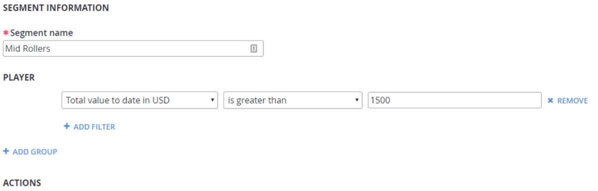
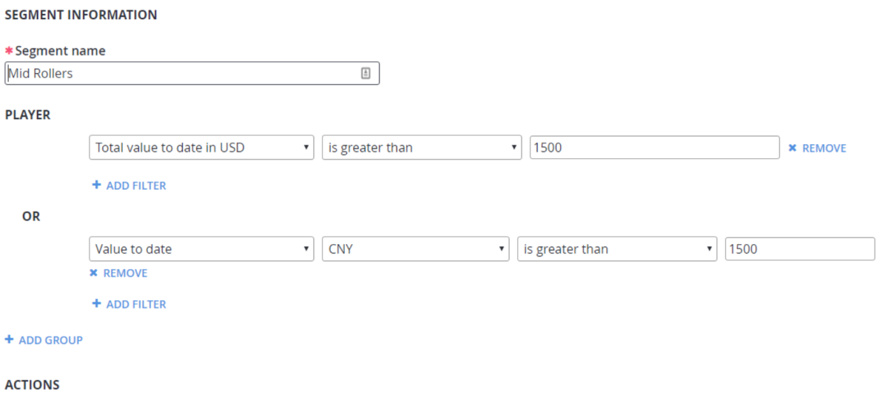

# Getting a player's Value-to-Date (VTD) (Legacy Economy)

[!INCLUDE [notice](../../../includes/_economy-deprecation.md)]

PlayFab tracks the total amount spent by a player in the [player profile model](xref:titleid.playfabapi.com.client.accountmanagement.getplayerprofile#playerprofilemodel), which is retrieved by calling the [GetPlayerProfile](xref:titleid.playfabapi.com.client.accountmanagement.getplayerprofile) API.

Within the `PlayerProfileModel`, a player's VTD is tracked in two different fields:

1. `totalValueToDateInUSD` - The sum of the player's purchases made with real-money currencies, converted to the US dollars (**USD**) equivalent and represented as a whole number of cents (1/100 USD).  
2. `valuesToDate` - An array of [ValueToDateModel](xref:titleid.playfabapi.com.client.accountmanagement.getplayerprofile#valuetodatemodel) objects that contain the player's lifetime purchase totals, summed for each real-money currency in which they have made a purchase. The `TotalValue` field in each object expresses the total for that currency as a whole number of 1/100 monetary units.

The following JSON shows these two fields with example values.

```json
{
    …
    totalValueToDateInUSD: 1700
    valuesToDate: [{ "USD", 1200 }, { "EUR", 320 }]
    …
}
```

## Using VTD to define player segments

In the PlayFab Game Manager, you can use either totalValueToDateInUSD or valuesToDate as *segment predicates* - criteria that can be used to define player segments.

When creating or editing a player segment, the two predicates are included in the dropdown list:

 1. **Total value to date in USD** - The `TotalValueToDateInUSD` value.
 2. **Value to date** - The `ValuesToDate` totals. When you select this predicate, you'll see additional fields to specify the currency and the amount for that currency.

## Segment examples

The following examples show segments created using each of the VTD totals.

1. Create a segment of all players who have purchased more than **15 USD** in any currency.

     

2. Create a segment of all players who have spent more more than **15 USD** in any currency *or* **15 Chinese Yuan**.

     
