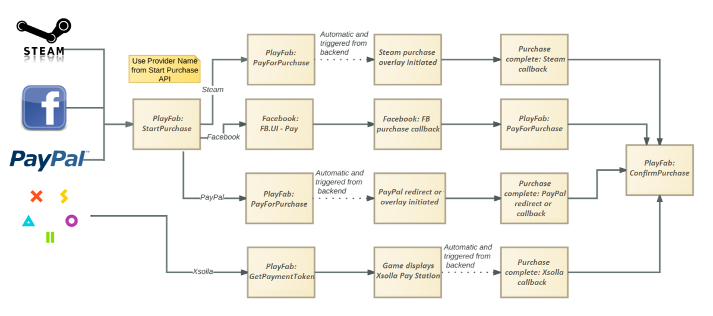

# Non-receipt payment processing

[!INCLUDE [notice](../../../includes/_economy-deprecation.md)]

In addition to receipt validation for a variety of platforms, PlayFab also provides a mechanism for enabling purchases via payment providers that don’t use a receipt or entitlement-based systems - such as Facebook, PayPal, Xsolla, and Steam.

This tutorial will walk you through using this cart-style payments system, showing you how to:

- Define the set of goods the player wants to purchase.

- Process the player with your chosen provider.
- Validate that the payment processed successfully, adding the appropriate items to the player’s inventory.
- In addition, it will also cover the player provider part of the process, so that you have a complete overview of how to complete the purchase using PlayFab.

The following image shows a summary of the API calls used in the payment flow.

  

## Setting up payment providers

Before we begin with the logic for actually processing payments, the first thing you’ll need to do is to actually set up your intended payment providers.

To do that:

- Choose your game in the PlayFab Game Manager.
- Select the **Add-ons** tab.

That takes you to our **Add-ons Marketplace**, where you can find all our third-party integrations, including **Payment Providers**.

> [!NOTE]
> Some providers, like Facebook and Steam, do *more* than just handle payments, and you’ll find them in the Platforms section of this tutorial.

- Select the **Providers** you want to use.
- Then choose the **Install** option for each.
- Enter the requested information (commonly an application and secret key), but each provider will have their own unique requirements.

> [!NOTE]
> This information allows us to communicate with their service on your behalf, so that we can initiate purchases and check on their status.

- Once that has been completed, you’re ready to start implementing the payment flow.

## PlayFab API calls

From the client, the sequence of calls for this process are very similar for most non-receipt payment providers.

- [StartPurchase](xref:titleid.playfabapi.com.client.playeritemmanagement.startpurchase) - Creates the list of goods for the purchase.
- [PayForPurchase](xref:titleid.playfabapi.com.client.playeritemmanagement.payforpurchase) - Establishes the payment provider and locks the payment pricing.
- [ConfirmPurchase](xref:titleid.playfabapi.com.client.playeritemmanagement.confirmpurchase) - Validates whether the purchase completed successfully and if necessary ensures the goods are added to the player’s inventory.

> [!NOTE]
> The exception to this is Xsolla, which we'll address separately at the end of this tutorial.

In the examples that follow, you’ll see fields like `{{TitleID}}` and `{{SessionTicket}}`. You will need to replace these values in your own code, with the appropriate values for your game, and the player’s authentication ticket.

## Initiating the purchase

Throughout the purchase flow, you’ll be working with a defined set of goods from your game catalog that the player wants to purchase.

This is the cart of goods, which you define by a call to PlayFab Client API method `StartPurchase`, to start the process.

```csharp
PlayFabClientAPI.StartPurchase(new StartPurchaseRequest() {
    CatalogVersion = "IAP1_0",
    Items = new List<ItemPurchaseRequest>() {
        new ItemPurchaseRequest() {
            ItemId = "BigBagOfGold",
            Quantity = 1,
            Annotation = "Purchased via in-game store"
        }
    }
}, result => {
    // Handle success
}, error => {
    // Handle error
});
```

In this example, we’re loading up the cart with an item defined in the game catalog with the ID of `IAP1_0` - a `BigBagOfGold`. This is the `ItemId`, as defined in the game catalog.

The player wants to purchase only *one* of it, and the annotation is being used to indicate how the item wound up in the player inventory, which is useful for later review.

It’s also possible to specify that this purchase is using the pricing from a store you’ve defined in your game, by including the StoreId parameter, but we’ll leave that out of this example, for simplicity.

The return from the StartPurchase call contains a lot of information - including the `DisplayName` and `Description` values for the items from your catalog, any defined prices for them, plus the player's virtual currency balances.

But the primary things you’ll need for the next step are the `OrderId` (which uniquely identifies this purchase), and the specific provider you want to use, which is in the `PaymentOptions`.

> [!NOTE]
> Only Payment Providers you have enabled for your title will appear in the **`PaymentOptions`**.

```json
{
  "code": 200,
  "status": "OK",
  "data": {
    "OrderId": "1234567890ABCDEF",
    "Contents": [{
      "ItemId": "BigBagOfGold",
      "ItemInstanceId": "ABCDEF1234567890",
      "DisplayName": "A hefty sack of gold",
      "Description": "Why, it’s a stonking great bag of shiny!",
      "VirtualCurrencyPrices": {
        "RM": 999
      }
    }],
    "PaymentOptions": [{
        "Currency": "RM",
        "ProviderName": "Facebook",
        "Price": 999,
        "StoreCredit": 0
      },
      {
        "Currency": "RM",
        "ProviderName": "PayPal",
        "Price": 999,
        "StoreCredit": 0
      },
      {
        "Currency": "RM",
        "ProviderName": "Steam",
        "Price": 999,
        "StoreCredit": 0
      }
    ],
    "VirtualCurrencyBalances": {
      "VC": 0
    }
  }
}
```

## Establishing the payment provider: Webhook providers

### Facebook

Normally, the flow at this point is to tell PlayFab which payment providers will be used, so that the service can communicate with that provider and set up the information about the transaction.

Facebook is an exception to this procedure. It requires that the purchase be initiated in *their* service *first*. After that, a third-party service such as PlayFab can use the Facebook-provided transaction identifier to validate the status of the purchase.

If your store, catalog, or item IDs are *not* alpha-numeric, they must be [HTML / URL encoded](https://www.w3schools.com/tags/ref_urlencode.asp) when building the `OpenGraphProduct` URL, as shown in the following code.

```csharp
FB.ui({
    method: 'pay',
    action: 'purchaseitem',
    product: "https://{{TitleId}}.playfabapi.com/OpenGraphProduct/{{TitleId}}/{{StoreId}}/IAP1_0/BigBagOfGold",
    request_id: "1234567890ABCDEF"
}, function (response) {
    console.log('Payment completed', response);
    print(response);
    if (response.payment_id) {
        facebookPurchaseId = response.payment_id;
        payForOrder(); // This is a function call you need to write
                       // which makes the call to the Client API PayForPurchase
                       // (see below)
    }
});
```

When making this call, lease remember that the product is *case-sensitive* in Facebook.

In particular, the `TitleId` - which you need to replace with the *correct* title ID for your game in PlayFab - is usually in lower-case in their service. If you encounter any issues with Facebook not finding the correct product, try grabbing the product manually using a GET request, as shown on [this page](https://developers.facebook.com/docs/payments/product/).

In addition, you’ll also need to make sure you’re using the values from earlier in the flow:

- The `CatalogID` of the PlayFab-defined catalog containing the item to be purchased (`IAP1_0`).

- The `itemID` of the item in the game’s PlayFab catalog which is to be purchased (`BigBagOfGold`)
- The `OrderID` returned from the call to `StartPurchase`, at the beginning of this process (`1234567890ABCDEF`)

On a successful response, Facebook will return a `payment_id`, which can then be used as the `ProviderTransactionId` in the call to the Client API method `PayForPurchase`.

```csharp
const string paymentId = "_SOME_PAYMENT_ID" ;
PlayFabClientAPI.PayForPurchase(new PayForPurchaseRequest() {
    OrderId = "1234567890ABCDEF",
    ProviderName = "Facebook",
    Currency = "RM",
    ProviderTransactionId = paymentId
}, result => {
    // Handle success
}, error => {
    // Handle error
});
```

Which should return a simple confirmation.

```json
{
    "code": 200,
    "status": "OK",
    "data": {
        "OrderId": "1234567890ABCDEF",
        "Status": "Init",
        "PurchaseCurrency": "RM",
        "PurchasePrice": 999,
        "CreditApplied": 0
    }
}
```

This completes the loop, connecting PlayFab to the purchase on both sides of the equation, allowing us to query for its status.

You can read more about the Facebook payment system on the Facebook Developer Portal: [https://developers.facebook.com/docs/payments/overview](https://developers.facebook.com/docs/payments/overview)

An additional aspect of Facebook Payments is that there is a requirement that titles use webhooks for payments, to enable real time change notifications to payment status.

This is necessary in the Facebook model, as payments can take a very long time to complete in some cases. Fortunately, this is simple. In your title setup in Facebook, simply enter the following as your Callback URL.

```html
https://{{TitleId}}.playfabapi.com/ThirdPartyPayments/FacebookPaymentUpdate
```

Where `{{TitleId}}` is the **Title ID** for your game in PlayFab (for example, <https://aaa.playfabapi.com/ThirdPartyPayments/FacebookPaymentUpdate>).

There’s no need to specify a token in the Facebook setup - just set the Callback URL, confirm that your PlayFab setup is correct in the **Facebook Add-ons** page of the **Game Manager**, and you’re set.

When Facebook uses this webhook to update the status of the payment, the order status will be updated in PlayFab (and if it was successful), the appropriate items will be added to the player inventory.

> [!NOTE]
> Security: Be aware that this API is a prompt for PlayFab to call again to Facebook, and securely authenticate and validate the transaction. *It is not a backdoor for a hacker to bypass Facebook payments*.

When using Facebook as the payment provider, it is *still important* for your client to confirm the purchase, as shown below.

## Establishing the payment provider: Non-webhook providers

### Steam

Steam is the easiest to integrate of *all* the payment providers.

```csharp
PlayFabClientAPI.PayForPurchase(new PayForPurchaseRequest() {
    OrderId = "1234567890ABCDEF",
    ProviderName = "Steam",
    Currency = "RM"
}, result => {
    // Handle success
}, error => {
    // Handle error
});
```

As a result of the `PayForPurchase` call, PlayFab uses the web methods provided by Steam to initiate the purchase in that service. This automatically causes the user to be presented with the purchase confirmation dialog via the Steam client.

So at the same time you’re getting the response to the Client API `PayForPurchase` call, the user is being asked to accept the payment.

```json
{
    "code": 200,
    "status": "OK",
    "data": {
        "OrderId": "1234567890ABCDEF",
        "Status": "Init",
        "PurchaseCurrency": "RM",
        "PurchasePrice": 999,
        "CreditApplied": 0
    }
}
```

Steam uses a callback mechanism to inform the title of completion of the purchase process, so you will need to register a callback handler for the `MicroTxnAuthorizationResponse_t` callback.

Registered Steam developers can get further information on this process at this location: [https://partner.steamgames.com/documentation/MicroTxn#WebPurchasing](https://partner.steamgames.com/documentation/MicroTxn#WebPurchasing).

Upon receiving the callback, the title should proceed to the `ConfirmPurchase` call, shown in the [Last Step: Confirm the Purchase](#last-step-confirm-the-purchase) section.

### PayPal

With PayPal, the `PayForPurchase` call is practically the same as with Steam.

```csharp
PlayFabClientAPI.PayForPurchase(new PayForPurchaseRequest() {
    OrderId = "1234567890ABCDEF",
    ProviderName = "PayPal",
    Currency = "RM"
}, result => {
    // Handle success
}, error => {
    // Handle error
});
```

However, in this case there is *no* convenient client application that sends the payment request to the player.

With PayPal, you need to present the player with the PayPal interface, asking them to verify that they agree to the purchase. Behind the scenes, this process uses [PayPal Express Checkouts](https://developer.paypal.com/api/nvp-soap/set-express-checkout-nvp/), though, because we’re taking care of all the details.

All you need to do is present the user with the Payment Confirmation page, which is returned to you as the `PurchaseConfirmationPageURL`.

```json
{
    "code": 200,
    "status": "OK",
    "data": {
        "OrderId": "1234567890ABCDEF",
        "Status": "Init",
        "PurchaseCurrency": "RM",
        "PurchasePrice": 999,
        "PurchaseConfirmationPageURL": "https://...",
        "CreditApplied": 0
    }
}
```

In this case, once the browser window has been dismissed, that should indicate that it is time to move to confirming the purchase in PlayFab.

## Last step: confirm the purchase

The final part of the process is for PlayFab to complete the purchase process, adding the purchased items (if any) to the player’s inventory.

In the case of some providers, at this stage the title already knows if the purchase was completed successfully.

In any case, a call to the Client API method `ConfirmPurchase` will only add the items to the player inventory if the payment was made, and they haven’t already been added.

```csharp
PlayFabClientAPI.ConfirmPurchase(new ConfirmPurchaseRequest() {
    OrderId = "1234567890ABCDEF"
}, result => {
    // Handle success
}, error => {
    // Handle error
});
```

At this point, if the order has been completed successfully, we iterate through the items in the cart that you set up with the call to the Client API `StartPurchase`.

This adds the items to the player's inventory and returns the information about the items purchased to the title.

```json
{
    "code": 200,
    "status": "OK",
    "data": {
        "OrderId": "1234567890ABCDEF",
        "Status": "Succeeded",
        "PurchaseDate": "2016-07-19T09:04:28Z",
        "Items": [{
            "ItemId": "BigBagOfGold",
            "ItemInstanceId": "ABCDEF1234567890",
            "CatalogVersion": "IAP1_0",
            "DisplayName": "A hefty sack of gold",
            "UnitCurrency": "RM",
            "UnitPrice": 999
        }]
    }
}
```

### Transaction states

Behind the scenes, there are a number of state changes the order goes through. The complete list is provided below, though it should be noted that depending on the specific provider process, some of these states will never show up in the results of any of the three purchase process API calls, and are included here for completeness.

- **CreateCart** - While the order object itself is not returned in the response to the Client API `StartPurchase`, it has been created at that point. At this stage, the items and prices are stored in the object, but it has not been submitted to any payment provider.

- **Init** - As shown above, this is the status returned when the order has been submitted to the payment provider, but has not yet been authorized by the player.
- **Approved** - This occurs briefly, after the player has approved the payment, but before PlayFab has completed the process of placing the items in the player inventory. *It is only included in this list for completeness, as titles should never see an order with this status*.
- **Succeeded** - This indicates that the order has been completed successfully. The player has approved the payment, and all inventory items have been added to that player's inventory.
- **FailedByProvider** - If for any reason the provider rejects the payment (which includes the player declining the payment), the order is considered failed by the provider.
- **DisputePending** - The payment provider has notified PlayFab of a dispute on the payment that is unresolved.
- **RefundPending** - A payment provider has notified PlayFab that a refund request has been issued. At this stage, the refund has not actually occurred.
- **Refunded** - The order has been refunded. Most (if not all), payment providers also provide this information directly to the developer. The developer will need to decide how to manage this status, which can vary depending on a number of factors, such as whether the items are consumable goods (which may already have been consumed).
- **RefundFailed** - A refund was requested, but was rejected by the payment provider. PlayFab will not be able to provide any additional information on this - so if more details are needed, the developer should contact the payment provider directly.
- **ChargedBack** - This status varies by payment provider, and can indicate that an order is in dispute or has been charged back. Again, for more information on the specifics of the order, the payment provider should be contacted.
- **FailedByPlayFab** - This status indicates that an unexpected failure occurred in the payment process. On seeing this status response, the title should retry the previous payment API call. If this status persists, you are advised to post this issue on our [support forums](https://community.playfab.com/) and provide all the details concerning the issue (title ID, PlayFab ID, order ID).

## Accepting Payments with Xsolla

For Xsolla, the process is quite different, and does not use the code flow above as you'll be using the Xsolla payment flow, as described here: [https://developers.xsolla.com/](https://developers.xsolla.com/).

First, you'll need to have a merchant ID, project ID, and merchant API key from Xsolla in order to configure your title to use their payment service.

- To get started, use the link in the **Add-ons Marketplace's Xsolla** page to sign up for an Xsolla account.

- Once you have that configuration page set up, your next step will be to create the catalog of goods in the Xsolla service.
- When doing this, verify that the item_code for each item in Xsolla matches an item ID in your PlayFab catalog, as those are the identifiers we'll be using to complete your purchase and add the correct items to the player inventory securely.
- To set up your list of virtual items in the Xsolla catalog, please refer to their documentation, which we provided earlier in our instructions.

### Initiating the purchase (Xsolla)

Once you're ready to make a purchase, you'll use the `GetPaymentToken` API call to request a token from the Xsolla service, by specifying it as the `TokenProvider`.

```csharp
PlayFabClientAPI.GetPaymentToken(new GetPaymentTokenRequest() {
    TokenProvider = "xsolla"
}, result => {
    // Handle success
}, error => {
    // Handle error
});
```

The call will return a `ProviderToken`, which is the Xsolla token you'll need in the next step, and a PlayFab `OrderId`. Behind the scenes, this call initiates the transaction with Xsolla.

```json
{
    "code": 200,
    "status": "OK",
    "data": {
        "ProviderToken": "1234567890ABCDEF",
        "OrderId": "1234567890ABCDEF"
    }
}
```

### Completing the purchase (Xsolla)

Next, the client needs to pass the token to Xsolla to begin the payment process. You can pass that token to Xsolla using one of the following URLs:

**Sandbox payments**:

```html
https://sandbox-secure.xsolla.com/paystation3/?access_token=[TOKEN]
```

**Live payments**:

```html
 https://secure.xsolla.com/paystation3/?access_token=[TOKEN]
```

Once you have performed that, you'll complete the purchase in the Xsolla interface.

Again, you'll need to refer to the Xsolla documentation found in the link we provided earlier in this instruction for any questions on using their interface.

Once that is done, there's no further need for you to take any action. Xsolla and PlayFab will exchange webhook calls, and PlayFab will fulfill the purchase by putting the purchased items into the player inventory and posting the appropriate events to PlayStream.

You can check the transaction status (see the full list above) by polling the Client API `GetPurchase`.

In most cases, this process should not take more than 2-3 seconds to complete.

```csharp
PlayFabClientAPI.GetPurchase(new GetPurchaseRequest()
{
    OrderId = "1234567890ABCDEF"
}, result =>
{
    // Handle success
}, error =>
{
    // Handle error
});
```

```json
{
    "code": 200,
    "status": "OK",
    "data": {
        "OrderId": "1234567890ABCDEF",
        "PaymentProvider": "Xsolla",
        "TransactionStatus": "Succeeded",
        "PurchaseDate": "2017-06-07T00:00:00Z"
    }
}
```

## Final notes

One thing to be aware of is that payments can take a long time to complete with some providers.

If you find that the status of the purchase in the response from a call to the Client API `ConfirmPurchase` is still `Init`, you should wait before re-querying. The best practice here is to store the `OrderId` at the start of the process, and then use an exponential back-off when querying for the result.

So if the status is Init, wait *one* minute before re-trying the call to the Client API `ConfirmPurchase`, then wait *two* minutes, then *four*, *eight*, etc., until you hit some max value. Including a **check for completed transactions** option would then provide a way for the user to reset that timer.

Finally, it’s worth noting that you can use sandbox mode for testing purchases with some payment providers.

To do so, check the **Use sandbox purchase testing** option from your **Title’s Add-on** tab in the PlayFab Game Manager.
