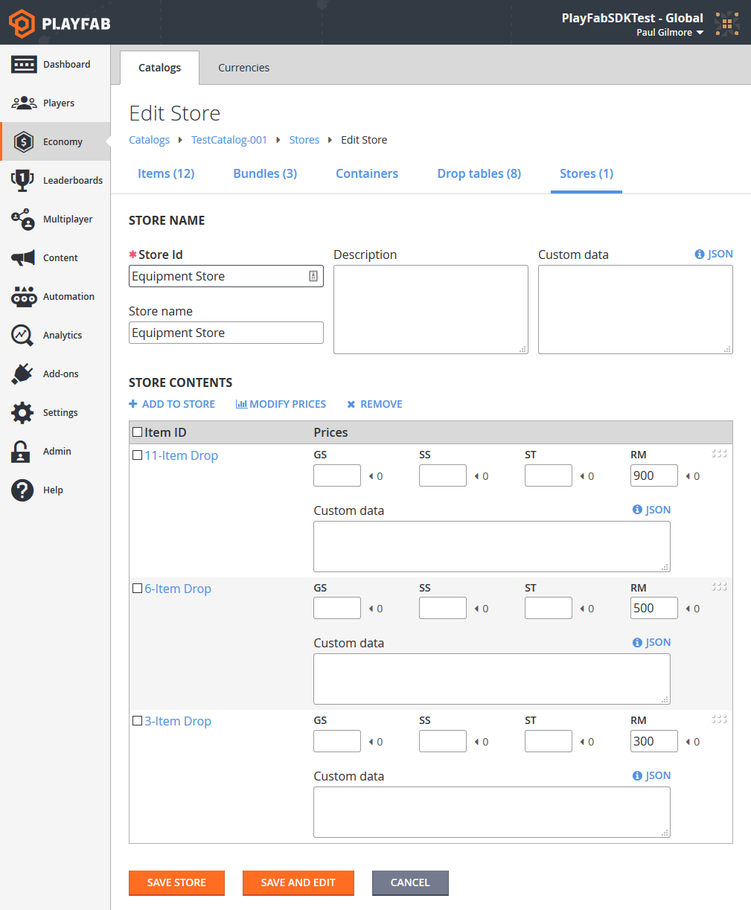
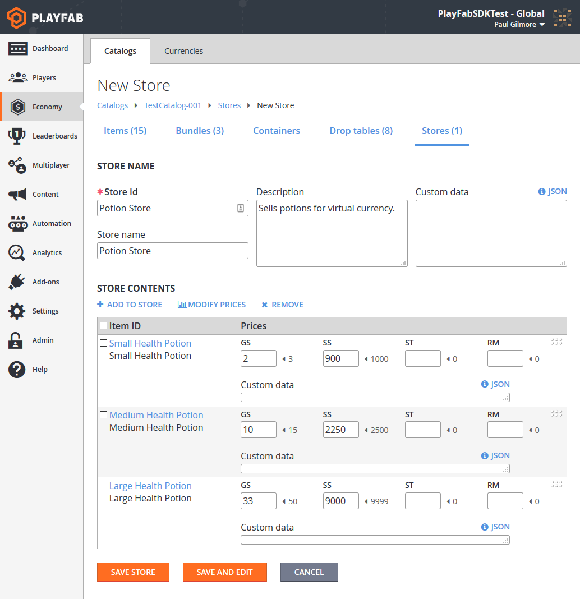

# Stores and sales (Legacy Economy)

[!INCLUDE [notice](../../../includes/_economy-deprecation.md)]

In PlayFab, **Stores** are built upon [Catalogs](../items/catalogs.md) and [Currencies](../tutorials/currencies.md). Your primary catalog should define all of the items in your game and assign them prices in the currencies that you've created.

Stores should define subsets of the items in your catalog, and make them available for purchase at specific prices that can be different than the catalog prices.

A store allows you to single out a specific set of items, and make them available at specific prices for a set time period.

This tutorial illustrates the best practices for defining stores based on virtual currency and real money.

## Requirements

* Familiarity with the PlayFab [Game Manager](../../../gamemanager/quickstart.md).
* You must have defined one or more [Virtual Currencies](../tutorials/currencies.md). The latter example in this tutorial uses:
  * **SP** (**Silver Pieces**)
  * **GP** (**Gold Pieces**).
* You must have a _primary catalog_ with one or more items defined.
  * The first example uses multiple item/bundles, similar to the ones described in the [Drop Tables](../tutorials/drop-tables.md) tutorial.
  * The second example in this tutorial uses small, medium, and large health potions.

### Best practices

Catalog prices should be fixed long-term - they define the _real_ price of an item.

Stores should be _temporary_, being added and removed according to your LiveOps strategies.

> [!NOTE]
> Expect to get most of your revenue by cycling stores, and transitioning items in and out of active stores.

## General information about stores and catalog pricing

* **Pricing**: The prices defined in the catalog should be defined as the _regular_ price of an item. Stores allow you to define a temporary sale price for an item, utilizing the common retail tactic. Alternately, stores can provide a temporary price for an item that isn't normally available for sale at all.
* **Zero Cost**: If the cost of an item in a particular currency is unset (**null**) or **zero**, it can't be purchased using that currency for both catalogs and stores. Zero cost allows you to make items available for exclusively free currencies, or exclusively premium currencies, by leaving the entries for the other currencies blank or by resetting them to **zero**.
* **Real Money**: The **RM** currency is available in all catalogs and stores. RM is a restricted currency key that indicates _real money transactions only_. You should only charge RM for items of significant value, or bundles/containers with premium currency.
* **Prices are Either/Or**: If two prices are defined on an item, the item can be purchased for one or the other. It _isn't possible_ to require two currencies for a single item.

## Defining a real money store

In your **Game Manager**:

* Navigate to your **Title**.
* Select **Economy** from your menu on the left.
* On the **Catalogs** tab, select your primary catalog and select **Stores**.
* Select the **New Store** button.

In the [Drop Tables](../tutorials/drop-tables.md) example, we created an 11-item drop bundle. For this example, we'll make three similar bundles available in a real money store.

> [!NOTE]
> Any item can be sold for real money, but it is a best practice to make only _specific_ valuable items or bundles directly available.

The screenshot provided below shows a complete new **Store**, containing three **Item Bundles** available for **Real Money**.

  

The specifics for completing real money purchases are covered in our advanced tutorial, [non-receipt payment processing](non-receipt-payment-processing.md).

### Best practices for real money stores

How you use real money is largely dependent on the specific design of your game. Direct purchase of in-game items is valid, but less common.

More typically, your game should allow purchase of a premium virtual currency using real money. You can cycle multiple stores with different ratios of premium currency to real money.

> [!TIP]
> The primary takeaway is - make sure your players can _always_ give you money.

## Defining a virtual-currency store

Let's get into the gritty details and code for purchasing in-game items with virtual currency.

The initial steps are nearly identical to the preceding example:

1. Create three new items: **Small**, **Medium**, and **Large Health Potions** with _free_ **Currency** price, and a _premium_ **Currency** price.
1. Create a new store with the items on sale.

  

## Purchasing multiple items in a single purchase

To purchase a single item for virtual currency, use the [PurchaseItem](xref:titleid.playfabapi.com.client.playeritemmanagement.purchaseitem) method, as described in our [Stores quickstart](../stores/quickstart.md). This tutorial covers purchasing multiple items in a single purchase.

Your first step in this process should be to get the store, and display it to the user.

```csharp
void GetVcStore()
{
    var primaryCatalogName = "TestCatalog-001"; // In your game, this should just be a constant matching your primary catalog
    var storeId = "Potion Store"; // In your game, this should be a constant for a permanent store, or retrieved from titleData for a time-sensitive store
    var request = new GetStoreItemsRequest
    {
        CatalogVersion = primaryCatalogName,
        StoreId = storeId
    };
    PlayFabClientAPI.GetStoreItems(request, LogSuccess, LogFailure);
}
```

The `LogSuccess` callback in this example receives a [GetStoreItemsResult](xref:titleid.playfabapi.com.client.title-widedatamanagement.getstoreitems#getstoreitemsresult) that contains a full description of all the items in the store, their _store_ prices, and any metadata contained in the store itself.

### Best practices for displaying stores

Games with stores should call and cache their primary catalog using the [GetCatalogItems](xref:titleid.playfabapi.com.server.title-widedatamanagement.getcatalogitems) method. You can display both the catalog price and the store price, along with a 10% OFF or similar bonus decoration beside items for sale.

> [!TIP]
> Players are more likely to buy items on sale, especially if the sale is a limited-time offer.

At this point, it's the responsibility of your GUI code to present the user with the opportunity to select which items they wish to buy and how many.

* Between your game and PlayFab, the remaining steps are several separate API calls, but you can make the sequence of multiple calls invisible to the player.
* Collect all information about the purchase up front, and make the full sequence of calls after _all_ player input is collected.

```csharp
void DefinePurchase()
{
    var primaryCatalogName = "TestCatalog-001"; // In your game, this should just be a constant matching your primary catalog.
    var storeId = "Potion Store"; // At this point in the process, it's just maintaining the same storeId used above.
    var request = new StartPurchaseRequest
    {
        CatalogVersion = primaryCatalogName,
        StoreId = storeId,
        Items = new List<ItemPurchaseRequest> {
             // The presence of these lines are based on the results from GetStoreItems, and user selection - Yours will be more generic.
            new ItemPurchaseRequest { ItemId = "Small Health Potion", Quantity = 20,},
            new ItemPurchaseRequest { ItemId = "Medium Health Potion", Quantity = 100,},
            new ItemPurchaseRequest { ItemId = "Large Health Potion", Quantity = 2,},
        }
    };
    PlayFabClientAPI.StartPurchase(request, result => { Debug.Log("Purchase started: " + result.OrderId); }, LogFailure);
}
```

During the item selection process, you must allow the user to select which currency they wish to spend for these items. In this example, all items have costs in **SP** and **GP**, which means the user has a choice of which currency to spend.

> [!NOTE]
> The [result](xref:titleid.playfabapi.com.client.playeritemmanagement.startpurchase#startpurchaseresult) from the `StartPurchase` API in the code example above, contains a list of `PaymentOptions`. Each payment option contains the `Currency`, `Price`, and  `ProviderName` that can be used to make the purchase.

### Restrictions

Only _one_ virtual currency is allowed in a single purchase. All selected items must be purchasable with a _single currency_.

The currency must be specified in the call, which is important when there are multiple possible currencies. The sequence will fail if there are items in the request without corresponding costs in the selected currency.

The `ProviderName` must also be specified in the call. For real money purchases, the provider name is who is used to fund the purchase, such as Facebook, PayPal, or Steam. For VC purchases, it will be a string based on your title ID. The `ProviderName` can be obtained from the `PaymentOptions` field of the [StartPurchaseResult](xref:titleid.playfabapi.com.client.playeritemmanagement.startpurchase#startpurchaseresult) as described in the previous **Note**.

> [!TIP]
> For VC purchases, the `ProviderName` for your title is a string constructed from the word "Title" concatenated with the decimal equivalent of your hexadecimal `TitleId`. For example, "Title123456".

### Best practices for displaying store items

Avoid confusion for your player by ensuring that all items in a store have consistent options.

Real money items should be in a separate store from premium VC items, and again separate from free VC items. If a single store allows multiple currencies, then _all_ items in that store should consistently use the same set of multiple currencies. Create as many stores as you need to provide a smooth customer experience.

```csharp
void DefinePaymentCurrency(string orderId, string currencyKey, string providerName)
{
    var request =new PayForPurchaseRequest {
        OrderId = orderId, // orderId comes from StartPurchase above.
        Currency = currencyKey, // User defines which currency they wish to use to pay for this purchase (all items must have a defined/non-zero cost in this currency).
        ProviderName = providerName // providerName comes from the PaymentOptions in the result from StartPurchase above.
    };
    PlayFabClientAPI.PayForPurchase(request, LogSuccess, LogFailure);
}
```

Finally, once the purchase is fully defined, you can complete the process, as shown below.

```csharp
// Unity/C#
void FinishPurchase(string orderId)
{
    var request = new ConfirmPurchaseRequest { OrderId = orderId };
    PlayFabClientAPI.ConfirmPurchase(request, LogSuccess, LogFailure);
}
```

### Best practices for handling API failure results

Any single API call can fail for many reasons. Wireless devices such as phones can often have intermittent connectivity, and any internet call can fail due to random latency.

Each call should check for multiple failure conditions. You should abort if the response shows the request is invalid (for example, unable to buy multiple items with a single currency). There could be issues with your store design.

If the response indicates a connectivity failure, you can try again with an exponential back-off delay.

## Conclusion

Stores are a great mechanism for encouraging your players to purchase items.

Stores work with any kind of virtual currency. Stores can also work with real money through an alternate set of API methods.

* You can set up a single-item purchase with VC via [PurchaseItem](xref:titleid.playfabapi.com.client.playeritemmanagement.purchaseitem).
* You can set up a multiple-item purchase with real money or VC via the sequence:
  * [StartPurchase](xref:titleid.playfabapi.com.client.playeritemmanagement.startpurchase)
  * [PayForPurchase](xref:titleid.playfabapi.com.client.playeritemmanagement.payforpurchase)
  * [ConfirmPurchase](xref:titleid.playfabapi.com.client.playeritemmanagement.confirmpurchase)

For more information on real money purchases, see [Non-Receipt Payment Processing](../tutorials/non-receipt-payment-processing.md).

For advanced store usage, see [Custom Stores for Player Segments](custom-stores-for-player-segments.md) tutorial.
