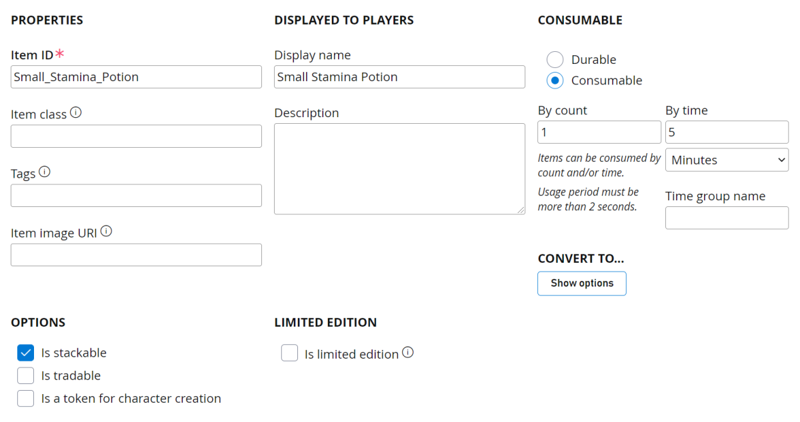
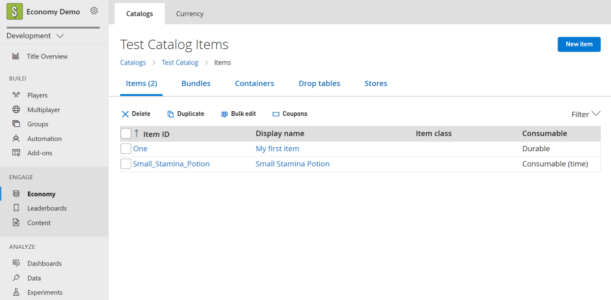
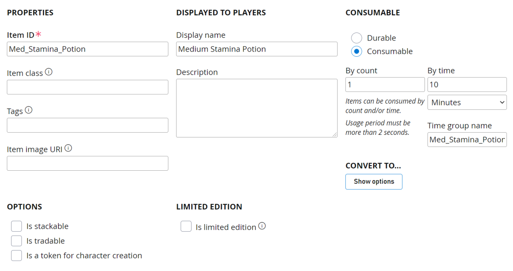
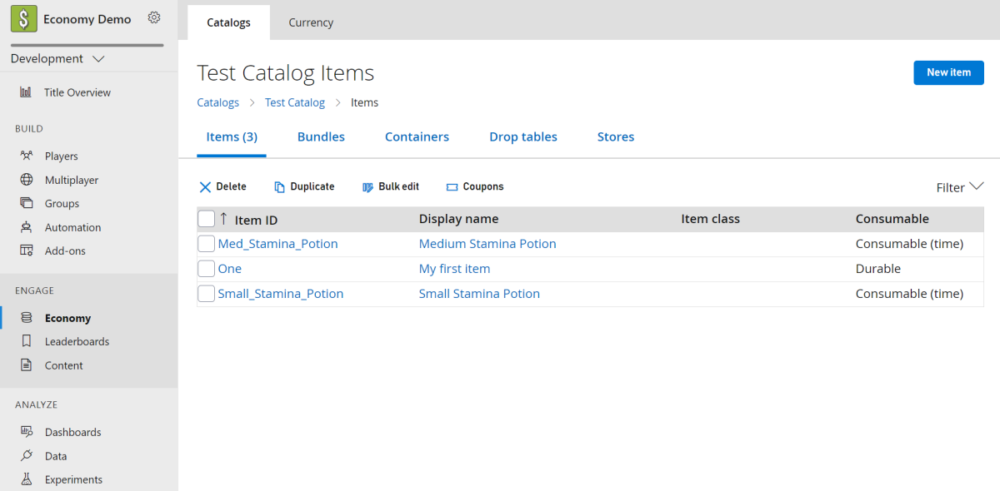

# Timed Consumables (Legacy Economy)

[!INCLUDE [notice](../../../includes/_economy-deprecation.md)]

This tutorial walks you through creating timed consumables using the PlayFab Game Manager. Timed consumables are items that are configured to auto-consume after a specific time from the initial grant to the player.

## Requirements

- We assume that you're already  familiar with [Catalogs](../items/catalogs.md), [Inventory](../../data/playerdata/player-inventory.md), and the PlayFab [Game Manager](../../../gamemanager/quickstart.md).
- You must have a *primary catalog*.

## Create a Stackable Timed Consumable

Let's create a small stamina potion that boosts your player's stamina for five minutes when granted, and increases the time range by five minutes. In Game Manager:

1. Navigate to your **Title**.
1. Select **Economy** from the menu on the left.
1. Go to the **Catalogs** tab and choose your primary catalog - your screen should look similar to this example:
  
1. Select **New item** in the top right corner.
1. Fill out the following fields:

   Field Name | Sample Value | Description
    :---: | :---: | ---
    Item ID | Small_Stamina_Potion | This *required* field is the unique identifier for the item within the Catalog. The item ID must be unique within the Catalog, but you can have multiple catalog versions containing items with the same item ID.
    Display Name | Small Stamina Potion | This *optional* field is the name displayed for the catalog item. One common usage is when you want to offer the item in your in-game store. Display names don't need to be unique.
    Consumable | Consumable | Indicates whether the item is **Durable** or **Consumable**.
    By Count | 1 | This field is *required* when **Consumable** is selected. It determines how much the count of that item will be decremented when consumed.
    By Time | 5 Minutes | This field is *optional* when **Consumable** is selected. It determines the amount of time that will elapse from the moment the item is granted to the moment it's consumed.
    Time Group Name | Small_Stamina_Potion | This field is *optional* when **Consumable** is selected. It allows you to join multiple item consumption times with the same group name together.
    Is Stackable | True | Marking an item as **Stackable** allows only one item of this type in the inventory and increments the quantity count of the item.

    
1. Select **Save item**.

You'll now be able to stack these potions and the remaining time will automatically "stack" as well. For example, if I grant one small stamina potion to a player at 1:00pm, the item will be consumed at 1:05pm. If I grant another small stamina potion at 1:02pm, the two items will be consumed at 1:10pm.

> [!NOTE]
> If you don't specify a time group name for a stackable timed consumable, the full stack will expire when the original expiration time was set from the first grant. For example, in the scenario above, if I instead left the time group name blank, if I grant one small stamina potion to a player at 1:00pm, the item will be consumed at 1:05pm. If I grant another small stamina potion at 1:02pm, the two items will still be consumed at 1:05pm. If I grant yet another small stamina potion at 1:04pm, the three items will still be consumed at 1:05pm. But after the stack is consumed, if I grant a small stamina potion at 1:10pm, the item will be consumed at 1:15pm.

## Create a Non-Stackable Timed Consumable

Let's create a similar example as before, but with a non-stackable item. Let's create a medium stamina potion that will boost your player's stamina for 10 minutes when granted, and increase the time range by an additional 10 minutes for each additional item. In Game Manager:

1. Navigate to your **Title**.
1. Select **Economy** from the menu on the left.
1. Go to the **Catalogs** tab and choose your primary catalog - your screen should look similar to this example:
  
1. Select **New item** in the top right corner.
1. Fill out the following fields:

    Field Name | Sample Value | Description
    :---: | :---: | ---
    Item ID | Med_Stamina_Potion | This *required* field is the unique identifier for the item within the Catalog. The item ID must be unique within the Catalog, but you can have multiple catalog versions containing items with the same item ID.
    Display Name | Medium Stamina Potion | This *optional* field is the name displayed for the catalog item. One common usage is when you want to offer the item in your in-game store. Display names don't need to be unique.
    Consumable | Consumable | Indicates whether the item is **Durable** or **Consumable**.
    By Count | 1 | This *required* field (when **Consumable** is selected) determines how much the count of that item will be decremented when consumed.
    By Time | 10 Minutes | This *optional* field (when **Consumable** is selected) determines the amount of time that will elapse from the moment the item is granted to the moment it's consumed.
    Time Group Name | Med_Stamina_Potion | This *optional* field (when **Consumable** is selected) allows you to join multiple item consumption times with the same group name together.
    Is Stackable | False | Marking an item as **Stackable** allows only one item of this type in the inventory and increments the quantity count of the item.

      
1. Select **Save item**.

Now every time you grant an additional medium stamina potion, it will create an entirely new instance in the player's inventory, as the item isn't stackable. You'll still be able to automatically "stack" the remaining time for those items. For example, if I grant one medium stamina potion to a player at 1:00pm, the item will be consumed at 1:10pm. If I grant another medium stamina potion at 1:05pm, the two items will be consumed at 1:20pm.

> [!NOTE]
> If you don't specify a time group name for a non-stackable timed consumable, each instance will expire independently of one another. For example, in the scenario above, if I instead left the time group name blank, if I grant one medium stamina potion to a player at 1:00pm, the item will be consumed at 1:10pm. If I grant another medium stamina potion at 1:05pm, the first item will still be consumed at 1:10pm, and the second item will be consumed at 1:15pm.

## Link Multiple Timed Consumables

Now that you have a Small Potion (stackable) and a Medium Potion (non-stackable), let's link those two timers together. Let's modify a few fields to allow your player's stamina to get boosted when the small or medium stamina potions are granted, and increase the time range by an additional 5 or 10 minutes for each small or medium stamina potion, respectively. In Game Manager:

1. Navigate to your **Title**.
1. Select **Economy** from the menu on the left.
1. Go to the **Catalogs** tab and choose your primary catalog - your screen should look similar to this example:
    
1. Select **Med_Stamina_Potion** in the item list.
1. Change the **Time Group Name** from `Med_Stamina_Potion` to `Stamina_Potion`.
1. Select **Save item**.
1. Select **Small_Stamina_Potion** in the item list.
1. Change the **Time Group Name** from `Small_Stamina_Potion` to `Stamina_Potion`.
1. Select **Save item**.

Now every time you grant an additional small or medium stamina potion, it will automatically "stack" the remaining time for all items with the same time group name. For example, if I grant one medium stamina potion to a player at 1:00pm, the item will be consumed at 1:10pm. If I grant a small stamina potion at 1:05pm, the two items will be consumed at 1:15pm.
