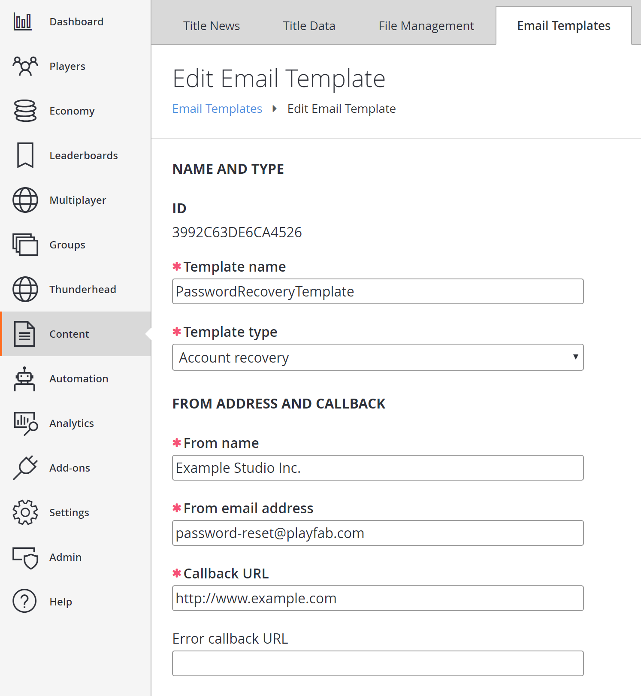
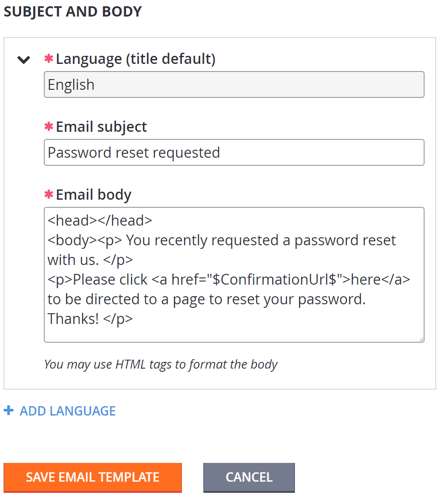
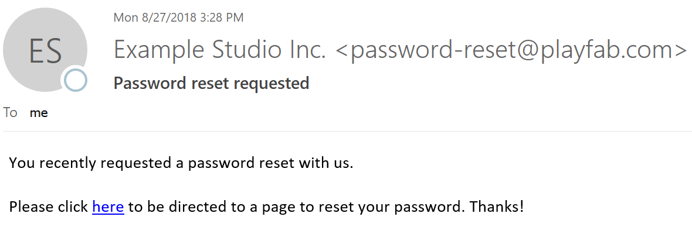
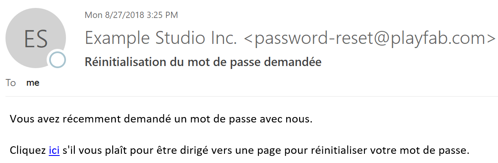

# Localized email templates

PlayFab is introducing support for storing localized strings on behalf of game developers. In addition, we are adding the necessary logic to provide your players with the correct strings for the language they prefer.

This tutorial walks you through how to use localized email templates. With localized email templates, you can make multiple translated versions of an email, and associate *all* of them with one template ID.

> [!NOTE]
> Any templates introduced before this feature was released will retain their behavior.  However, you can easily update them to use the new localized format used by new email templates.

## Requirements

This is an *advanced* tutorial. Please make sure that all requirements have been met, or you will *not* be able to complete this tutorial.

- For an introduction to email templates, refer to the [Using Email Templates to Send an Account Recovery Email](using-email-templates-to-send-an-account-recovery-email.md) tutorial.
- Please review the information on how to work with default languages on your title, and the preferred languages for your players in the [Setting Default Languages](../news/setting-default-languages.md) tutorial. You must have a title default language set to continue with localized email templates.

## Updating an existing email template

The first thing we will do is update the existing account recovery email template we made in the [Using Email Templates to Send an Account Recovery Email](using-email-templates-to-send-an-account-recovery-email.md) tutorial mentioned above.

1. Select **Content** from the menu on the left.
2. Go to the **Email Templates** tab.
3. Move to the **Template name** field, and select the **Account Recovery** template.



For the purposes of this tutorial, we will assume your title default language is English. You’ll see that your existing version of the template shows up as the default language version.



Adding more languages is as simple as selecting the **+ ADD LANGUAGE** link that is provided, then choosing the language you want to add to the template, and typing in the localized strings.

In this example, we're going to add the following French strings to our existing template.

French email subject:

```html
Réinitialisation du mot de passe demandée
```

French email body:

```html
<head></head>
<body><p>Vous avez récemment demandé un mot de passe avec nous. </p>
<p>Cliquez <a href="$ConfirmationUrl$">ici</a> s'il vous plaît pour être dirigé vers une page pour réinitialiser votre mot de passe.
```

Here's what it should look like:


When you select the **SAVE EMAIL TEMPLATE** button, you'll be redirected back to the page containing the list of your email templates.

As you can see, a new language version was added, but a new template was *not* added, since all language versions are stored under the same template ID.

## Sending localized emails

Next, we will send our new localized version of the email. As was mentioned in the [Setting Default Languages](../news/setting-default-languages.md) tutorial, PlayFab does the heavy lifting to match your title's supported languages with your players' preferred language. All you need to do is tell us to send the email.

To verify this behavior, create two test players.

Leave one of the new players without a preferred language. This will demonstrate how PlayFab falls back to the title's default if there is no language specified or if there is no match between the title's language and the player's language.

Set the *other* new player's language by using Game Manager, or by using the [SetProfileLanguage](xref:titleid.playfabapi.com.profiles.accountmanagement.setprofilelanguage) API. We have used French in this example.

> [!NOTE]
> When using the `SetProfileLanguage` API, the language string must be specified in the ISO 639-1 format (for example, "en", "es", or "ja"). At the current time, the code "zh" is not supported.

Make sure you have set the contact email on both players as explained in [Step 2 of the Using Email Templates to Send an Account Recovery Email](using-email-templates-to-send-an-account-recovery-email.md#step-2---add-username-password-login-email-and-contact-email-to-a-player) tutorial, before continuing on to the next step.

Use the [SendCustomAccountRecoveryEmail](xref:titleid.playfabapi.com.server.accountmanagement.sendcustomaccountrecoveryemail) API once per player to send this template:

- Once in French to the player whose preferred language is French.
- Once in the default language to a player with no preferred language set.

Sample email to the player with *no preferred language* is shown below.



Sample email to the player whose *preferred language is French* is shown below.



## Conclusion

As you can see, PlayFab noticed there was a match between your template's support for French, and the player's language preference.

Where there was *no* match or *no* preference, the player received your title's default language strings.

If you have any questions or feedback on this tutorial, please contact us through our [forums](https://community.playfab.com/questions/ask.html) or slack channel.