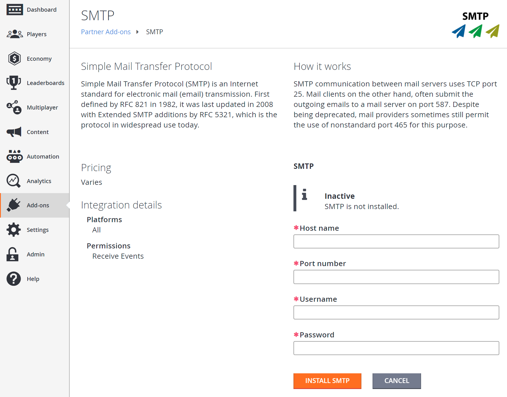
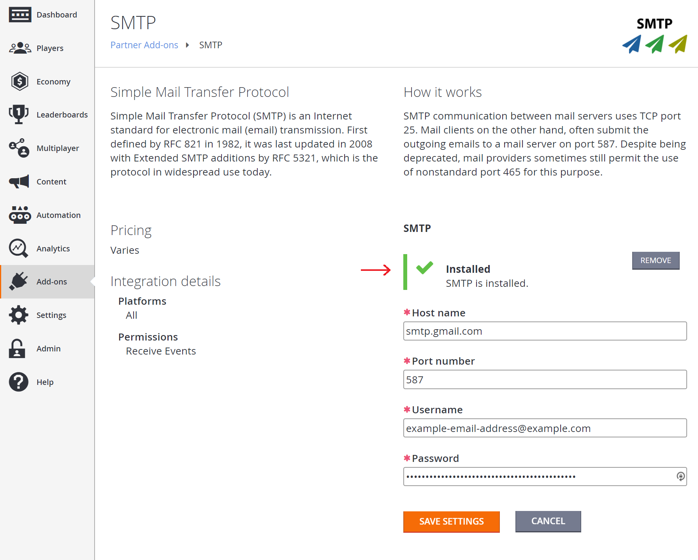

# Setting up an SMTP server with add-ons

This tutorial walks you through how to set up an SMTP add-on, to support sending custom emails through PlayFab.

## Requirements

Game Manager will be required, as the SMTP server for the title is set up using an add-on. Read our [Game Manager Quickstart](../../../gamemanager/quickstart.md) if you are unfamiliar with it.

## Go to the add-on page and install SMTP

In **Game Manager**:

1. Go to **Add-ons**.
2. Under the **Marketing** section, select the **SMTP** add-on. This will redirect you to the **Add-on** page.

  

3. Select the **INSTALL SMTP** button.

## Configure SMTP

A form should appear with the **Host name**, **Port number**, **Username**, and **Password** fields.

  

- Fill out the form with **Host name**, **Port number**, **Username**, and **Password** for your SMTP server.
- Select the **SAVE SETTINGS** button, and the add-on should now be installed.

> [!NOTE]
> If your SMTP server requires **SSL/TLS**, use **port 587**.

## Testing

To test this feature, you can use the Gmail SMTP server, provided you have a Gmail account. To use Gmail, fill in the fields as follows:

- Host name: **smtp.gmail.com**
- Port number: **587**
- Username: (**your gmail address** - e.g., "support@playfab.com")
- Password: (**your password**)

> [!NOTE]
> If you have 2-factor authentication enabled, you will need to create an App password. See [Sign in using an App password](https://support.google.com/accounts/answer/185833?hl=en) for more information.

The SMTP add-on is now installed, and will show a green check and message indicating success.

  
