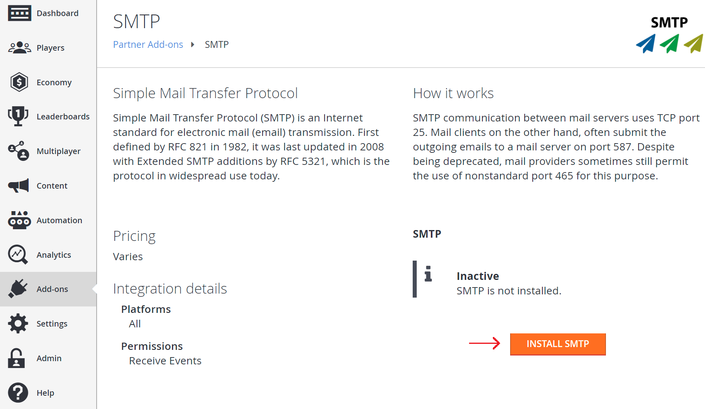

# Setting up an SMTP server with add-ons

This tutorial walks you through how to set up an SMTP add-on to support sending custom emails through PlayFab.

## Requirements

- Game Manager will be required as a title's SMTP server is set up using an add-on. Read our [Game Manager quickstart](../../config/gamemanager/quickstart.md) if you are unfamiliar with it.

## Go to the add-on page and install SMTP

In Game Manager, go to Add-ons. Under the Marketing section there will be an "SMTP" add-on. Click on the add-on. It looks like the following:

  

This will redirect you to the add-on page. Click INSTALL SMTP.

  

## Configure SMTP

A form should appear with the “Host name”, “Port number”, “Username”, and “Password” fields.

  

Fill out the form with “Host name”, “Port number”, “Username”, and “Password” for your SMTP server. Click SAVE SETTINGS and the add-on should now be installed. One thing to note is that if your SMTP server requires SSL/TLS, use port 587.

## Testing

For testing this feature, you can use the Gmail SMTP server, provided you have a Gmail account. To use Gmail, fill in the fields as follows:

- Host name: smtp.gmail.com
- Port number: 587
- Username: (your gmail address. E.g., "support@playfab.com")
- Password: (your password)

> [!NOTE]
> If you have 2-factor authentication enabled, you will need to create an App password. See [Sign in using an App password](https://support.google.com/accounts/answer/185833?hl=en) for more information.

The SMTP add-on is now installed and will show a green check and message indicating success.

  
