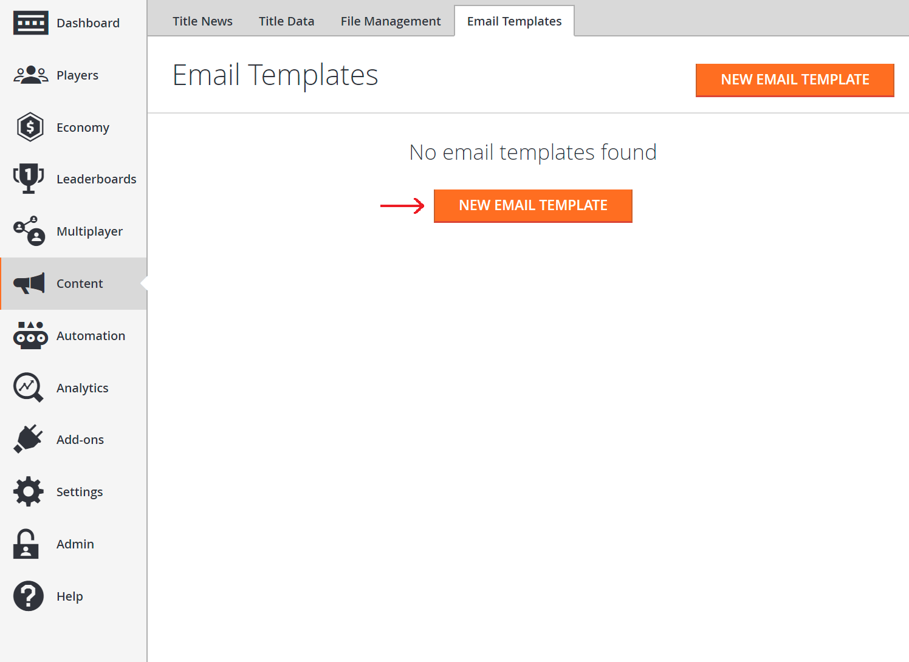
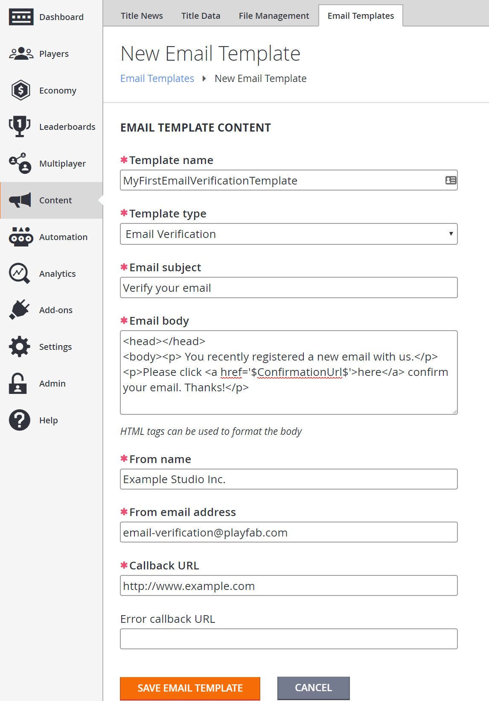
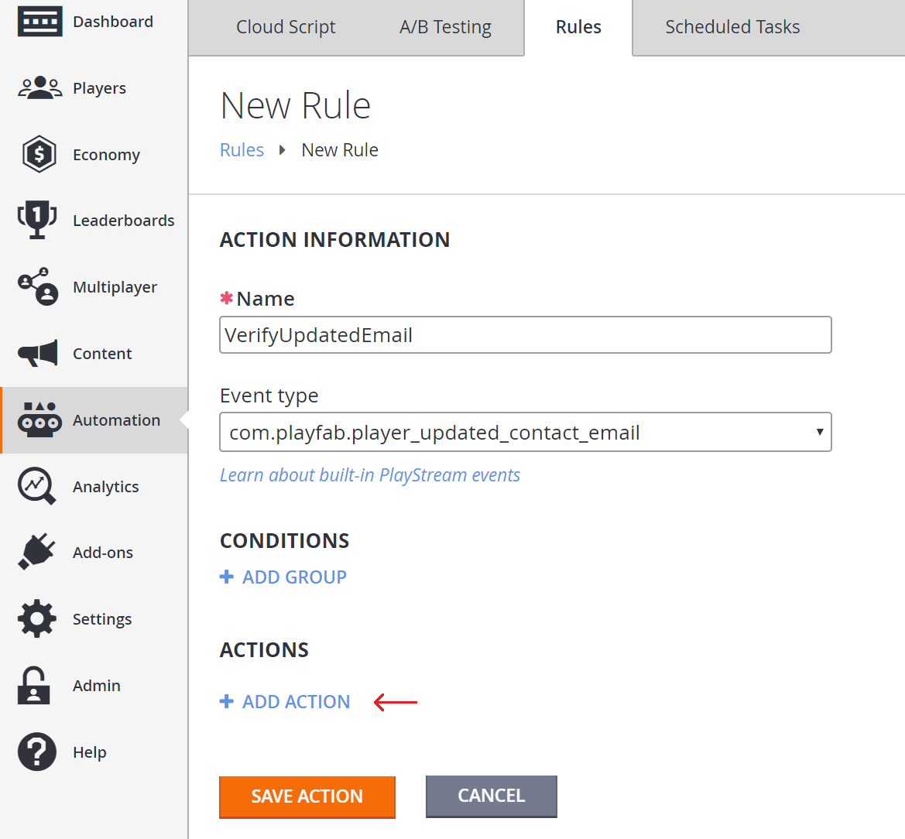
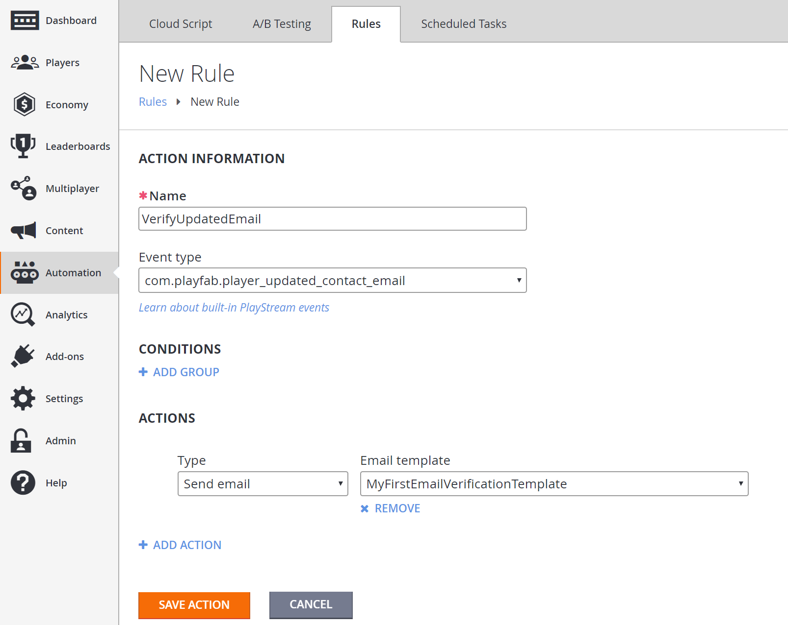
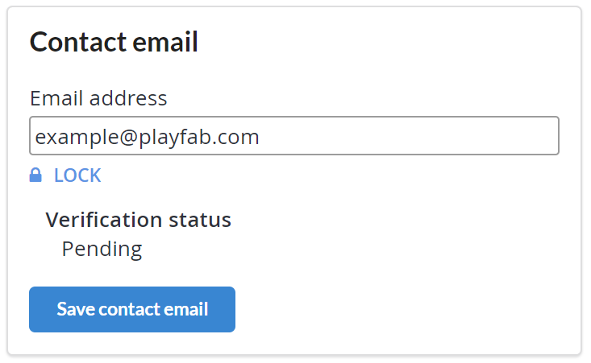
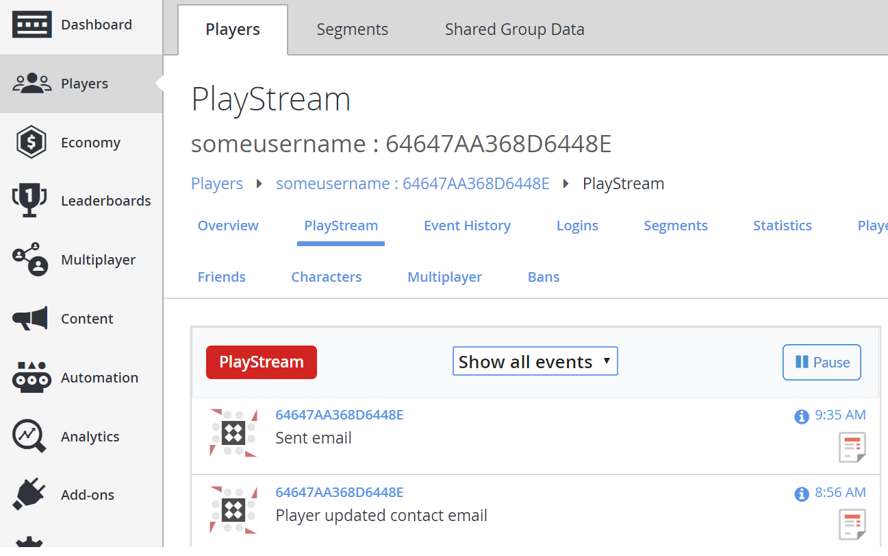
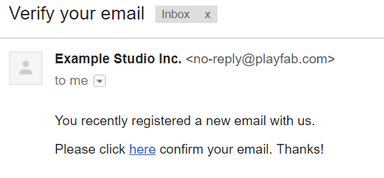

# Using a rule to verify a contact email address

This tutorial walks you through the steps for creating a rule that sends a verification email when a player changes their contact email address.

## Requirements

> [!IMPORTANT]
> This is an *advanced* tutorial. Please make sure that all of the requirements have been met, or you will *not* be able to complete this tutorial.

- To send custom emails with email templates, you'll need to have your own SMTP server with a username and password. Verify that you have your own SMTP server *before* following our tutorial [Setting up an SMTP server with add-ons](../../engagement/emails/setting-up-an-smtp-server-with-add-ons.md).

> [!NOTE]
> You can use Gmail for testing - but with Gmail you are limited to 2,000 emails per day.

- Basic knowledge of how to create a player will be necessary, since there will need to be players with a username and password before calling account recovery logic.
- Read the [Game Manager quickstart](../../../gamemanager/quickstart.md) if you're unfamiliar with the Game Manager, as it's the place where email templates are created.
- Knowledge of how to work with player profiles will be required, to confirm that emails are necessary for checking that a contact email has been added to a player's profile. Read up on how to get a player's profile in the [Getting Player Profiles](../../data/playerdata/getting-player-profiles.md) tutorial, and make sure that under the **Client Profile Options** on your **Title** you allow **Contact email addresses**.
- Creating a rule is necessary in this tutorial it's a good idea to read up on how [Rules](../../automation/actions-rules/quickstart.md) work.

## Step 1 - Create an email template

The first thing we'll do is create an account recovery email template.

- Select **Content** from the menu on the left.
- Go to the **Email Templates** tab.
- Select the **NEW EMAIL TEMPLATE** button.

  

Now add a **New Email Template**, filling in the fields as follows and leaving the **Error Callback** URL empty:

- **Template name**: MyFirstEmailVerificationTemplate
- **Template type**: Email Verification
- **Email subject**: Verify your email
- **Email body**: (enter as below)

```html
<head></head>
<body><p> You recently registered a new email with us.</p>
<p>Please click <a href="$ConfirmationUrl$">here</a> confirm your email. Thanks!</p>
```

- **From Name**: The name you want to show in the **From** field in the email.
- **From Email Address**:  The email address you want to show in the **From** field in the email. This must be an email domain that the SMTP server enables you to send emails from.

  > [!NOTE]
  > Some email servers, like Gmail, will ignore this field and send from the account set up with the SMTP server.
  
- **Callback URL**:  <https://www.example.com>

### A few things to remember

- The `$ConfirmationUrl$` in the email body generates a customized URL that when selected, tracks that a user has selected the URL, and then issues a redirect to the **Callback URL**. In this case, it's injected into an **anchor tag**.
- The **Callback URL** is the URL that PlayFab will redirect to after the player selects the **Confirmation URL** link. It can be a static page that tells the user they were successful in confirming their email. In this case, we'll redirect to <https://www.example.com>.

  

After filling the form out, select the **SAVE EMAIL TEMPLATE** button, and you'll be redirected back to the page containing the list of your email templates. Make a note of the ID of the email template as it will be used in Step 4.

  

## Step 2 - Create a rule to send an email when a contact email is updated

Next, we'll create a rule to send a verification email every time a player updates their contact email. In **Game Manager**:

- Select **Automation** in the menu to the left.
- Select the **Rules** tab.
- Select **NEW RULE**.
- Fill out the **Rule Name** field with your **Rule VerifyUpdatedEmail**.
- From the **Event Type** drop-down, select **com.playfab.player_updated_contact_email**.
- Under the **Actions** heading, select **+ADD ACTION**.

  

Choose **Send Email** from the **Type** drop-down.

- The **Email template** drop-down should be populated by the template created in Step 1 **MyFirstEmailVerificationTemplate**.
- If it isn't, select **MyFirstEmailVerificationTemplate** from the drop-down.

  

## Step 3 - Add a contact email to a player

For this next step, you'll need an existing player account.

We add a contact email to the player using [AddOrUpdateContactEmail](xref:titleid.playfabapi.com.client.accountmanagement.addorupdatecontactemail).

> [!NOTE]
> A **Contact Email** field in a Player Profile is different from the **Login Email** field on a Player Profile, even though they may both contain the same email address. Any time you send email to the player, it will *only* go to the contact email address.

### C# code example

In the following example, we sign-in a player, then add a contact email using [AddOrUpdateContactEmail](xref:titleid.playfabapi.com.client.accountmanagement.addorupdatecontactemail). Make sure the email address associated with the player is one that you can access.

```csharp
void AddContactEmailToPlayer()
{
    var loginReq = new LoginWithCustomIDRequest
    {
        CustomId = "SomeCustomID", // replace with your own Custom ID
        CreateAccount = true // otherwise this will create an account with that ID
    };

    var emailAddress = "testaddress@example.com"; // Set this to your own email

    PlayFabClientAPI.LoginWithCustomID(loginReq, loginRes =>
    {
        Debug.Log("Successfully logged in player with PlayFabId: " + loginRes.PlayFabId);
        AddOrUpdateContactEmail(loginRes.PlayFabId, emailAddress);
    }, FailureCallback);
}

void AddOrUpdateContactEmail(string playFabId, string emailAddress)
{
    var request = new AddOrUpdateContactEmailRequest
    {
        EmailAddress = emailAddress
    };
    PlayFabClientAPI.AddOrUpdateContactEmail(request, result =>
    {
        Debug.Log("The player's account has been updated with a contact email");
    }, FailureCallback);
}

void FailureCallback(PlayFabError error)
{
    Debug.LogWarning("Something went wrong with your API call. Here's some debug information:");
    Debug.LogError(error.GenerateErrorReport());
}
```

## Step 4 - Confirm that the contact email was added to the player's profile

Next, confirm that the contact email was added to the player's profile. Log into the **Game Manager**, and visit the **Players Profile** page.

You should see a **Contact Email** listed for that player, with **Verification Status**: **Pending**.

> [!NOTE]
> The **Verification Status** could be **Unverified**, if the verification email was not sent out yet, but will move to the **Pending** state as soon as the email is sent.

  

You can also make a call to [GetPlayerProfile](xref:titleid.playfabapi.com.client.accountmanagement.getplayerprofile) with **ShowContactEmailAddresses** in the [PlayerProfileViewConstraints](xref:titleid.playfabapi.com.server.accountmanagement.getplayerprofile#playerprofileviewconstraints) set as *True* to show that the player now has the contact email that we just added.

## Step 5 - Check that the email was sent

Finally, we can check that the account recovery email was sent.

The first thing you can do is to go to the player's **PlayStream** in **Game Manager**:

- Select **Players** in the menu to the left.
- On the **Players** Tab,  go to the **PlayStream** area.
- It should show a **Sent Email Event**.

  

Selecting the **Info** icon on the Event should show JSON similar to the one shown below.

```json
{
    "EventName": "sent_email",
    "EventNamespace": "com.playfab",
    "Source": "PlayFab",
    "EntityType": "player",
    "TitleId": "YourTitleId",
    "EventId": "a05625e48b1f4194bd08d1ff6a889cf8",
    "EntityId": "64647AA368D6448E",
    "SourceType": "BackEnd",
    "Timestamp": "2017-10-27T09:35:16.2946918Z",
    "History": null,
    "CustomTags": null,
    "Reserved": null,
    "emailTemplateId": "7D6438687903D4DC",
    "emailTemplateName": "MyFirstEmailVerificationTemplate",
    "emailTemplateType": "EmailVerification",
    "success": true,
    "emailName": "Primary"
}
```

To verify that you actually received the email, go to the email of the player you created in Step 3. There should be an email that looks similar to the one shown below.

  

If you inspect the URL in that email, you'll see that it looks something like this one.

```html
https://a5f3.playfabapi.com/EmailConfirmation/Confirm/?token=2346241B7C277796&titleId=A5F3&templateId=38017AAE7F494AB3
```

When the player selects that URL, three things happen:

1. PlayFab generates a new PlayStream event, called **auth_token_validated**. This is how you know that the player selected that URL in the email.
   - You can use that event to trigger actions, like granting coins or items to the player.
2. Because this email template was the special **Email Verification** template, PlayFab will then mark the player email as *Verified*.
3. PlayFab returns a redirect URL sending the player to the callback URL website.
    - On this website you can show a static **Thanks for verifying your email** message, or something more elaborate. The redirect URL looks something like this: <https://www.example.com/?token=2346241B7C277796>.

    - Go ahead and select the URL found in the email.
    - You'll be taken to the **example.com** website.
    - View your **Player Profile** using the **Game Manager**.
    - You'll see that the **Verification status** has changed.

  

## Conclusion

So that's it for this tutorial. You've seen how to set up your SMTP server, create an email template, and create a rule that sends an email to a player verifying their email address.

If you have any questions or feedback on this tutorial, please let us know in our [community forums](https://community.playfab.com/).
 
